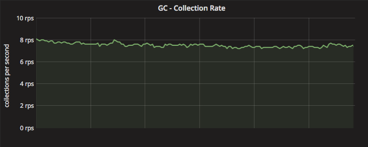
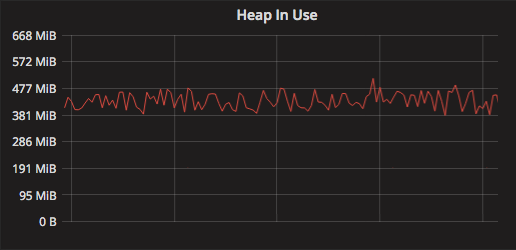
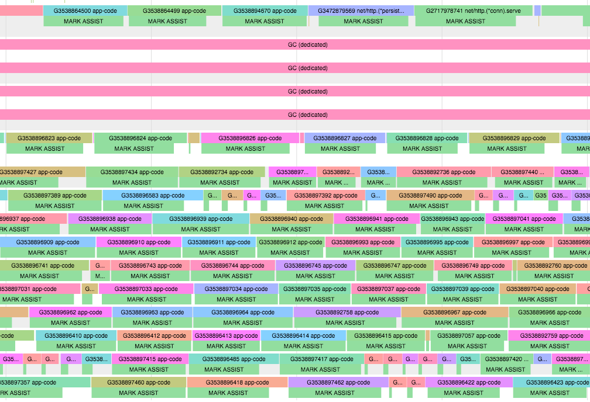
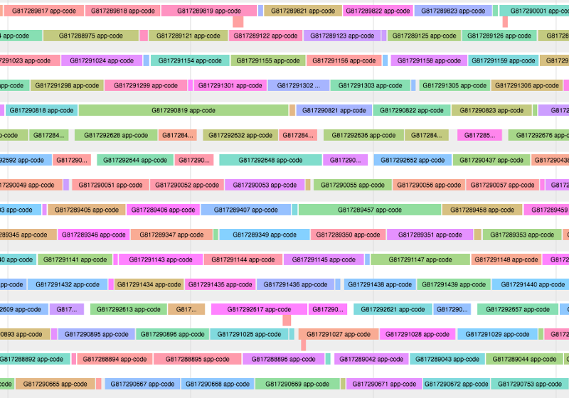
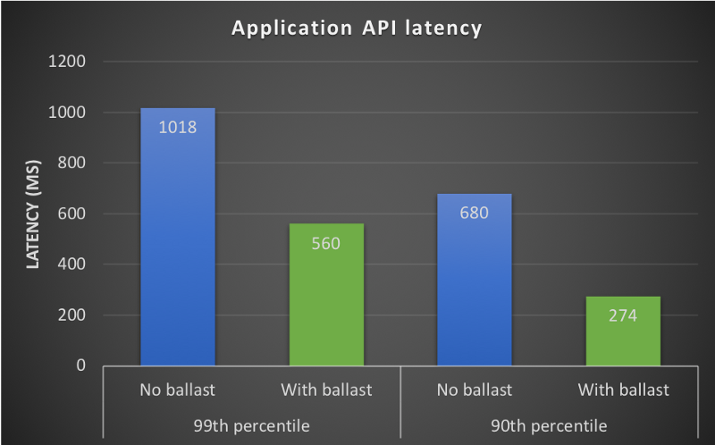

# Go memory ballast: How I learned to stop worrying and love the heap

- 原文地址：[Go memory ballast: How I learned to stop worrying and love the heap](https://blog.twitch.tv/go-memory-ballast-how-i-learnt-to-stop-worrying-and-love-the-heap-26c2462549a2)
- 原文作者：[Ross Engers](https://blog.twitch.tv/@rengers_49053)
- 译文出处：https://blog.twitch.tv
- 本文永久链接：https://github.com/gocn/translator/blob/master/2019/w15_go_memory_ballast.md
- 译者：
- 校对者：

I’m a big fan of small code changes that can have large impact. This may seem like an obvious thing to state, but let me explain:

1. These type of changes often involve diving into and understanding things one is not familiar with.
2. Even with the most well factored code, there is a maintenance cost to each optimization you add, and it’s usually (although not always) pretty linear with the amount of lines of code you end up adding/changing.

We recently rolled out a small change that reduced the CPU utilization of our API frontend servers at Twitch by ~30% and reduced overall 99th percentile API latency during peak load by ~45%.

This blog post is about the change, the process of finding it and explaining how it works.

## Setting the stage

We have a service at Twitch called Visage, that functions as our API frontend. Visage is the central gateway for all externally originating API traffic. It is responsible for a bunch of things, from authorization to request routing, to (more recently) server-side GraphQL. As such, it has to scale to handle user traffic patterns that are somewhat out of our control.

As an example, a common traffic pattern we see is a “refresh storm.” This occurs when a popular broadcaster’s stream drops due to a blip in their internet connectivity. In response, the broadcaster restarts the stream. This usually causes the viewers to repeatedly refresh their pages, and suddenly we have a lot more API traffic to deal with.

Visage is a Go application (built with Go 1.11 at the time of this change) that runs on EC2 behind a load balancer. Being on EC2 it scales well horizontally, for the most part.

However, even with the magic of EC2 and Auto Scaling groups, we still have the problem of dealing with very large traffic spikes. During refresh storms, we frequently have surges of millions of requests over a few seconds, on the order of 20x our normal load. On top of this, we would see API latency degrade significantly when our frontend servers were under heavy load.

One approach to handle this is to keep your fleet permanently over-scaled, but this is wasteful and expensive. To reduce this ever-increasing cost, we decided to spend some time searching for some low hanging fruit that would improve per-host throughput, as well as provide more reliable per-request handling, when hosts were under load.

## Scouting the deck

Luckily we run [pprof](https://golang.org/pkg/runtime/pprof/) on our production environments, so getting at real production traffic profiles becomes really trivial. If you are not running pprof, I would highly encourage you do. The profiler, for the most part, has very minimal CPU overhead. The execution tracer can have a small overhead, but still small enough that we happily run it in production for a few seconds each hour.

So after taking a look at our Go application’s profiles, we made the following observations:

1. At steady state, our application was triggering ~8–10 garbage collection (GC) cycles a second (400–600 per minute).
2. >30% of CPU cycles were being spent in function calls related to GC
3. During traffic spikes the number of GC cycles would increase
4. Our heap size on average was fairly small (<450Mib)



Visage application GC cycles per second



Visage application MiB of [heap in use](https://golang.org/pkg/runtime/#MemStats)

If you haven’t guessed it already the improvements we made relate to the performance of garbage collection in our application. Before I get into the improvements, below is a quick primer / recap on what GCs are and what they do. Feel free to skip ahead if you’re well versed in the concepts.

## What is a garbage collector (GC)

In modern applications, there are generally two ways to allocate memory: the stack and the heap. Most programmers are familiar with the stack from the first time writing a recursive program that caused the [stack to overflow](https://stackoverflow.com/questions/26158/how-does-a-stack-overflow-occur-and-how-do-you-prevent-it). The heap, on the other hand, is a pool of memory that can be used for dynamic allocation.

Stack allocations are great in that they only live for the lifespan of the function they are part of. Heap allocations, however, will not automatically be deallocated when they go out of scope. To prevent the heap from growing unbound, we must either explicitly deallocate, or in the case of programming languages with memory management (like Go), rely on the garbage collector to find and delete objects that are no longer referenced.

Generally speaking in languages with a GC, the more you can store on the stack the better, since these allocations are never even seen by the GC. Compilers use a technique called escape analysis to determine if something can be allocated on the stack or must be placed on the heap.

In practice, writing programs that force the compiler to only allocate on the stack can be very limiting, and so in Go, we leverage its wonderful GC to do the work of keeping our heap clean.

## Go’s GC

*GCs are complex pieces of software so I’ll do my best to keep this relevant*.

Since v1.5, Go has incorporated a concurrent mark-and-sweep GC. This type of GC, as the name implies, has two phases: mark and sweep. The “concurrent” just means that it does not stop-the-world (STW) for the entire GC cycle, but rather runs mostly concurrently with our application code. During the mark phase, the runtime will traverse all the objects that the application has references to on the heap and mark them as still in use. This set of objects is known as live memory. After this phase, everything else on the heap that is not marked is considered garbage, and during the sweep phase, will be deallocated by the sweeper.

To summarize the following terms:

Heap size — includes all allocation made on the heap; some useful, some garbage.

Live memory — refers to all the allocations that are currently being referenced by the running application; not garbage.

It turns out that for modern operating systems, sweeping (freeing memory) is a very fast operation, so the GC time for Go’s mark-and-sweep GC is largely dominated by the mark component and not sweeping time.

Marking involves traversing all the objects the application is currently pointing to, so the time is proportional to the amount of live memory in the system, regardless of the total size of the heap. In other words, having extra garbage on the heap will not increase mark time, and therefore will not significantly increase the compute time of a GC cycle.

Based on all of the above, it should seem reasonable that less frequent GC’ing means less marking, which means less CPU spent over time, but what is the trade off? Well, it’s memory. The longer the runtime waits before GC’ing, the more garbage will accumulate in the system’s memory.

As we noted earlier though, the Visage application which runs on its own VM with 64GiB of physical memory, was GC’ing very frequently while only using ~ 400MiB of physical memory. To understand why this was the case, we need to dig into how Go addresses the GC frequency / memory tradeoff and discuss the pacer.

## Pacer

The Go GC uses a pacer to determine when to trigger the next GC cycle. Pacing is modeled like a control problem where it is trying to find the right time to trigger a GC cycle so that it hits the target heap size goal. Go’s default pacer will try to trigger a GC cycle every time the heap size doubles. It does this by setting the next heap trigger size during the mark termination phase of the current GC cycle. So after marking all the live memory, it can make the decision to trigger the next GC when the total heap size is 2x what the live set currently is. The 2x value comes from a variable `GOGC` the runtime uses to set the trigger ratio.

The pacer in our case was doing a superb job of keeping garbage on our heap to a minimum, but it was coming at the cost of unnecessary work, since we were only using ~ 0.6% of our system’s memory.

## Enter the ballast

> Ballast — Nautical. any heavy material carried temporarily or permanently in a vessel to provide desired draft and stability. — source: dictionary.com

The ballast in our application is a large allocation of memory that provides stability to the heap.

We achieve this by allocating a very large byte array as our application starts up:

```go
func main() {

	// Create a large heap allocation of 10 GiB
	ballast := make([]byte, 10<<30)

	// Application execution continues
	// ...
}
```

Reading the above code you may have two immediate questions:

1. Why on earth would you do that?
2. Won’t this use up 10 GiB of my precious RAM?

Let’s start with **1. Why on earth would you do that?** As noted earlier, the GC will trigger every time the heap size doubles. The heap size is the total size of allocations on the heap. Therefore, if a ballast of 10 GiB is allocated, the next GC will only trigger when the heap size grows to 20 GiB. At that point, there will be roughly 10 GiB of ballast + 10 GiB of other allocations.

When the GC runs, the ballast will not be swept as garbage since we still hold a reference to it in our main function, and thus it is considered part of the live memory. Since most of the allocations in our application only exist for the short lifetime of an API request, most of the 10 GiB of allocation will get swept, reducing the heap back down to just over ~ 10 GiB again (i.e., the 10GiB of ballast plus whatever in flight requests have allocations and are considered live memory.) Now, the next GC cycle will occur when the heap size (currently just larger than 10 GiB) doubles again.

So in summary, the ballast increases the base size of the heap so that our GC triggers are delayed and the number of GC cycles over time is reduced.

*If you are wondering why we use a byte array for the ballast, this is to ensure that we only add one additional object to the mark phase. Since a byte array doesn’t have any pointers (other than the object itself), the GC can mark the entire object in O(1) time.*

Rolling out this change worked as expected — we saw ~ 99% reduction in GC cycles:


Log base 2 scale graph showing GC cycles per minute

So this looks good, what about CPU utilization?


Visage application CPU utilization

The green sinusoidal CPU utilization metric is due to the daily oscillations of our traffic. One can see the step down after the change.

~ 30% reduction in CPU per box means without looking further, we can scale down our fleet by 30%, however what we also care about is API latency — more on that later.

As mentioned above, the Go runtime does provide an environment variable GOGC that allows a very coarse tuning of the GC pacer. This value controls the ratio of growth the heap can experience before the GC is triggered. We opted against using this, as it has some obvious pitfalls:

* The ratio itself is not important to us; the amount of memory we use is.
* We would have to set the value very high to get the same effect as the ballast, making the value susceptible to small changes in live heap size.
* Reasoning about the live memory and its rate of change is not easy; thinking about total memory used is simple.

For those interested, there is a [proposal](https://github.com/golang/go/issues/23044) to add a target heap size flag to the GC which will hopefully make its way into the Go runtime soon.

Now onto **2. Won’t this use up 10Gib of my precious RAM?** I’ll put your mind at ease. The answer is: no it won’t, unless you intentionally make it. Memory in ‘nix (and even Windows) systems is virtually addressed and mapped through page tables by the OS. When the above code runs, the array the ballast slice points to will be allocated in the program’s virtual address space. Only if we attempt to read or write to the slice, will the page fault occur that causes the physical RAM backing the virtual addresses to be allocated.

We can easily confirm this with the following trivial program:

```go
func main() {
	_ = make([]byte, 100<<20)
	<-time.After(time.Duration(math.MaxInt64))
}
```

We’ll run the program and then inspect with `ps`:

```plain
ps -eo pmem,comm,pid,maj_flt,min_flt,rss,vsz --sort -rss | numfmt --header --to=iec --field 4-5 | numfmt --header --from-unit=1024 --to=iec --field 6-7 | column -t | egrep "[t]est|[P]ID"
%MEM  COMMAND          PID    MAJFL  MINFL  RSS   VSZ
0.2   test_alloc       27826  0      1003   4.8M  108M
```

This shows just over 100MiB of memory has been allocated virtually to the process — **V**irtual **S**i**Z**e (VSZ), while ~ 5MiB has been allocated in the resident set — **R**esident **S**et **S**ize(RSS), i.e physical memory.

Now let’s modify the program to write to half of the underlying byte array backing the slice:

```go
func main() {
	ballast := make([]byte, 100<<20)
	for i := 0; i < len(ballast)/2; i++ {
		ballast[i] = byte('A')
	}
	<-time.After(time.Duration(math.MaxInt64))
}
```

Again inspecting with ps:

```plain
%MEM  COMMAND          PID    MAJFL  MINFL  RSS   VSZ
2.7   test_alloc       28331  0      1.5K   57M   108M
```

As expected, half of the byte array is now in the RSS occupying physical memory. The VSZ is unchanged since the same size virtual allocation exists in both programs.

*For those interested, the MINFL column is the number of minor page faults — that is the number of page faults the process incurred that required loading pages from memory. If our OS managed to allocate our physical memory nice and contiguously, then each page fault will be able to map more than one page of RAM, reducing the total number of page faults that occur.*

So as long as we don’t read or write to the ballast, we can be assured that it will remain on the heap as a virtual allocation only.

## What about the API latency

As mentioned above, we saw an API latency improvement (especially during high load) as a result of the GC running less frequency. Initially, we thought this may be due to a decrease in GC pause time — this is the amount of time the GC actually stops the world during a GC cycle. However, the GC pause times before and after the change were not significantly different. Furthermore, our pause times were on the order of single digit milliseconds, not the 100s of milliseconds improvement we saw at peak load.

To understand where this latency improvement came from, we need to talk a bit about a feature of the Go GC called `assists`.

## GC assists

GC assists puts the burden of memory allocation **during a GC cycle** on the goroutine that is responsible for the allocation. Without this mechanism, it would be impossible for the runtime to prevent the heap growing unbound during a GC cycle.

Since Go already has a background GC worker, the term assist, refers to our goroutines assisting the background worker. Specifically assisting in the mark work.

To understand this a bit more, let’s take an example:

```go
someObject :=  make([]int, 5)
```

When this code is executed, through a series of symbol conversions and type checking, the goroutine makes a call to [runtime.makeslice](https://golang.org/src/runtime/slice.go#L34), which finally ends up with a call to [runtime.mallocgc](https://golang.org/src/runtime/slice.go#L49) to allocate some memory for our slice.

Looking inside the `runtime.mallocgc` function shows us the interesting code path.

Note, I’ve removed most of the function and just showing the relevant parts below:

```go
// Allocate an object of size bytes.
// Small objects are allocated from the per-P cache's free lists.
// Large objects (> 32 kB) are allocated straight from the heap.
func mallocgc(size uintptr, typ *_type, needzero bool) unsafe.Pointer {

  	// Some error checking and debug code omitted here...

	// assistG is the G to charge for this allocation, or nil if
	// GC is not currently active.
	var assistG *g
	if gcBlackenEnabled != 0 {
		// Charge the current user G for this allocation.
		assistG = getg()
		if assistG.m.curg != nil {
			assistG = assistG.m.curg
		}
		// Charge the allocation against the G. We'll account
		// for internal fragmentation at the end of mallocgc.
		assistG.gcAssistBytes -= int64(size)

		if assistG.gcAssistBytes < 0 {
			// This G is in debt. Assist the GC to correct
			// this before allocating. This must happen
			// before disabling preemption.
			gcAssistAlloc(assistG)
		}
	}

	// Actual allocation code ommited below...
}
```

source: [runtime/malloc.go](https://golang.org/src/runtime/malloc.go)

In the code above, the line `if assistG.gcAssistBytes < 0` is checking to see if our goroutine is in allocation debt. Allocation debt is a fancy way of saying that this goroutine was allocating more than it was doing GC work during the GC cycle.

You can think of this like a tax that your goroutine must pay for allocating during a GC cycle, except that this tax must be paid upfront before the allocation can actually happen. Additionally, the tax is proportional to the amount the goroutine is attempting to allocate. This provides a degree of fairness such that goroutines that allocate a lot will pay the price for those allocations.

So assuming this is the first time our goroutine is allocating during the current GC cycle, it will be forced to do GC assist work. The interesting line here is the call to `gcAssistAlloc`

This function is responsible for some housekeeping and eventually calling into `gcAssistAlloc1` to perform the actual GC assist work. I won't go into the details of the `gcAssistAlloc` functions, but essentially it does the following:

1. Check that the goroutine is not doing something non pre-emptible (i.e., the system goroutine)
2. Perform GC mark work
3. Check if the goroutine still has an allocation debt, otherwise return
4. Goto 2

It should now be clear that any goroutine that does work that involves **allocating** will incur the GCAssist penalty **during a GC cycle**. Since the work has to be done before the allocation, this would surface as latency or slowness on the actual useful work the goroutine is intending to do.

In our API frontend, this meant that API responses would see increased latency during GC cycles. As mentioned earlier, as load increased to each server, memory allocation rate would increase, which would in turn increases the rate of GC cycles (often to 10s or 20s of cycles/s). More GC cycles, we now know, means more GC assist work for goroutines serving the API, and therefore, more API latency.

You can see this quite clearly from an [execution trace](https://golang.org/pkg/runtime/trace/) of our application. Below are two slices from the same execution trace of Visage; one while the GC cycle was running and one while it was not.



Execution trace during a GC cycle

The trace shows which goroutines are running on which processor. Anything labeled `app-code` is a goroutine running useful code for our application (e.g., logic to serve an API request). Notice, how besides the four dedicated procs running the GC code, our other goroutines are being delayed and forced to do `MARK ASSIST` (i.e.`runtime.gcAssistAlloc`) work.



Profile from same application as above, not during a GC cycle

Contrast that with this profile from the same running application not during a GC cycle. Here, our goroutines are spending most of their time running our application code as expected.

So by simply reducing GC frequency, we saw close to a ~99% drop in mark assist work, which translated to a~45% improvement in 99th percentile API latency at peak traffic.



You may be wondering why Go would choose such a strange design (using assists) for its GC, but it actually makes a lot of sense. The GC’s main function is to ensure that we keep the heap to a reasonable size and don’t let it grow unbound with garbage. This is easy enough in a stop-the-world (STW) GC, but in a concurrent GC, we need a mechanism to ensure that the allocations happening during the GC cycle don’t grow without bound. Having each goroutine pay the allocation tax proportional to what it wants to allocate in the GC cycle is a pretty elegant design in my opinion.

For a really comprehensive write up of this design choice, see [this Google Doc](https://docs.google.com/document/d/1wmjrocXIWTr1JxU-3EQBI6BK6KgtiFArkG47XK73xIQ/).

## In (sweeping) summary
1. We noticed our applications were doing a lot of GC work
2. We deployed a memory ballast
3. It reduced GC cycles by allowing the heap to grow larger
4. API latency improved since the Go GC delayed our work less with assists
5. The ballast allocation is mostly free because it resides in virtual memory
6. Ballasts are easier to reason about than configuring a GOGC value
7. Start with a small ballast and increase with testing

## Some final thoughts

Go does a great job of abstracting away many runtime specific details from the programmer. This is great and probably works really well for most programmers and applications.

When you start pushing the boundaries of your application environment, be it compute, memory, or IO, there is no substitute for lifting up the hood, taking a look around, and figuring out why the engine is not running efficiently.

When you need to do this, and you probably will, it sure helps to have a set of tools like the ones Go provides that let you discover the bottleneck quickly.

> **Acknowledgements**
I’d like to thank Rhys Hiltner for his invaluable help in investigating and digging into many Go runtime and GC intricacies. Also thank you to Jaco Le Roux, Daniel Bauman, Spencer Nelson, and Rhys again, for help editing and proofreading this post.
**References**
Richard L. Hudson — [The Journey of Go’s Garbage Collector](https://blog.golang.org/ismmkeynote)
Mark Pusher — [Golang’s Real-time GC in Theory and Practice](https://making.pusher.com/golangs-real-time-gc-in-theory-and-practice/index.html)
Austin Clements — [Go 1.5 concurrent garbage collector pacing](https://docs.google.com/document/d/1wmjrocXIWTr1JxU-3EQBI6BK6KgtiFArkG47XK73xIQ/)
