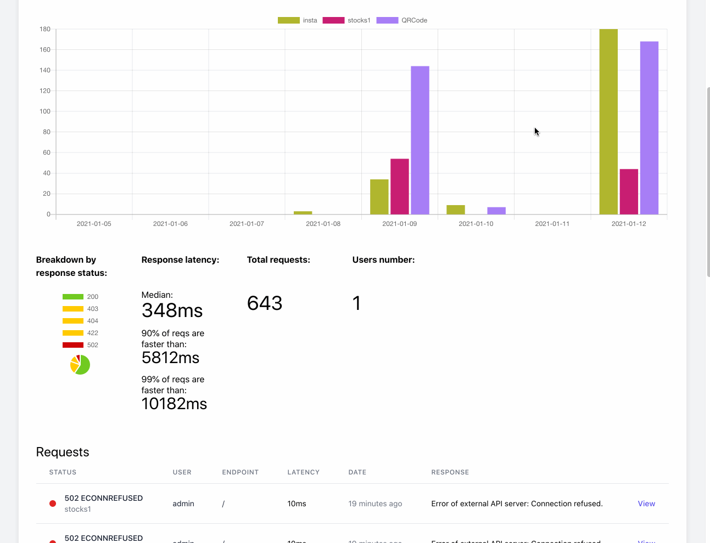

# 2021年，Clickhouse在日志存储与分析方面可作为ElasticSearch和MySQL的备选方案

- 原文地址：https://pixeljets.com/blog/clickhouse-vs-elasticsearch/
- 原文作者：Anton Sidashin
- 本文永久链接：https://github.com/gocn/translator/blob/master/2021/w10_Clickhouse_for_log_storage_and_analysis_in_2021.md
- 译者：[Fivezh](https://github.com/fivezh)
- 校对：[]()

In 2018, I've written an [article about Clickhouse](https://pixeljets.com/blog/clickhouse-as-a-replacement-for-elk-big-query-and-timescaledb/), this piece of content is still pretty popular across the internet, and even was translated a few times. More than two years have passed since, and the pace of Clickhouse development [is not slowing down](https://github.com/ClickHouse/ClickHouse/pulse/monthly): 800 merged PRs just during last month! This didn't blow your mind? Check out the full changelog, for example for 2020: https://clickhouse.tech/docs/en/whats-new/changelog/2020/ The description of just new features for each year may take an hour to go through.

For the sake of honest comparison, [ElasticSearch repo has jaw-dropping 1076 PRs merged for the same month](https://github.com/elastic/elasticsearch/pulse/monthly), and in terms of features, their pace is *very* impressive, as well!

We are using Clickhouse for log storage and analytics in [ApiRoad.net](https://apiroad.net/) project (which is [an API marketplace where developers sell their APIs](https://apiroad.net/), still in active development) and we are happy with the results so far. As an API developer myself, I know how important is the observability and analysis of HTTP request/response cycle to maintain the quality of service and quickly detect bugs, this is especially true for pure API service. *(If you are an API author and want to utilize ApiRoad analytics & billing plaftform to sell API subscriptions, drop me a message at [contact@apiroad.net](mailto:contact@apiroad.net) with your API description – I will be happy to chat!)*



We are also using ELK (ElasticSearch, Logstash, filebeat, Kibana)  stack on other projects, for very similar purposes - getting http and mail logs, for later analysis and search via Kibana.

And, of course, we use MySQL. Everywhere!

This post is about the major reasons why we chose Clickhouse and not ElasticSearch (or MySQL) as a storage solution for ApiRoad.net essential data - request logs (Important note: we still use MySQL there, for OLTP purposes).

## 1. SQL support, JSON and Arrays as first class citizens.

SQL is a perfect language for analytics. I love SQL query language and SQL schema is a perfect example of boring tech that I recommend to use as a source of truth for all the data in 99% of projects: if the project code is not perfect, you can improve it relatively easily if your database state is strongly structured. If your database state is a huge JSON blob (NoSQL) and no-one can fully grasp the structure of this data, this refactoring usually gets much more problematic.


I saw this happening, especially in older projects with MongoDB, where every new analytics report and every new refactoring involving data migration is a big pain. Starting such projects is fun – as you don't need to spend your time carefully designing the complete project schema, just "see how it goes" – but maintaining them is not fun!


But, it is important to note that this rule of thumb - "use strict schema" - is not that critical for log storage use cases. That's why ElasticSearch is so successful, it has many strong sides, and flexible schema.


Back to JSON: traditional RDBMS are still catching up with NoSQL DBMS in terms of JSON querying and syntax, and we should admit JSON is a very convenient format for dynamic structures (like log storage).


Clickhouse is a modern engine that was designed and built when JSON was already a thing (unlike MySQL and Postgres), and Clickhouse does not have to carry the luggage of backward compatibility and strict SQL standards of these super-popular RDBMS, so Clickhouse team can move fast in terms of features and improvements, and they indeed move fast. Developers of Clickhouse had more opportunities to hit a sweet balance between strict relative schemas and JSON flexibility, and I think they did a good job here. Clickhouse tries to compete with Google Big Query and other big players in the analytics field, so it got many improvements over "standard" SQL, which makes its syntax a killer combo and in a lot of cases much better than you get in traditional RDBMS, for analytics and various calculation purposes.

Some basic examples:

In MySQL, you can extract json fields, but complex JSON processing, like joining relational data on JSON data, became available only recently, [from version 8 with JSON_TABLE function](https://mysqlserverteam.com/json_table-the-best-of-both-worlds/). In PosgreSQL, the situation is even worse - [no direct JSON_TABLE alternative until PostgreSQL 12](https://stackoverflow.com/a/61732970/1132016)!

Compare it to Clickhouse JSON and related arrays feature set - it is just miles ahead. Links:

- [arrayJoin](https://clickhouse.tech/docs/en/sql-reference/statements/select/array-join/)
- [groupArray](https://clickhouse.tech/docs/en/sql-reference/aggregate-functions/reference/grouparray/)
- [arrayMap](https://clickhouse.tech/docs/en/sql-reference/functions/array-functions/#array-map)
- [arrayFilter](https://clickhouse.tech/docs/en/sql-reference/functions/array-functions/#array-filter)

These are useful in a lot of cases where you would use `generate_series()` in PostgreSQL. A concrete example from ApiRoad: we need to map requests amount on chart.js timeline. If you do regular `SELECT .. group by day`, you will get gaps if some days did not have any queries. And we don't need gaps, we need zeros there, right? This is exactly where `generate_series()` function is useful in PostgreSQL. In MySQL, [the recommendation is to create stub table with calendar and join on it...](https://ubiq.co/database-blog/fill-missing-dates-in-mysql/) not too elegant, huh?

Here is how to do it in ElasticSearch: https://www.elastic.co/guide/en/elasticsearch/reference/current/search-aggregations-bucket-datehistogram-aggregation.html#_missing_value_2

Regarding the query language: I am still not comfortable with verbosity and approach of ElasticSearch Lucene syntax, HTTP API, and all these  json structures that you need to write to retrieve some data. SQL is my preferred choice.

Here is the Clickhouse solution for dates gap filling:

```
SELECT a.timePeriod as t, b.count as c from (
	with (select toUInt32(dateDiff('day', [START_DATE], [END_DATE])) ) 
		as diffInTimeUnits
                
	select arrayJoin(arrayMap(x -> (toDate(addDays([START_DATE], x))), 			range(0, diffInTimeUnits+1))) as timePeriod ) a
            
LEFT JOIN 
            
	(select count(*) as count, toDate(toStartOfDay(started_at)) as timePeriod from logs WHERE 
		[CONDITIONS]
		GROUP BY toStartOfDay(started_at)) b on a.timePeriod=b.timePeriod
```

Here, we generate virtual table via lambda function and loop, and then left join it on  results from logs table grouped by day.

I think `arrayJoin` + `arrayMap` + `range` functions allow more flexibility than `generate_series()` from Postgres or ElasticSearch approach. There is also `WITH FILL` keyword available for a more concise syntax.

## 2. Flexible schema - but strict when you need it

For log storage tasks, the exact data schema often evolves during project lifetime, and ElasticSearch allows you to put huge JSON blob into index and later figure out the field types and indexing part. Clickhouse allows to use the same approach. You can put data to JSON field and filter it relatively quickly, though it won't be quick on terabyte scale. Then, when you see you often need fast query execution on specific data field, you add materialized columns to your logs table, and these columns extract values from existing JSON on-the-fly. This allows much faster queries on terabytes of data.

I recommend this video from Altinity on the topic of JSON vs Tabular schema for log data storage:

[https://youtu.be/pZkKsfr8n3M](https://youtu.be/pZkKsfr8n3M)


## 3. Storage and Query Efficiency

Clickhouse is very fast in SELECTs, [this was discussed in the previous article](https://pixeljets.com/blog/clickhouse-as-a-replacement-for-elk-big-query-and-timescaledb/).

[What is interesting, there is a piece of evidence that **Clickhouse can be 5-6 times more efficient in storage, comparing to ElasticSearch, while also being literally an order of magnitude faster in terms of queries.**](https://youtu.be/pZkKsfr8n3M?t=2479) [**Another one (in Russian)**](https://habr.com/ru/company/mkb/blog/472912/)

There are no direct benchmarks, at least I could not find any, I believe because Clickhouse and ElasticSearch are very different in terms of query syntax, cache implementations, and their overall nature.

If we talk about MySQL, any imperfect query, missing index, on a table with mere 100 million rows of log data can make your server crawl and swap, MySQL is not really suited for large-scale log queries. But, in terms of storage, compressed InnoDB tables are surprisingly not that bad. Of course, it's much worse in terms of compression comparing to Clickhouse (sorry, no URLs to benchmarks to support the claim this time), due to its row-based nature, but it still often manages to reduce cost significantly without a big performance hit. We use compressed InnoDB tables for some cases for small-scale log purposes.

## 4. Statistics functions

Getting median and .99 percentile latency of 404 queries is easy in Clickhouse:

```
SELECT count(*) as cnt, 
  quantileTiming(0.5)(duration) as duration_median, 
  quantileTiming(0.9)(duration) as duration_90th, 
  quantileTiming(0.99)(duration) as duration_99th
  FROM logs WHERE status=404
```

Notice usage of `quantileTiming` function and how [currying](https://javascript.info/currying-partials) is elegantly used here. Clickhouse has generic `quantile` function! But `quantileTiming` is [optimized for working with sequences which describe distributions like loading web pages times or backend response times](https://clickhouse.tech/docs/en/sql-reference/aggregate-functions/reference/quantiletiming/#quantiletiming).

There are more than that. Want weighted arithmetic mean? Want to calculate linear regression? this is easy, just use specialized function.

Here is a full list of statistics functions of Clickhouse:

https://clickhouse.tech/docs/en/sql-reference/aggregate-functions/reference/

Most of these are problematic to get in MySQL.

ElasticSearch is much better in this than MySQL, it has both quantiles and weighted medians, but it still does not have linear regression.

## 5. MySQL and Clickhouse tight integration

MySQL and Clickhouse has integrations on multiple levels, which make it easy to use them together with minimum of data duplication:

- [MySQL external dicts](https://clickhouse.tech/docs/en/sql-reference/dictionaries/external-dictionaries/external-dicts-dict-sources/#dicts-external_dicts_dict_sources-mysql)
- [MySQL database replica inside Clickhouse (via binlog)](https://clickhouse.tech/docs/en/engines/database-engines/materialize-mysql/#materialize-mysql)
- [MySQL database engine](https://clickhouse.tech/docs/en/engines/database-engines/mysql/) - similar as previous one but dynamic, without binlog
- [MySQL table function](https://clickhouse.tech/docs/en/sql-reference/table-functions/mysql/) to connect to MySQL table in specific SELECT query
- [MySQL table engine](https://clickhouse.tech/docs/en/engines/table-engines/integrations/mysql/) to describe specific table statically in CREATE TABLE statement
- [Clickhouse can speak MySQL protocol](https://clickhouse.tech/docs/en/interfaces/mysql/)

I can't say for sure how fast and stable dynamic database engines and table engines work on JOINs, this definitely requires benchmarks, but the concept is very appealing - you have full up-to-date clone of your MySQL tables on your Clickhouse database, and you don't have to deal with cache invalidation and reindexing.

Regarding using MySQL with Elasticsearch, my limited experience says that these two techonologies are just too different and my impression is that they are speaking foreign languages, and do no play "together", so what I usually did is just JSONify all my data that I needed to index in ElasticSearch, and send it to ElasticSearch.  Then, after some migration or any other UPDATE/REPLACE happen on MySQL data, I try to figure out the re-indexing part on Elasticseach side. [Here is an article of the Logstash powered approach to sync MySQL and ElasticSearch](https://www.elastic.co/blog/how-to-keep-elasticsearch-synchronized-with-a-relational-database-using-logstash). I should say I don't really enjoy Logstash for it's mediocre performance, and RAM requirements, and since it is another moving part which can break. This syncing and re-indexing task is often a significant stop factor for us to use Elasticsearch in simple projects with MySQL.


## 6. New Features

Want to attach S3 stored CSV and treat it as table in Clickhouse? [Easy](https://clickhouse.tech/docs/en/engines/table-engines/integrations/s3/).

Want to update or delete log rows to be compilant with GDPR? Now, this is easy!

There was no clean way to delete or update data in Clickhouse in 2018 when my first article was written, and it was a real downside. Now, it's not an issue anymore. Clickhouse leverages custom SQL syntax to delete rows:

```
ALTER TABLE [db.]table [ON CLUSTER cluster] DELETE WHERE filter_expr
```

This is implemented like this to be explicit that deleting is still a pretty expensive operation for Clickhouse (and other columnar databases) and you should not do it every second on production.

## 7. Cons

There are cons for Clickhouse, comparing to ElasticSearch. First of all, if you build internal analytics for log storage, you do want to get the best GUI tool out there. And Kibana is good nowadays for this purpose when you compare it to Grafana (at least, this point of view is very popular on the Internet, Grafana UI is not that slick sometimes). And you have to stick to Grafana or Redash if you use Clickhouse. [(Metabase, which we adore, also got Clickhouse support!)](https://github.com/enqueue/metabase-clickhouse-driver)

But, in our case, in ApiRoad.net project, we are building customer-facing analytics, so we have to build analytics GUI from scratch, anyways (we are using a wonderful stack of Laravel, Inertia.js, Vue.js, and Charts.js to implement the customer portal, by the way).

Another issue, related to the ecosystem: the selection of tools to consume, process data and send them to Clickhouse is somewhat limited. For Elasticsearch, there are Logstash and filebeat, tools native to Elastic ecosystem, and designed to work fine together. Luckily, Logstash can also be used to put data to Clickhouse, this mitigates the issue. In ApiRoad, we are using our own custom-built Node.js log shipper which aggregates logs and then sends them to Clickhouse in a batch (because Clickhouse likes big batches and does not like small INSERTs).

What I don't like in Clickhouse is also weird naming of some functions, which are there because Clickhouse was created for Yandex.Metrika (Google Analytics competitor), e.g. visitParamHas() is a function to check if a key exists in JSON. Generic purpose, bad non-generic name. I should mention that there is a bunch of fresh JSON functions with good names: e.g. JSONHas(), with one interesting detail: they are using [different JSON parsing engine](https://github.com/simdjson/simdjson), more standards-compliant but a bit slower, as far as I understand.


## Conclusion

ElasticSearch is a very powerful solution, but I think its strongest side is still huge setups with 10+ nodes, used for large-scale full-text search and facets, complex indexing, and score calculation – this is where ElasticSearch shines. When we talk about time-series and log storage, my feeling is there are better solutions, and Clickhouse is one of them. ElasticSearch API is enormous, and in a lot of cases it's hard to remember how to do one exact thing without copypasting the exact HTTP request from the documentation, it just feels "enterprisy" and "Java-flavored". Both Clickhouse and ElasticSearch are memory hungry apps, but RAM requirements for minimal Clickhouse production installation is 4GB, and for ElasticSearch it is around 16GB. I also think Elastic team focus is getting pretty wide and blurred with [all the new amazing machine-learning features they deploy](https://www.elastic.co/what-is/elasticsearch-machine-learning), my humble opinion is that, while these features sound very modern and trendy, this enormous feature set is just impossible to support and improve, no matter how many devs and money you have, so ElasticSearch more and more gets into "Jack of all trades, master of none" category for me. Maybe I am wrong.

Clickhouse just feels different. Setup is easy. SQL is easy. Console client is wonderful. Everything just feels so light and makes sense, even for smaller setups, but rich features, replicas, and shards for terabytes of data are there when you need it.


## Good external links with further info on Clickhouse:

[Altinity Blog](https://altinity.com/blog/)

https://blog.luisico.net/2019/03/17/testing_clickhouse_as_logs_analysis_storage/

https://youtu.be/zbjub8BQPyE

UPD: [this post hit top#1 on HackerNews, useful comments there, as usual!](https://news.ycombinator.com/item?id=26316401)

Best comments:

> ClickHouse is incredible. It has also replaced a large, expensive and slow Elasticsearch cluster at Contentsquare. We are actually starting an internal team to improve it and upstream patches, email me if interested!

> I'm happy that more people are "discovering" ClickHouse. ClickHouse is an outstanding product, with great capabilities that serve a wide array of big data use cases. It's simple to deploy, simple to operate, simple to ingest large amounts of data, simple to scale, and simple to query. We've been using ClickHouse to handle 100's of TB of data for workloads that require ranking on multi-dimensional timeseries aggregations, and we can resolve most complex queries in less than 500ms under load.


Also from HN:

[It turns out Uber just switched from ELK to Clickhouse for log analytics, read more on their writeup.](https://eng.uber.com/logging/)