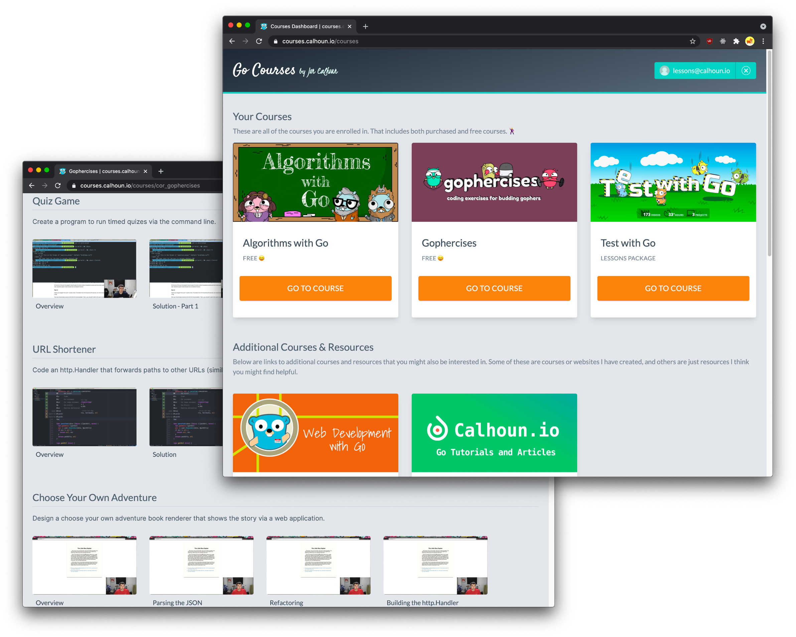

# **浅谈如何组织Go代码结构**

* 原文地址：https://changelog.com/posts/on-go-application-structure
* 原文作者：`Jon Calhoun`
* 本文永久链接：https://github.com/gocn/translator/blob/master/2021/w20_Thoughts_on_how_to_structure_Go_code.md
- 译者：[Fivezh](https:/github.com/fivezh)
- 校对：[]()

应用程序的结构很是困扰开发者。

好的程序结构可以改善开发者的体验。它可以帮助你隔离正在进行中的内容，而不必将整个代码库放在脑中。一个结构良好的应用程序可通过解耦和易于编写的测试来帮助避免错误。

一个结构不佳的应用程序却适得其反。它使得测试更加困难，找到相关代码也异常复杂，并可能引入非必要的复杂性和冗长的代码，这些将拖慢开发速度却没有一点好处。

最后一点很重要：使用一个远比需要复杂的程序结构，实际上对项目的伤害比帮助更大。

我正在写的东西可能对任何人来说都不是新闻。程序员很早就被告知合理组织代码的重要性。无论是变量和函数命名，还是文件的命名和组织，这几乎是每一个编程课中早期涉及的主题。

所有这些都引出了一个问题：**搞清楚如何构建 `Go` 代码为何如此困难？**

### 通过上下文来组织

在过去的 `Q&A` 中，我们被问及 `Go` 应用的结构问题，Peter Bourgon 的回答是这样的：

> 很多语言都有这样的惯例（我猜），对于同一类型的项目，所有项目的结构都大致相同...如果你用 `Ruby` 做一个 `web` 服务，你会有这样的布局，程序包会以你使用的架构模式来命名。以 `MVC` 为例，控制器等等。但是在 `Go` 中，这并不是我们真正要做的。我们的程序包和项目结构基本能反映出我们正在实施事务所在的领域。不是所使用的模式，也不是脚手架，而是取决于当前项目所在领域中的特定类型和实体。
> **因此，从定义上讲，不同项目在习惯上总是有所不同。**在一个项目中有意义的，在另一个项目中可能就没有意义。不是说这里是唯一的方法，但这是我们倾向于的一种选择......因此，是的，这个问题没有答案，那种关于语言中约定俗成让很多人非常困惑，但结果可能是错误的选择......我不知道，但我想这是主要的一点。
>
> [Peter Bourgon](https://twitter.com/peterbourgon) 在 [Go Time #147](https://changelog.com/gotime/147#transcript-185) 中的回答。其中的加粗是我标注的。

总的来说，大多数成功的 `Go` 应用程序的结构并不能从一个项目复制/粘贴到另一个项目。也就是说，我们不能把一般的文件夹结构复制到一个新的应用程序，并期望它能正常工作，因为新的应用程序很可能有一套独特的上下文来工作。

与其寻找一个可以复制的模板，不如让我们从思考应用程序的上下文来开始。为了帮助你能理解我的意思，让我们来一起看下，我是如何构建用于托管 `Go` 课程的网络应用程序的。



*背景信息：这个 `Go` 课程应用程序是一个网站，学生在这里注册课程并查看课程内容。大多数课程都有视频、链接（课程中使用的代码）、以及其他相关信息。如果你曾经使用过任何视频课程网站，你应该对它的外观有一个大致的了解，但如果你想进一步挖掘，你可以免费注册[Gophercises](https://gophercises.com/)。*。

在这一点上，我对应用程序的需求相当熟悉，但我要试着带领你了解最初开始创建程序时的思考过程，因为那是经常要开始的状态。

开始的时候，有两个主要内容上下文需要考虑：

1. 学生上下文
2. 管理员/老师上下文

学生上下文是大多数人所熟悉的。在这种情况下，用户登录到一个账户，查看他们可以访问的课程仪表板，然后向下导航到课程内容。

管理员的上下文有点不同，大多数人不会看到它。作为管理员，不用担心消费课程，而更关心如何管理它们。我们需要能添加新的课程，更新现有课程视频，以及其他。除了能够管理课程之外，管理员还需要管理用户、购买和退款。

为了创建这种分离，我的仓库将从两个包开始：

```bash
admin/
  ... (some go files here)
student/
  ... (some go files here)
```

通过分离这两个包，我能够在每种情况下以不同的方式定义实体。例如，从学生的角度来看，`Lesson` 类型主要由指向不同资源的一些 `URL` 组成，它有用户相关信息，如 `CompletedAt` 字段表明该特定用户何时/是否完成课程。


```go
package student

type Lesson struct {
  Name         string // 课程名, 比如: "如何写测试"
  Video        string // 课程视频url，空则用户无权访问
  SourceCode   string // 课程源码url
  CompletedAt  *time.Time // 表示该用户是否完成课程的布尔值或完成时间
  // + 更多字段
}
```

同时，管理员的 `Lesson` 类型没有 `CompletedAt` 字段，因为在这种上下文情况下是没有意义。这些信息只对登录用户查看课程有关，而不是管理员管理课程的内容。

相反，管理员 `Lesson` 类型将提供对 `Requirement` 等字段的访问，这些字段被用来确定用户是否可以访问此内容。其他字段看起来也会有些不同；`Video` 字段不是视频的URL，而是视频托管地点的信息，因为这是管理员更新内容的方式。

Instead, the admin Lesson type will provide access to fields like `Requirement`, which will be used to determine if a user has access to content. Other fields will look a bit different as well; rather than a URL to the video, the `Video` field might instead be information about where the video is hosted, as this is how admins will update the content.

```go
package admin

// 为了简洁起见，本例使用内联结构
type Lesson struct {
  Name string
  // 视频URL可以使用这些信息动态构建（在某些情况下，使用时间限制的访问令牌）
  Video struct {
    Provider string // Youtube, Vimeo, 等
    ExternalID string
  }
  // 决定源码资源URL的有关信息，如 `repo/branch`
  SourceCode struct {
    Provider string // Github, Gitlab, 等
    Repo     string // 比如 "gophercises/quiz"
    Branch   string // 比如 "solution-p1"
  }

  // 用来确定用户是否有权限学习本课。
  // 通常是类似于 "twg-base "的字符串，当用户购买课程许可证时，将有这些权限字符串链接到他们的账户。这可能不是最有效的方法，但现在已经足够用了，而且可以很容易地制作提供多个课程访问权限的程序包。
  Requirement string
}
```

我采用这种方式是因为相信这两种情况会有足够的差异，以证明这种分离是合理的，但我也怀疑这两种情况都不会发展到足够大，以证明未来任何进一步的组织。

我可以用不同的方式组织这些代码吗？当然可以。

我可能改变结构的一个方法是进一步分离它。例如， `admin` 包的一些代码与管理用户有关，而另一些代码与管理课程有关。把它分成两个部分是很容易的。另外，可以把所有与认证有关的代码(注册、修改密码等)放到一个 `auth` 包中。

与其过度思考，挑选看起来合适的方案并按需进行调整更有意义。

### 以层的方式组织包结构

另一种分割程序的方法是通过依赖关系。Ben Johnson在[gobeyond.dev](https://www.gobeyond.dev/)，特别是在[Packages as layers, not groups](https://www.gobeyond.dev/packages-as-layers/)一文中对此进行了很好的讨论。这个概念与Kat Zien在 `GopherCon` 演讲中提到的[六边形架构](https://www.youtube.com/watch?v=oL6JBUk6tj0&t=1614s)非常相似，"你如何组织Go应用程序的结构"。

从较高的角度来看，我们的想法是我们拥有一个核心域，在其中定义资源和与之交互所使用的服务。

```go
package app

type Lesson struct {
  ID string
  Name string
  // ...
}

type LessonStore interface {
  Create(*Lesson) error
  QueryByPermissions(...Permission) ([]Lesson, error)
  // ...
}
```

使用像 `Lesson` 这样的类型和 `LessonStore` 这样的接口，我们可以编写一个完整的应用程序。如果没有 `LessonStore` 的实现，我们就不能运行程序，但可以编写所有的核心逻辑，而不必担心如何实现。

当我们准备好实现像 `LessonStore` 接口时，我们会给程序添加一个新的层。在这种情况下，它可能是以 `sql` 包的形式出现。

```go
package sql

type LessonStore struct {
  db *sql.DB
}

func Create(l *Lesson) error {
  // ...
}

func QueryByPermissions(perms ...Permission) ([]Lesson, error) {
  // ...
}
```

*想更多了解这一策略，建议去看看 Ben 的文章，网址是 https://www.gobeyond.dev/*

> 译者注：该文章的中文译稿 [以层的方式而不是组的方式进行包管理](https://github.com/gocn/translator/blob/master/2021/w7_packages_as_layers_not_groups.md)

分层打包的方式似乎与上述 `Go` 课程中选择的方法大相径庭，但实际上，混合这些策略要比最初看起来容易得多。例如，如果把 `admin` 和 `student` 分别作为一个定义了资源和服务的域，就可以使用分层打包的方法来实现这些服务。下面是使用 `admin` 包域和 `sql` 包的例子，其中 `sql` 包有一个 `admin.LessonStore` 的实现。

```go
package admin

type Lesson struct {
  // ... same as before
}

type LessonStore interface {
  Create(*Lesson) error
  // ...
}
```

```go
package sql

import "github.com/joncalhoun/my-app/admin"

type AdminLessonStore struct { ... }

func (ls *AdminLessonStore) Create(lesson *admin.Lesson) error { ... }
```

上面这些是对该应用的正确选择吗？我不知道。

使用这样的接口会使测试代码片断变得容易，但这只有在它真正有用时才重要。否则，我们写接口，解耦代码，并创建新的包，但却没有看到真正的好处。这样一来，这种方案只会让自己更加忙碌。

### 唯一错误的决定是没有决定

除了以上这些结构之外，还有无数种（或无结构）组织代码的方法，根据不同的上下文这些方法也是有意义的。我曾在一些项目中尝试扁平结构（单一的包），我仍然对这种方式的效果感到震惊。当刚开始写 `Go` 代码时，我几乎只使用 `MVC`。这不仅比整个社区引导的更好，而且摆脱了因不知道如何布局程序结构的困境，避免了不知道从哪里开始的难题。 

在同一 `Q&A` 中，我们被问到如何组织 `Go` 代码，Mat Ryer表达了没有一个固定方式来组织代码的好处：

> 我认为，这里是非常自由的，虽然说没有真正的方法，但这也意味着你不会做错。适合你的情况才是好的选择。
> [Mat Ryer](https://twitter.com/matryer) 在 [Go Time #147](https://changelog.com/gotime/147#transcript-186) 中发表的观点

现在我有很多使用 `Go` 的经验，我完全同意 Mat 的观点。决定一个应用适合什么样的结构，这是一种自有。我喜欢没有一个固定的方法，也没有一个错误的方法。尽管现在有这种感觉，但也记得在我经验不足的时候，因为没有具体的例子可以参考而感到非常沮丧。

事实是，如果没有一些经验，决定什么结构适合你的情况几乎是不可能的，但现实往往迫使我们在获得任何经验之前就得选择。这是一个《第22条军规》陷阱，在还没有开始的时候就阻止了我们。

然而我并没有放弃，而是选择了使用所知道的东西：`MVC`。这使我能够编写代码，获得一些工作，并从这些错误中学习。随着时间的推移，开始理解其他的代码结构方式，我的应用程序与 `MVC` 的相似度越来越低，但这是一个渐进的过程。我甚至怀疑，如果一开始就强迫自己立即弄好程序的结构，这根本就不会成功。最多只能在经历了大量的挫折之后获得成功。

绝对正确的是，`MVC` 永远不会像为项目量身定做的应用结构那样提供清晰的信息。同样正确的是，对于一个几乎没有 `Go` 代码经验的人来说，发掘项目的理想结构并不是一个现实的目标。它需要实践、实验和重构来获得正确的结果。`MVC` 是简单而平易近人的。当我们没有足够的经验或上下文来想出更好的选择时，它会是一个合理的开始。

### 总结

正如在本文开头所说，好的程序结构是为了改善开发者的体验。它是为了帮助你以一种有意义的方式来组织代码。它并不是要让新手们陷入瘫痪、不知道该如何继续。

如果你发现自己被卡住了，不知道如何继续，问问自己什么是更有效的：继续卡住，还是挑选一个结构并加以尝试？

对于前者，什么都做不了。对于后者，即使你做错了，也可以从中学习经验，并在下一次做得更好。这听起来比永远不开始要好得多。