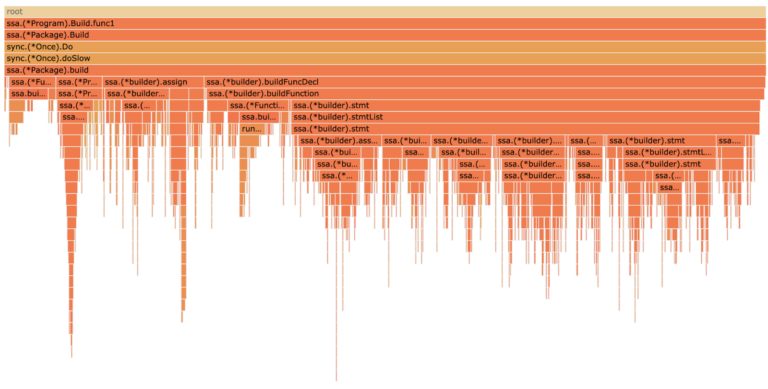
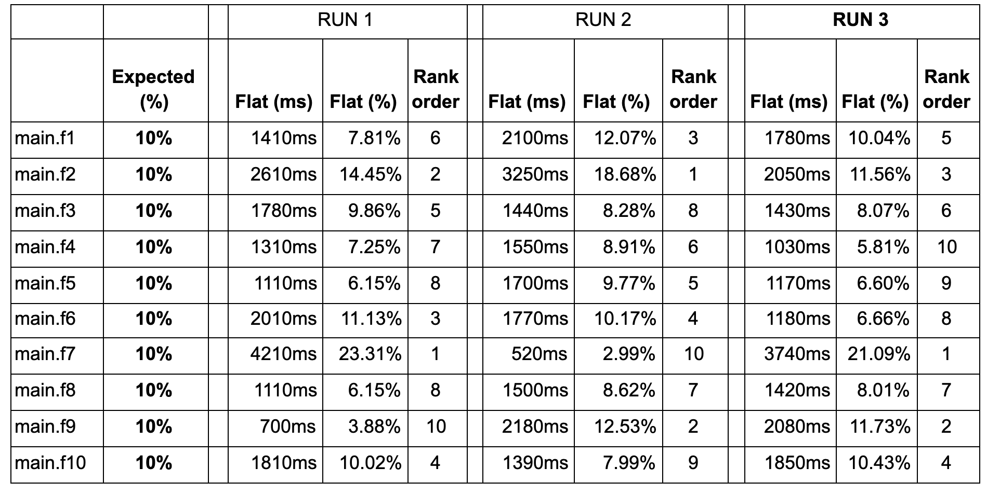
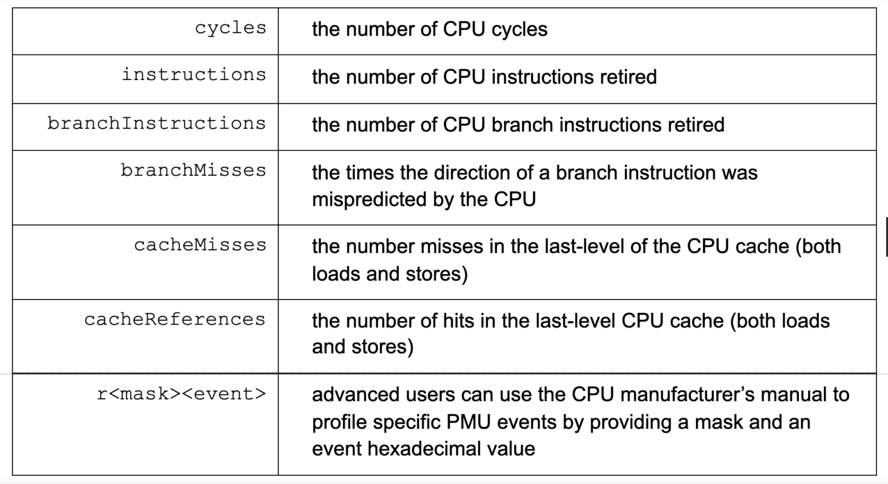
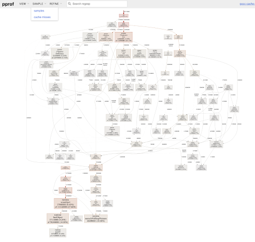
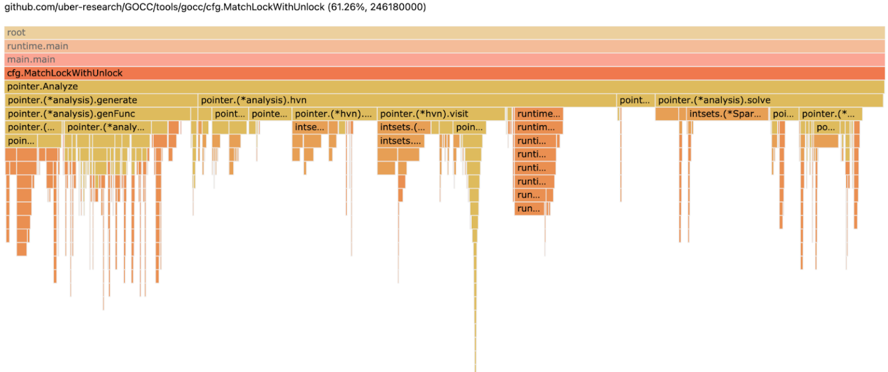

# **pprof++: 一个带有硬件监控的 Go Profiler**

* 原文地址：https://eng.uber.com/pprof-go-profiler/
* 原文作者：[Milind Chabbi](https://eng.uber.com/author/milind-chabbi/)
* 本文永久链接：https://github.com/gocn/translator/blob/master/2021/w20_pprof_go_profiler.md
- 译者：[tt](https:/github.com/1-st)
- 校对：[]()



## 追求更好的 Go Profiler 的动机

Golang 是数百万 CPU 核心上运行的成千上万Uber后端服务的命脉。了解CPU瓶颈对于减少服务延迟以及提高计算队列效率至关重要。 Uber 的规模要求我们对代码和微体系结构做深入了解。

尽管与其他几种语言相比，Go 语言内置的 profiler 聊胜于无，但事实上，Go 语言中的 CPU profiler 在基于 Linux 的系统（也可能在其他操作系统）上受到严重限制，并且缺乏很多东西 [[1](https://static.googleusercontent.com/media/research.google.com/en//pubs/archive/44271.pdf), [2](https://software.intel.com/content/www/us/en/develop/documentation/vtune-cookbook/top/methodologies/top-down-microarchitecture-analysis-method.html), [3](https://ieeexplore.ieee.org/document/6844459), [4](https://hal.inria.fr/hal-01593009/document)] 来全面了解CPU 瓶颈所需的详细信息。

考虑到这些问题，我们着手构建了一个自定义的 Go 分析器，该分析器更适合我们的需求和 Uber 业务运营的规模。具体来说，我们将 Go 的默认 pprof profiler 集成丰富的硬件性能监控功能来对其进行增强。这一增强主要提供了以下好处：

1. 获取更精确的 Go 程序 profiles。
2. 监视各种 CPU 事件的能力，例如高速缓存未命中，套接字间（NUMA）流量，CPU 分支错误预测，仅举几例。
3. 能够以非常高的采样频率（高达10微秒）监视 go 程序。

## 背景

分析是 Golang 的内置功能之一。 Go Profiler 涵盖了诸如 CPU 时间，内存分配等方面。本文涉及最常见和最熟悉的性能分析形式- CPU 性能分析。有3种著名的方法可以从 Go 程序中获取 CPU profile:

1. **通过公开的 http 端口获取 CPU profile** 

    首先，通过在 Go 程序中包含以下代码段，公开指定端口上的分析端点：

    ```golang 
    go func() {log.Println(http.ListenAndServe("localhost:6060", nil))}() 
    ``` 

    然后，从正在运行的 Go 程序的分析端点中获取 profiles；例如，以下命令包含5秒钟的 CPU profile，并将其存储在 timer.prof 文件中。

    ```shell
    $curl -o timer.prof server200:6060/debug/pprof/profile?seconds=5
    ``` 

    在 Uber，我们十分依赖从成千上万生产环境微服务中获取 profile 的能力，并且我们拥有一套精巧的下游工具来对其进行后处理。
2. **从 Go 基准测试中获取 CPU profile**
    Go 测试框架允许对程序进行基准测试，然后通过传递额外的 -cpuprofile 标志以收集 CPU Profile来对基准进行概要分析。
    ```shell
    $go test -bench BenchmarkXYZ -cpuprofile cpuprof.out
    ```

3. **从代码检测获取CPU profile**
    可以在感兴趣的代码区域周围插入启动/停止分析 API ，并提供 io.writer 将结果概要文件刷新到文件中，如下所示：
    ```golang
    f, err := os.Create("cpuprof.prof")
    defer f.Close()
    pprof.StartCPUProfile(f)
      MyCodeToProfile()
    pprof.StopCPUProfile()

    ```

    所有这三个接口都生成一个 pprof 协议缓冲区文件，可以使用 go 工具 pprof <profile file> 命令行或其他下游工具查看该文件。Go CPU profile包括调用堆栈样本的时间归因。它们可以通过调用图和火焰图可视化。

## 准确度和精度

准确度和精度是一个好的测量工具的基本属性。

如果概要分析数据与事实相近，则称其为准确的。例如，如果API_A（）消耗了总执行时间的25％，而分析器将其测量为总执行时间的24％，则测量的准确度为96％

如果多次测量之间的差异性很低，则分析数据被认为是精确的。一组相同变量的测量精度通常表示为样本平均值的最小值和最大值，或者表示为样本的标准误差或差异系数。

不幸的是，当前的 pprof CPU profile 这两个条件都不符合。在 Go 运行时内部，CPU 分析使用操作系统计时器来定期（每秒约100次）中断执行。在每个中断（也称为样本）上，它同时收集当时的调用堆栈。

## 不准确和原因

profile的不准确性有两个来源：采样频率和采样偏差。

**采样频率**: 基于样本的 profile 准确度与[奈奎斯特采样定理(Nyquist Sampling Theorem)](https://en.wikipedia.org/wiki/Nyquist%E2%80%93Shannon_sampling_theorem)紧紧相关. 为了忠实地恢复输入信号，采样频率应大于信号中包含的最高频率的两倍。如果微服务需要10毫秒来处理请求，则我们应该至少每5毫秒采样一次，以对请求中发生的事情有所了解。但是，OS 定时器不能慢到每 10ms 进行一次采样。事实上，为了函数级别的准确采样，我们需要微妙级别的粒度。

[大量样本](https://en.wikipedia.org/wiki/Law_of_large_numbers)可以使profiles更接近实际，并且可以通过增加测量窗口的长度来获取更多样本。如果需要更多的样本来纠正小样本问题，线性缩放测量时间以收集更多样本是不切实际的。因此，迫切需要在测量窗口内收集更多样本并获得亚毫秒级执行的细粒度样本。

**采样偏差**: 如果样本有偏差，则仅增加样本量并不能提高准确性. Linux 中的 OS 计时器（初始）样本有偏差，因为来自一个 OS 线程（例如 T1 ）的计时器中断可以由任意（不要与统一随机变量混淆）线程（例如 T2）来处理。这意味着，T2 将处理中断并用其调用堆栈错误得修饰样本，这将产生偏差样本。如果与 T1 相比，T2 处理的计时器中断更多，那么系统性的采样偏差将会发生，这将导致 profile 的不准确。

## 不精确及其原因

导致大多数测量不精确的两个主要原因：样本量和测量滑移。

**样本量**: 较少的样本数量直接导致较大的标准误差。 OS 计时器的低分辨率导致测量窗口中的样本减少，从而导致 pprof 配置文件的精度降低。相反，更高的样品分辨率将提高精度。

**测量滑移**: 测量误差的第二个来源是任何给定测量设备中固有的随机误差。配置为在 N 毫秒后过期的 OS 计时器设备只能保证在 N 毫秒后的某个时间生成中断，而不是精确地在 N 毫秒。这种随机性导致测量中出现较大的“滑移”。假设一个定时器设置为每10毫秒触发一次。当具有4ms分辨率的 OS 调度程序对其进行检查时，它还有1ms的到期时间。这意味着计时器将在4ms之后触发，而这将会比本该测量的时间慢3ms。对于10ms的周期性定时器，这将导致高达30％的不精确性。尽管可能无法完全消除随机误差，但高级的测量设备可以减少随机误差的影响。

## 示范
考虑以下这个 Go 程序: [goroutine.go](https://github.com/chabbimilind/GoPprofDemo/blob/master/goroutine.go), 它具有10个完全相似的 goroutines main.f1-main.f10，其中每个函数占用的 CPU 时间完全相同（即，占总执行时间的10％）。表1总结了在此程序上使用默认 pprof cpu 配置文件的结果，该配置文件在具有 Linux OS 的12核 Intel Skylake 架构服务器上运行

 

在表1中的RUN 1，RUN 2和RUN 3标头列所表示的相同配置下，进行了3​​次测量。Expected（％）列显示了每个例程中的预期相对时间。 Flat（ms）列显示10个例程中的每一个的绝对毫秒测量值，Flat（％）列显示例程中相对于每次运行的总执行时间的相对时间。排序列按每次运行的每个功能的执行时间的降序排位。

考虑RUN 1中的数据。main.f1-main.f10在赋予它们的时间上有很大的差异，而我们希望它们中的每一个都占总时间的10％。占有时间最高的例程（main.f7的4210ms，23.31％）和最低的例程（main.f9的700ms，3.88％）的时间差距高达6倍。这证明了基于pprof计时器的配置文件的准确性很差（偏离基本事实）。

现在将注意力集中在RUN 1，RUN2和RUN 3的3次运行上。赋予任何例程的时间每次运行都不同。例程的排序在每次运行之间都发生显着变化。在RUN 1中，显示main.f7以排位1运行了4210ms，而在RUN 2中，仅以排位10运行了520ms。main.f1例程的3次运行之间的差异系数为71％，所有函数的平均差异系数为28％。这表明基于pprof计时器的配置文件不精确。将此程序的运行时间增加10倍甚至100倍并不能解决此分析错误。

其他详细信息出现在[Golang提案中]中(https://go.googlesource.com/proposal/+/refs/changes/08/219508/2/design/36821-perf-counter-pprof.md).

## 超过代码热点

profiler 的第二个方面是，它提供了不仅仅是热点的更多详细信息，以帮助开发人员采取纠正措施。所有profile 都显示热点，但是热点充其量只是症状，不能完全反映出潜在的问题。例如，如果 profiler 显示程序在矩阵矩阵乘法中花费了90％的时间，它不会告诉您程序是好是坏。矩阵乘法可能已经高度优化了！但是，如果分析器可以确定在矩阵矩阵乘法期间访问的50％的数据是从运行它的 NUMA 系统的远程 DRAM 提取的，则它立即突出显示程序中的数据局部性问题，因此也有机会优化。在基本的 profiler（包括默认的 Go profiler）中很难获得此类详细信息。

## 带有硬件性能计数器的解决方案

为了解决这些问题，我们开发了pprof++，它增强了默认的 Go CPU 分析器以使用硬件性能监视功能。

1. **增强准确度和精度**: 现代的商用CPU配备了硬件性能监视单元（PMU）。可以将硬件性能计数器配置为非常精细的测量粒度，从而提高配置精度。此外，PMU的先进特性提供了在中断时记录CPU状态的功能，从而可以重构程序的精确状态，从而提高精度。最后，可以将来自硬件PMU的中断配置为传递给当前聚焦的特定线程，这避免了线程描述不正确的问题，从而提高了分析精度。

2. **洞察多种CPU事件，以更好地诊断性能问题**: 诊断复杂的性能问题时，仅凭时间是不够的。例如，如果将大量时间赋予数据结构遍历，那么原因可能并不明显。硬件性能监视揭示了CPU和内存子系统的许多内部功能，这些功能可以诊断性能问题的根本原因。例如，如果在再次访问以前访问的数据之前获取了许多新数据，则从CPU高速缓存中逐出这些数据，如果要分析CPU高速缓存未命中，这将拥有可见性。同样，如果2个相邻的数据项被2个独立的线程访问，而它们恰好位于同一CPU高速缓存行上，则会导致2个CPU的专用高速缓存之间共享高速缓存行ping-poning，通常称为错误共享，可以通过现代英特尔CPU中称为HITM的计数器进行诊断。 
3. **高频测量**: 由于PMU可以配置为任意低的采样阈值，因此可以以极高的频率（大约10 s或100 s微秒）监视事件，这对于延迟敏感的服务很有必要，在这些服务中，单个请求仅持续数十毫秒。

PMU在现代CPU中无处不在，被Linux之类的OS所暴露，并且可以通过编程控制它们，以在事件的阈值累积时传递中断。  例如，Intel公布了他们的[性能监控事件](https://software.intel.com/content/dam/develop/public/us/en/documents/335279-performance-monitoring-events-guide.pdf)针对其处理器系列的每个成员，Linux通过perf_event子系统公开PMU。. pprof++对Go运行时进行更改，订阅这些硬件事件，并获得定期中断。这种机制通常称为基于硬件事件的采样。事件的选择使硬件性能监控变得丰富而可见。像OS计时器分析一样，pprof++在每个PMU中断上执行调用栈退卷，并将事件归因于调用栈样本。这使pprof++配置文件可以突出显示哪些函数和源代码行会导致不同的体系结构瓶颈，例如CPU高速缓存未命中。

对于初学者而言，确定要监视的硬件性能事件可能会令人生畏。因此，我们简化了流程并公开了以下最常见的事件。这些事件拥有一个可重写的[预设](https://github.com/uber-dev/go/blob/release-branch.go1.16_pmu_pprof/src/runtime/pprof/pprof.go#L911) 分析阶段。





 

pprof++的输出是相同的，熟悉的pprof协议缓冲区profile文件，可以使用pprof工具将其视为调用图（图1）或火焰图（图2），也可以馈送至其他下游profile处理工作流程。如果使用PMU周期事件获取配置文件，则pprof调用图和火焰图将查明并量化哪些代码区域（上下文）占CPU周期的数量；如果使用PMU cacheMisses事件获取profile，则pprof调用图和Flame-graph将查明并量化代码区域（上下文）占CPU上一级缓存未命中的数量，依此类推。 

## 入手使用pprof++ 

为了利用pprof++，请使用我们的自定义Go编译器重新编译您的Go程序，并添加PMU分析功能；详见下方的[可用性](https://eng.uber.com/pprof-go-profiler/#CA)部分.。

[背景](https://eng.uber.com/pprof-go-profiler/#BG)部分介绍的三种使用方式与使用pprof++基本一样:

1. **通过公开的 http 端口获取CPU profile**

    与pprof一样，包括相同的代码片段以公开性能分析端点；无需更改应用程序代码。开发人员现在可以获取多种配置文件。我们在/debug /pprof /profile endpoin中引入了2个新参数

    1.
        ```shell 
        event=<timer|cycles|instructions|cacheMisses|cacheReferences|branches|branchMisses|rHexValue>
        ```
    2.
        ```shell
        period=<Int64Value>
        ```
    这是一些使用例子:

    a. 通过在500万个CPU周期中对调用堆栈进行一次采样来使用CPU周期收集profile，并收集25秒钟。
    ```shell
    $ curl -o cycles.prof <host>:<port>/debug/pprof/profile?event=cycles\&period=5000000\&seconds=25 
    ```
    event = cycles 表示事件探查器采样 CPU 周期。默认值是 pprof 中的“定时器”。period=5000000 表示分析器每5M个 CPU 周期进行一次采样。在 2.5GHz CPU 上，这将导致每秒约500个样本。seconds=25 表示分析器测量应用程序25秒。默认值为30秒。 

    b. 通过在100万条退休指令中对调用堆栈进行一次采样来使用CPU退休指令事件收集配置文件，并在30秒内收集配置文件（默认）。
    ```shell
    $ curl -o ins.prof <host>:<port>/debug/pprof/profile?event=instructions\&period=1000000
    ```
    c.通过在10K高速缓存未命中中对调用堆栈进行一次采样来收集使用最后一级高速缓存未命中的profile，并收集30秒钟。
    ```shell
    $ curl -o cachemiss.prof <host>:<port>/debug/pprof/profile?event=cacheMisses\&period=10000
    ```
    d. 收集 profile 以检测由于2个不同 NUMA 套接字上的2个内核之间的正确或错误共享而导致的高速缓存行争用。这可以通过 [MEM_LOAD_L3_MISS_RETIRED.REMOTE_HITM](https://github.com/torvalds/linux/blob/master/tools/perf/pmu-events/arch/x86/skylakex/cache.json) 事件轻松完成，该事件在 skylake 体系结构上具有掩码 0x4 和事件代码 0xD3。因此，我们设置 event= r04d3。让我们以每10K个此类事件中的呼叫堆栈样本作为示例。
    ```shell
    $ curl -o remote_hitm.prof <host>:<port>/debug/pprof/profile?event=r04d3\&period=10000
    ```
2. **从 Go 基准测试中获取 CPU profile**

    我们在命令行中引入了两个新参数： 

    1. 
        ```shell
        cpuevent=<timer|cycles|instructions|cacheMisses|cacheReferences|branches|branchMisses|rHexValue>
        ```
    2. 
        ```shell
        cpuperiod=<Int64Value>
        ```
    以下是一些用法示例：

    a. 通过在每100万个周期中采样一次，从 BenchmarkXYZ 上的 CPU 周期计数器中收集配置文件，并将配置文件写入 cycle.prof 文件。
    ```shell
    $go test -bench BenchmarkXYZ -cpuprofile cycles.prof -cpuprofileevent cycles -cpuprofileperiod 1000000
    ```
    b. 通过在每10000个错误预测的分支中采样一个来收集 BenchmarkXYZ 中错误预测的分支的概要文件，并将概要文件写入 mispredbranch.prof。
    ```shell
    $go test -bench BenchmarkXYZ -cpuprofile mispredbranch.prof -cpuprofileevent branchMisses -cpuprofileperiod 100000
    ```
    c. 确定代码在 CPU 的一级指令高速缓存中引起频繁丢失的位置。可以在事件为FRONTEND_RETIRED.L1I_MISS 的 Intel Skylake 计算机上对此事件进行配置文件，事件FRONTEND_RETIRED.L1I_MISS 的掩码为 0x1，事件代码为 0xc6。让我们在10000次未命中的情况下进行一次采样。
    ```shell
    $go test -bench BenchmarkXYZ -cpuprofile insL1miss.prof -cpuprofileevent r01c6 -cpuprofileperiod 10000
    ```
3. **从代码检测获取CPU profile**

    pprof++ 向 runtime/pprof 包引入了新的API。pprof.StartCPUProfileWithConfig（opt ProfilingOption，moreOpts…ProfilingOption）错误，其中 ProfilingOption可以是以下之一 

    ```golang
    func OSTimer(w io.Writer) ProfilingOption
    func CPUCycles(w io.Writer, period uint64) ProfilingOption
    func CPUInstructions(w io.Writer, period uint64) ProfilingOption
    func CPUCacheReferences(w io.Writer, period uint64) ProfilingOption
    func CPUCacheMisses(w io.Writer, period uint64) ProfilingOption
    func CPUBranchInstructions(w io.Writer, period uint64) ProfilingOption
    func CPUBranchMisses(w io.Writer, period uint64) ProfilingOption
    func CPURawEvent(w io.Writer, period uint64, hex uint64) ProfilingOption
    ```
    
    现在，我们可以在感兴趣的代码区域周围使用StartCPUProfileWithConfig /StopCPUProfile分析API。

    a.每100万个CPU周期使用一次CPU周期事件采样来分析代码区域。
    ```golang
    f, _ := os.Create("cpuprof.prof") 
    defer f.Close() 
    pprof.StartCPUProfileWithConfig(CPUCycles(f, 1000000))  
    MyCodeToProfile() 
    pprof.StopCPUProfile()
    ```
    我们允许高级用户在一次运行中同时收集多个事件。此功能受环境变量GO_PPROF_ENABLE_MULTIPLE_CPU_PROFILES = <true | false>的保护。每个事件都需要自己的io.writer。下面的示例显示了同时收集4个配置文件：CPU周期（每10M中的一个），退出的指令（每1M中的一个），最后一级的高速缓存未命中（每10K中的一个）以及在第二级TLB中丢失的退休的加载指令（一个） （1K中的值）），可用于事件MEM_INST_RETIRED.STLB_MISS_LOADS，掩码= 0x11，事件代码= 0xd0。
    ```golang
    cyc, _ := os.Create("cycprof.prof")
    defer cyc.Close()
    ins, _ := os.Create("insprof.prof")
    defer ins.Close()
    cache, _ := os.Create("cacheprof.prof")
    defer cache.Close()
    tlb, _ := os.Create("tlb.prof")
    defer brMiss.Close()
    pprof.StartCPUProfileWithConfig(CPUCycles(cyc, 1000000), CPUInstructions(ins, 1000000), CPUCacheMisses(cache, 10000), CPURawEvent("r11d0", 1000))
    MyCodeToProfile()
    pprof.StopCPUProfile()
    ```
## 视频演示

以下视频演示了pprof++的下载，初始设置和用法。

<video id="video" controls="" preload="none" poster="">
<source id="mp4" src="../static/images/w20_pprof_go_profiler/demoPprof.mp4" type="video/mp4">
</video>

## 结论和可用性

任何编程语言都必须具有准确而精确的profile，这些profile可以提供对程序执行的更深层次的可见性和可操作性。Uber 将 Go 广泛用于其微服务，这导致我们将这些功能引入 Golang 的 Pprof 分析器中。尽管存在许多其他具有类似功能的第三方profile，但 Go 运行时中PMU profile的集成提供了与众多执行环境和下游后处理工具的无缝集成。 

我们已经在[GitHub](https://github.com/uber-research/go/tree/pmu_pprof_feb_12_2021_fe028e)上发布了一个当前实现的pprof++原型. 我们已经让它在[Go 1.15.8](https://github.com/uber-research/go/commits/release-branch.go1.15_pmu_pprof) 和 [Go 1.16](https://github.com/uber-research/go/commits/release-branch.go1.16_pmu_pprof) 发布分支的顶部变得可行。

pprof ++当前仅在Linux OS上可用。为了快速下载，我们提供了Go二进制文件的x86_64（aka AMD64）版本：

1. [go1.15.8.linux-amd64.tar.gz](https://github.com/uber-research/go/releases/download/v1.15.8/go1.15.8.linux-amd64.tar.gz)
2. [go1.16.linux-amd64.tar.gz](https://github.com/uber-research/go/releases/download/v1.16/go1.16.linux-amd64.tar.gz) 

src/net/http/pprof/examples/ 和 src/runtime/pprof/examples/下有几个使用pprof++的示例程序。 

## 致谢

[Pengfei Su](https://pengfei-su.github.io/), 现在是UC Merced的助理教授，他在2019年夏天在Uber编程系统小组实习时开发了初始原型。 