# Uber 的 API 网关架构

* 原文地址：https://eng.uber.com/architecture-api-gateway/
* 原文作者：`Madan Thangavelu, Abhishek Parwal, Rohit Patali`
* 本文永久链接：https://github.com/gocn/translator/blob/master/2021/w22_uber_architecture_api_gateway.md

- 译者：[咔叽咔叽](https:/github.com/watermeloooo)
- 校对：[Fivezh](https:/github.com/fivezh)

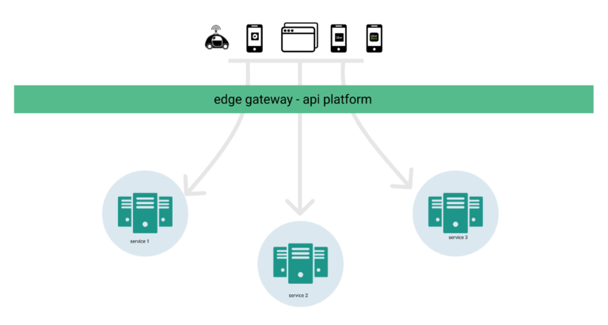

近些年来，API 网关一直是微服务架构的一个组成部分。API 网关为我们的应用程序提供了一个单一的入口点，并提供了一个接口来访问后端微服务的数据、逻辑或功能。它还提供了一个集中的地方来实现许多高层次的职责，包括路由、协议转换、限速、削减负载、丰富报头并传播、数据中心亲和性的执行、安全审计、用户鉴权、移动客户端的代码生成等等。

在[上一篇文章](https://eng.uber.com/gatewayuberapi/)中，我们讲述了 Uber 的 API 网关的演变以及我们在每个阶段的设计选择。在这篇文章中，我们将更深入地探讨自助 API 网关系统的技术组件。

在最抽象的层面上，网关是通过 API 提供数据的另一种服务。网关有很多种类，涵盖的范围也很广，从作为 API 网关的低级负载均衡，到功能非常丰富的应用级负载均衡，在这些 API 中操作请求和响应的有效载荷。在 Uber，我们开发了一个功能丰富的 API 网关，能够对跨多协议的传入和传出的数据载荷进行复杂操作。

## API 管理

一个功能丰富的应用程序需要通过与不同功能的后端服务进行互动来实现的。而这些互动都要通过一个共同的应用网关层。API 管理是指这些网关 API 的创建、编辑、删除和版本管理。

工程师在用户界面中配置他们的 API 参数，并将功能性 API 发布到互联网上，供所有 Uber 应用使用。配置规范了 API 的行为：路径、请求数据类型、响应类型、允许的最大调用量、允许的应用程序、通信协议、调用的具体微服务、允许的报头、可观察性、字段映射验证等等。

一旦配置被发布，网关基础设施将这些配置转换为有效的和功能性的 API，可以为我们应用程序的流量提供服务。网关基础设施还为应用程序生成客户端 SDK，以消费这些 API。

所有与网关系统的互动都是通过一个用户界面进行的，它引导用户一步一步地创建一个 endpoint。用户界面简化了这一过程，并对 API 的各个方面进行了各种验证。此外，这也是配置请求超时、监控和警报的地方。

管理系统提供了一些辅助功能，比如在发布新的配置变化之前的审查机制和存储会话以共享或恢复 API 管理。下面的屏幕截图显示了允许添加中间件的 UI 步骤：

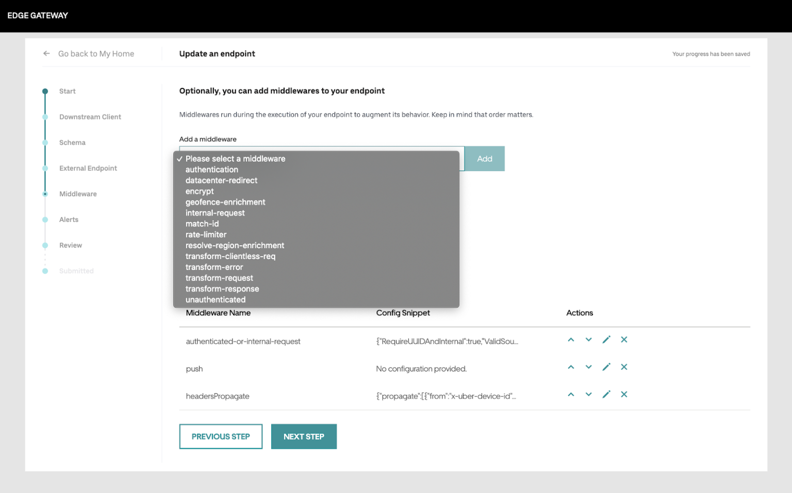

## 请求生命周期中的组件

为了解释网关的各个组成部分，比较重要的是了解一个请求是如何在网关运行时流动的。一个传入的请求包含一个路径，该路径被映射到一个为其服务的处理程序。在一个请求的生命周期中，它流经以下组件：协议管理器、中间件、数据验证、处理程序和后端客户端。请求生命周期中的所有组件都是作为一个栈来实现的。

下面详细描述的每个组件都在传入时对请求对象进行操作，而在响应对象传出时以相反的顺序运行相同的组件。

**协议管理器**是栈的第一层。它包含网关所支持的协议的反序列化器和序列化器。该层提供了实现 API 的能力，这些 API 可以接收任何类型的相关协议载荷，包括  JSON、Thrift 或 Protobuf。它还能方便地接收传入的 JSON 请求，并以 proto 编码的响应来回应。

**中间件**层是一个抽象，它在调用 endpoint 处理程序之前实现可组合的逻辑。中间件实现面向切面的关注点，如认证、授权、速率限制等。每个 endpoint 可以选择配置一个或多个中间件。除了可选的中间件，该平台还包括一组总是为每个请求执行的强制中间件。单个中间件不需要同时实现 requestMiddleware 以及 responseMiddleware 方法。如果一个中间件执行失败，调用将使栈的其余部分断路，中间件的响应将被返回给调用者。在某些情况下，中间件可以是无操作的，这取决于请求上下文。

**endpoint 处理程序**是负责请求验证、载荷转换以及将 endpoint 请求对象转换为客户端请求对象的层。当对响应对象进行操作时，endpointHandler 将后端服务响应转换为 endpoint 响应，对响应对象进行转换，基于 schema 的响应验证和序列化。

**客户端**向后端服务发出请求。客户端可识别协议，并根据配置期间选择的协议生成。用户可以配置客户端的内部功能，如请求和响应转换、schema 验证、熔断和重试、超时和截止期限管理、以及错误处理。

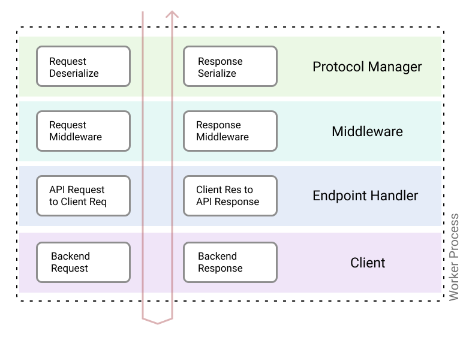

## 配置组件

协议管理器、中间件、处理程序和客户端有许多行为，可以用配置来控制。管理 API 的用户不需要修改任何代码，只需修改配置即可确定网关上的预期 endpoint 行为。为了便于配置，这些配置是通过用户界面管理的，并由 Git 仓库提供支持。

每个组件的配置都在 Thrift 和/或 YAML 文件中捕获。YAML 文件为组件提供信息，并作为它们之间的粘合剂。Thrift 文件定义了有效载荷和协议语义。

网关 thrift 文件大量使用了[thrift IDL 中的注释](https://thriftrw.readthedocs.io/en/latest/api.html#thriftrw.idl.Annotation)的功能，以便为各种功能和协议提供一个单一的真实来源。在下面的章节中，我们将深入探讨每个组件的配置。

### 协议管理器

协议管理器需要理解在协议上下文中请求的数据的形状和类型。对于响应，也应该知道类似的参数。

下面的三行 YAML 配置提供了协议类型、Thrift 文件路径和协议管理器用来处理传入请求的方法：

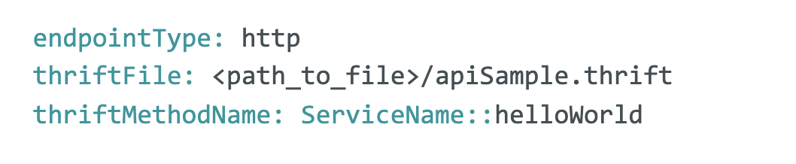

上面的配置表明新的 API 是 “HTTP” 协议类型，关于 schema 和协议的其他细节都在下面的 apiSample.thrift 文件中提供。

Thrift 文件 apiSample.thrift 功能丰富，它描述了 JSON 请求和响应载荷的数据类型、HTTP 路径和 HTTP 谓词。HTTP 协议是在 Thrift schema 中使用 Thrift 的注释功能定义的。

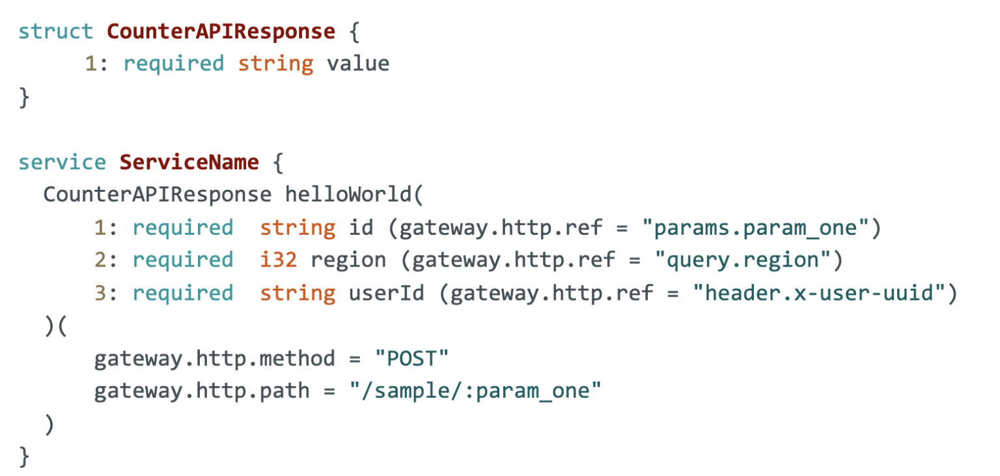

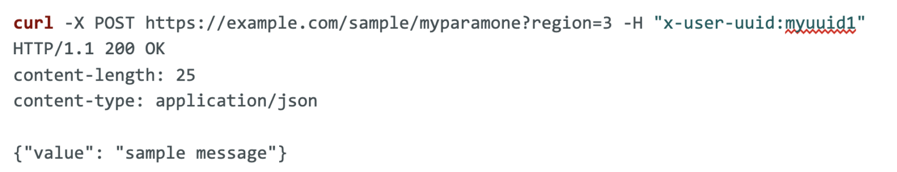

并非所有 API 调用都会成功。下面的示例 schema 将一个处理程序的错误响应提供给适当的 HTTP 协议。这是使用如下所示的注解完成的：

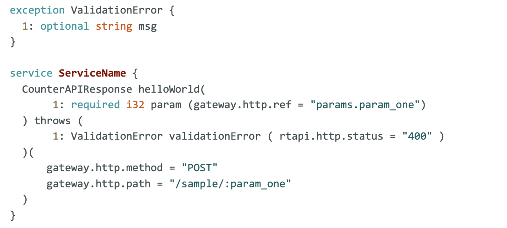

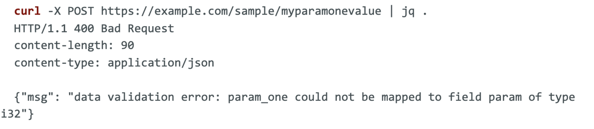

还有十几个其他的注解，帮助协议管理器管理使用 thrift 注解的 HTTP 请求的行为。

### 中间件

中间件是栈中最灵活且功能最丰富的组件。它允许网关平台向 API 网关用户暴露更高阶的功能。我们将在[解锁功能](https://docs.google.com/document/d/1TK5IjvziFpfeEkQj7SWVO4ZV9AK9jCP6LL1K1yN9gCo/edit#heading=h.jtyq3mx4l8ko)部分介绍由中间件提供的详细功能。在这里，我们将重点讨论 YAML 文件中的中间件配置。

在上面的配置中，将 authentication 中间件添加到 API 中。authentication 中间件将从 header.x-user-uuid 的值中接收配置的路径参数。上面配置的第二个中间件是 transformRequest 中间件，它被指示从传入的请求中复制 regionID 到调用后端服务中。在开发新的中间件时，它为 API 开发者需要提供的可配置参数定义了一个 schema。

### 处理程序

支持处理程序的配置主要是验证和将传入请求映射到后端客户端的请求参数。

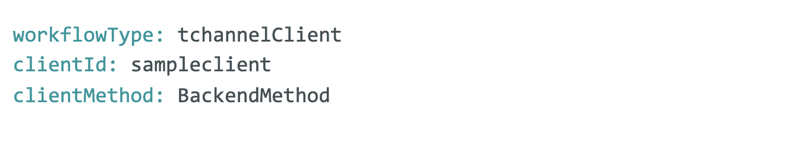

上面的配置提供了处理程序理解请求应该映射到的后端客户端所需的输入。如果传入的请求字段与后端服务完全匹配，上述配置就足够了。如果字段的名称不同，则必须使用转换请求中间件来映射它们。

### 客户端

后端客户端的配置分为 YAML 文件和 thrift 文件。在下面的示例中，使用 backendSample.thrift 文件中定义的请求和响应定义配置了一个使用[_TChannel_](https://github.com/uber/tchannel)协议的新后端服务，其中包含两个可以调用的方法。

请再次注意，Backend::method 也可以真正成为 HTTP API，在 Thrift 规范中，借助注解可以用 /backend/method 这样的路径等价表示。

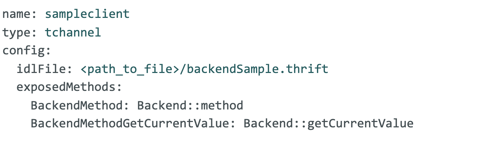

## 可运行的产物

上一节描述的所有组件的 YAML 和 Thrift 配置是完整描述单个 API 配置所必需的。自助网关负责确保这些组件配置一起提供网关运行时。

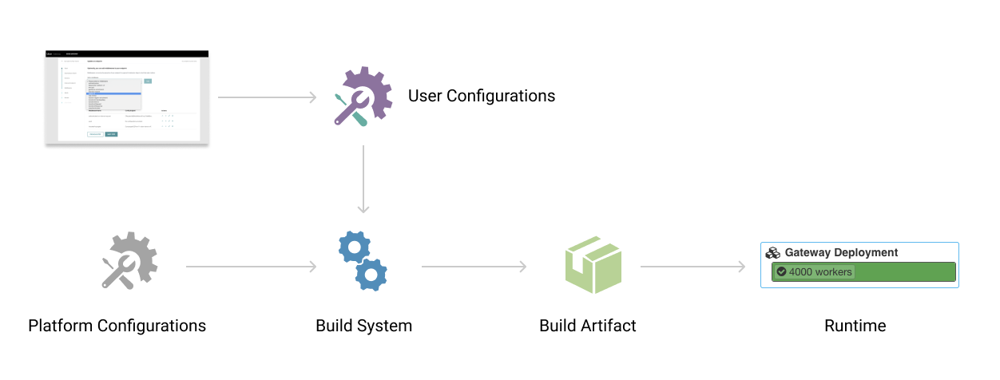

有两种类型的网关：一种采用配置并基于它们动态提供 API (非常类似于 Kong、Tyk 和反向代理，如 Envoy、Nginx)；另一种是根据输入的配置，使用代码生成步骤生成一个构建程序。在 Uber，我们选择了后者，用代码生成的方法来创建一个可运行的构建程序。

**生成 scheme 对象：**所有的 scheme 文件都通过处理器运行来为 [thriftrw](https://github.com/thriftrw) 和 protoc 输出本地 golang 代码。这对于序列化/反序列化和客户端接口的代码生成是必要的。

**生成自定义序列化：**移动应用程序的 API 契约需要与 i64、枚举类型和多种协议有关的自定义序列化。

**依赖性的 DAG：**endpoint、后端客户端和中间件的代码是静态生成的。它们在代码生成中存在固有的依赖性。而客户端是独立的，可以立即生成。中间件的功能可以依赖零个或多个客户端。endpoint 可以依赖零个或多个中间件也可以依赖零个或一个客户端。这个 DAG（有向无环图）会在构建时被解决。

由于客户端是独立于 endpoint 生成的，endpoint 可以是 HTTP，而后端服务可以是 gRPC。他们是在边缘网关构建的这一步骤中完成绑定的。

**API 生成：**在这最后一步，对 DAG 进行迭代以生成所有的 endpoint。单个生成步骤如下：加载模板，生成端点请求到客户端请求的映射(反之亦然)，注入依赖项，并使用请求-响应转换生成 IDL 对象。

整个代码的生成被抽象为一个 Uber OSS 库，[Zanzibar](https://github.com/uber/zanzibar)。

## 解锁功能

中心化系统的一个优势是可以构建令所有入驻用户受益的功能。有了像边缘网关这样功能丰富的网关，就有了多种途径来构建丰富的功能。

下面是一些已经开发的功能的例子，以及一些仍在酝酿中的功能。

### 审计管道 

边缘网关发出包含丰富元数据的访问日志，该日志被持久化以进行审计。维护我们产品的所有 API 访问模式的审记记录至关重要。当恶意攻击者试图使用自动化系统访问我们的 API 时，它可以进行安全审计，并帮助建立跨版本、跨地域和跨应用程序的各种产品的档案。

此管道有助于快速捕获特定 SDK 版本、应用程序、地理位置或互联网提供商之间的错误、问题和异常。我们所有的应用程序都启用了审计管道。

### 鉴权

每个外部 API 请求都经过身份验证 (AuthN) 和/或授权 (AuthZ)。该平台提供了几种可重用的 AuthX 实现，作为用户可以从其 endpoint 选择使用中间件。这消除了对如何实现这些 AuthN/AuthZ 的担忧，并强制 endpoint 至少使用一种所提供的实现。平台所有者可以无缝地对这些实现进行更新，这些更新将自动应用于所有 endpoint。

### 熔断

每个用于调用后端服务的客户端都被包裹着一个断路器。只要后端服务出现延迟或错误率增加（可配置），断路器就会启动，从而防止级联中断。这为已经恶化的服务提供了恢复的空间。

### 限速

endpoint 所有者可以选择对 API 进行限速。所提供的实现的一些例子是基于用户 ID、用户代理、IP、请求的一些属性的组合的限速，等等。可以基于来自路径/查询参数、报头或主体的特定字段来实施限速。这样可以灵活地提供比简单的用户级 API 访问更精细的应用感知型限速策略。每个 endpoint 都可以独立地动态分配一个配额，而不需要重新部署。

### 文档

YAML 和 Thrift 中的配置都完全描述了 API。这提供了以一致的方式自动生成所有网关 API 文档的选项。

### 手机客户端 SDK 生成

Uber 的所有移动应用都基于 Thrift IDL 生成服务和模型，与服务器交互。CI 工作从网关获取所有的 endpoint IDL，并为各种模型运行自定义的代码生成。移动代码生成也依赖于各种自定义 Thrift 注解，如异常状态代码、URL 路径和 HTTP 方法。对 endpoint schema 的向后不兼容变更将被代码生成审查的持续集成过程所阻止。

### 响应字段裁剪

因为 API 的创建很容易，并且同一底层客户端服务可以支持多个 endpoint。我们能够创建 API 来精细地选择用户体验所需的特定字段，而不是使用完整大小的后端响应进行响应。

### 数据中心亲和性

拥有冗余的数据中心和区域是目前大规模网络公司的架构。属于不同业务部门或领域的 API 被托管在网关上，每个业务部门可以在多个数据中心定义他们的工作负载分片。边缘网关提供了一个缓存，业务部门可以写入其中，将用户、区域或版本亲和性配置到适当的数据中心。然后，网关将遵守数据中心的亲和力信息，重新路由来自特定用户、设备或应用程序的传入 API。

### 短期用户禁令

帐户级禁令是对付恶意行为者的有效手段。对于暂时滥用系统的用户，网关提供了一个中心位置，可以在短时间内阻止特定用户访问 API。这种方法类似于数据中心的亲和性，其中网关可以提供外部缓存来存储具有 TTL 的受阻用户。欺诈和安全系统可以为用户、应用程序版本或其他标识符提供拦截。边缘网关将确保这些短期禁令的实施，以保护我们的用户。

## 挑战和教训

在网关的开发过程中，我们不得不在设计的多个方面做出选择。一些选择导致了非常令人兴奋的结果，而另一些选择则没有提供预期的投资回报。我们将简要介绍几个挑战。

### 语言

在开发该网关的时候，我们的语言选择是 Go 和 Java。我们之前的版本是用 Node.js。虽然那是一种非常适用于构建 IO 密集型网关层的语言，但我们决定与 Uber 的语言平台团队支持的语言保持一致。Go 提供了显著的性能改进。由于缺乏泛型，在构建过程中产生了大量的代码，以至于我们达到了 Go 链接器的极限。我们不得不在二进制编译期间关闭符号表和调试信息。Go (不是 Thrift) 中的 ID、HTTP 和保留关键字等语言命名约定造成了向用户暴露内部实现细节的故障。

### 序列化格式

我们网关的协议管理器能够实现多种协议。这一功能暴露了复杂的兼容性问题，例如在 JSON schema 与 Thrift schema 中表示 Union、Set、List 和 Map 的数据类型不匹配。我们不得不为这种映射制定自己的约定。

### 配置存储

如前所述，用户的配置被存储在 Git 中。然而，其中一些配置是动态的，如 API 限速。以前，这里的变化需要代码生成和部署。这很耗费时间，因此我们现在将用户配置的动态部分存储在一个配置存储中。

### 网关 UI

在网关 UI 中开发单个 API 很容易，但在开发批处理编辑流时就变得难以管理了。当 Thrift 文件引用其他 Thrift 文件并且嵌套可以任意深时，情况尤其如此。一旦用户提供配置并由构建系统接管，由于构建系统独立于 UI 而发展，将构建失败呈现给 UI 可能会很有挑战性。在它们之间保持一致的契约来展现错误是至关重要的。

### 理解载荷

大多数网关功能的开发不需要对传入或传出的载荷进行反序列化。协议互操作性的用例迫使我们对载荷进行反序列化。这增加了构建系统的复杂性，也增加了运行时的性能。如果后端和移动端协议是相同的，限制网关只访问协议谓词和报头 (header) 而不反序列化正文 (body) 可能会有好处。然而，这将限制一些复杂的网关功能。

一个丰富的网关，像我们描述的那样，是一项复杂的工作。如果你有兴趣走同样的路，[zanzibar](https://github.com/uber/zanzibar)可以提供一个可扩展的模块，从那里启动。在 Uber，我们正在开发一种基于[envoy](https://www.envoyproxy.io/)的 API 网关运行时，用于从我们的应用程序到后端服务的 gRPC 请求，而我们的自助用户界面没有明显的用户体验变化。如果你有兴趣和热情，就来和我们谈谈吧!

## 致谢

如果没有这么多参与网关开发的人的重大贡献，这项工作是不可能完成的。一些重要的致谢有：Abhishek Panda, Alex Hauser, Aravind Gopalan, Chao Li, Chuntao Lu, Gregory Trowbridge, Jake Verbaten, Karthik Karuppaiya, Maximiliano Benedetto, Michael Sindler, Olivia Zhang, Pavel Astakhov, Rena Ren, Steven Bauer, Tejaswi Agarwal, Uday Medisetty, and Zhenghui Wang。