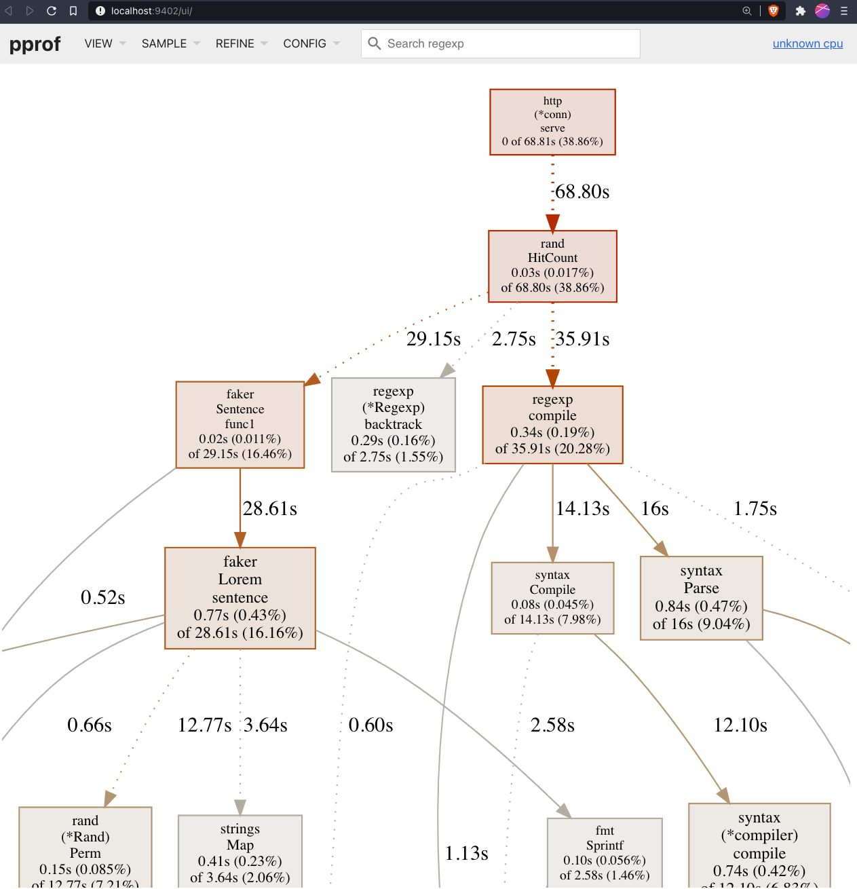
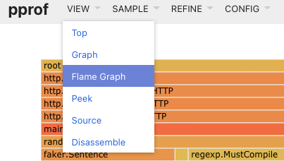
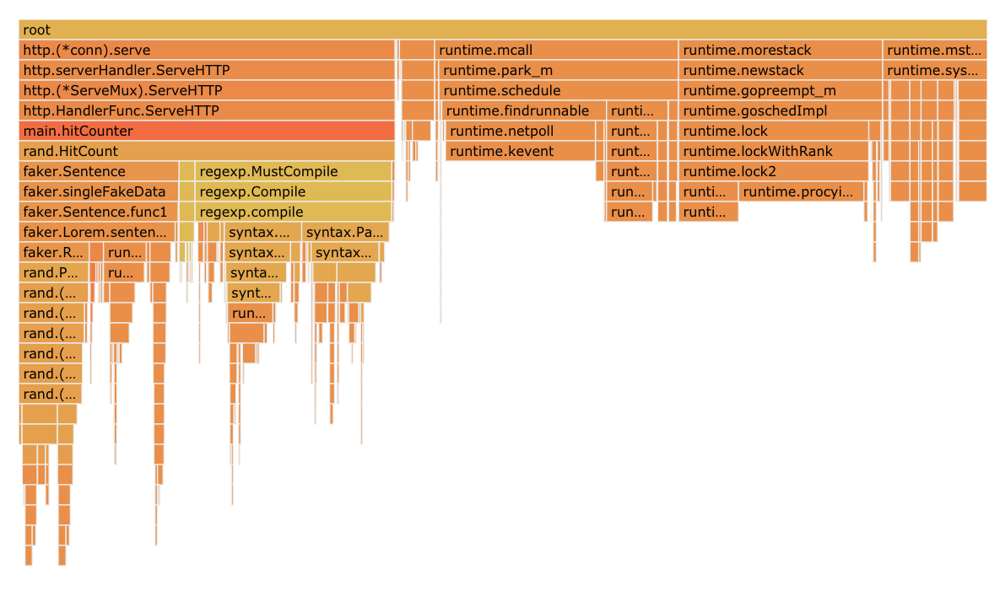
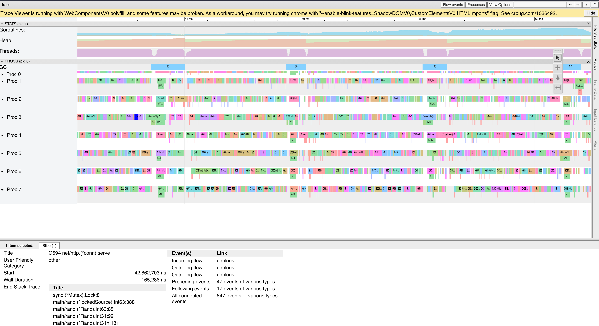

# Go 性能工具小抄

* 原文地址：https://steveazz.xyz/blog/go-performance-tools-cheat-sheet
* 原文作者：`Steve Azzopardi`
* 本文永久链接：https://github.com/gocn/translator/blob/master/2021/w23_go_performance_tools_cheat_sheet.md

- 译者：[Cluas](https:/github.com/Cluas)
- 校对：[Martinho0330](https://github.com/Martinho0330)

Go 有很多工具可以让你了解你的应用程序可能在哪里花费 CPU 时间或分配内存。我不是每天都使用这些工具，所以我每次都是在寻找同样的东西。这篇文章的目的是为这些 Go 所提供的工具提供一个参考文献。

我们将使用 [https://gitlab.com/steveazz-blog/go-performance-tools-cheat-sheet](https://gitlab.com/steveazz-blog/go-performance-tools-cheat-sheet) 作为一个演示项目，同样的事情有 3 种实现方式，每一种都比前一种性能更好。
*   [默认实现](https://gitlab.com/steveazz-blog/go-performance-tools-cheat-sheet/-/tree/main)
*   [性能更好的实现](https://gitlab.com/steveazz-blog/go-performance-tools-cheat-sheet/-/tree/better)
*   [性能最好的实现](https://gitlab.com/steveazz-blog/go-performance-tools-cheat-sheet/-/tree/best)

## 基准测试(Benchmarks)

最流行的方法之一是使用 Go 中内置的 [基准测试](https://pkg.go.dev/testing#hdr-Benchmarks) 来看看你是否改进了什么。

在我们的演示项目中，已经有了 [可用的基准测试](https://gitlab.com/steveazz-blog/go-performance-tools-cheat-sheet/-/blob/main/rand/counter_test.go) 我们可以用一个命令运行它们。

    go test -bench=. -test.benchmem  ./rand/plainplainplain

    goos: darwin
    goarch: amd64
    pkg: gitlab.com/steveazz/blog/go-performance-tools-cheat-sheet/rand
    cpu: Intel(R) Core(TM) i7-6820HQ CPU @ 2.70GHz
    BenchmarkHitCount100-8              3020            367016 ns/op          269861 B/op       3600 allocs/op
    BenchmarkHitCount1000-8              326           3737517 ns/op         2696308 B/op      36005 allocs/op
    BenchmarkHitCount100000-8              3         370797178 ns/op        269406189 B/op   3600563 allocs/op
    BenchmarkHitCount1000000-8             1        3857843580 ns/op        2697160640 B/op 36006111 allocs/op
    PASS
    ok      gitlab.com/steveazz/blog/go-performance-tools-cheat-sheet/rand 8.828s

_注意: `-test.benchmem` 是一个可选的标志，用于显示内存分配。_

仔细看一下每一栏的含义:

    BenchmarkHitCount100-8              3020            367016 ns/op             269861 B/op               3600 allocs/opplain
    ^------------------^ ^                ^                   ^                      ^                          ^
             |           |                |                   |                      |                          |
            名称       CPU数量          总运行次数          每次操作的纳秒数          每次操作的字节数             每次操作的内存分配数

### 比较基准测试(Benchmarks)

Go 创建了 [perf](https://github.com/golang/perf) 它提供了 [benchstat](https://github.com/golang/perf/tree/master/cmd/benchstat) 这样你就可以一起比较 benchmark 输出，它将给你展示出它们之间的差异。

例如，让我们比较一下 [`main`](https://gitlab.com/steveazz-blog/go-performance-tools-cheat-sheet/-/tree/main) 和 [`best`](https://gitlab.com/steveazz-blog/go-performance-tools-cheat-sheet/-/tree/best) 分支.

    # 运行 `main` 分支的基准测试
    git checkout main
    go test -bench=. -test.benchmem -count=5 ./rand/ > old.txt

    # 运行 `best` 分支的基准测试
    git checkout best
    go test -bench=. -test.benchmem -count=5 ./rand/ > new.txt

    # 比较两个基准测试结果
    benchstat old.txt new.txt
    name               old time/op    new time/op    delta
    HitCount100-8         366µs ± 0%     103µs ± 0%  -71.89%  (p=0.008 n=5+5)
    HitCount1000-8       3.66ms ± 0%    1.06ms ± 5%  -71.13%  (p=0.008 n=5+5)
    HitCount100000-8      367ms ± 0%     104ms ± 1%  -71.70%  (p=0.008 n=5+5)
    HitCount1000000-8     3.66s ± 0%     1.03s ± 1%  -71.84%  (p=0.016 n=4+5)

    name               old alloc/op   new alloc/op   delta
    HitCount100-8         270kB ± 0%      53kB ± 0%  -80.36%  (p=0.008 n=5+5)
    HitCount1000-8       2.70MB ± 0%    0.53MB ± 0%  -80.39%  (p=0.008 n=5+5)
    HitCount100000-8      270MB ± 0%      53MB ± 0%  -80.38%  (p=0.008 n=5+5)
    HitCount1000000-8    2.70GB ± 0%    0.53GB ± 0%  -80.39%  (p=0.016 n=4+5)

    name               old allocs/op  new allocs/op  delta
    HitCount100-8         3.60k ± 0%     1.50k ± 0%  -58.33%  (p=0.008 n=5+5)
    HitCount1000-8        36.0k ± 0%     15.0k ± 0%  -58.34%  (p=0.008 n=5+5)
    HitCount100000-8      3.60M ± 0%     1.50M ± 0%  -58.34%  (p=0.008 n=5+5)
    HitCount1000000-8     36.0M ± 0%     15.0M ± 0%  -58.34%  (p=0.008 n=5+5)

注意，我们传递了 `-count` 标志来多次运行基准测试，这样它就可以得到运行的平均值。

## pprof

Go 有自己的剖析器，它可以让你更好地了解 CPU 时间花在哪里，或者应用程序在哪里分配内存。Go 在一段时间内对这些进行采样，例如，它将在 X 秒内每隔 X 纳秒查看 CPU/内存的使用情况。

### 生成剖析文件(Profiles)

#### Benchmarks

你可以使用我们在演示项目中的基准来生成剖析文件。

CPU:

    go test -bench=. -cpuprofile cpu.prof ./rand/

Memory:

    go test -bench=. -memprofile mem.prof ./rand/plain

#### net/http/pprof package

如果你正在编写一个 webserver，你可以导入 [`net/http/pprof`](https://pkg.go.dev/net/http/pprof) 它将在 DefaultServeMux 上暴露`/debug/pprof` HTTP 端点，就像我们在 [示例应用](https://gitlab.com/steveazz-blog/go-performance-tools-cheat-sheet/-/blob/e7736e21bf1c3be7bb25e4c64b8730bb3b631b73/main.go#L7) 中做的那样。

确保你的应用程序不是空闲着它需要正在运行或接收请求，以便剖析器能够对调用进行采样，否则你可能会因为应用程序是空闲的而最终得到一个空的剖析文件。

    # CPU剖析文件plainplainplainplain
    curl http://127.0.0.1:8080/debug/pprof/profile > /tmp/cpu.prof
    # 堆剖析文件
    curl http://127.0.0.1:8080/debug/pprof/heap > /tmp/heap.prof
    # 内存分配剖析文件
    curl http://127.0.0.1:8080/debug/pprof/allocs > /tmp/allocs.prof

如果你访问`/debug/pprof`，它将给出所有可用的端点的列表和它们的含义。

#### runtime/pprof 包

这与 `net/http/pprof` 类似，将它添加到你的应用程序中，但不是为所有的项目添加，你可以指定一个特定的代码路径，在那个路径生成剖析文件。当你只对你的应用程序的某一部分感兴趣，并且你只想对应用程序的那一部分进行采样时，这就很有用。要阅读如何使用它，请查看 [go 的参考文档](https://pkg.go.dev/runtime/pprof) 。

你也可以用这个来 [给应用加上标签](https://rakyll.org/profiler-labels/) 这可以帮助你更好地了解概况。

### 阅读剖析文件(Profiles)

现在我们知道了如何生成剖析文件，让我们看看如何读取它们以了解我们的应用程序正在做什么。

我们将使用的命令是 `go tool pprof`。

#### 调用图

例如，为了使用我们在演示程序中 [registered](https://gitlab.com/steveazz-blog/go-performance-tools-cheat-sheet/-/blob/e7736e21bf1c3be7bb25e4c64b8730bb3b631b73/main.go#L7) 的`/debug/pprof`端点，我们可以直接传入 HTTP 端点。

    # 打开新的浏览器窗口，查看30秒后的调用图。plainplain
    go tool pprof -http :9402 http://127.0.0.1:8080/debug/pprof/profile

另一个选择是使用 `curl` 下载剖析文件，然后使用 `go tool`命令，这对于从没有暴露在公共互联网上的生产端点获取剖析文件可能很有用。

    # 在服务器上查看。plainplain
    curl http://127.0.0.1:8080/debug/pprof/profile > /tmp/cpu.prof
    # 在你从服务器上得到它之后，在本地查看。
    go tool pprof -http :9402 /tmp/cpu.prof

注意，在所有的命令中，我们都传递了`-http`标志，这是可选的，因为在默认情况下，这将打开 CLI 界面。

下面你可以看到我们的演示应用程序调用图。为了更好地理解它的含义，你应该阅读 [解释调用图](https://github.com/google/pprof/blob/master/doc/README.md#interpreting-the-callgraph) 。

#### 火焰图

调用图对于查看程序正在调用的内容很有用，也可以帮助你了解应用程序正在花费的时间。了解 CPU 时间或内存分配去向的另一种方法是使用火焰图。

使用同一个演示程序，让我们再次运行 `go tool pprof`:

    # 来自HTTP端点
    go tool pprof -http :9402 http://127.0.0.1:8080/debug/pprof/profile
    # 来自本地的剖析文件
    go tool pprof -http :9402 /tmp/cpu.prof

然而，这一次我们将使用顶部导航栏，前往 `View` > `Flame Graph`

然后你应该看到类似下面的东西:

为了让你更好地了解如何阅读火焰图，你可以查看一下 [什么是火焰图，怎么去读火焰图(RubyConf2017 上的议题)](https://youtu.be/6uKZXIwd6M0)

你也可以使用 [speedscope](https://www.speedscope.app/) 这是一个与语言无关的应用程序，可以从剖析文件中生成火焰图，它比 Go 提供的互动性更强一些。

#### 比较剖析文件(Profiles)

`go tool pprof` 也允许你使用 [比较剖析文件](https://github.com/google/pprof/blob/master/doc/README.md#comparing-profiles) 来显示 1 个剖析文件和另一个剖析文件之间的差异。

再次使用我们的演示项目，我们可以为 "main" 和 "best" 分支生成剖析文件。

    # 运行 `main` 分支，生成剖析文件。plain
    curl http://127.0.0.1:8080/debug/pprof/profile > /tmp/main.prof

    # 运行 `best` 分支，生成剖析文件。
    curl http://127.0.0.1:8080/debug/pprof/profile > /tmp/best.prof

    # 比较剖析文件。
    go tool pprof -http :9402 --diff_base=/tmp/main.prof /tmp/best.prof

## 追踪(Traces)

我们需要经历的最后一个工具是 CPU 追踪器。这可以让你准确地了解在程序执行过程中发生了什么。它可以告诉你哪些核心是闲置的，哪些核心是忙碌的。如果你正在调试一些没有达到预期性能的并发代码，这就非常好用。

再次使用我们的演示程序，让我们使用`net/http/pprof`添加的`debug/pprof/trace`端点来获得 CPU 跟踪。

    curl http://127.0.0.1:8080/debug/pprof/trace > /tmp/best.traceplainplain

    go tool trace /tmp/best.trace

关于追踪器的更详细的解释可以在 [go 程序员学院博客](https://blog.gopheracademy.com/advent-2017/go-execution-tracer/) 上找到。

## 资源

*   [Go 高性能研究](https://dave.cheney.net/high-performance-go-workshop/dotgo-paris.html)
*   [go-perf百科](https://github.com/dgryski/go-perfbook)
*   [Go 工具实战](https://youtu.be/uBjoTxosSys)
*   [pprof++](https://eng.uber.com/pprof-go-profiler/)
*   [追踪(trace)设计文档](https://docs.google.com/document/u/1/d/1FP5apqzBgr7ahCCgFO-yoVhk4YZrNIDNf9RybngBc14/pub)
*   [如何用 Go 编写基准测试](https://dave.cheney.net/2013/06/30/how-to-write-benchmarks-in-go)
