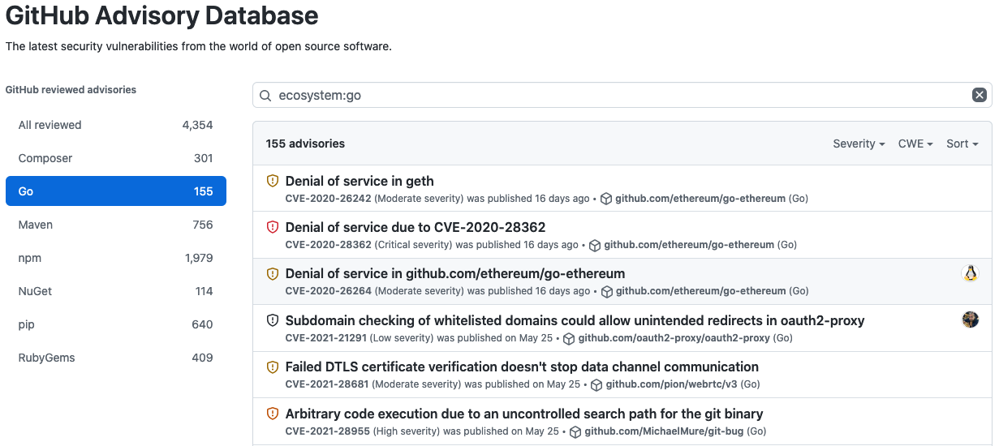
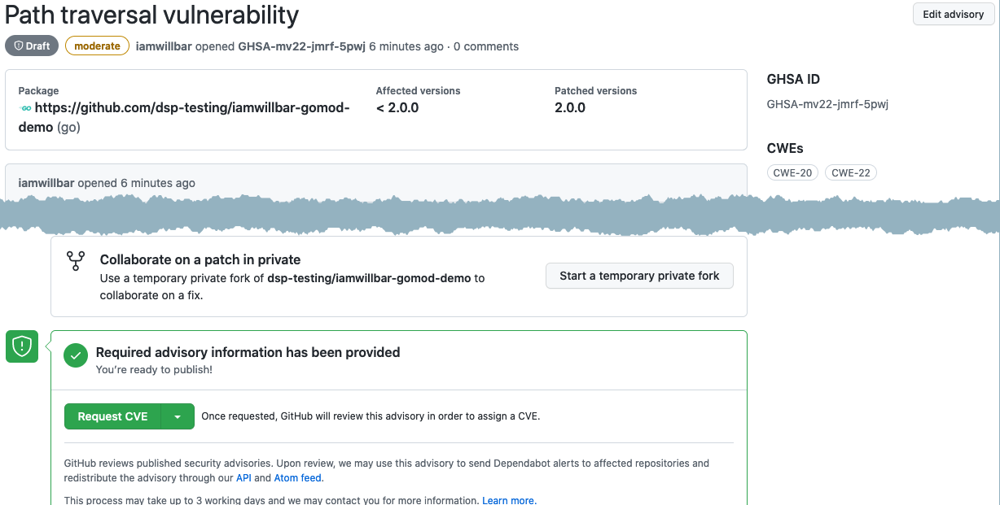
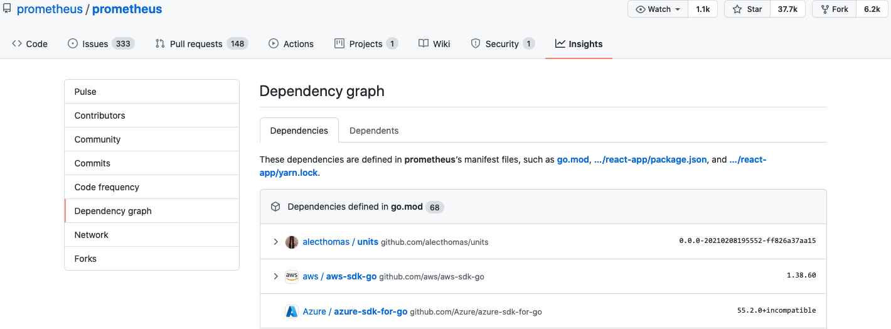
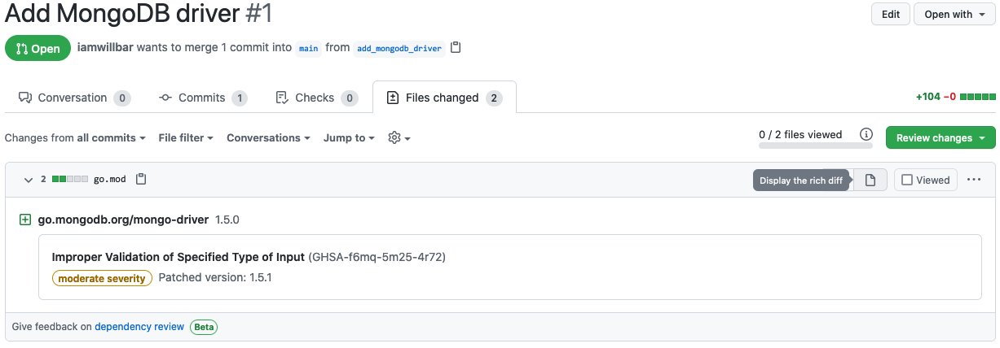
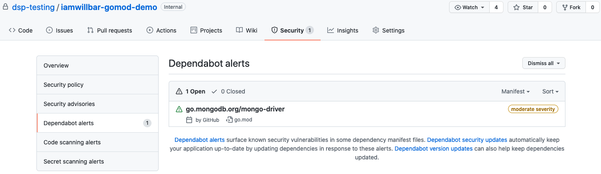
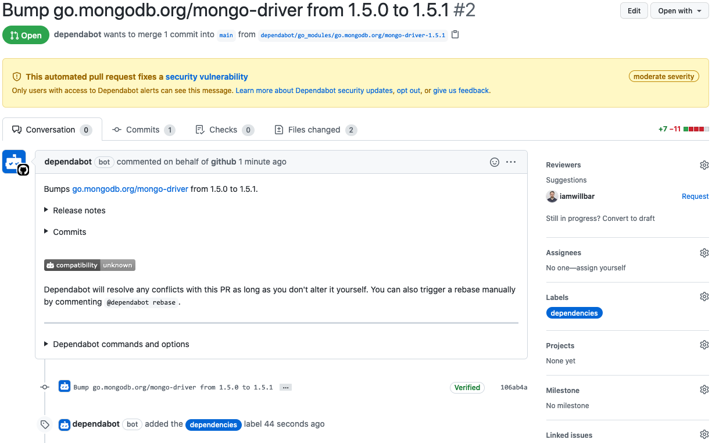

# GitHub 为 Go 社区带来供应链安全功能

* 原文地址：https://github.blog/2021-07-22-github-supply-chain-security-features-go-community/
* 原文作者：[William Bartholomew](https://github.blog/author/iamwillbar/)
* 本文永久链接：https://github.com/gocn/translator/blob/master/2021/w28_GitHub_brings_supply_chain_security_features_to_the_Go_community.md

- 译者：[朱亚光](https://github.com/zhuyaguang)
- 校对：

Go国际社区从一开始就拥抱 GitHub ( GitHub 即是 Go 代码协作的地方也是发布包的地方)使得 Go 成为 如今 GitHub 上排名前15的编程语言。我们很高兴地宣布 GitHub 的供应链安全功能可以用于 Go modules 了，这个功能可以帮助 Go 社区发现、报告和预防安全漏洞。

> Go 语言创建的初衷之一就是为了解决大型软件依赖管理的问题。GitHub是开源的 Go modules 最受欢迎的托管主机。今天发布的这个功能不仅仅会帮助 GitHub 用户，还会帮助任何依赖 GitHub 托管 Go modules 的人。我们很高兴 GitHub 正在投资有益于整个 Go 生态的改进，我们期待在未来能与他们进行更多的合作。
>
> – Steve Francia, Google Go语言PL

Go modules 于2019年引入，目的是使依赖管理更容易和版本信息更明确，根据 [Go2020开发者调查](https://blog.golang.org/survey2020-results)  Go models 获得了几乎普遍的采用。下面，我将向您一一介绍下 GitHub 的供应链安全功能如何与Go modules配合使用，来提高Go 社区的安全性。

## [咨询](https://github.blog/2021-07-22-github-supply-chain-security-features-go-community/#advisories)

GitHub 的咨询数据库是一个开放的安全咨询数据库，专注于为开发人员提供高质量，可操作的漏洞信息。它根据 [Creative Commons Attribution 4.0](https://creativecommons.org/licenses/by/4.0/) 协议获得许可，因此数据可以在任何地方使用。

目前为止，我们已经发布了[超过 150 多个现有的 Go 建议](https://github.com/advisories?query=ecosystem%3Ago)，并且随着我们整理现有的漏洞和对新发现的漏洞录入，这个数字每天都会在增长。

如果你是 Go module 的维护者，你可以使用安全公告来管理披露漏洞。你可以与漏洞报告者（例如安全研究人员）合作，在公开宣布漏洞之前私下讨论和修复漏洞。安全公告还可以很方便帮你的公告申请一个[常见漏洞和暴露](https://cve.mitre.org/) (CVE) 标识号并将其发布到[国家漏洞数据库](https ://nvd.nist.gov/) (NVD)。

## [依赖图](https://github.blog/2021-07-22-github-supply-chain-security-features-go-community/#dependency-graph)

GitHub 的依赖图分析了代码库中的 `go.mod` 文件来理解代码库的依赖关系。除了安全建议之外，依赖关系图还给开发人员提供易受攻击的依赖项的信息。如果需要查看代码库检测到的依赖项，请选择代码库的 **Insights** 选项卡，然后从左侧边栏中选择 **Dependency graph**。

依赖关系图是公共仓库的默认功能，但是[私有仓库](https://docs.github.com/en/code-security/getting-started/securing-your-repository#managing-the-dependency-graph)您必须手动开启。如果你的公共仓库的依赖关系图还没填充，稍等下马上就会填充了。如果你迫不及待，可以通过推送下更改的`go.mod`文件来触发更新。

为了防止引入新的漏洞，你可以使用[依赖审查](https://docs.github.com/en/github/collaborating-with-pull-requests/reviewing-changes-in-pull-requests/reviewing-dependency-changes-in-a-pull-request#about-dependency-review)来查看某个PR 对 `go.mod` 更改而带来的影响。

## [Dependabot 警告](https://github.blog/2021-07-22-github-supply-chain-security-features-go-community/#dependabot-alerts)

如果你正在使用的 Go module 发现了新的漏洞时，Dependabot 警告会通知你。你可以使用我们的 [通知配置](https://docs.github.com/en/code-security/supply-chain-security/managing-vulnerabilities-in-your-projects-dependencies/configuring-notifications-for-vulnerable-dependencies)  来配置你收到的通知。

## [Dependabot 安全更新](https://github.blog/2021-07-22-github-supply-chain-security-features-go-community/#dependabot-security-updates)

有什么比易受攻击的依赖发出告警更好的策略呢？当然是提交一个 PR 的时候，能自动将易受攻击的 Go modules 升级到没有漏洞的版本！ 这正是 Dependabot 安全更新所做的。

我们发现，通过自动生成的PR来升级易受攻击的依赖项，从而来修复软件的代码库，比那些没有的要[快40%](https://octoverse.github.com/static/github-octoverse-2020-security-report.pdf)。

## [开始并了解更多](https://github.blog/2021-07-22-github-supply-chain-security-features-go-community/#get-started-and-learn-more)

从今天开始 [保护你的 Go 代码库](https://docs.github.com/en/code-security/getting-started/securing-your-repository), 或了解更多关于 GitHub 供应链安全功能的信息：

-   [安全建议](https://docs.github.com/en/code-security/security-advisories/about-github-security-advisories)
-   [依赖图](https://docs.github.com/en/code-security/supply-chain-security/understanding-your-software-supply-chain/about-the-dependency-graph)
-   [Dependabot 警告](https://docs.github.com/en/code-security/supply-chain-security/managing-vulnerabilities-in-your-projects-dependencies/about-alerts-for-vulnerable-dependencies)
-   [Dependabot 安全更新](https://docs.github.com/en/code-security/supply-chain-security/managing-vulnerabilities-in-your-projects-dependencies/about-dependabot-security-updates)

