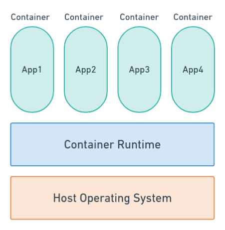
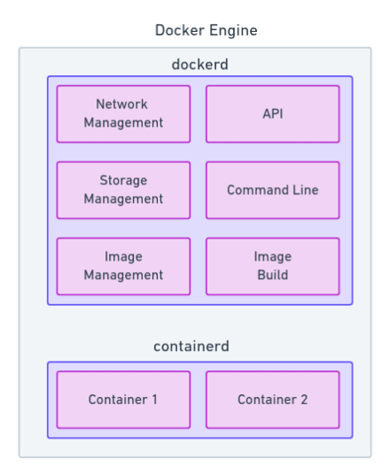
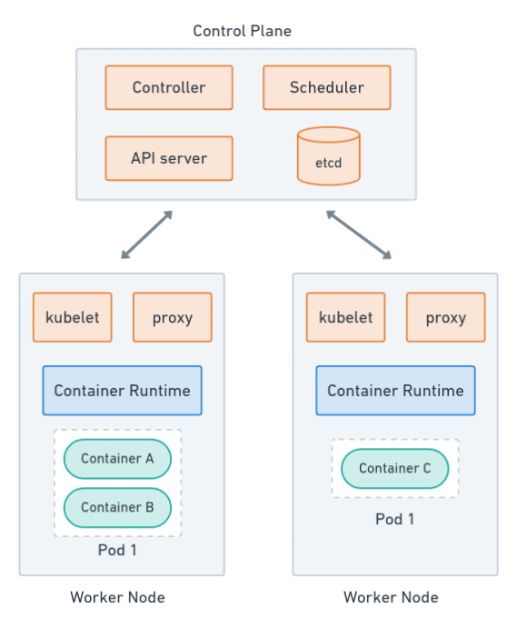
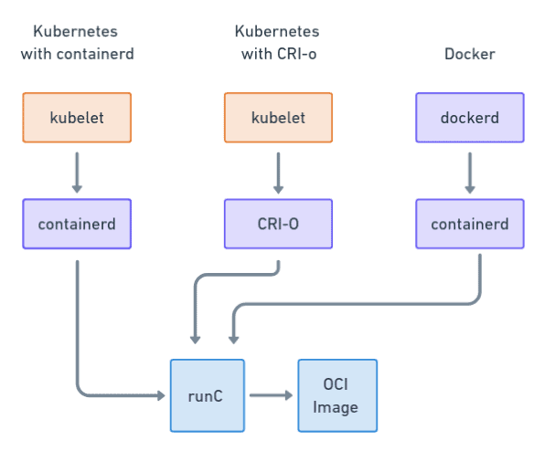
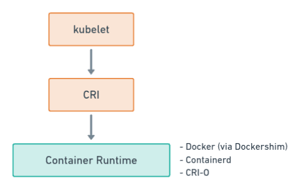
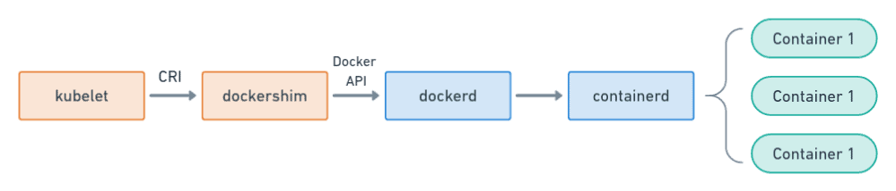

# Kubernetes vs Docker:了解2021年的容器
几个星期前，Kubernetes开发团队宣布，他们正在弃用docker。这则新闻通过科技界和社交网络广为流传。Kubernetes 群集是否会中断，如果是，我们将如何运行我们的应用程序？我们现在该怎么办？今天，我们将审查所有这些问题和更多。

让我们从头开始。如果你已经熟悉docker和kubernetes，并希望直接了解关键信息，[跳到docker弃用对你有什么影响？](https://semaphoreci.com/blog/kubernetes-vs-docker#h-how-does-kubernetes-deprecating-docker-impact-you)

## 什么是容器？
尽管Docker被用作容器的同义词，但现实情况是，它们早在docker成为东西之前就已经存在了。Unix 和 Linux 自 70 年代末开始引入 [chroot](https://man7.org/linux/man-pages/man2/chroot.2.html) 以来，一直有某种形式的容器。Chroot 允许系统管理员在一种但并非真正孤立的文件系统中运行程序。后来，这个想法被提炼和增强到集装箱引擎，如免费 [BSD Jails](https://docs-dev.freebsd.org/en/books/handbook/jails) ， [OpenVZ](https://openvz.org/) ，或[Linux Containers（LXC）](https://linuxcontainers.org/) 。

但是什么是容器呢？

容器是一个逻辑分区，我们可以运行与系统其余部分分离的应用程序。每个应用程序都有自己的专用网络和不与其他容器或主机共享的虚拟文件系统。

运行容器应用程序比安装和配置软件方便得多。首先，容器是便携式的：我们可以在一台服务器中构建，并相信它将在任何服务器中工作。另一个优点是，我们可以同时运行同一程序的多个副本，而不会发生冲突或重叠，否则确实很难做到。

然而，要使这一切发挥作用，我们需要一个容器runtime，一个能够运行容器的软件。

## 什么是docker？
docker是最受欢迎的容器runtime-从长远来看。这并不奇怪，因为它将容器的概念引入主流，这反过来又激发了像Kubernetes这样的平台的创建。

在Docker之前，运行容器确实是可能的，但这是艰苦的工作。Docker 使事情变得简单，因为它是一个完整的技术堆栈，可以：

- 管理容器生命周期。
- 代理请求来回容器。
- 监视和记录容器活动。
- 安装共享目录。
- 对容器设置资源限制。
- 生成镜像。Dockerfile是构建容器镜像的格式文件。
- 从注册处推送和拉取图像。
- 在第一次迭代中，Docker 使用 Linux 容器 （LXC） 作为运行时间后端。随着项目的发展，LXC被容器所取代，docker自己的实施。现代docker安装分为两个服务：containerd，负责管理容器；dockerd，处理剩余的部分。

## 什么是kubernetes？
kubernetes采取容器的想法，并把它一个缺口。Kubernetes 不是在单个服务器中运行容器化应用程序，而是将其分布在一组机器上。在 Kubernetes 中运行的应用程序的外观和行为都像一个单元，尽管在现实中，它们可能由松散耦合的容器排列而成。

Kubernetes在容器顶部添加分布式计算功能：

- 吊舱：吊舱是共享内存、CPU、存储和网络等资源的逻辑容器组。
- 自动缩放：Kubernetes 可根据需要启动和停止吊舱，从而自动适应不断变化的工作负载。
- 自我修复：容器在故障时被监控并重新启动。
- 负载均衡：请求分布在健康的可用吊舱上。
- 推出：kubernetes支持自动推出和回滚。使 [Canary](https://semaphoreci.com/blog/what-is-canary-deployment) 和 [Blue-Green](https://semaphoreci.com/blog/continuous-blue-green-deployments-with-kubernetes) 等复杂程序变得微不足道。
我们可以将Kubernetes的架构视为两架飞机的组合：

控制面板是集群的协调大脑。它有一个控制器，管理节点和服务，调度器分配吊舱的节点，和API服务，处理通信。配置和状态存储在一个高度可用的数据库称为etcd。
工人节点是运行容器的机器。每个工人节点运行几个组件，如kubelet代理、网络代理和容器运行时。Kubernetes版本 v1.20 的默认容器运行时是 Docker。

## 容器格式
在启动容器之前，我们需要构建或下载一个容器镜像，这是一个文件系统，里面装满了应用程序所需的一切：代码、二进制文件、配置文件、库和依赖项。

容器的普及表明需要开放的镜像标准。因此，Docker 公司和 CoreOS 于 2015 年建立了[开放式容器计划（OCI）](https://opencontainers.org/) ，其使命是生产供应商中立格式。这一努力的结果是创造了两项标准：

- 定义镜像二进制格式的镜像规范。
- 描述如何拆开和运行容器的运行时规范。OCI 维护称为runc的参考实现。容器和 CRI-O 都使用背景中的流体生成容器。OCI 标准带来了不同容器解决方案之间的互操作性。因此，一个系统内置的图像可以在任何其他合规堆栈中运行。

OCI 标准带来了不同容器解决方案之间的互操作性。因此，一个系统内置的镜像可以在任何其他合规堆栈中运行。

## Docker Vs. Kubernetes
这里是事情变得更加技术性的地方。我说每个Kubernetes工人节点都需要一个容器运行时。在其第一个[原始设计](https://github.com/kubernetes/kubernetes/blob/release-0.4/DESIGN.md) ，Docker是离不开Kubernetes，因为它是唯一的运行时支持。

然而，Docker从未被设计成在Kubernetes内运行。意识到这个问题，Kubernetes开发人员最终实现了一个名为容器运行时间接口（CRI） 的 API。此界面允许我们在不同的容器运行时之间进行选择，使平台更加灵活，对 Docker 的依赖性更小。

这一变化给Kubernetes团队带来了新的困难， 因为Docker不知道CRI或支持CRI 。因此，在引入 API 的同时，他们不得不编写一个名为Dockershim的适配器，以便将 CRI 消息转换为 Docker 特定命令。
## 弃用Dockershim
虽然Docker是一段时间以来第一个也是唯一支持的引擎，但是它从来不在长期计划内。[Kubernetes V 1.20弃用了dockershim](https://github.com/kubernetes/kubernetes/blob/master/CHANGELOG/CHANGELOG-1.20.md#deprecation) ， 拉开了离开docker的过渡的序幕。

一旦过渡完成，堆栈就会变小得多。它从这个：

变为：

结果是每个工人节点所需的膨胀更少，依赖性也更少。

那么，为什么要改变呢？

简单地说，Docker很重。我们得到更好的性能与轻量级集装箱运行时，如容器或[CRI-O](https://cri-o.io/) 。最近的例子是，谷歌的基准显示，容器消耗的内存和CPU更少，而吊舱的启动时间也比Docker少。

此外，在某些方面，Docker本身可以被认为是技术债务。事实上，Kubernetes需要的是容器运行时：容器。其余的，至少就Kubernetes而言，是额外的开销。

## Kubernetes弃用Docker对你有什么影响？
事情并不像听起来那么戏剧化。让我们在整节的开头说，在v1.20中唯一改变的是，你会得到一个弃用警告，只有当你运行Docker。就这样。

我还能使用Docker进行开发吗？

是的，你绝对可以，现在和在可预见的未来。你看，Docker不运行Docker特定的镜像：它运行符合OCI标准的容器。只要Docker继续使用这种格式，Kubernetes将继续接受它们。

我仍然可以用Docker打包我的生产应用程序吗？

是的，原因与上一个问题相同。与Docker打包的应用程序将继续运行-那里没有变化。因此，您仍然可以使用您了解和喜爱的工具构建和测试容器。您不需要更改CI/CD 管道或切换到其他镜像注册，Docker 制作的镜像将继续像始终一样在群集中工作。

我需要改变什么？

现在什么都没有如果您的群集使用 Docker 作为运行时，则升级到 v1.20 后将获得弃用警告。但这一变化是Kubernetes社区发出的一个明确信号，表明他们想采取的方向。是时候开始规划未来了。

变革何时发生？

该计划是在2021年底将所有Docker依赖关系完全删除v1.23。

当Kubernetes离开时，会发生什么？

届时，Kubernetes 集群管理员将被迫切换到符合 CRI 标准的容器运行时。

如果你是一个最终用户，没有很多变化给你。除非你运行某种节点自定义，否则你可能不必做任何特别的事情。仅测试您的应用程序与新的容器运行时配合使用。

这些是升级到 v1.23 后会导致问题或中断的一些事情：

- 使用Docker特定的日志记录和监视。即，从日志中解析 Docker 消息或投票 Docker API。
- 使用Docker优化。
- 运行依赖docker CLI 的脚本。
- 运行docker命令在特权吊舱。例如：构建镜像。有关替代解决方案，请参阅卡尼科等项目。docker build
- 使用docker工人设置。
- 运行窗口容器。容器确实在 Windows 中工作， 但它的支持水平还没有达到 Docker 的。目标是通过集装箱版本 1.20为 Windows 提供稳定的容器释放。
- 如果您在 AWS EKS、Google GKE 或 Azure AKS 等云提供商上使用托管集群，请在 Docker 支持消失之前检查您的集群是否使用了支持的运行时。有些云供应商落后几个版本，因此您可能有更多的时间来计划。因此，请咨询您的提供商。举个例子，谷歌云宣布，他们正在改变默认运行时从Docker到容器的所有新创建的工人节点，但你仍然可以选择Docker。

如果您运行自己的集群：除了检查上述要点外，您还需要评估移动到与 CRI 完全兼容的另一个容器运行时。Kubernetes文档详细解释了这些步骤：

- 切换到容器
- 切换到CRI-O
或者，如果你想继续使用Docker过去的版本1.23，按照cri-dockerd项目，它计划保持Docker作为一个可行的运行时选择。

结论
Kubernetes正在成长，但这种变化并不需要是一次创伤性的经历。大多数用户不必采取任何行动。对于那些这样做的人，还有时间测试和计划
