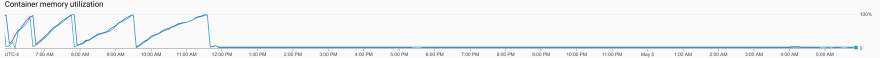

# Finding and fixing memory leaks in Go

- 原文地址：https://dev.to/googlecloud/finding-and-fixing-memory-leaks-in-go-1k1h
- 原文作者：Tyler Bui-Palsulich
- 本文永久链接：https://github.com/gocn/translator/blob/master/2021/w42_Finding_and_fixing_memory_leaks_in_Go.md
- 译者：[Fivezh](https://github.com/fivezh)
- 校对：[]()

This post reviews how I found a memory leak, how I fixed it, how I fixed similar issues in Google's sample Go code, and how we're improving our libraries to prevent this in the future.

The [Google Cloud Client Libraries for Go](https://github.com/googleapis/google-cloud-go) generally use gRPC under the hood to connect with Google Cloud APIs. When you create an API client, the library initializes a connection to the API then leaves that connection open until you call `Close` on the `Client`.

```golang
client, err := api.NewClient()
// Check err.
defer client.Close()
```

Clients are safe to use concurrently, so you should keep the same `Client` around until you're done with it. But, what happens if you don't `Close` the client when you should?

You get a memory leak. The underlying connections never get cleaned up.

------

Google has a bunch of GitHub automation bots to help manage hundreds of GitHub repos. Some of our bots proxy their requests through a [Go server](https://github.com/googleapis/repo-automation-bots/tree/main/serverless-scheduler-proxy) running on [Cloud Run](https://cloud.google.com/run/docs/quickstarts/build-and-deploy/go). Our memory usage looked like a classic sawtooth memory leak:


I started debugging by adding the `pprof.Index` handler to the server:

```golang
mux.HandleFunc("/debug/pprof/", pprof.Index)
```


[`pprof`](https://pkg.go.dev/net/http/pprof) provides runtime profiling data, like memory usage. See [Profiling Go Programs](https://blog.golang.org/pprof) on the Go Blog for more information.

Then, I built and started the server locally:

```sh
$ go build
$ PROJECT_ID=my-project PORT=8080 ./serverless-scheduler-proxy
```

Next, I sent a some requests requests to the server:

```sh
for i in {1..5}; do
curl --header "Content-Type: application/json" --request POST --data '{"name": "HelloHTTP", "type": "testing", "location": "us-central1"}' localhost:8080/v0/cron
echo " -- $i"
done
```

The exact payload and endpoint is specific to our server and is irrelevant for this post.

To get a baseline for what memory is being used, I collected some initial `pprof` data:

```sh
curl http://localhost:8080/debug/pprof/heap > heap.0.pprof
```

Inspecting the output, you can see some memory usage, but nothing immediately stands out as a large issue (which is good! We just started the server!):

```sh
$ go tool pprof heap.0.pprof
File: serverless-scheduler-proxy
Type: inuse_space
Time: May 4, 2021 at 9:33am (EDT)
Entering interactive mode (type "help" for commands, "o" for options)
(pprof) top10
Showing nodes accounting for 2129.67kB, 100% of 2129.67kB total
Showing top 10 nodes out of 30
      flat  flat%   sum%        cum   cum%
 1089.33kB 51.15% 51.15%  1089.33kB 51.15%  google.golang.org/grpc/internal/transport.newBufWriter (inline)
  528.17kB 24.80% 75.95%   528.17kB 24.80%  bufio.NewReaderSize (inline)
  512.17kB 24.05%   100%   512.17kB 24.05%  google.golang.org/grpc/metadata.Join
         0     0%   100%   512.17kB 24.05%  cloud.google.com/go/secretmanager/apiv1.(*Client).AccessSecretVersion
         0     0%   100%   512.17kB 24.05%  cloud.google.com/go/secretmanager/apiv1.(*Client).AccessSecretVersion.func1
         0     0%   100%   512.17kB 24.05%  github.com/googleapis/gax-go/v2.Invoke
         0     0%   100%   512.17kB 24.05%  github.com/googleapis/gax-go/v2.invoke
         0     0%   100%   512.17kB 24.05%  google.golang.org/genproto/googleapis/cloud/secretmanager/v1.(*secretManagerServiceClient).AccessSecretVersion
         0     0%   100%   512.17kB 24.05%  google.golang.org/grpc.(*ClientConn).Invoke
         0     0%   100%  1617.50kB 75.95%  google.golang.org/grpc.(*addrConn).createTransport
```

The next step was sending a bunch of requests to the server and seeing if we could (1) reproduce the seeming memory leak and (2) identify what the leak is.

Sending 500 requests:

```sh
for i in {1..500}; do
curl --header "Content-Type: application/json" --request POST --data '{"name": "HelloHTTP", "type": "testing", "location": "us-central1"}' localhost:8080/v0/cron
echo " -- $i"
done
```

Collecting and analyzing more `pprof` data:

```sh
$ curl http://localhost:8080/debug/pprof/heap > heap.6.pprof
$ go tool pprof heap.6.pprof
File: serverless-scheduler-proxy
Type: inuse_space
Time: May 4, 2021 at 9:50am (EDT)
Entering interactive mode (type "help" for commands, "o" for options)
(pprof) top10
Showing nodes accounting for 94.74MB, 94.49% of 100.26MB total
Dropped 26 nodes (cum <= 0.50MB)
Showing top 10 nodes out of 101
      flat  flat%   sum%        cum   cum%
   51.59MB 51.46% 51.46%    51.59MB 51.46%  google.golang.org/grpc/internal/transport.newBufWriter
   19.60MB 19.55% 71.01%    19.60MB 19.55%  bufio.NewReaderSize
    6.02MB  6.01% 77.02%     6.02MB  6.01%  bytes.makeSlice
    4.51MB  4.50% 81.52%    10.53MB 10.51%  crypto/tls.(*Conn).readHandshake
       4MB  3.99% 85.51%     4.50MB  4.49%  crypto/x509.parseCertificate
       3MB  2.99% 88.51%        3MB  2.99%  crypto/tls.Client
    2.50MB  2.49% 91.00%     2.50MB  2.49%  golang.org/x/net/http2/hpack.(*headerFieldTable).addEntry
    1.50MB  1.50% 92.50%     1.50MB  1.50%  google.golang.org/grpc/internal/grpcsync.NewEvent
       1MB     1% 93.50%        1MB     1%  runtime.malg
       1MB     1% 94.49%        1MB     1%  encoding/json.(*decodeState).literalStore
```

`google.golang.org/grpc/internal/transport.newBufWriter` really stands out as using a ton of memory! That's the first indication of what the leak is related to: gRPC. Looking at our application source code, the only place we were using gRPC was for [Google Cloud Secret Manager](https://cloud.google.com/secret-manager/docs/quickstart):

```golang
client, err := secretmanager.NewClient(ctx) 
if err != nil { 
    return nil, fmt.Errorf("failed to create secretmanager client: %v", err) 
}
```

We never called `client.Close()` and created a `Client` on every request! So, I added a `Close` call and the problem went away:

```golang
defer client.Close()
```

I submitted the fix, it [automatically deployed](https://cloud.google.com/build/docs/deploying-builds/deploy-cloud-run), and the sawtooth went away immediately!



Woohoo! 🎉🎉🎉

------

Around the same time, a user filed an issue on our [Go sample repo for Cloud](https://github.com/GoogleCloudPlatform/golang-samples), which contains most of the Go samples for docs on [cloud.google.com](https://cloud.google.com/). The user noticed we forgot to `Close` the `Client` in one of our samples!

I had seen the same thing pop up a few other times, so I decided to investigate the entire repo.

I started with a rough estimate of how many affected files there were. Using `grep`, we can get a list of all files containing a `NewClient` style call, then pass that list to another invocation of `grep` to only list the files that *don't* contain `Close`, ignoring test files:

```sh
$ grep -L Close $(grep -El 'New[^(]*Client' **/*.go) | grep -v test
```


Oops! There were 207 files… For context, we have about 1300 `.go` files in the [GoogleCloudPlatform/golang-samples](https://github.com/GoogleCloudPlatform/golang-samples) repo.

Given the scale of the problem, I thought some automation would be [worth it](https://xkcd.com/1205/) to get a rough start. I didn't want to write a full on Go program to edit the files, so I stuck with Bash:

```sh
$ grep -L Close $(grep -El 'New[^(]*Client' **/*.go) | grep -v test | xargs sed -i '/New[^(]*Client/,/}/s/}/}\ndefer client.Close()/'
```

Is it perfect? No. Did it make a huge dent in the amount of work? Yes!

The first part (up until `test`) is the exact same as above -- get a list of all of the possibly affected files (the ones that seem to create a `Client` but never call `Close`).

Then, I passed that list of files to `sed` for actual editing. `xargs` invokes the command you give it with each line of `stdin` being passed as an argument to the given command.

To understand the `sed` command, it helps to see what a sample usually looks like in the `golang-samples` repo (omitting imports and everything after client initialization):

```golang
// accessSecretVersion accesses the payload for the given secret version if one
// exists. The version can be a version number as a string (e.g. "5") or an
// alias (e.g. "latest").
func accessSecretVersion(w io.Writer, name string) error {
    // name := "projects/my-project/secrets/my-secret/versions/5"
    // name := "projects/my-project/secrets/my-secret/versions/latest"
    // Create the client.
    ctx := context.Background()
    client, err := secretmanager.NewClient(ctx)
    if err != nil {
        return fmt.Errorf("failed to create secretmanager client: %v", err)
    }
    // ...
}
```

At a high level, we initialize the client and check if there was an error. Whenever you check the error, there is a closing curly brace (`}`). I used that information to automate the editing.

The `sed` command is still a douzy, though:

```sh
sed -i '/New[^(]*Client/,/}/s/}/}\ndefer client.Close()/'
```

The `-i` says to edit the files in place. I'm OK with this because `git` can save me if I mess up.

Next, I used the `s` command to insert `defer client.Close()` right after the presumed closing curly brace (`}`) from checking the error.

But, I don't want to replace *every* `}`, I only want the *first one after a call to `NewClient`*. To do that, you can give an [*address range*](https://www.gnu.org/software/sed/manual/html_node/Addresses.html) for `sed` to search.

An address range can include the start and end patterns to match before applying whatever command comes next. In this case, the start is `/New[^(]*Client/`, matching `NewClient` type calls, and the end (separated by a `,`) is `/}/`, matching the next curly brace. That means our search and replace will only apply between the call to `NewClient` and the closing curly brace!

From knowing the error handling pattern above, the closing brace of the `if err != nil` condition is exactly where we want to insert our `Close` call.

------

Once I had automatically edited all of the samples, I ran `goimports` to fix the formatting. Then, I went through each edited file to make sure it did the right thing:

- In server applications, should we actually close the client, or should we keep it around for future requests?
- Is the name of the `Client` actually `client` or is it something else?
- Is there more than one `Client` to `Close`?

Once that was done, I was left with [180 files edited](https://github.com/GoogleCloudPlatform/golang-samples/pull/2080).

------

The last order of business is trying to make it so this doesn't happen to users anymore. There are a few ways we have in mind:

1. Better samples. See above.
2. Better GoDoc. We updated our library generator to include a comment in the generated libraries saying to `Close` the `Client` when you're done with it. See https://github.com/googleapis/google-cloud-go/issues/3031.
3. Better libraries. Is there a way we can automatically `Close` clients? Finalizers? Have an idea of how we can do this better? Let us know on https://github.com/googleapis/google-cloud-go/issues/4498.

I hope you learned a bit about Go, memory leaks, `pprof`, gRPC, and Bash. I'd love to hear your stories about memory leaks you've found and what it took to fix them! If you have ideas about how we can improve our [libraries](https://github.com/googleapis/google-cloud-go) or [samples](https://github.com/GoogleCloudPlatform/golang-samples), let us know by filing an issue.
