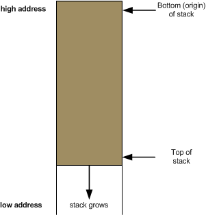

# 基于寄存器调用的软件加速

- 原文地址：https://menno.io/posts/golang-register-calling/
- 原文作者：[Menno Finlay-Smits](https://github.com/mjs)
- 本文永久链接：https://github.com/gocn/translator/blob/master/2021/w47_faster_software_through_register_based_calling.md
- 译者：[cvley](https://github.com/cvley)
- 校对：

2021 年 11 月 23 日发表

 [Go 1.17 的发布说明](https://golang.org/doc/go1.17#compiler) 中提到一个 Go 编译器有趣的变更：现在将使用寄存器来代替栈，用于传递函数的参数和返回值。这个特性的 [提案文档](https://go.googlesource.com/proposal/+/refs/changes/78/248178/1/design/40724-register-calling.md) 提到，大量的应用预期可以提升 5-10% 的吞吐，尤其是对于开发者而言，除了使用新版的 Go 编译器重新编译外，没有其他的工作量。我好奇这个变更的原理，因此决定深入研究一番。接下来的旅程多少有些技术宅的气息，那么坐好我们开始吧！

注意尽管本篇博客的诱因来自于 Go 的一个变更，但即使你不使用 Go，也可以发现本文绝大部分的内容非常有趣。

### 复习：寄存器

此时回顾 CPU 寄存器的内容对下文的理解有用。简单来说，寄存器是处理器中少量的高速临时存储。每个寄存器都有一个名字，每个可以存储一个 [word](https://en.wikipedia.org/wiki/Word_(computer_architecture)) 的数据——对于现在绝大多数的计算机来说，是 64 bits。

一些寄存器有通用的目的，而其他的有特定的功能。在本文中，你将遇到 AX, BX 和 CX 通用目的的寄存器，同时也包括 SP （stack pointer，栈指针）这一特殊用途的寄存器。

### 复习：栈

回顾计算机程序中栈的概念也是有用的。它是放在程序内存顶部的一块内存。栈一般用于存储局部变量、函数参数、函数返回值和函数返回的地址。栈会随着不断添加内容而逐渐向下扩大。

Eli Bendersky 有一篇解释栈工作原理的[精彩文章](https://eli.thegreenplace.net/2011/02/04/where-the-top-of-the-stack-is-on-x86)，其中就包含下面这张图：

当在栈中添加元素时，我们称为_入_栈。当从栈中移除元素时，我们称为_出_栈。x86 CPU 有对应出入栈的指令。

前面提到的 SP 寄存器指向当前栈顶的元素。

注意这里的表述有些随意。在 x86 电脑上（和许多其他 CPU 架构上）栈的工作原理是这样，但并非全部都是如此。

### 调用约定

在编译好的软件中，当某些代码想要调用一个函数时，这个函数的参数需要以某种方式传入到函数中（当函数完成时，返回值也需要以某种方式传出来）。完成这个目的有多种不同的可行方法，对应每种传递参数和返回值的方法叫做“调用约定”。

Go 1.17 发布说明中，有一部分引用了上面这段话，实际上也是对应 Go 调用约定的一个变更。

除非你使用汇编语言来编程，或者尝试融合其他语言的代码，否则是无法感知这个变更的。即使这样，能够了解机器层面的工作方式依旧非常有趣。

### 一段简单的代码

为了对比 Go 编译器在 1.16 和 1.17 生成代码的不同，我们需要一段简单的测试程序。这段程序无需太复杂，仅仅调用一个接受一些参数的函数，然后返回一个值就可以。下面这个是我想到的一个简单的程序：

    package main
    
    import "fmt"
    
    func add(i, j int) int {
        return i + j
    }
    
    func main() {
        z := add(22, 33)
        fmt.Println(z)
    }

### 反汇编

为了看到 Go 编译器生成的 CPU 指令，我们需要一个反汇编器。可以完成这个目的的一个工具是令人尊敬的 [objdump](https://linux.die.net/man/1/objdump)，它在 GNU binutils 套件中，如果你使用的是 Linux，可能已经安装了它。在本文中我将使用 `objdump` 。

Go 的编译流程有些不寻常之处，在将代码转换成真正的机器特定的指令前，它会先生成了一种定制的抽象汇编语言。这个中间态的汇编语言可以通过使用 `go tool objdump` 命令查看。

使用这个输出来探索有些诱人，但这个中间态的汇编语言 [不是为指定平台生成的机器码的直接表示](https://www.mit.edu/afs.new/sipb/project/golang/doc/asm.html)。因此，我们选择使用 objdump。

### Go 1.16 的输出

我们看下 Go 1.16 的输出，预期调用使用的是栈。首先使用 Go 1.16 编译出二进制文件，并确保可执行：

    $ go1.16.10 build -o prog-116 ./main.go
    $ ./prog-116
    55

我的 Linux 发行版已经安装了 Go 1.17.3，我使用的安装方法参考的是安装 Go 1.16.10 的 [官方文档](https://golang.org/doc/manage-install#installing-multiple)中描述的方法。

很棒！现在我们进行反编译，看下生成的指令：

    $ objdump -d prog-116 > prog-116.asm

我首先注意到的是，代码真多：

    $ wc -l prog-116.asm
    164670 prog-116.asm

对于这么简短的程序来说，生成的指令太多了，这是因为每个 Go 程序包含了 Go 的运行时，而运行时的代码量较多，用于调度 goroutines 并提供 Go 开发的所有便利。幸运的是，和测试程序直接相关的指令在底部：

（为了简单，我省略了 objdump 一般会提供的偏移量和 raw 字节；同时也省略一些 Go 设置的代码）

    0000000000497640 <main.main>:
      ...
      movq   $0x37,(%rsp)
      call   40a3e0 <runtime.convT64>
      mov    0x8(%rsp),%rax
      xorps  %xmm0,%xmm0
      movups %xmm0,0x40(%rsp)
      lea    0xaa7e(%rip),%rcx        # 4a2100 <type.*+0xa100>
      mov    %rcx,0x40(%rsp)
      mov    %rax,0x48(%rsp)
      mov    0xb345d(%rip),%rax        # 54aaf0 <os.Stdout>
      lea    0x4290e(%rip),%rcx        # 4d9fa8 <go.itab.*os.File,io.Writer>
      mov    %rcx,(%rsp)
      mov    %rax,0x8(%rsp)
      lea    0x40(%rsp),%rax
      mov    %rax,0x10(%rsp)
      movq   $0x1,0x18(%rsp)
    
      movq   $0x1,0x20(%rsp)
    
      nop
      call   491140 <fmt.Fprintln>
      ...

奇怪！这和我们代码看起来完全不一样。 `add` 函数的调用在哪里？事实上， `movq $0x37,(%rsp)` （把 0x37 移动到栈指针寄存器指向的内存位置）看起来非常可疑。22 + 33 = 55，是十六进制的 0x37。看起来 Go 编译器已经对代码进行了优化，在编译时计算出了加法的结果，在这个过程中消除了大部分的代码。

为了进一步研究，我们需要使用一个特殊的注释来标识 add 函数，以此告诉 Go 编译器不要[内联](https://dave.cheney.net/tag/inlining) add 函数。`add` 现在看起来是这样：

    //go:noinline
    func add(i, j int) int {
        return i + j
    }

编译代码并再次运行 `objdump`，反编译的结果看起来更符合我们的预期。我们从 `main()` 开始——我已经把反汇编进行了拆分并添加了注释。

main 函数以基址指针和栈指针的初始化开始：

    0000000000497660 <main.main>:
        mov    %fs:0xfffffffffffffff8,%rcx
        
        cmp    0x10(%rcx),%rsp
        jbe    497705 <main.main+0xa5>
        sub    $0x58,%rsp
        mov    %rbp,0x50(%rsp)
        lea    0x50(%rsp),%rbp

接下来，

        movq   $0x16,(%rsp)
        movq   $0x21,0x8(%rsp)

这里我们看到 `add` 的参数已经被放到栈上，用于准备函数调用。0x16 (22) 移动到栈指针指向的地方。0x21 (33) 复制了栈指针指向位置后的 8 个字节（也就是之前栈上的内容）。8 这个偏移量很重要，因为我们处理的是 64 位（8 字节）的整数。一个 8 字节的偏移表示的是 33 被直接放在 22 后面的栈中。

        call   4976e0 <main.add>
        mov    0x10(%rsp),%rax
        mov    %rax,0x30(%rsp)

这里是 add 函数被调用的地方。当 `call` 指令在 CPU 上执行时，指令指针的当前值被推到栈上，执行跳到 `add` 函数。一旦 `add` 返回，执行会继续把返回值（栈指针 + 0x10）分配给 `z`（栈指针 + 0x30 作为结果）。

在 main 函数调用里还有更多的代码，用于处理 fmt.Println 的调用，但它们不在本文的讨论范围。

在观察这段代码时，我发现一个有趣的情况是，并没有使用经典的 `push` 指令来加和。值通过 `mov` 放入栈中。这么做是为了性能考虑。一次 `mov` 比一次 `push` [一般需要更少得 CPU 周期](https://agner.org/optimize/instruction_tables.pdf)。

我们也应该看一下 `add`：

    0000000000497640 <main.add>:
        mov    0x10(%rsp),%rax
        mov    0x8(%rsp),%rcx
        add    %rcx,%rax
        mov    %rax,0x18(%rsp)
        ret    

第二个参数（在 SP + 0x10）复制到 AX 寄存器中，第一个参数（在 SP +0x08）复制到 CX 寄存器中。但等一下，参数不应该在 SP 和 SP+0x10 吗？当 `call` 指令执行时，它们确实在那里，指令指针入栈，所以栈指针需要减少，才有空间放入它们——这表明参数的偏移需要根据这个情况来调整。

`add` 指令简单易懂。其中 CX 和 AX 相加（结果存在 AX）。然后结果传入返回的位置（SP +0x18）。

`ret` （返回）指令从栈中拿到返回地址，执行 `main` 中 `call` 后面的指令。

哈！对于这么简单的程序来说，代码真多。尽管理解工作原理很有用，但谢天谢地我们现在几乎不写汇编语言了！

### 检查 Go 1.17 的输出

现在我们看下通用的程序使用 Go 1.17 编译的情况。编译和反汇编的步骤和 Go 1.16 相似：

    $ go build -o prog-117 ./main.go
    $ objdump -d prog-117 > prog-117.asm

主要的反汇编代码和 Go 1.16 下开始的地方是一样的——符合预期——但在 `add` 调用的地方不同：

        mov    $0x16,%eax
        mov    $0x21,%ebx
        xchg   %ax,%ax
        call   47e260 <main.add>

不同于被复制到栈上，函数参数被复制到 AX 和 BX 寄存器上。这是基于寄存器调用的本质。

~`xchg %ax,%ax` 指令有些神秘，我仅知道对应的原理。如果你了解，可以发邮件联系，我将会在这里添加细节信息。~

**更新**: `xchg %ax,%ax` 指令可以确定是为了兼容在一些 Intel 处理器上的 [bug](https://www.intel.com/content/www/us/en/support/articles/000055650/processors.html)。这个指令（"exchange AX with AX"）除了在 `call` 指令前引入两个字节的对齐填充外，没有其他功能——这用于兼容处理器的 bug。Go [GitHub issue](https://github.com/golang/go/issues/35881) 有详细的信息。感谢那些作者。

正如我们前面所见，`call` 指令把执行移动到 `add` 函数中。

现在我们看下 `add`:

    000000000047e260 <main.add>:
        add    %rbx,%rax
        ret    

就是这么简单！不像 Go 1.16 版本，无需把栈上的参数移动到寄存器再相加，也无需再把结果移动到栈。函数参数预期是在 AX 和 BX 寄存器中，返回值预期返回到 AX。`ret` 指令在 `call` 执行后，通过使用 `call` 留在栈上的返回地址，返回执行流程。

在函数参数和返回值的处理过程中，仅有少量的工作量，基于寄存器调用可能更快的答案也逐渐浮出水面。

### 性能对比

那么基于寄存器的调用可以快多少呢？我创建了一个简单的 Go 基准程序来验证：

    package main
    
    import "testing"
    
    //go:noinline
    func add(i, j int) int {
    	return i + j
    }
    
    var result int
    
    func BenchmarkIt(b *testing.B) {
    	x := 22
    	y := 33
    	var z int
    	for i := 0; i < b.N; i++ {
    		z = add(x, y)
    	}
    	result = z
    }

注意在基准函数外使用变量，是为了保证[编译器不会优化](https://dave.cheney.net/2013/06/30/how-to-write-benchmarks-in-go) 掉 `z` 的分配。

基准测试可以这么运行：

    go test bench_test.go -bench=.

在我这个有些年头的笔记本上，在 Go 1.16 下能得到的最好结果是：

    BenchmarkIt-4   	512385438	         2.292 ns/op

Go 1.17 的结果：

    BenchmarkIt-4   	613585278	         1.915 ns/op

提升很显著——我们的例子执行时间下降了 16%。效果不错，尤其是这个提升对于所有的 Go 程序都很容易，仅仅需要使用编译器的新版本就可以了。
### 结论

我希望你对探索一些软件底层细节的内容感兴趣，毕竟我们现在很少考虑这方面的内容，希望你在这个过程中有所收获。

非常感谢 [Ben Hoyt](https://benhoyt.com/writings/) 和 [Brian Thorne](https://hardbyte.nz/) 对本文的详细审阅。

**更新**：本文在其他地方获得非常多的讨论，尤其是：

*   [Reddit](https://www.reddit.com/r/golang/comments/r0apqf/a_deep_dive_into_the_register_based_calling/)
*   [Hacker News](https://news.ycombinator.com/item?id=29316415)

[源](https://menno.io/posts/golang-register-calling/)
