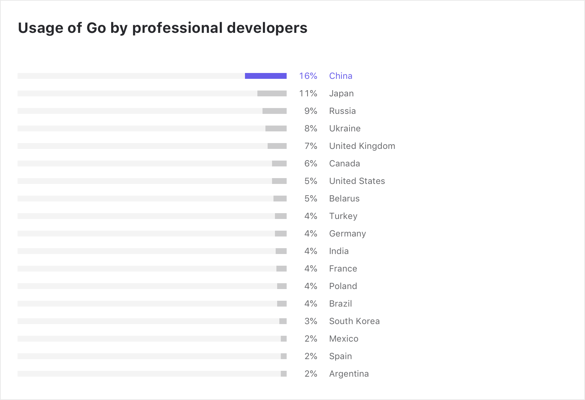
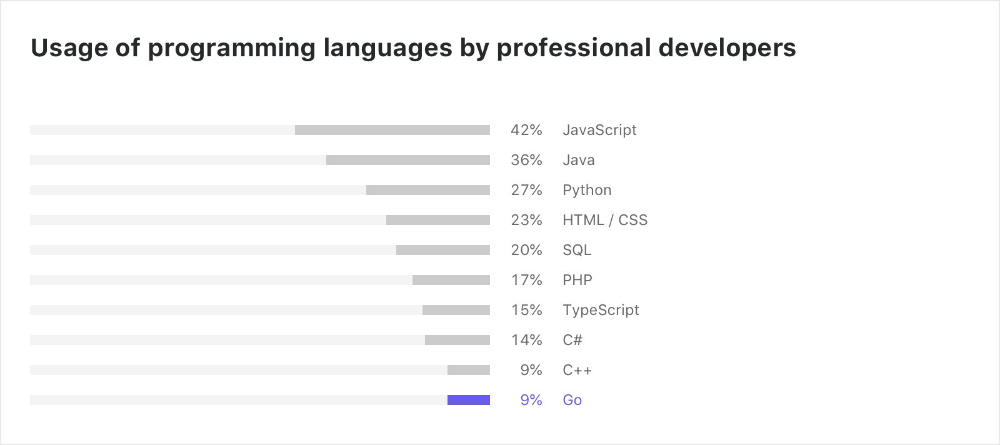
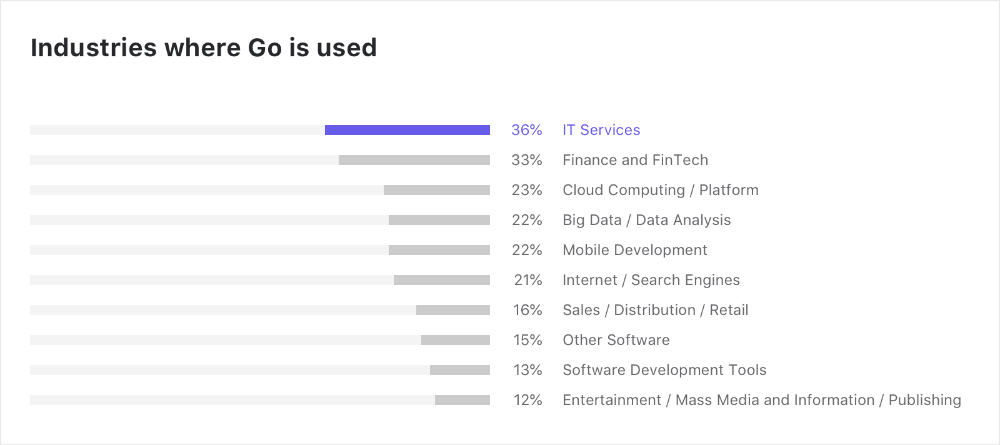
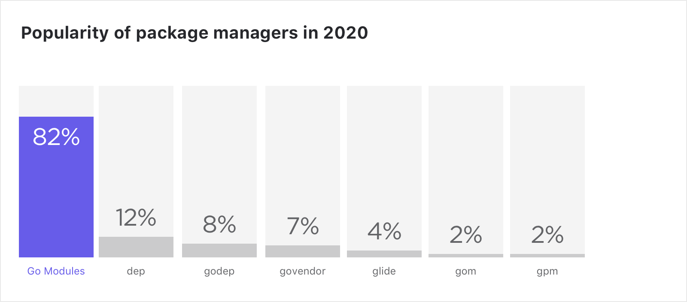
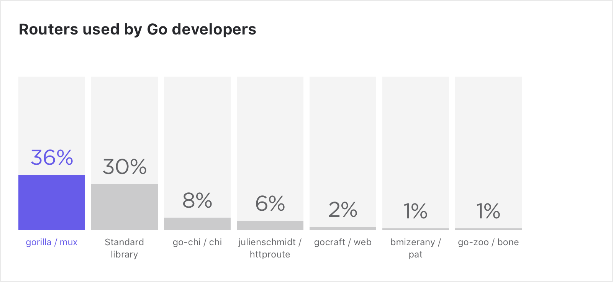
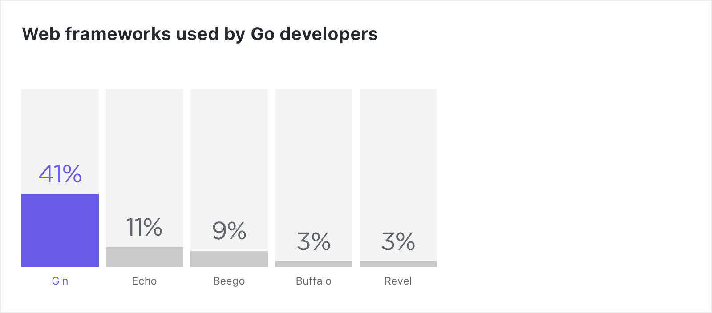
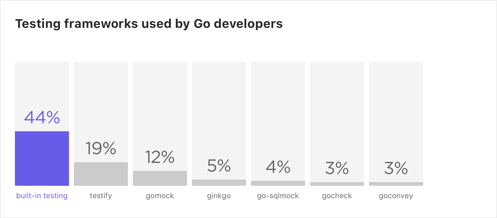
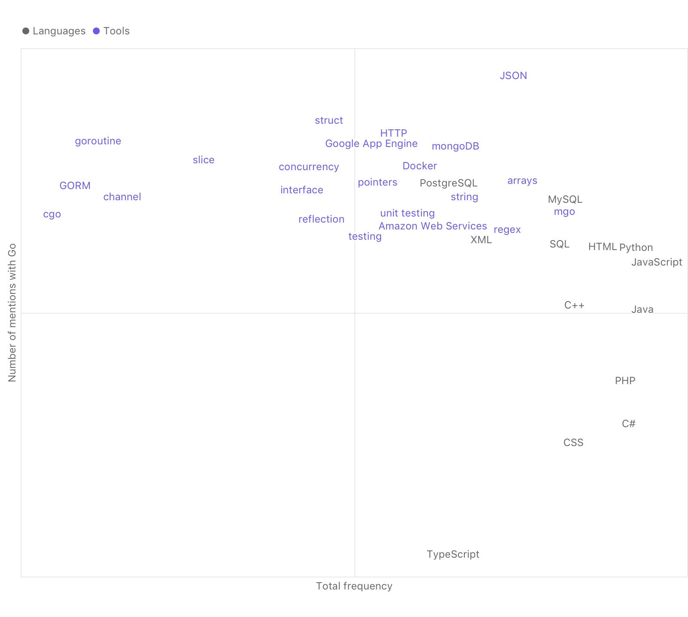

# 2021 Go 趋势报告

- 原文地址：https://blog.jetbrains.com/go/2021/02/03/the-state-of-go/
- 原文作者：Ekaterina Zharova
- 本文永久链接：https://github.com/gocn/translator/blob/master/2021/w6_the_state_of_Go.md
- 译者：[朱亚光](https://github.com/zhuyaguang)
- 校对：

> [Ekaterina Zharova](https://blog.jetbrains.com/author/ekaterina-zharovajetbrains-com)
>
> 2021.2.3

在当今最流行的编程语言列表里，Go语言一直是名列前茅。我们已经知道了Go语言的火热、有趣、受社区用户的欢迎，正如它速度和效率那样，但我们还想知道更多。我们为了发现更多的事实，在目前Go现有的信息的基础上，进行了深入研究。我们邀请了Go语言专家、`Goland`开发倡导者 `Florin Pățan`  来发表他对Go语言发展趋势的看法。

在哪儿
-----

### 约110万Go开发者

总的来说，大约有 **110万专业的 Go 开发者** 使用 Go 作为**主要开发语言**。 如果我们把那些使用其他语言作为主力开发语言，但是把Go当作业余爱好的开发人员算在内的话，这一数字可能接近**270万**。

就全球分布而言，居住在 **亚洲** 的 Go 开发者最多，大约有57万开发者使用 Go 作为主要开发语言。

_专家分析_

这也正是我最期待的使用Go开发的地方。就Go用户数量而言，亚洲高居榜首，我认为主要原因是有大量的来自像腾讯、阿里巴巴、华为这些大公司的开发者。这些公司一般都有很多开发人员。

具体在哪里
------------------

下图显示了我们在 [2020开发者生态调查](https://www.jetbrains.com/lp/devecosystem-2020/go/) 中调查的每个国家使用Go作为主要语言的开发者的分布情况（受访者最多可以选择3种主要语言）。**中国** 的开发者集中度最高，有16%的中国开发者在使用Go。

_专家分析_

看到中国排在榜首，我一点也不惊讶。我本以为俄罗斯会排在第二，美国会高一点，大概在前五位。

中国之所以排在榜首，可能正是因为他们拥有的开发者数量最多。而且我认识的很多公司，比如 `PingCAP`、腾讯和华为，都有很多开发者来支撑和构建他们的内部工具、基础设施和后端服务，这些服务都和微服务相结合。这似乎是关键原因。

我知道俄罗斯的 Go 社区非常棒，所以也难怪 Go 在那里很受欢迎。我对日本和乌克兰很好奇，因为我没想到他们会这么高，我以为德国和印度会更高些。记得四五年前我在柏林的时候，我认识的每一家创业公司都在使用 Go 。

行业洞察
-----------------

Go 依然保持着开发者主要使用语言的 **前10名**，根据[2020开发者生态调查](https://www.jetbrains.com/lp/devecosystem-2020/go/)显示 Go 的份额约为9%。

_专家分析_

我认为 Go 会一直增长。人们通常不会把 Go 作为他们开始编程的入门语言，但是会从其他语言迁移过来，例如 `PHP` `Ruby`，但据我所知，主要从 `C++` `C#` 迁移过来。

Go 相比 PHP 的优势是类型安全，因为 Go 是一门静态类型语言，而 PHP 是门动态类型语言。这就意味着编译器在运行时做了大量的工作来确保你写的代码能够编译并且正常运行。相比于 C++ ，Go 的优势是简单。在 Go 里面，一切都是那么简单。

总的来说，Go 的特点就是与生俱来的速度快，无论是写代码还是运行时。一般来说，在不做任何特殊优化的情况下，采用 Go 语言你就能提高5-10倍的性能，这对公司来说是一个很重要的生产优势。同时 Go 也是一门简单的语言，很容易上手，很容易替换现有项目中的微服务。

许多 IT 基础设施工具，如 `Kubernetes`、`Docker`和`Vault`（举几个大型的例子）都是用 Go 构建的。因此虽然很多公司是使用 Java ，但是还是会有一个团队会用 Go，特别是为了来维护这些项目和给这些项目打补丁。这可能是 Go  采用率保持增长的另外一个原因。 这种技术在公共技术设施和部署中使用的越多，Go 就增长的越快。我认为接下来几年会有越来越多的人采用Go，我们将会看到大约有15%-20%的开发者会使用 Go 。特别是考虑到开发者生态调查中问道，“你计划在未来的12个月内采用或者迁移到其他语言吗？”，13%的受访者回答是Go。

Go开发的软件类型
----------------------------------

**Web 服务** 是使用 Go  最受欢迎的领域，根据 [2020开发者生态调查](https://www.jetbrains.com/lp/devecosystem-2020/go/) 结果显示，其占有36%份额。

_专家分析_

为什么是 web 服务，我认为主要原因是构建一个 API 服务非常快。他们不需要框架，就可以用Go快速启动和运行一个。

我不认为这张图在未来会有很大变化，我真心希望看到 web 服务得到更多的分享，因为用 Go 开始一个web 服务确实很简单。

对于实用小程序，我见过很多类似的，因为 Go 很容易快速写一个小应用来帮你处理大量的数据，写一个小的实用程序或需要消耗大量资源的一次性任务。越来越多的人采用`Docker` 和`Kubernetes`，就会有越来越多的人使用 Go,仅仅是因为他们都是用 Go 写的。任何类型的 DevOps 的工作都可以从 Go 中获益，因为它提供了类型安全和速度。与基础设施的云端交互很容易（Google、Amazon、Azure等），因为他们都有很好的 SDK 。我认为未来几年，当泛型到来时，我们还可以期待下 “Libraries / Frameworks” 的一些提升。

系统软件——我认为随着越来越多的人开始使用像 Rust 这样的语言编写系统软件，这一数字将会下降。数据库也是如此。所以这大约6%市场，在未来这可能会变成一个商机。编程工具——我很惊讶它在列表中份额这么高，我非常感兴趣去了解一下 Go 有哪些编程工具。

使用Go的顶级行业
-------------------------------

根据 [2020开发者生态调查](https://www.jetbrains.com/lp/devecosystem-2020/go/) ，Go 程序员主要从事 **IT 服务**，其次是 **金融和金融科技**、**云技术/云平台** 和其他行业。

_专家分析_

金融和金融科技。这是我希望看到的，因为据我所知有相当多的银行已经开始采用 Go 或者正在广泛使用 Go 作为他们的基础设施。例如，[来自英国的Monzo使用 Go 构建了他们整个银行](https://monzo.com/blog/2016/09/19/building-a-modern-bank-backend)。云计算和云平台也很有意义，因为它们对于使用 Go 编写的应用来说是很自然的。

移动开发，这是意料之外的。Go 并没有好的移动开发历史。如果有什么不同的话，我希望大家使用 Go 来为移动程序提供网络服务或者后端服务，但仅此而已。

有几个行业，我不认为 Go 的使用率会很快增加。比如，任何基于机器学习的东西，因为这仍然是 Python 的要塞。人们正在努力让机器学习在 Go 中变得受欢迎和变得更好，但是我认为至少要几年之后才会有一些结果。

Go 工具
--------

### 包管理

**Go Modules** 是 Go 开发者中最受欢迎的包管理工具。根据 _2020 开发者生态调查_ 其使用率从 [2019](https://www.jetbrains.com/lp/devecosystem-2019/go/) 到41%上升到到 [2020](https://www.jetbrains.com/lp/devecosystem-2020/go/) 的82%。

_专家分析_

我认为在某种程度上我们可能不得不停止问这个问题，因为 Go Modules已经被设置为标准默认模型，而且Go团队也想要弃用 `GOPATH`。到那时，其他的所有的包管理工具都将会被淘汰。

### Go 路由

根据 [2020](https://www.jetbrains.com/lp/devecosystem-2020/go/) 和 [2018](https://www.jetbrains.com/research/devecosystem-2018/go/) 的开发者生态调查显示，**Gorilla / Mux** 和 **标准库** 自2018年以来一直是使用最多的 Go 路由。

_专家分析_

标准库之所以如此受欢迎，可能是因为每当你去Reddit、Slack或其他地方，人们通常都会建议你坚持使用标准库，只有在你真正需要的时候才使用其他东西。我使用`gorilla/mux`，是因为它在标准库的基础上有更多的抽象，又不会牺牲太多的性能。也可能是因为它是最接近标准库的，而且它使得编写服务端更容易。总的来说，这种分布可能是我希望看到的。

### 5大web框架

根据 [2020](https://www.jetbrains.com/lp/devecosystem-2020/go/) 和 [2018](https://www.jetbrains.com/research/devecosystem-2018/go/) 的开发者生态调查显示，**Gin** 的使用量自2018年以来几乎翻了一倍，而其他 web 框架基本保持稳定。

_专家分析_

Gin 在 web 上如此受欢迎，因为它是一个速度快的框架，而且也得到了很好的推荐。它也是最古老的框架之一。因为会有很多文档摆在那儿，很多用户已经在使用它和推荐它。

### 测试框架

使用 **内置测试框架** 的比例从 [2018](https://www.jetbrains.com/research/devecosystem-2018/go/) 64%下降到 [2020](https://www.jetbrains.com/lp/devecosystem-2020/go/) 的44%，而使用其他测试框架的比例略有增长。

_专家分析_

内置的测试框架比例很高是因为 Go 标准库有一个非常好的开箱即用的测试库。

内置测试可能会下降主要是因为越来越多的人从其他语言(比如 PHP )转向这门语言，他们试图复制自己已有的测试习惯。

讨论最多的Go工具和其他语言
-------------------------------------------

Go 经常在 IT 社区中被讨论，Stack Overflow 就是其中之一。我们从其 Q&A 单元获取数据来找出哪些标签与“Go”同时出现次数最多。其中有23种工具和两种语言（`MySQL` 和 `PostgreSQL`）。除了这些工具，还有与其他顶级语言的共存。纵轴表示标签出现的总次数，而横轴表示带有“Go”的标签的提及次数。

_专家分析_

我预计` JSON` 的确是个问题，把 Go 的数据结构序列化和反序列化成` JSON`是很不容易的，这可能是为什么 `JSON`如此醒目的原因。来自其他语言的人通常很难理解`struct`，除非它们来自C++或C。

基于`AWS`本身的受欢迎程度，我认为`Amazon Web Services`会有很多问题。现在现在为`Google App Engine`开发 Go 应用程序更简单了，但以前并不是这样，所以才会有这么多问题。

总而言之，Go社区是一个非常有趣且具有包容性的社区，你可以成为其中的一员。从不排斥新人，鼓励他们提出问题，探索语言。在一般的主题方面，泛型以及某些语言改进、编译器改进等都是经常讨论的话题。

尤其是泛型，因为它是该语言最需要的特性之一，并且有大量的工作负载将受益于该特性。

--------------------------------------------------------------------
