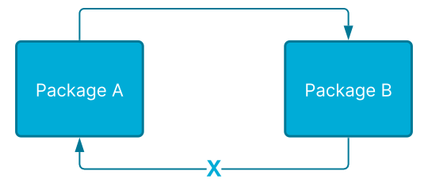
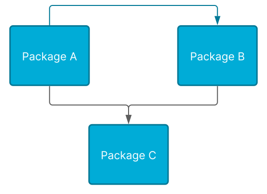
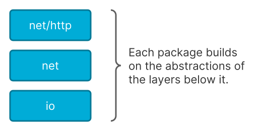
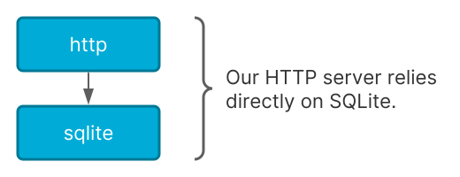
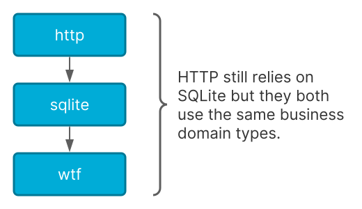
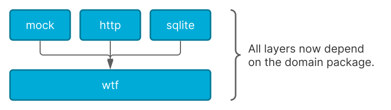
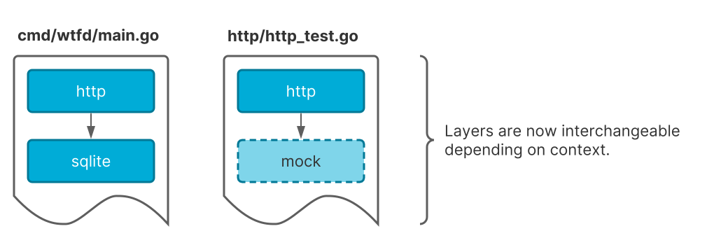

# 以层的方式而不是组的方式进行包管理

- 原文地址：https:/www.gobeyond.dev/packages-as-layers/
- 原文作者：Ben Johnson
- 本文永久链接：https:/github.com/gocn/translator/blob/master/2021/w7_packages_as_layers_not_groups.md
- 译者：[cvley](https:/github.com/cvley)
- 校对：[guzzsek](https:/github.com/guzzsek)


四年之前，我写了一篇[_包管理标准_](https:/www.gobeyond.dev/standard-package-layout/)的文章，试图解决即使是高级Go开发者也觉得困难的话题之一：包管理。然而，大多数的开发者依旧挣扎于使用文件夹结构的代码组织方式，而在这种方式下，随着应用的发展，目录结构也会慢慢增长而日趋复杂。

几乎所有的编程语言都有一个将功能集合的机制。Ruby有gems，Java有包管理。而那些没有组织代码标准约定的语言，老实说，是不关心代码组织的方式。所以这就完全依赖个人选择了。

然而，转换到Go语言的开发者会经常发现，他们的包管理方式常常会反噬。为何Go的包与其他语言如此不同？这是因为不是组的关系——而是层的关系。

## 理解循环依赖

Go的包和其他语言组合方式的一个主要区别是Go不支持循环依赖。A包可以依赖B包，那么之后B包就无法再依赖A包。



包的依赖关系只是单向的。

对于开发者来说，当他们在两个包中共享通用的代码时，这个限制就会导致问题。一般来说有两个解决方法：要么将两个包合二为一，要么引入第三个包。



但是，不断分裂更多的包只能掩盖问题。最后，只剩大量的包而没有真实的结构。

## 借鉴标准库

在Go编程需要指导时，最有效的方法之一是阅读标准库。没有完美的代码，但Go的标准库中封装了大量这门语言创造者们的理想代码。

比如，`net/http`包构建在`net`包的抽象基础之上，而`net`包则是构建在下面`io`层的抽象之上。想象一下`net`包在某种情况下依赖`net/http`包是多么的荒谬，你就会发现这种包结构非常合理。



虽然这种方式在标准库中有效，但很难在应用开发中使用。

## 在应用开发中使用层的方式

接下来我们看下一个叫做[WTF Dial](https:/github.com/benbjohnson/wtf)的示例应用，你可以阅读[介绍文章](https:/www.gobeyond.dev/wtf-dial/)进一步了解详情。

在这个应用中，我们有两个逻辑层：

1.  一个SQLite数据库
2.  一个HTTP服务

我们分别为这两个逻辑创建包——`sqlite` & `http`。很多人在对包的命名与标准库的包一样时会有些犹豫。这个想法是对的，你可以把它命名为`wtfhttp`，但是我们的HTTP包将完全封装`net/http`，而且我们不会在同个文件中同时使用这两个包。我觉得在每个包名字前都加前缀的做法很无聊也很丑，所以我不会这么干。

### 直接的方法

设置应用结构的一个方法是把数据类型（如`User`、`Dial`）和函数（如`FindUser()`、 `CreateDial()`）放在`sqlite`中。`http`包将直接依赖于它：



这个方法不错，对于简单的应用也有效。但最后我们还是会遇到一些问题。首先，我们的数据类型命名是`sqlite.User`和`sqlite.Dial`。这听起来有些奇怪，因为数据类型应该属于应用——而不是SQLite。

其次，HTTP层现在就只能托管SQLite的数据。如果我们想在中间增加缓存层怎么办？或者我们如何支持其他类型的数据存储方式，比如Postgres或直接在磁盘上存储的JSON文件？

最后，因为没有抽象层来模拟SQLite数据库，在每次HTTP测试时我们将不得不运行SQLite服务。一般来说，我支持尽可能多地进行端到端的测试，但在更高层引入单元测试的做法也有适用的场景。尤其是在引入云服务的场景下，你肯定不想每次测试调用时都运行云服务。

### 隔离业务领域

修改的第一步是将_业务领域_移动到单独的包内。这也叫做“应用领域”。它表示的是应用特定的数据类型——比如在WTF Dial中的`User`, `Dial`。

在这个例子中我使用根包（`wtf`），因为它和应用名字一样，而且是新开发者打开代码仓库时最先看到的地方。类型的命名使用更加合适的`wtf.User`和`wtf.Dial`。



可以看下`wtf.Dial`类型的例子：

```golang
type Dial struct {
	ID int `json:"id"`

	/ Owner of the dial. Only the owner may delete the dial.
	UserID int   `json:"userID"`
	User   *User `json:"user"`

	/ Human-readable name of the dial.
	Name string `json:"name"`

	/ Code used to share the dial with other users.
	/ It allows the creation of a shareable link without
	/ explicitly inviting users.
	InviteCode string `json:"inviteCode,omitempty"`

	/ Aggregate WTF level for the dial.
	Value int `json:"value"`

	/ Timestamps for dial creation & last update.
	CreatedAt time.Time `json:"createdAt"`
	UpdatedAt time.Time `json:"updatedAt"`

	/ List of associated members and their contributing WTF level.
	/ This is only set when returning a single dial.
	Memberships []*DialMembership `json:"memberships,omitempty"`
}
```
    
[dial.go#L14-50](https:/github.com/benbjohnson/wtf/blob/e23f5f00e0f48f54bd751cc264ea85c094f7d466/dial.go#L14-L50)

在上面的代码中，没有任何实现细节的引用——只有基础类型和`time.Time`。为了方便，也添加来JSON标签。

### 通过抽象服务移除依赖

我们的应用结构看起来好了一些，但HTTP依赖SQLite这点依旧有些奇怪。HTTP服务器会从一个潜在的数据库里获取数据——不会特别关心它是SQLite还是别的。

要修复这个问题，我们可以在业务领域创建服务的接口。这些服务是典型的创建、读取、更新、删除（CRUD）操作，但可以扩展到其他的操作。

```golang
/ DialService represents a service for managing dials.
type DialService interface {
	/ Retrieves a single dial by ID along with associated memberships. Only
	/ the dial owner & members can see a dial. Returns ENOTFOUND if dial does
	/ not exist or user does not have permission to view it.
	FindDialByID(ctx context.Context, id int) (*Dial, error)

	/ Retrieves a list of dials based on a filter. Only returns dials that
	/ the user owns or is a member of. Also returns a count of total matching
	/ dials which may different from the number of returned dials if the
	/ "Limit" field is set.
	FindDials(ctx context.Context, filter DialFilter) ([]*Dial, int, error)

	/ Creates a new dial and assigns the current user as the owner.
	/ The owner will automatically be added as a member of the new dial.
	CreateDial(ctx context.Context, dial *Dial) error

	/ Updates an existing dial by ID. Only the dial owner can update a dial.
	/ Returns the new dial state even if there was an error during update.
	/
	/ Returns ENOTFOUND if dial does not exist. Returns EUNAUTHORIZED if user
	/ is not the dial owner.
	UpdateDial(ctx context.Context, id int, upd DialUpdate) (*Dial, error)

	/ Permanently removes a dial by ID. Only the dial owner may delete a dial.
	/ Returns ENOTFOUND if dial does not exist. Returns EUNAUTHORIZED if user
	/ is not the dial owner.
	DeleteDial(ctx context.Context, id int) error
}
```
    
[dial.go#L81-L122](https:/github.com/benbjohnson/wtf/blob/e23f5f00e0f48f54bd751cc264ea85c094f7d466/dial.go#L81-L122)

现在我们的领域包（`wtf`）不仅设置了数据结构，也设置了层间交互的接口约定。这让包结构变得扁平，这样所有的包都可以依赖这个领域包。这让我们打破包间的直接依赖，并可以引入另一种实现比如`mock`包。



### 重新封包

将包间依赖打破，增加了我们使用代码的灵活性。对于应用的二进制文件，`wtfd`，我们依旧想让`http`依赖`sqlite`（ 参见`[wtf/main.go](https:/github.com/benbjohnson/wtf/blob/main/cmd/wtfd/main.go#L180-L205)`），但对于测试我们可以让`http`依赖新的`mock`包（参见`[http/server_test.go](https:/github.com/benbjohnson/wtf/blob/main/http/server_test.go#L22-L59)`）：



在这个小web应用WTF Dial上这么使用有些杀鸡用牛刀，但随着代码仓库的不断增加，这么处理会越来越重要。

## 结论

在Go语言中，包是一个强有力的工具，但如果你把它们按组而不是按层来管理，就会陷入无穷的沮丧中。在理解来应用的逻辑层后，应用领域的数据类型和接口约定可以抽取出来，放到根包中作为一个对所有子包都通用的领域语言。对于不断发展的应用有必要定义这种领域语言。

有问题或者评论？欢迎在[WTF Dial GitHub 讨论版](https:/github.com/benbjohnson/wtf/discussions)留言。
