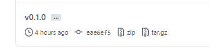
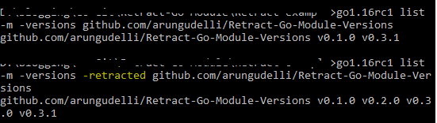
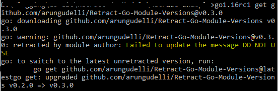

# Retract Go Module Versions in Go 1.16

- 原文地址：https://golangtutorial.dev/tips/retract-go-module-versions/
- 原文作者：Arunkumar Gudelli
- 本文永久链接：https:/github.com/gocn/translator/blob/master/2021/w8_go_retracting.md
- 译者：[咔叽咔叽](https:/github.com/watermelo)
- 校对：[]()


One of the cool feature of Go 1.16 is retracting Go Module versions.

## What is retracting?

So what is retracting?

If you search in Google we will get meanings like `draw back` or `withdraw`.

The word retract taken from academic literature

> A retracted research paper is still available, but it has problems and should not be the basis of future work

We will publish our Go modules to Github using versioning mechanism.

In one of the module version you did a mistake and released it to the produciton with the new version number(v0.1.0).

In the meanwhile you realised the mistake and published a new version with the fix(v0.2.0).

We cannot modify the code in v0.1.0 and few people might be using them.

And there is no way to tell the users that **Don’t use this version**.

> **Go 1.16 retract feature** solve this problem by tagging the version as **retract**.

Let’s go through an example to understand it further.

First check your Go version, I am using Go 1.16 RC1 version.

```
    go1.16rc1 version

    go version go1.16rc1 windows/amd64
```

Install Go 1.16RC1 as mentioned in the [Go-1.16 RC1 released](/news/g-1.16rc1-released/) article.

I have created a github repository for this demo.

```
    git clone https://github.com/arungudelli/Retract-Go-Module-Versions.git
```

And created a module called `hello` using Go 1.16 version

```
    go1.16rc1 mod init github.com/arungudelli/Retract-Go-Module-Versions

    go: creating new go.mod: module github.com/arungudelli/Retract-Go-Module-Versions
    go: to add module requirements and sums:
            go mod tidy
```

And it will generate `go.mod` file

```
    module github.com/arungudelli/Retract-Go-Module-Versions

    go 1.16
```

And created a file name `hello.go` with the following contents.

```golang
    package hello

    // Welcome Message
    func Welcome() string {
    	return "Hello, gophers From Go 1.16"
    }
```

My intial version is ready. So all I have to do is adding the tag to the module.

```
    >git tag v0.1.0
    >git push -q origin v0.1.0
```

Now in github we can see the versions.



Now To use this module, I have created a small `go` program, which will use the Welcome function in `hello.go` module.

```
    go1.16rc1 mod init gopher116
```

`go.mod` file

```
    module gopher116

    go 1.16
```

And in the `gopher116.go`

```golang
    package main

    import (
    	"fmt"

    	"github.com/arungudelli/Retract-Go-Module-Versions"
    )

    func main() {
    	fmt.Println(hello.Welcome())
    }
```

In the above code we are telling to

1.  Import the `github.com/arungudelliRetract-Go-Module-Versions` package,so we have a dependency on this package
2.  Use the fmt.Println to print the message return by the `hello.Welcome()`.

To add the dependency on the `github.com/arungudelliRetract-Go-Module-Versions` use the below command.

```
    >go1.16rc1 get github.com/arungudelli/Retract-Go-Module-Versions@v0.1.0

    go: downloading github.com/arungudelli/Retract-Go-Module-Versions v0.1.0
    go get: added github.com/arungudelli/Retract-Go-Module-Versions v0.1.0
```

Now run the program using `go run` command

```
    >go1.16rc1 run .

    //Hello, gophers From Go 1.16
```

## Releasing second better version

To send a better message to the gophers, `hello` module has been modified with the following code.

```
    package hello

    //Welcom message
    func Welcome() string {
    	return "Hello, gophers From Go 1.15"
    }
```

And published the package with the tag version 2 (v0.2.0).

```
    >git tag v0.2.0
    >git push -q origin v0.2.0

And our `gopher116` found out there is a new version released, upgraded the package

    > go1.16rc1 get github.com/arungudelli/Retract-Go-Module-Versions@v0.2.0
    go: downloading github.com/arungudelli/Retract-Go-Module-Versions v0.2.0
    go get: upgraded github.com/arungudelli/Retract-Go-Module-Versions v0.1.0 => v0.2.0
```

After running the application

```
    >go1.16rc1 run .

    //Hello, gophers From Go 1.15
```

A terrible mistake happened, `Go` version supposed to be `1.16` but changed to `1.15` in version 2.

## Retracting Go Module version

Go 1.16 comes with the rescue feature `retract`.

As a publisher We have to fix our code and inform the user about mistake happened in the version.

> **To mark a Go module version as retract use the ‘-retract’ flag**.

Modify the package `go.mod` file with `go mod edit` command following by -retract flag.

```
    go1.16rc1 mod edit -retract=v0.2.0
```

This will add retract version information in `go.mod` file.

```
    module github.com/arungudelli/Retract-Go-Module-Versions

    go 1.16

    retract v0.2.0
```

As a better practice add the comment above `retract` directive, why retracting necessary for this version.

```
    module github.com/arungudelli/Retract-Go-Module-Versions

    go 1.16

    // Mistake happened in the version DO NOT USE
    retract v0.2.0
```

Now publish the changes with the new version

```
    >git tag v0.3.0
    >git push -q origin v0.3.0
```

## Knowing retracted module versions in Go project

And our `gopher116` still using the version `v0.2.0`.

So to know the retratced module versions in Go, use `go list -m -u all` command.

```
    >go1.16rc1 list -m -u all
    gopher116
    github.com/arungudelli/Retract-Go-Module-Versions v0.2.0 (retracted) [v0.3.0]
```

Now the version 2.0 marked as `(retracted)`.

So we need to upgrade our module the version 3(v0.3.0).

```
    >go1.16rc1 get github.com/arungudelli/Retract-Go-Module-Versions@v0.3.0

    go: downloading github.com/arungudelli/Retract-Go-Module-Versions v0.3.0
    go get: upgraded github.com/arungudelli/Retract-Go-Module-Versions v0.2.0 => v0.3.0
```

And ran the program

```
    >go1.16rc1 run .

    //Hello, gophers From Go 1.15
```

And still it’s displayed the same old message.

Because in the version 3, I marked the version 2 as retracted but the code is not changed.

So again we need to mark the version 3 as retract.

## Retracting Multiple Go Module versions

Now edit the `go.mod` file and mark the version 3 as retracted using the below command.

```
    go1.16rc1 mod edit -retract=v0.3.0
```

Our new `go.mod` file.

```
    module github.com/arungudelli/Retract-Go-Module-Versions

    go 1.16

    retract (
        // Failed to update the message DO NOT USE
    	v0.3.0
    	// Mistake happened in the version DO NOT USE
    	v0.2.0
    )
```

Added the reason above version 3.

So to retract multiple versions add the module versions line by line inside `retract` directive.

And this time changed the message in `hello.go` file.

```golang
    package hello

    // Welcome Message
    func Welcome() string {
    	return "Hello, gophers From Go 1.16 verion"
    }
```

And published the version with the new tag.

```
    >git tag v0.3.1

    >git push -q origin v0.3.1
```

And our `gopher116` ran the `go list` command again to know the retracted packages.

```
    >go1.16rc1 list -m -u all

    gopher116
    github.com/arungudelli/Retract-Go-Module-Versions v0.3.0 (retracted) [v0.3.1]
```

And updated the package with the new version using `go get` command

```
    >go1.16rc1 get github.com/arungudelli/Retract-Go-Module-Versions@v0.3.1

    //go get: upgraded github.com/arungudelli/Retract-Go-Module-Versions v0.3.0 => v0.3.1
```

Now finally the message has been fixed

```
    >go1.16rc1 run .

    //Hello, gophers From Go 1.16 version
```

## Install latest unretracted Go Module version

It’s difficult to keep track of all versions of a Go Module.

So to install latest unretracted Go Module version use the `@latest` tag instead of version.

```
    >go1.16rc1 get github.com/arungudelli/Retract-Go-Module-Versions@latest

    go get: upgraded github.com/arungudelli/Retract-Go-Module-Versions v0.3.0 => v0.3.1
```

## Listing all versions of Go Modules

To list the all versions of a Go module or package use `go list` command.

```
    >go1.16rc1 list -m -versions github.com/arungudelli/Retract-Go-Module-Versions

    //OUTPUT
    github.com/arungudelli/Retract-Go-Module-Versions v0.1.0 v0.3.1
```

`go list -m -versions` command excludes retracted versions. (v0.2.0 and v0.3.0 are not visible)

## Listing all retracted versions of Go Modules

To list the all retracted versions of a Go Module, use the flag `-retracted` along with `go list` command.

```
    >go1.16rc1 list -m -versions -retracted github.com/arungudelli/Retract-Go-Module-Versions

    //OUTPUT
    github.com/arungudelli/Retract-Go-Module-Versions v0.1.0 v0.2.0 v0.3.0 v0.3.1
```

Retracted versions are included in the output.



## Installing Retracted Go Module versions

Even though we marked the versions as retracted, we can still download and use the packages.

For example if we try to install the retracted module version using `go get` command, It will show the warning messsage.

```
    go1.16rc1 get github.com/arungudelli/Retract-Go-Module-Versions@v0.2.0
    go: warning: github.com/arungudelli/Retract-Go-Module-Versions@v0.2.0: retracted by module author: Mistake happened in the version DO NOT USE
    go: to switch to the latest unretracted version, run:
            go get github.com/arungudelli/Retract-Go-Module-Versions@latestgo get: downgraded github.com/arungudelli/Retract-Go-Module-Versions v0.3.1 => v0.2.0
```



The message displayed will be the comment added above the retract version in `go.mod` file.

So while adding retracted versions give a meaningful message to the user.

You can download or clone the [repository of this demo](https://github.com/arungudelli/Retract-Go-Module-Versions).

```
    git clone https://github.com/arungudelli/Retract-Go-Module-Versions.git
```

I hope you enjoyed the article if so please share it with others.

Follow me on [twitter](https://twitter.com/arunGudelli) or [facebook](https://www.facebook.com/gudelliArun) or [github](https://github.com/arungudelli/) to get in touch with me.
