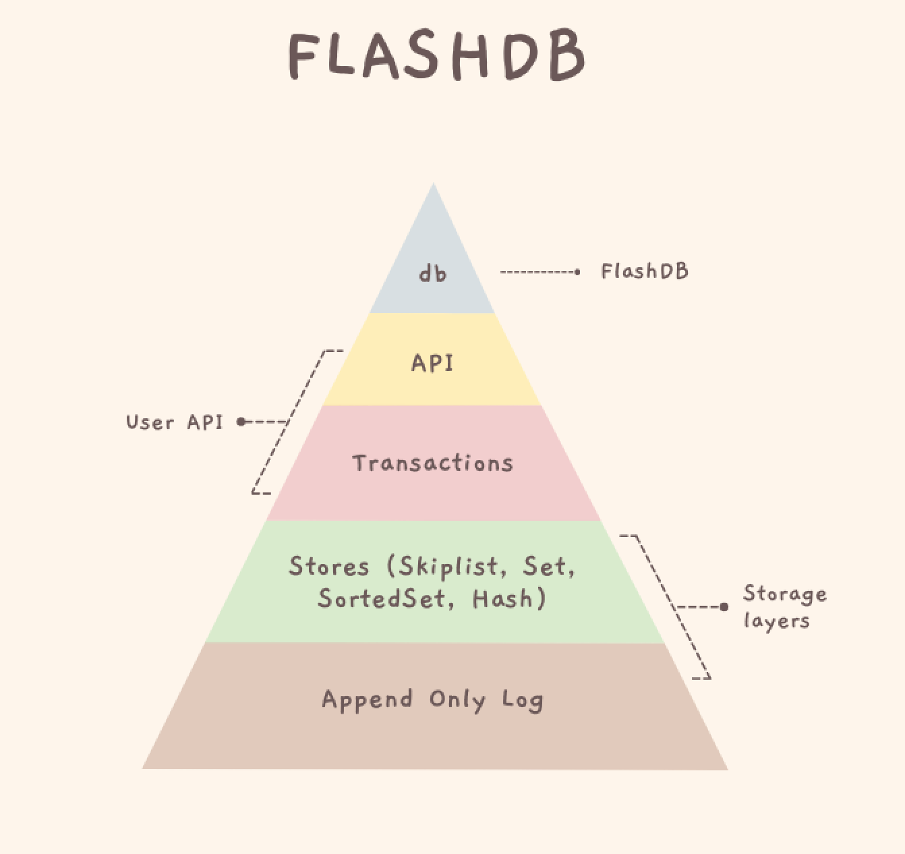

# 用 Go 编写一个简单的内存键值数据库

- 原文地址：https://aly.arriqaaq.com/building-a-database-in-go
- 原文作者：Farhan Aly
- 本文永久链接：https://github.com/gocn/translator/blob/master/2022/w17_Writing_a_simple_in-memory_key-value_Database_in_Go.md
- 译者：[张宇](https://github.com/pseudoyu)
- 校对：[小超人](https://github.com/xkkhy)

从 Postgres 到 Redis，再到 Prometheus，我们都使用并从事过各种数据库的开发。我花了很多时间来阅读其中一些数据库的源代码，对于那些像我一样好奇的少数人来说，他们有兴趣学习如何编写一个数据库。本书旨在记录这一过程。

[GitHub - arriqaaq/flashdb: FlashDB is an embeddable, in-memory key/value database in Go (with Redis like commands)](https://github.com/arriqaaq/flashdb)

## 内存数据库

与传统数据库的数据主要保存在机械硬盘或者固态硬盘不同的是, 内存数据库主要将数据保存在内存中。 内存数据库主要是通过消除对磁盘的访问来实现最小的响应时间，两者的不同主要体现在内存数据库是将数据保存在主存或者 RAM 中。然而, 传统的数据库则是通过驱动磁盘来获取数据。由于所有的数据都存储与管理在主存中，内存数据库相比传统的数据库更不稳定，因为当计算机断电或 RAM 崩溃时，数据将会丢失。内存数据库可以通过将每个操作存储在日志中或采取快照的方式在磁盘上持久化数据。

## 目标

我们的目标是用 Go 编写一个简单、快速、嵌入式和可持久化的键/值数据库，并且实现以下功能

- 支持类似 Redis 的数据结构：`string`,  `hash`, `set`, `zset`
- 具有低延时和高吞吐量
- 支持事务，ACID 语义
- [仅可写入的持久化文件](https://github.com/arriqaaq/flashdb#append-only-file)格式
- 可以通过使用 TTL 来处理[数据过期](https://github.com/arriqaaq/flashdb#data-expiration)

## 开始

我们的目的是建立一个非常简单的 KV（键/值）存储，以便让每个人都能轻松理解和实现。在 Go 中，有相当多的嵌入式键/值存储可用，以下是一些例子：

- [BadgerDB](https://github.com/dgraph-io/badger) - BadgerDB 是一个完全用 Go 编写的嵌入式、可持久化、简单而快速的键值（KV）数据库。它旨在成为 RocksDB 等非基于 Go 实现的键值存储的高性能替代品
- [BoltDB](https://github.com/boltdb/bolt) - BoltDB 是一个基于 B+ 树的嵌入式 Go 键/值数据库
- [BuntDB](https://github.com/tidwall/buntdb) - BuntDB 是一个应用于 Go 的嵌入式内存键/值数据库，具有自定义索引和地理空间支持
- [go-memdb](https://github.com/hashicorp/go-memdb) - 基于不可变基数树的 Golang 内存数据库
- [nutsdb](https://github.com/xujiajun/nutsdb) - 一个基于磁盘的键值存储

读起来比做起来容易，我们可以通过阅读庞大的代码库来了解其内部结构，但这对很多人来说是开始的障碍。[NutsDB](https://github.com/xujiajun/nutsdb) 是我在 2-3 年前读到的第一批简单易懂的代码之一。

因此，FlashDB 是由易于理解的组合库组成的。我们的想法是为任何想学习关于如何编写一个简单的 ACID 数据库的新手提供桥梁。

## 架构

FlashDB 的架构很简单并且支持各种 Redis 命令。Redis 本质上不是一个普通的键值存储，而是一个数据结构服务器，支持不同种类的值。事实上 Redis 使用以下数据结构实现了各种类型。

### 字符串

Redis 字符串类型是你能与 Redis 键关联的最简单的值类型。由于 Redis 键是字符串，当我们把字符串类型也作为一个值时，我们是把一个字符串映射到另一个字符串。这是用[可变基数树](https://github.com/arriqaaq/art)（ART）实现的，这样可以很容易进行扫描。

- [String](https://github.com/arriqaaq/skiplist)

### 哈希

用哈希表示对象很方便，而实际上哈希中可放入的字段数量并没有实际限制（除了可用的内存），所以你可以在应用程序中以许多不同的方式使用哈希。这是用一个非常简单的 HashMap 数据结构实现的。

- [Hash](https://github.com/arriqaaq/hash)

### 集合

Redis 集合是无序的字符串集合。我们可以对集合进行一些操作，比如检测某个元素是否已经存在，查找多个集合之间的交集、并集或差集等。这也是用一个简单的 HashMap 数据结构实现的。

- [Set](https://github.com/arriqaaq/set)

### 有序集合

有序集合是一种数据类型，类似于集合与哈希的混合体。和集合一样，有序集合也是由唯一的、不重复的字符串元素组成的。所以从某种意义上说，有序集合也是一个集合。

虽然集合内的元素并不是有序的，但有序集合中的每个元素都与一个浮点值相关，称为分数（该类型类似于哈希，因为每个元素都被映射到一个值）。

这是对用于字符串的跳表结构稍加修改实现的。

- [ZSet](https://github.com/arriqaaq/zset)

## 持久化

虽然已经有了很多持久化机制，我选择了一个简单的 append-only 日志设计方式，因为它比较容易实现和理解。**AOF**(仅可写入的文件)记录了服务器收到的每一个写操作，这些操作将在服务器启动时再重放，重建原始数据集。命令的记录格式与 API 协议本身相同，以只写入的方式进行。当日志过大时，FlashDB 能够在后台分片处理日志。这是基于 [wal](https://github.com/tidwall/wal) 实现的。

- [Append Only Log](https://github.com/arriqaaq/aol)

## 总结

综上，[FlashDB](https://github.com/arriqaaq/flashdb) 仅依靠上述五个简单的库就完成了，具有事务与 ACID 支持。它很易于理解，但我希望这对任何有兴趣学习如何编写数据库的人来说是一个有用的教程。

[GitHub - arriqaaq/flashdb: FlashDB is an embeddable, in-memory key/value database in Go (with Redis like commands)](https://github.com/arriqaaq/flashdb)

## 讲座

我最近在 Golang meetup 上分享了这个项目，这是幻灯片的内容。

[https://www.canva.com/design/DAE8sGRyC2o/ZCuCaezQ6dYA0Oq24QxjUQ/view?utm_content=DAE8sGRyC2o&utm_campaign=designshare&utm_medium=link&utm_source=publishsharelink](https://www.canva.com/design/DAE8sGRyC2o/ZCuCaezQ6dYA0Oq24QxjUQ/view?utm_content=DAE8sGRyC2o&utm_campaign=designshare&utm_medium=link&utm_source=publishsharelink)