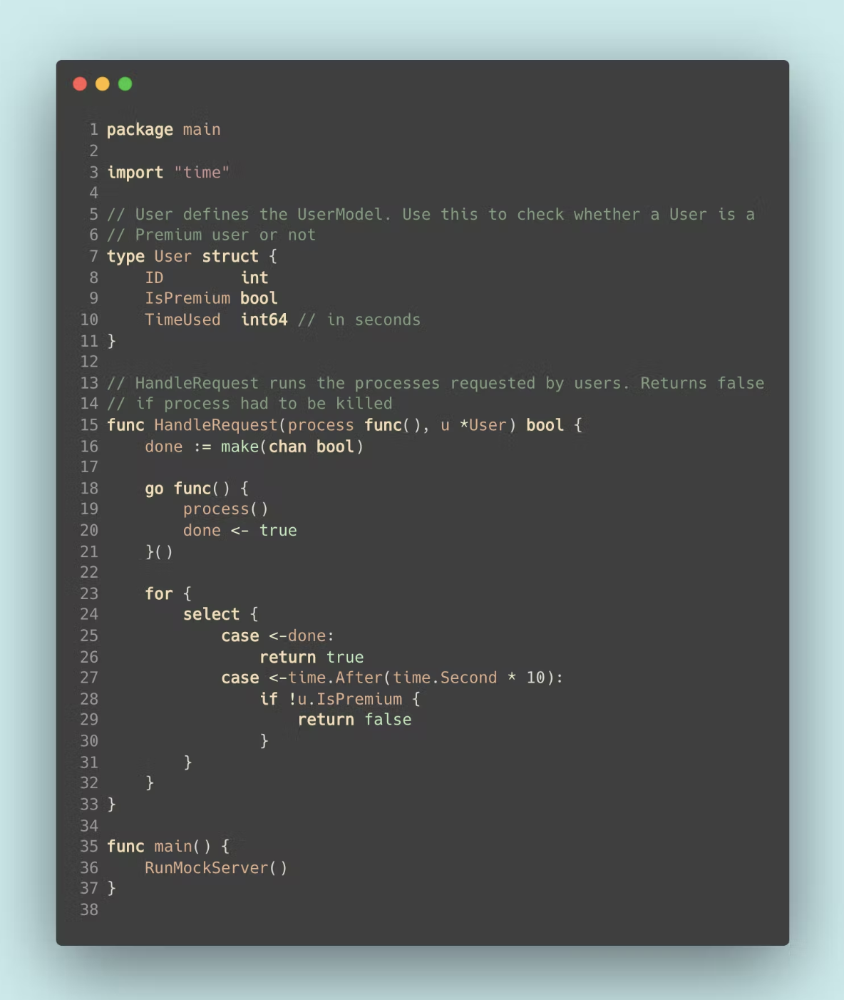

# 使用 GO 限制每个请求的时间

现在有这样一个场景，你将获得免费的视频处理服务。 每个人都将获得 10 秒的免费处理时间。 如果你不是付费用户，该服务将在 10 秒后终止你的进程。

这个问题有两种变体。 你可以限制每个请求为 10 秒，或者每个用户累计使用时长限制为 10 秒。

本文将讨论第一种，限制每个请求为 10 秒。

## 解决方案




如果10秒后用户还不是高级用户，请求将被终止。

## 关键要点

### 如何让代码超时

当你在Go中需要限制程序的执行时间时，你可以使用以下模式。

```go
// This code is taken from the book 
// Learning Go by Jon Bodner.
func timeLimit() (int, error) {
    var result int
    var err error

    done := make(chan struct{})

    go func() {
        result, err = doSomeWork()
        close(done)
    }

    select {
        case <-done:
            return result, err
        case <-time.After(2 * time.Second):
            return 0, errors.New("Timed out")
    }
}

```

当你想在 Go 中限制程序执行时间或让代码超时时，你会看到上述模式的许多变体。

在这个模式中，我使用了：

1.  `time.After` 函数在特定时间后将当前时间写入 channel 。

2.  `select` 语句，它将阻塞直到其中一个 case 可以运行。 如果可以运行多个 case ，它将随机选择一个。

这是我用来解决这个问题的模式。 唯一的区别是我将 select 块包装在一个 for 循环中，我将在后面解释。

### 上述我们使用的模式实际上并没有杀死 Goroutine

如果你在 goroutine 完成处理之前退出 `timeLimit`，goroutine 会继续运行。 你只是选择不对它（最终）返回的结果做任何事情。

如果你想停止 goroutine 中的工作，而不再希望等待其完成，请使用上下文取消。 但这将是另一篇文章的主题。

### Select 语句行为

`select` 语句让 goroutine 等待某些通信操作。 没有 `default` 语句的 `select` 语句会阻塞，直到其中一个 case 可以运行。

在这个问题中，你需要将 `select` 语句包装在 for 循环中，因为一旦收到来自定时器的消息，就可能需要等待进程完成。

```go
func HandleRequest(process func(), u *User) bool {
    ...
    for {
        select {
            case <-done:
                return true
            case <-time.After(time.Second * 10):
                if !u.IsPremium {
                    return false
                }
        }
    }
    ...
```

当`time.After`向 channel 发送消息时，你需要检查用户是否为高级用户。 如果用户是高级用户，则需要继续该过程直到完成。 通过将 select 语句放在 for 循环中，就可以再次执行 `select` 语句，在函数返回之前会等待 `done` channel 写入。

