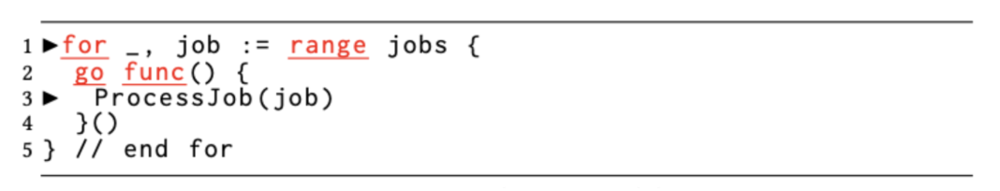
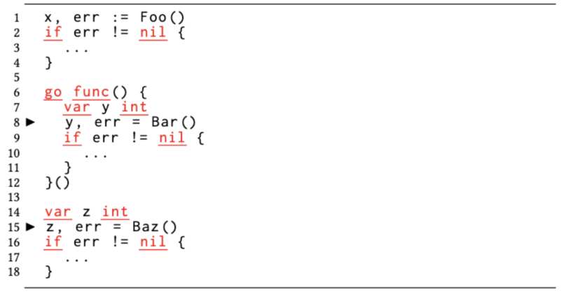
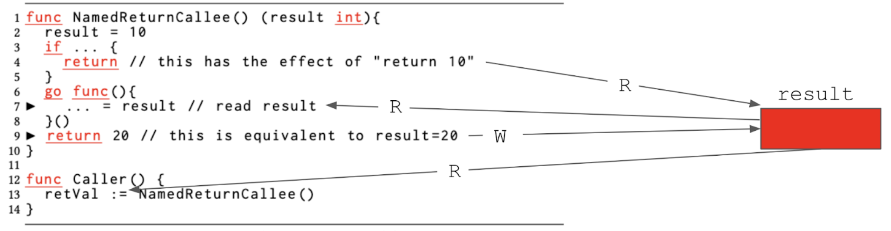
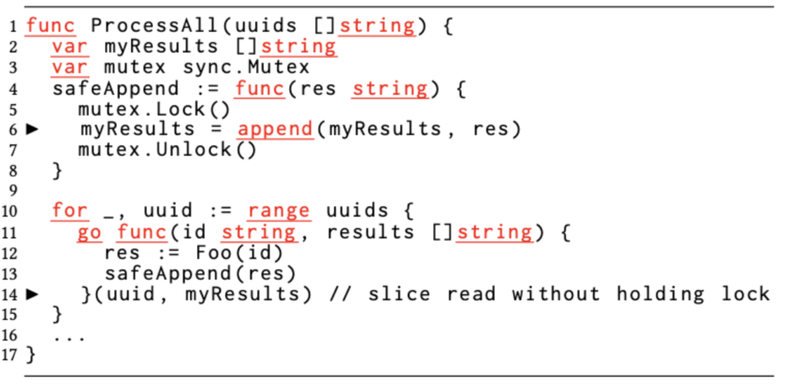
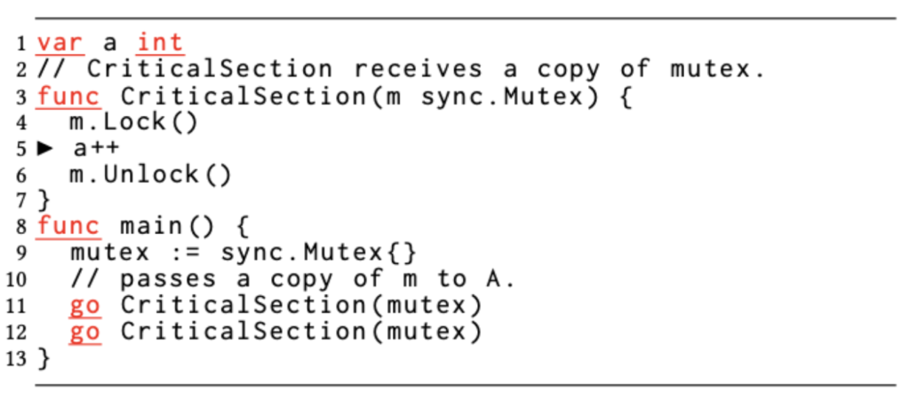
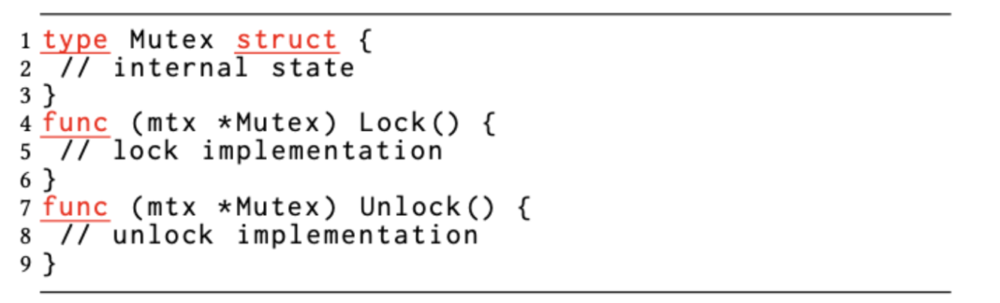
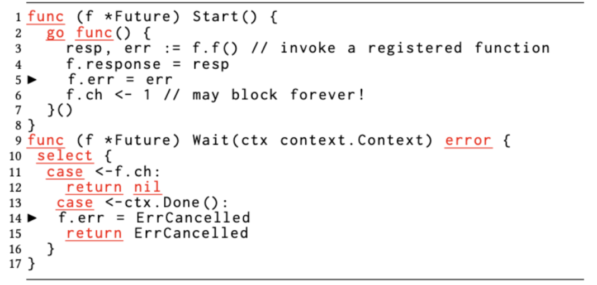
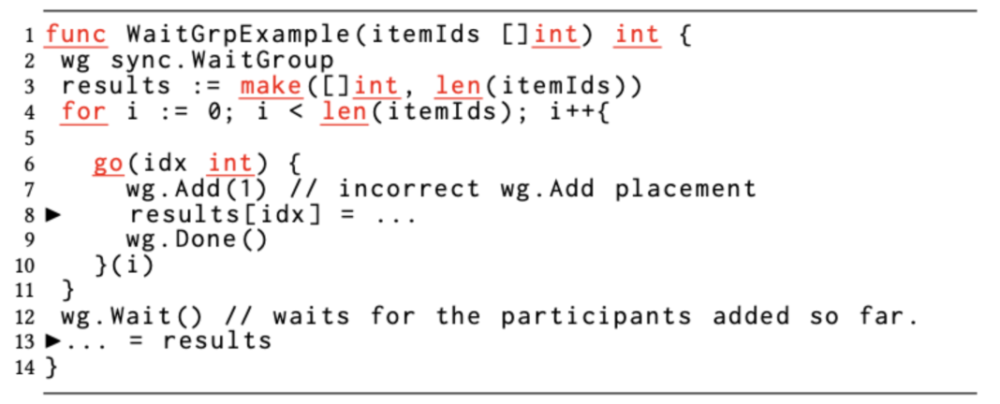
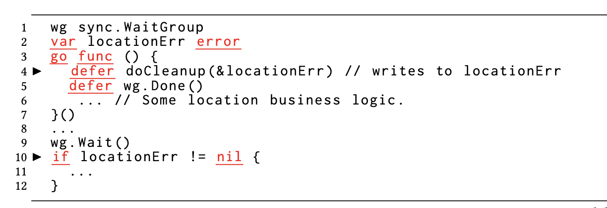
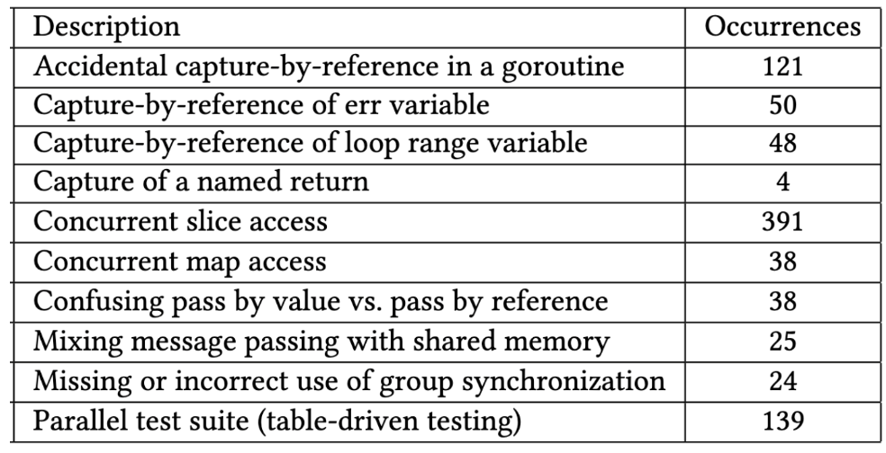

- 原文地址：https://eng.uber.com/data-race-patterns-in-go/
- 原文作者：[Milind Chabbi](https://eng.uber.com/author/milind-chabbi/) and [Murali Krishna Ramanathan](https://eng.uber.com/author/murali-ramanathan/)
- 本文永久链接：https://github.com/gocn/translator/blob/master/2022/w24_data_race_patterns_in_go.md
- 译者：[小超人](https://github.com/dijkvy)
- 校对：[zxmfke](https://github.com/zxmfke)

# Go 中的数据竞争模型

of code (and growing) and contains approximately 2,100 unique Go services (and growing).

Uber 把Golang(简称 Go)作为开发微服务的主要编程语言。我们的 Go monorepo 仓库中大约包含了 5000 万行代码(这个数量还在增长)，其中大约包含了 2100 个独立的 Go 服务(这个数量同样也在增长)。

并发作为 Go 中的一等公民；在函数调用之前使用 go 关键字就会以异步的方式调用。这些异步函数调用在 Go 中被称为 goroutines。开发者通过创建 goroutines 来缩短延迟时间（比如在 IO 或 RPC 调用等场景）。多个 goroutine 之间可以通过 ([channels](https://go101.org/article/channel.html) 来传递消息或者使用 [共享内存](https://en.wikipedia.org/wiki/Shared_memory#:~:text=In%20computer%20science%2C%20shared%20memory,of%20passing%20data%20between%20programs.
) ) 来进行通信。共享内存恰好是 Go 中最常用的通信方式。

Go 程序员可以随意使用 goroutines, 因为它们被认为是 "[轻量级](https://medium.com/the-polyglot-programmer/what-are-goroutines-and-how-do-they-actually-work-f2a734f6f991)" 并且创建 goroutines 
是一件很容易的事。最后，我们注意到，在使用 Go 编写的程序通常比使用其他语言编写的程序表现出更高的并发性能。例如，通过扫描运行我们数据中心的数十万个微服务实例，我们发现使用 Go 编写的微服务表现出的并发能力大约是 java 的 
8 倍。更高的并发也意味着可能发生更多并发错误。数据竞争是两个或者多个 goroutines 同时以无序并且至少有一个是以写的方式访问同一个数据时产生的并发错误。数据竞争是潜在的 bug，必须 [不惜一切代价避免](https://www.usenix.org/legacy/events/hotpar11/tech/final_files/Boehm.pdf)。

我们使用动态数据竞争检测技术开发了一个系统来检测 Uber 的数据竞争。这个系统在六个月的时间里，在我们的 Go 代码库中检测到大约 2,000 个数据竞争，其中我们的开发人员已经修复了大约 1,100 个数据竞争。

在这篇博客中，我们将展示我们在 Go 程序中发现的各种数据竞争模型。这项研究是通过分析 210 位独特的开发人员在六个月内修复的 1,100 多个数据竞争进行的。总的来说，我们注意到，由于某些语言设计选择，使得 Go 更容易引入数据竞争。其中语言特性和数据竞争之间存在复杂的相互作用。

## Go 中的数据竞争模型_

我们研究了由开发者修复的约 1,100 个数据竞争的问题，并将它们划分为不同的类别。我们对这些数据竞争的研究显示了导致 Go 数据竞争的一些常见模型和一些神秘的原因：

### 1. 在 Go 的设计中，goroutines 可以以引用的方式不加限制地捕捉自由引用变量是引发数据竞争的重要因素

嵌套函数（又称[闭包](https://go.dev/tour/moretypes/25)），在 Go 中可以通过引用的方式捕获所有自由变量。程序员不需要明确指定在闭包语法中捕获哪些自由变量。

这种使用模式与 Java 和 C ++ 不同。Java [lambdas](https://docs.oracle.com/javase/tutorial/java/javaOO/lambdaexpressions.html) 只能够捕捉值，他们有意识地采取了该设计选择来避免并发错误 [[1](https://www.baeldung.com/java-lambda-effectively-final-local-variables), [2](http://www.lambdafaq.org/what-are-the-reasons-for-the-restriction-to-effective-immutability/)]。C ++ 要求开发者明确指定按值还是引用的方式指定捕获方式。

尤其是在大闭包的情况下, 开发者通常不知道闭包内部使用的变量是通过引用方式捕获的自由变量。很多时候，Go 开发者通常会使用闭包函数作为 goroutines。由于使用引用捕捉和并发执行 goroutine, 除非有显式的同步操作，否则 Go 程序最终会以无序访问这些自由变量。我们用下面三个示例证明了这一点：

示例 1：在循环中捕捉临时变量引起的数据竞争

图 1A 中的代码显示了迭代 Go  `jobs` 切片并通过 `ProcessJob` 函数处理每个 `job` 变量。

在这里，开发者将耗时的 `ProcessJob` 函数包装在匿名函数中，并且在每次循环遍历的时候都以 goroutine 的方式启动。但是，在循环中是在 goroutine 内部通过引用的方式来捕捉变量 `job`。当第一个循环迭代启动的 goroutine 访问了变量 `job` 时，父 goroutine 中的 for 循环将通过 slice 前进并更新变量 `job` 的值，以指向 slice 中的第二个元素，从而导致数据竞争。这种类型的数据竞争发生在循环体中对传值和引用类型元素进行读和写访问(包括切片，数组和 map)。Go 推荐一个编码习惯来隐藏和私有化循环体中的循环索引变量，很遗憾，开发者并不总是遵守这些规范。

示例 2：由于习惯捕获错误而引发的数据竞争。

图 1B：由于习惯捕获错误而引发的数据竞争。

Go [提倡函数有多个返回值](https://www.digitalocean.com/community/tutorials/handling-errors-in-go)。实际上，如图 1B 所示，函数除了实际的返回值以外，还会返回一个用于指示是否发生错误的错误对象。仅当错误值为 `nil` 时，实际的返回值才会被认为是有意义的。一种常见的做法是将返回的错误对象分配给名称为 `err` 的变量，然后检查其零值。但是，由于可以在函数主体内调用多个返回错误的函数，因此每次都会对 `err` 变量进行多次赋值，然后每次进行空值检查。当开发者将此惯用方式与 goroutine 混合在一起时，在闭包中通过引用捕获 `err`
。最终，在闭包函数（或多个 goroutine 实例）中对相同的 `err` 变量同时读取并将其写入，这就会导致数据竞争。

示例 3：由于捕捉命名返回变量而引起的数据竞争。

图 1C：由于捕捉命名返回变量而引起的数据竞争。

Go 引入了一种 [命名返回值](https://yourbasic.org/golang/named-return-values-parameters/)
的语法糖。命名返回变量被看作是定义在函数顶部的变量，其作用范围超出了函数的主体。函数的返回分两种，没有参数的返回语句的裸返回和命名的返回值。在存在闭包的情况下，将正常（非裸返回）返回值与命名返回混合使用或在命名返回的函数中使用延迟返回是有风险的，因为它会引入数据竞争。

图 1C 中名为 `NamedReturnCallee` 的函数返回名为 `result` 的整型值。由于这个语法的特性，在函数体中都可以对 `result` 变量进行读写操作。如果该函数在第 4 行裸返回第 2 行的分配 `result = 10` 的结果，则第 13 行的 `Caller` 将看到返回值为 10。编译器将会复制 `result` 的值并赋值给变量 `retVal`。如第 9
行所示，命名的返回函数还可以使用标准返回语法。这种情况下，编译器会将 20 赋值给命名返回变量 `result`。第 6 行创建了一个 goroutine，该 goroutine 捕获了命名的返回变量 `result`。在编写这个 goroutine 时，即使是并发专家也可能会认为，第 7 行的读操作是安全的，因为没有其他地方对同一个变量进行写入操作。毕竟，第 9 行上的语句返回常量 20 ，并且似乎没有触及命名的返回变量结果。但是，像前面所说的一样，这份代码，将 `return 20` 这个语句转换为写入结果。现在我们突然对共享结果变量进行并发读取和写入，这是数据竞争的一种情况。

### 2.切片令人困惑的类型，产生出微妙而难以诊断的数据竞争

[切片](https://go.dev/ref/spec#Slice_types)
是一种动态数组的引用类型。一个[切片](https://dev.to/herocod3r/understanding-slices-and-the-internals-in-go-4hb1)
内部包含指向基础数组的指针，当前长度和基础数组可以扩展的最大容量。为了易于讨论，我们将这些变量称为切片的元字段。切片上的一个常见操作是通过追加数据操作而使它扩容。当大小达到容量时，进行了新的分配（例如，有可能是当前 len 的两倍），并更新了元字段的值。当多个 goroutines 同时访问切片时，自然可以通过 `mutex` 访问这些受保护的信息。

图 2：即使在使用锁后，切片也有可能产生数据竞争。

在图 2 中，开发者认为，第 6 行使用锁对切片进行 append 操作足以避免数据竞争。但是，当将切片作为参数传递给第 14 行的 goroutine 时，就会发生数据竞争，而这并未受到锁的保护。goroutine 的调用导致切片的元字段从调用方（第 14 行）拷贝到 `Callee`（第 11 行）。鉴于切片是一种引用类型，开发者假设其通过（拷贝）向 `Callee` 引起了数据竞争。但是，切片与指针类型不同（元字段按值拷贝），因此是微妙的数据竞争。

### 3.同时访问 Go 内置的线程不安全的 map 会导致频繁的数据竞争

图 3：由于并发访问 map 而引起的数据竞争。

哈希表（[map](https://go.dev/blog/maps)）是 Go 中内置的非线程安全的数据结构。如果多个 goroutines 同时访问同一哈希表，其中至少一个试图修改哈希表（插入或删除其中的数据)，就会出现数据竞争问题。我们观察到开发者做出了一个基本但普遍的假设（这是一个错误的假设），即哈希表中的不同条目可以同时访问。这种假设源于开发者用于哈希表访问的 `table[key]` 语法并将它们误解为访问不相交的元素。但是，和数组或切片不同，map
（哈希表）是稀疏的数据结构，访问一个元素可能会导致访问另一个元素。如果在同一过程中发生另一个插入/删除，它将修改稀疏数据结构并引起数据竞争。我们甚至发现了更复杂的并发访问哈希表引起的数据竞争，原因是同一个哈希表被传递到深度调用路径，并且开发者忘记了这些调用路径通过异步的 goroutine 改变哈希表的事实。图 3 显示了此类数据竞争的示例。

虽然哈希表导致的数据竞争并不是 Go 独有的，但以下原因使其更容易在 Go 中发生数据竞争：

1. Go 开发者比其他语言的开发者更频繁地使用 map，因为 map 是语言内置的数据结构。例如，在我们的 Java 存储库中，我们发现每个 MLoC 有 4,389 个 map 结构，而 Go 同样是每 MLoC 5,950，高出 1.
   34 倍。

2. 哈希表访问语法就像数组访问语法（与 Java 的 get/put API 不同）一样，使其易于使用，这种访问语法不出意外地混淆了对数据结构的随机访问。在 Go 中，可以使用 `table[key]`
语法轻松查询不存在的 map 元素，该语法只需返回默认值而不会产生任何错误。这种容错性让开发者在 Go 中使用 map 时感到很满意。

### 4. Go 开发者经常在传递值（或在方法上传值）方面犯错，这可能导致非比寻常的数据竞争

按值传递语义是 Go [推荐](https://goinbigdata.com/golang-pass-by-pointer-vs-pass-by-value/)
，因为它简化了逃逸分析并为变量提供了更好的在栈上分配的机会，这减少了垃圾回收的压力。

和 Java 中所有对象都是引用类型不同的是，在 Go 中，对象可以是值类型（struct）或引用类型（接口）。这两者在语法方面没有差异，但是这会导致不正确使用同步结构体，例如 `sync.Mutex` 和 `sync.
RWMutex`，在是 Go 中的值类型（结构）。如果一个函数创建了一个互斥体结构并以传值的方式给多个 goroutine 调用，这些并发执行的 goroutine 在不共享内部状态的互斥对象上执行操作。如下图 4 所示，这会破坏对受保护的共享内存区域的互斥访问。

图 4A：由于方法调用按引用或按指针引起的数据竞争。

图 4B：`Sync.Mutex` 的 `Lock`/`Unlock` 签名。

由于 Go 语法对于在指针和值上调用方法是相同的，因此开发者不太关注 `m.Lock()` 使用的是拷贝而不是指针的问题。调用者仍然可以在互斥量值上调用这些 API，并且编译器会透明地使用传地址的方式调用。如果不存在这种透明度，则该错误可能会被编译器检测为类型不匹配的错误。

当开发者意外地实现了一个方法，其中接收者是指向结构的指针而不是结构的值拷贝时，就会发生与这种情况相反的情况。在这钟情况下，调用这个方法的多个 goroutine 最终会意外地共享结构的相同内部状态，而可能不是开发者开发者想要的。在这里，调用者也没有意识到值类型在接收者被透明地转换为指针类型。

### 5.混合使用(通道)消息传递和共享内存会使代码变得复杂并且容易受到数据竞争的影响

图 5：将消息传递与共享内存同时使用引起的数据竞争。

图 5 显示的是一个由开发者使用 `channel` 的信号和等待机制实现的一个泛型的 [future](https://docs.oracle.com/javase/7/docs/api/java/util/concurrent/Future.html)。这个 Future 可以通过调用 `Start()` 方法来启动，并且可以通过调用 Future 的 `Wait()` 方法来阻塞直到 Future 的完成。`Start()` 方法创建一个 goroutine，它执行注册到 Future 的函数并记录其返回值（响应和错误）。 goroutine 通过在通道 ch 上发送一条消息来向 `Wait()` 方法发出 future 完成的信号，如第 6 行所示。对称地，`Wait()` 方法阻塞以从 channel 中获取消息（第 11 行）。

Go 中的 [Contexts](https://pkg.go.dev/context) 在横跨 API 和进程之间携带截止日期、取消信号和其他请求相关的值。这种为任务设置截止时间的做法在微服务开发中很常见。因此，`Wait()` 
在上下文被取消（第 13 行）或 阻塞直到 future 完成（第 11 行）。此外，`Wait()` 包含在 [select](https://go.dev/ref/spec#Select_statements) 语句（第 10 行）中，这个语句会阻塞，直到至少有一个分支是 ready 状态的。

如果上下文超时，则相应的案例在第 14 行将 Future 的 err 字段记录为 `ErrCancelled`。这个对 err 的写入与第 5 行对 future 相同变量的写入竞争。

### 6. `sync.WaitGroup` 为 Go 在其组同步结构中提供了更多选择，但 `Add/Done` 方法的不正确使用也会导致数据竞争

图 6A：由于 `WaitGroup.Add()` 使用不正确导致的数据竞争。

[sync.WaitGroup](https://pkg.go.dev/sync#WaitGroup) 结构是 Go 中的组同步结构。不同于 [C++ 屏障](https://en.cppreference.com/w/cpp/thread/barrier)，[pthreads](https://pubs.opengroup.org/onlinepubs/009696899/functions/pthread_barrier_init.html) 或 Java [屏障](https://docs.oracle.com/javase/7/docs/api/java/util/concurrent/CyclicBarrier.html) 或 [latch](<https://docs.oracle.com/javase/7/docs/api/java/util/concurrent/CountDownLatch.html>) 结构，`WaitGroup` 中的参与者数量不是在构造时确定的，而是动态更新的。在 `WaitGroup` 对象上允许进行三种操作 - `Add(int)`、`Done()` 和 `Wait()`。 `Add()` 增加参与者的 `count` 值，并且 `Wait()` 阻塞直到 `Done()` 被调用 `count` 次（通常每个参与者都会调用一次）。 `WaitGroup` 在 Go 中被广泛使用。如表 1 所示，Go 中的组同步比 Java 高 1.9 倍。

在图 6 中，开发者打算创建与切片 `itemId` 中的元素数量一样多的 goroutine 来同时处理这些 `item`。每个 goroutine 在不同索引的结果切片中记录其成功或失败状态，并在第 12 行记录父功能块，直到所有 goroutine 完成。然后它依次访问结果的所有元素以计算成功处理的数量。

为了使此代码正常工作，当在第 12 行调用 `Wait()` 时，注册参与者的数量必须已经等于 `itemIds` 的长度。仅当 wg.Add(1) 在调用 wg.Wait() 之前执行的次数与 itemIds 的长度一样多时才有可能，这意味着 wg.Add(1) 应该在每个 goroutine 之前放置在第 5 行调用。但是，开发者在第 7 行错误地将 `wg.Add(1)` 放置在 goroutine 的主体中，这不能保证在外部函数 `WaitGrpExample` 调用 `Wait()` 时已经执行。因此，调用 `Wait()` 时，注册到 `WaitGroup` 的 `itemId` 的长度可能会少于此长度。出于这个原因，`Wait()` 可以提前解除阻塞，并且 `WaitGrpExample` 函数可以开始从切片结果中读取（第 13 行），同时一些 goroutine 正在同时写入同一个切片。

我们还发现过早将调用 `Waitgroup` 上的 `wg.Done()` 方法会导致数据竞争。如下图 B 所示，过早地调用 `wg.Done()` 与 Go 的 defer 语句交互的结果的微妙版本。当遇到多个 defer 语句时，按照后进先出的顺序执行。在这里，第 9 行的 `wg.Wait()` 在 `doCleanup()` 运行之前完成。父 goroutine 在第 10 行访问 `locationErr`，而子 goroutine 可能仍在延迟的 `doCleanup()` 函数内写入 `locationErr`（为简洁起见并未显示）。

图 6B：由于 defer 语句调用`WaitGroup.Done()` 顺序导致的数据竞争错误。

### 7.为 Go 的表驱动测试套件用法并行运行测试通常会导致生产或测试代码中的数据竞争

[测试](https://pkg.go.dev/testing) 是 Go 中的内置功能。带有后缀`_test.go` 的文件中的前缀测试的任何功能都可以通过 Go 构建系统作为测试运行。如果测试代码调用 API `testing.T.Parallel()` ，Go 会并发运行这些测试用例。我们发现，由于这种并发执行的测试引发了大量的数据竞争。这些数据竞争的根本原因有时是在测试代码中，有时是在生产代码中。另外，在单个测试函数中，Go
开发者通常会编写许多子测验，并通过 Go 提供的测试工具软件包执行它们。 Go
建议使用[表格驱动测试习惯](https://dave.cheney.net/2019/05/07/prefer-table-driven-tests)
来编写和运行一个测试套件。我们的系统并行地执行我们开发者编写的数十个或者数百个自测试时。这个习惯用法成为测试套件问题的根源，开发人员要么假设串行测试执行，要么忘记在大型复杂测试套件中使用共享对象。当生产 API 编写时没有线程安全（可能是因为不需要它），但被并行调用时，也会出现问题，这违反了假设。

## 总结

我们分析了修复的数据竞争问题，以对其背后的原因进行分类。这些问题被列为如下。这些标签并不是互斥的。

图 7：数据竞争的摘要。

从此链接获得了每个数据竞争模式的一个示例。

总而言之，根据观察到的（包括已经修复的）数据竞争，我们详细阐述了在 Go 程序中更加容易引入数据竞争问题的范式。我们希望我们在 Go 中进行数据竞争的经验帮助 Go 开发者更多地关注编写巧妙的并发代码。未来的编程语言设计师应仔细权衡不同的语言功能和编码习惯，减少创建常见和隐蔽的并发问题。

### 不足

本文的讨论是基于我们在 Uber 的 Go Monorepo 中进行数据竞争的经验，并且可能错过了其他可能发生数据竞争的模式。同样，由于动态竞争检测并未检测到由于代码和交织的覆盖而无法检测到所有有可能引起的数据竞争问题，因此我们的讨论可能错过了一些数据竞争模式。尽管对我们结果的普遍性有这些不足，但本文和部署经验中有关模式的讨论独立存在。

这是有关我们在 GO 代码中数据竞争的经验的两部分博客文章系列中的第二个。我们的经验的详尽版本将出现在 ACM Sigplan 编程语言设计与实施（PLDI），2022 年。在博客系列的第一部分中，我们讨论了与以 GO 代码为大规模部署动态竞争检测有关的学习。
