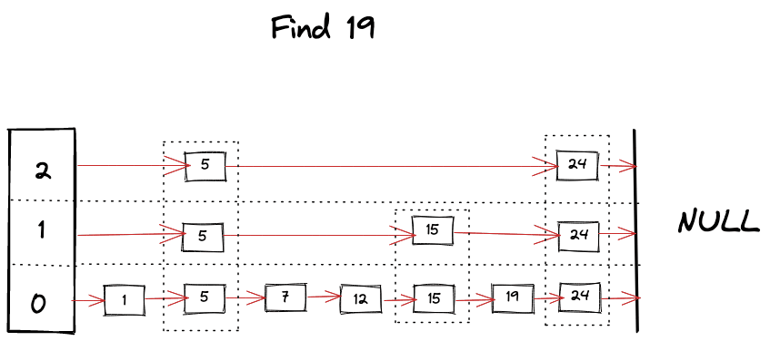
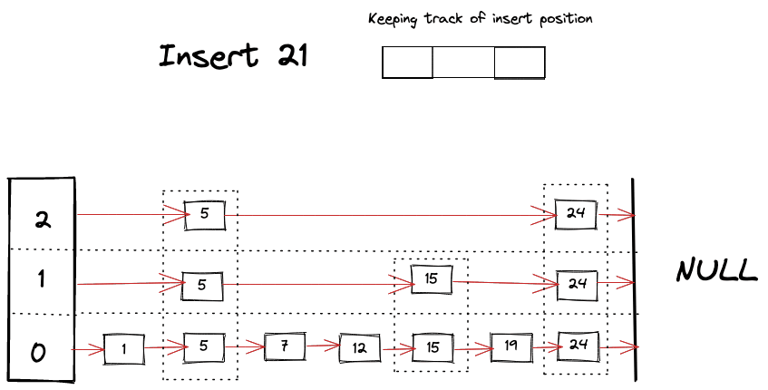
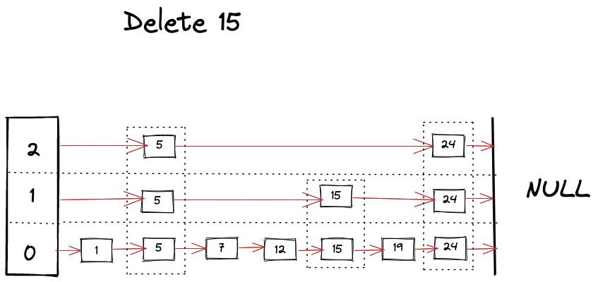
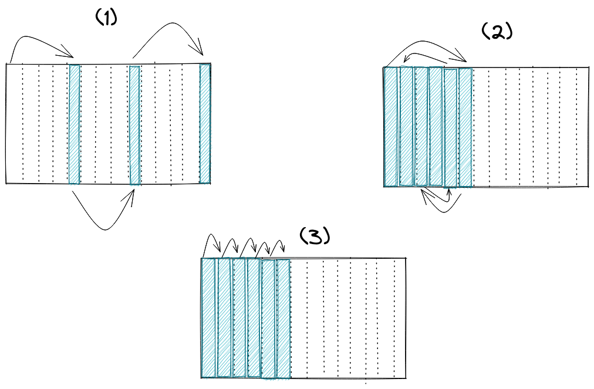
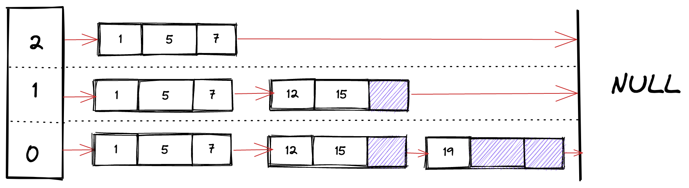

# Let's talk SkipList
# 聊一聊跳表数据结构
- 原文地址：https://ketansingh.me/posts/lets-talk-skiplist/
- 原文作者：ketansingh
- 本文永久链接：https://github.com/gocn/translator/blob/master/2022/w34_Let's_talk_skiplist.md
- 译者：[haoheipi](https://github.com/haoheipi)
- 校对：[]()

## 背景

在讨论那些“不著名”的数据结构时，跳表经常会出现。但实际上它们并没有那么默默无闻，事实上许多生产级软件都在积极地使用它们。在这篇文章中，我将描述如何制作一个玩具式的实现，以及潜在的性能优化和它们在现实世界中的使用案例，通过这三方面来探讨跳表。
那么什么是跳表呢？跳表是一种指向性的数据结构，它的灵感来自链表和二叉树。它们是排列在不同层级上的排序链表的集合，其中层级在设计上允许跳过部分节点，以便在后面搜索键时获得对数的复杂度。它们是二叉树的替代品，甚至在某些情况下就是 B 树，事实上，跳表的最后一层看起来有点像 B+ 树。对于需要有序存储或快速查找的随机负载，跳表的执行性能非常好。跳表不同层级的构建本质上是基于概率的，因此如果底层的随机算法不够均匀，这些层级上的列表便很容易变得不平衡。
与 Hashmap 和 Tree 相比，跳表通常更容易实现，这使它们成为理想的替代选择，特别是当只需要在内存中查找时。为什么要使用跳表?首先，查找、删除和插入具有对数的时间复杂度。其次，这些操作是相对非常容易实现的，因为不需要重新平衡树(如 RB 树，AVL 树，B+ 树)或调整容器大小(如 HashMaps)。最后，线程安全的实现也不太复杂，与其他有序集合相比，有锁和无锁的并发实现通常内存占用也比较低。

让我们试着用图来窥视一下跳表。


这个图本质上代表了按键的顺序组织的链表数据结构的集合。其中有不同的层级，它们按照有序的顺序包含前一级别的元素子集。通常相同节点没有多个副本，它只是一种在不同级别表示相同节点的方法，但这可能取决于具体实现。例如在图中，存在于所有层级上的 `Node 5` 连接到了 `Node 24、Node 15、Node 7`。它可能看起来有多个副本，但它是同一个节点，只是具有不同级别的多个连接。


# 玩具实现

对于实现，我将使用带有泛型的 Go ，因为我已经想使用它们一段时间了，没有一个比泛型类型安全的集合更好的用例了。使用泛型通常需要约束或特征(如 rustacans 所说)，我在标准库中找不到约束来强制元素顺序，所以我使用了 [golang.org/x/exp/constraints](https://pkg.go.dev/golang.org/x/exp/constraints) 包，它提供了 `Ordered` 约束，这将为我们提供一种比较方法，并在跳表中保持它们的排序。

## 数据结构

让我们定义一个结构体来存储单个节点的键和值

```golang
type Record[K constraints.Ordered, V any] struct {  
   Key   K  
   Value V  
}
```

然后是节点本身

```golang
type SkipNode[K constraints.Ordered, V any] struct {  
   record  *Record[K, V]  
   forward []*SkipNode[K, V]  
}
```

注意 `forward[i]` 表示在 `第 i 层级` 的列表中的下一个成员。例如，在上图中，`Node 5` 的 `forward[0]` 将指针指向 `Node 7`，`forward[1]` 指向 `Node 15`，`foward[2]` 指向 `Node 24`。

一旦我们有了这些结构体定义，我们就可以定义构造函数来帮助我们快速构建结构

```golang
func NewRecord[K constraints.Ordered, V any](key K, value V) *Record[K, V] {  
   return &Record[K, V]{  
      Key:   key,  
      Value: value,  
   }  
}  

func NewSkipNode[K constraints.Ordered, V any](key K, value V, level int) *SkipNode[K, V] {  
   return &SkipNode[K, V]{  
      record:  NewRecord(key, value),  
      forward: make([]*SkipNode[K, V], level+1),  
   }  
}
```

最后如下所示，我们可以编写跳表结构体

```golang
type SkipList[K constraints.Ordered, V any] struct {  
   head  *SkipNode[K, V]  
   level int  
   size  int  
}
```

我们需要头部节点，它本质上是用一个 `虚拟节点` 来帮助我们保持与跳表剩余部分的连接，`size` 是跳表中的元素数量，`levels` 是当前跳表中的层级数量，这将在稍后用于 `插入` 和 `查找` 操作。最后，为了构造跳表，我们可以编写这样的函数

```golang
func NewSkipList[K constraints.Ordered, V any]() *SkipList[K, V] {  
   return &SkipList[K, V]{  
      head:  NewSkipNode[K, V](new(K), new(V), 0),  
      level: -1,  
      size:  0,  
   }  
}
```

## 查找操作

查找操作是跳表中几乎所有操作的核心算法。这很像二分搜索，但在每层的链表中，当我们在搜索中遇到 `障碍` 时，我们开始寻找下面的层级，并利用跳表的有序和分层结构，得以跳过许多节点。算法可以总结如下

- 从跳表的顶层开始查找 key。
- 只要当前 key 比要找的 key 小，就在同一个层级继续向前查找。
- 如果碰巧找到了 key，则返回它的值。
- 如果下一个 key 比目标 key 大，那么就开始查找下面的层级。

```golang
func (s *SkipList[K, V]) Find(key K) (V, bool) {  
   x := s.head  
  
   for i := s.level; i >= 0; i-- {  
  
      for {  
         if x.forward[i] == nil || x.forward[i].record.Key > key {  
            break  
         } else if x.forward[i].record.Key == key {  
            return x.forward[i].record.Value, true  
         } else {  
            x = x.forward[i]  
         }  
      }  
   }  
  
   return *new(V), false    
}
```

我们可以想象在寻找 key 时发生的事情



## 插入操作

为了执行对跳表的插入，我们需要几个 `helper` 方法。首先是确定新节点的层级。在我们的实现中，我们使用了朴素的概率方法，即使用随机函数来选择层级，层级的概率是 `2^(-L-1)`。这在大多数情况下是可行的，并且非常容易实现，但它的效率取决于随机函数的好坏。它可能总是选择层级 0。理想情况下，我们希望从跳表得到的是节点数比它下面级别少一半，以便充分利用二分搜索的优势。

```golang
func (s *SkipList[K, V]) getRandomLevel() int {  
   level := 0  
   for rand.Int31()%2 == 0 {  
      level += 1  
   }  
   return level  
}  
```

第二个是 `adjustLevel`，这个方法负责增加跳表头部的前向指针数组大小，以便能够保存新层级的指针，以防新节点的层级大于跳表当前所包含的层级。我们并不关心在头节点记录中存储的键值，这就是为什么我用 `*new(K)， *new(V)` 来存储空值的原因。我也可以存储 nil 指针，但这样也行。

```golang
func (s *SkipList[K, V]) adjustLevel(level int) {  
   temp := s.head.forward  
   
   s.head = NewSkipNode(*new(K), *new(V), level)
   s.level = level  
   
   copy(s.head.forward, temp)  
}
```

插入建立在我们前面描述的 `helper` 方法和 Find 操作的基础上。它可以总结为以下步骤

- 为新节点指定一个层级
- 调整跳表头部的大小，以便能够存储指定层级的指针
- 通过比较 key 开始在每一层寻找新节点的适当位置，同时开始为新节点构建 `next` 指针数组。当继续往下走的时候就这样做。
- 更新指针以将新节点插入到正确的位置。

```golang
func (s *SkipList[K, V]) Insert(key K, value V) {   
   newLevel := s.getRandomLevel()  
  
   if newLevel > s.level {  
      s.adjustLevel(newLevel)  
   }  
  
   newNode := NewSkipNode[K, V](key, value, newLevel)  
   updates := make([]*SkipNode[K, V], newLevel+1)  
   x := s.head  
  
   for i := s.level; i >= 0; i-- {  
      for x.forward[i] != nil && x.forward[i].record.Key < key {  
         x = x.forward[i]  
      }  
      updates[i] = x  
   }  
  
   for i := 0; i <= newLevel; i++ {  
      newNode.forward[i] = updates[i].forward[i]  
      updates[i].forward[i] = newNode  
   }
   
   s.size += 1
}
```

我们可以想象在寻找 key 时发生的事情



## Delete Operation
## 删除操作

删除操作与查找操作非常相似，只需在查找不同层级的键时不断删除引用。

```golang
func (s *SkipList[K, V]) Delete(key K) {  
  
   x := s.head  
  
   for i := s.level; i >= 0; i-- {  
      for {  
         if x.forward[i] == nil || x.forward[i].record.Key > key {  
            break  
         } else if x.forward[i].record.Key == key {  
            x.forward[i] = x.forward[i].forward[i]  
         } else {  
            x = x.forward[i]  
         }  
      }  
   }  
}
```

如下所示，我们可以想象删除操作过程。




# 性能优化

## 内存访问 

与链表或二叉树一样，跳表不是缓存友好型的。大多数现代 CPU 都试图预测未来会使用哪些内存。最常见的[算法](https://en.wikipedia.org/wiki/Cache_prefetching)是，它假设程序将请求大块连续的数据(如数组)，所以它试图按预期将连续的内存块加载到缓存行，但链表节点不一定连续，这将导致[在 CPU 缓存无用数据](https://en.wikipedia.org/wiki/Thrashing_(computer_science))，因为只有几个块是相关的，其余的空间将被浪费，下一个节点可能位于完全不同的内存块中。数组最适合在 L1 中缓存，但是对于链表，不能保证下一个节点能在缓存中匹配，甚至不能保证 L2 或 L3 缓存中能匹配到，这取决于内存分配器的表现。

如果我们看一下下图中的访存延迟时间，就可以清楚地看到如果缓存失效太频繁，性能会有多糟糕。这意味着访问列表中的不同节点可能比访问数组中的下一个元素要慢 100-200 倍。


## 使用共享内存分配器

通常情况下，跳表或链表的问题根源在于缓存不友好的内存访问模式。让我们看看高效分配内存是如何帮助我们提高性能的。



从在上图中可以看到,内存分配可以采取三种形式

(1) 是分配器分配随机分布的内存块。(2)是分配器分配连续但没有按列表指针的正确顺序的内存块。(3)是指分配器分配连续且符合列表访问模式的内存块。

为简单实现分配的内存很有可能看起来像(1)这样，基本上表示分布在各处的内存块。对链表下一个节点的任何访问都将是缓存不友好的。如果我们使用内存池或共享分配器，我们可以使用类似(2)的语句。节点的所有内存都可以从一个专用的内存块中分配。这样可以提高数据缓存命中率和 TLB 缓存命中率。(3)是我们在理想情况下想要的，但实现可能会非常复杂，特别是删除操作。

一些编程语言可以很容易地替换内存分配器，如 C++ 和 Rust，然而这对于 Go 来说是棘手的。但可以通过[手动内存管理](https://dgraph.io/blog/post/manual-memory-management-golang-jemalloc/)和使用自定义内存池来完成。

## 使用松散跳表



松散跳表在每个节点中存储多个元素。松散目的是提供更好的缓存性能，但这取决于所访问对象的大小。这些变量可能会浪费额外的空间，因为每个节点会为数组分配内存，而数组可能不会一直被占用。删除操作可能很棘手，因为它会在节点数组中创建间隙。搜索与常规跳表非常相似，当找到一个候选数组时，对数组进行线性搜索。要插入时需要 push 到数组。如果没有多余的可用空间，则通过添加新的跳表节点进行插入。

## 跟踪每一层的元素

我在描述其中一个 `helper` 方法时简要地讨论了这一点。在我的实现中，决定层级位置是基于概率而非确定性的，但问题在于，如果存在一个糟糕的随机函数，我们便有可能创造出不平衡的跳表。不平衡的意思是，某个层级的节点数量超过理想数量。所以为了让搜索性能尽可能快，一个高效的实现应该确保一个层级只有前一个层级一半的元素。它允许在查找 key 时最高效地 `跳过` 部分节点。当然，主动平衡会降低插入和删除性能，所以需要适当的权衡。

# 业界跳表使用

与平衡树或哈希表相比，跳表并不常见，但偶尔你也会遇到它们。就我个人而言，我只在以下地方见过它们，但我很确定这并不是特例，如果你仔细看，你会发现它在更常见的地方。

## RocksDB

RocksDB 是一个用于快速存储的可嵌入持久化键值存储。RocksDB 还可以作为 client-server 模式数据库的基础，目前最流行的使用它的数据库之一是 CockroachDB。RocksDB 建立在 [LevelDB](https://code.google.com/p/leveldb/) 上，可扩展运行在多核 CPU 的服务器上，有效地使用快速存储，支持 IO-bound、内存读写和一致性写的工作负载。在内部，RocksDB 使用 LSM 树进行存储，并且在将已排序的键以 SST 文件的形式刷新到磁盘之前，需要一个 memtable 将其存储在内存中。memtable 在 RocksDB 中的一种实现是由 RocksDB 中的 跳表做到的。新的写操作总是将数据插入到 memtable 中，而读操作在从 SST 文件读取之前必须查询 memtable，因为 memtable 中的数据总是更新。

基于跳表的 memtable 在读写、随机访问和顺序 scan 方面都提供了良好的性能。此外，它还提供了一些其他 memtable 实现目前不支持的有用特性，比如 [并发插入](https://github.com/facebook/rocksdb/wiki/MemTable#concurrent-insert) 和 [基于代价插入](https://github.com/facebook/rocksdb/wiki/MemTable#insert-with-hint)。

## Redis SortedSet

Redis Sorted Sets 类似于 Sets，它的功能是用用户定义的值存储成员。[引用 Antirez 的话](https://news.ycombinator.com/item?id=1171423)，选择它而不是平衡的树是因为

> 1. 它们不是很占用内存。但这基本上取决于你的使用。对于具有给定数量的层级，改变节点出现的概率参数将使内存占用小于 b 树。
> 2. 一个 sorted set 通常是许多 ZRANGE 或 ZREVRANGE 操作的目标，也就是说，遍历跳表如同遍历链表。通过这种操作，跳表的缓存本地性至少与其他类型的平衡树一样好。
> 3. 它们更容易实现、调试等等。例如，由于跳表的简单性，我收到了一个补丁(已经合并在 Redis master)，以 O(log(N)) 复杂度增强跳表实现 ZRANK 。它只需要对代码做一些小小的修改。

## MuQSS Linux 调度器

Con Kolivas 维护了一系列调度器补丁集，多年来他为自己的使用进行了大量的调优，主要集中在减少延迟以获得更好的桌面体验。【 2016 年 10 月初】(http://ck-hack.blogspot.my/2016/10/muqss-multiple-queue-skiplist-scheduler.html)， Kolivas 发布了他广受欢迎的桌面调度器补丁集的设计，并将其重命名为 MuQSS。MuQSS 是具有多个运行队列的 CPU 调度器，每个 CPU 一个运行队列。队列被实现为跳表，而不是链表。Kolivas 的实现是一个为他的调度器自定义的跳表。

# 参考资料
- https://johnysswlab.com/the-quest-for-the-fastest-linked-list/
- https://dgraph.io/blog/post/manual-memory-management-golang-jemalloc/
- https://github.com/facebook/rocksdb/wiki/MemTable#concurrent-insert
- https://www.igvita.com/2012/02/06/sstable-and-log-structured-storage-leveldb/
- https://www.cockroachlabs.com/docs/stable/architecture/storage-layer.html
- https://vldb.org/pvldb/vol9/p1389-srinivasan.pdf
- https://citeseerx.ist.psu.edu/viewdoc/download?doi=10.1.1.170.719&rep=rep1&type=pdf
- https://15721.courses.cs.cmu.edu/spring2018/papers/08-oltpindexes1/skiplists-done-right2016.pdf
- https://15721.courses.cs.cmu.edu/spring2018/papers/08-oltpindexes1/pugh-skiplists-cacm1990.pdf
- https://github.com/dai-shi/excalidraw-claymate
- https://lwn.net/Articles/720227/
