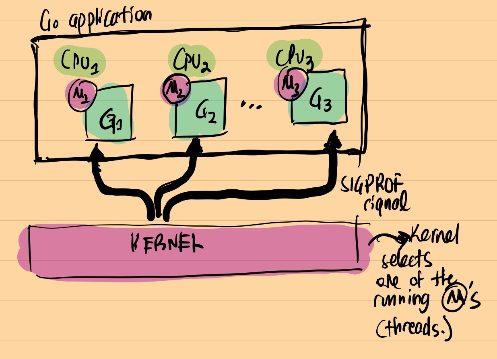
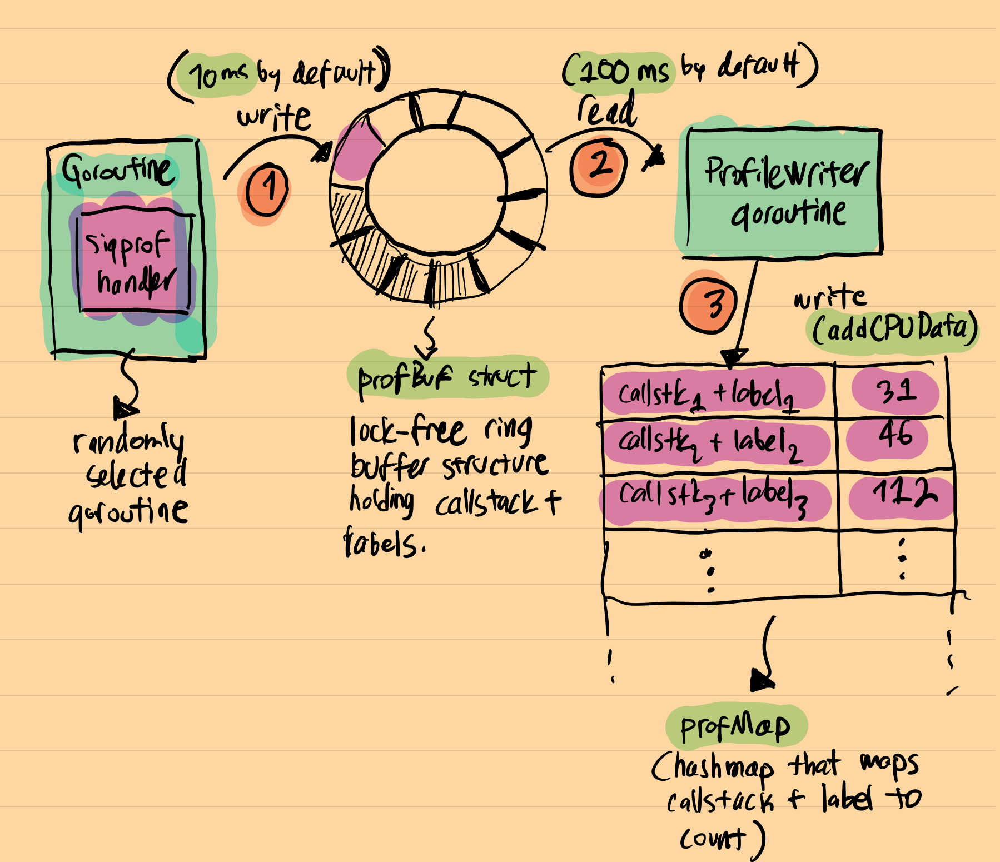

5. 原文地址：[Inside the Go CPU profiler (sumercip.com)](https://sumercip.com/posts/inside-the-go-cpu-profiler/)
2. 原文作者：[ Sümer Cip](https://sumercip.com/)
3. 本文永久链接：[https://github.com/gocn/translator/blob/master/2022/w41_Inside_the_Go_CPU_profiler_sumercip.md](https://github.com/gocn/translator/blob/master/2022/w41_Inside_the_Go_CPU_profiler_sumercip.md)
4. 译者：[zxmfke](https://github.com/zxmfke)
5. 校对：

### 深究 Go CPU profiler

------

在 profiling 方面，Go 是独一无二的。在 runtime 里面它包含强大的，有自主意识的 profilers。其他编程语言像 Ruby，Python，或者 Node.js，包含了 profilers 或者一些 APIs 接口用来写 profiler。但与 Go 提供的开箱即用的服务相比，它们的范围还是有限的。如果你想学习更多关于 Go 提供的可观测性工具，我强烈建议 Felix Geisendörfer 的 [忙碌的开发人员指南 - Go 性能分析，追踪和可观测性](https://github.com/DataDog/go-profiler-notes/blob/main/guide/README.md)

作为一个好奇的工程师，我喜欢钻研底层的实现原理，并且我一直希望能学习 Go CPU profiler 是如何实现的。这个博客就是这个学习的过程。毫无例外的，我总是能在我阅读 Go runtime 的时候找到并学习新的知识点。

#### 基础知识

有两种类型的 profiler ：

1. 追踪型：任何时候触发提前设定的事件就会做测量，例如：函数调用，函数退出，等等
2. **采样型**：常规时间间隔做一次测量

Go CPU profiler 是一个采样型的 profiler。也有一个追踪型的 profiler，[Go 执行追踪器](https://pkg.go.dev/runtime/trace)，用来追踪特定事件像请求锁，GC 相关的事件，等等。

采样型 profiler 通常包含两个主要部分：

1. **采样器**：一个在时间间隔触发的回调，一个堆栈信息一般会被收集成 profiling data。不同的 profiler 用不同的策略去触发回调。
2. **数据收集**：这个是 profiler 收集数据的地方：它可能是内存占用或者是调用统计，基本上跟堆栈追踪相关的数据

#### 其他 profiler 如何工作的小调研

Linux `perf` 使用 `PMU`（Performance Monitor Unit）计数器进行采样。你指示 `PMU` 在某些事件发生 N 次后产生一个中断。一个例子，可能是每 1000 个 CPU 时钟周期进行一次采样。Denis Bakhvalov 写了一篇[详细的文章](https://easyperf.net/blog/2018/06/01/PMU-counters-and-profiling-basics)，解释了像 `perf` 和 `VTune` 这样的工具如何使用 PMU 计数器来实现。一旦数据收集回调被定期触发，剩下的就是收集堆栈痕迹并适当地汇总。为了完整起见，Linux `perf` 使用 `perf_event_open(PERF_SAMPLE_STACK_USER,...)` 来获取堆栈追踪信息。捕获的堆栈痕迹通过 `mmap'd` 环形缓冲区写到用户空间。

[`pyspy`](https://github.com/benfred/py-spy) 和 [`rbspy`](https://github.com/rbspy/rbspy) 是 Python 和 Ruby 著名的采样分析器。它们都作为外部进程运行，定期读取目标应用程序的内存，以捕获运行线程的堆栈追踪。在Linux中，它们使用 `process_vm_readv`，如果我没记错的话，这个 API 在读取内存时，会让目标程序暂停几毫秒。然后他们在读取的内存中跟踪指针，来找到当前运行的线程结构和堆栈追踪信息。正如人们所猜测的那样，这是一个容易出错和复杂的方法，但效果却出奇的好。IIRC, [`pyflame`](https://github.com/uber-archive/pyflame) 也是使用类似的方法实现。

最近的 profiler 如 [Parca](https://sumercip.com/posts/inside-the-go-cpu-profiler/parca.dev)（还有其他一些）使用 [eBPF](https://ebpf.io/)。eBPF 是一项最近出现的技术，允许在内核虚拟机中运行用户区代码。它是一项杰出的技术，被用于许多领域，如安全、网络和可观察性。我强烈建议阅读一些关于 eBPF 的资料；这是一个庞大的话题，远远超出了这篇博文的范围。

#### profiler 是如何周期性触发的？

Go CPU profiler 是一个采样型 profiler。在Linux中，Go runtime 使用`setitimer/timer_create/timer_settime` API 来设置 `SIGPROF` 信号处理器。这个处理器在`runtime.SetCPUProfileRate` 控制的周期内被触发，默认为100Mz（10ms）。顺便提一下：令人惊讶的是，在Go 1.18 之前，围绕 Go CPU profiler 存在着一些严重的问题！你可以在[这里](https://www.datadoghq.com/blog/engineering/profiling-improvements-in-go-1-18/)看到这些问题的详细细节。IIUC，`setitimer` API 是在Linux中每线程触发基于时间的信号的推荐方式，~~但它并没有像宣传的那样工作。如果这个说法是错误的，请随时纠正我~~。(Felix Geisendörfer 纠正了这个说法）：从技术上讲，它的工作原理和你对进程导向的信号机制的期望是一样的。但对于多核 profiling 来说不是一个好的机制。

让我们看下你如何开启 Go CPU profiler：

```go
f, err := os.Create("profile.pb.gz")
if err != nil {
    ...
}
if err := pprof.StartCPUProfile(f); err != nil {
    ...
}
defer pprof.StopCPUProfile()
```

一旦 `pprof.StartCPUProfile` 被调用，Go runtime 就会在特定的时间间隔产生`SIGPROF` 信号。内核向应用程序中的一个**运行**线程发送 `SIGPROF` 信号。由于 Go 使用非阻塞式 I/O，等待 I/O 的 goroutines 不被计算为**运行**，Go CPU profiler 不捕获这些。顺便提一下：这是实现 [fgprof](https://github.com/felixge/fgprof) 的基本原因。`fgprof` 使用 [`runtime.GoroutineProfile`](https://pkg.go.dev/runtime#GoroutineProfile)来获得等待和非等待的 goroutines 的 profile 数据。

一图胜千言，下面是 Go runtime 如何处理 `SIGPROF` 信号：



#### profiler 是如何收集数据？

一旦一个随机运行的 goroutine 收到 `SIGPROF` 信号，它就会被中断，然后信号处理器的程序开始运行。被中断的 goroutine 的堆栈追踪在这个信号处理器的上下文中被检索出来，然后和当前的 profiler 标签一起被保存到一个[无锁](https://preshing.com/20120612/an-introduction-to-lock-free-programming/)的日志结构中（每个捕获的堆栈追踪都可以和一个自定义的标签相关联，你可以用这些标签在以后做过滤）。这个特殊的无锁结构被命名为 `profBuf` ，它被定义在 [runtime/profbuf.go](https://github.com/golang/go/blob/master/src/runtime/profbuf.go) 中，并对其工作原理做了详细的解释。它是一个**单一写、单一读**的无锁[环形缓冲](https://en.wikipedia.org/wiki/Circular_buffer) 结构，与[这里](http://www.cse.cuhk.edu.hk/~pclee/www/pubs/ancs09poster.pdf)发表的结构相似。writer 是 profiler 的信号处理器，reader 是一个 goroutine(`profileWriter`)，定期读取这个缓冲区的数据，并将结果汇总到最终的 hashmap。这个最终的 hashmap 结构被命名为 `profMap`，并在 `runtime/pprof/map.go`中定义。

下面是一个关于这一切如何结合在一起的简单的示意图：



可以看到，最终的结构与普通的 `pprof.Profile` 对象有很多相似之处：这是一个 hashmap，键是 stack trace + label，值是在应用程序中该调用栈被观察到的次数。当 `pprof.StopCPUProfile()` 被调用时，profiling 停止，`profileWriter` goroutine 调用 `build()` 函数，该函数[在此](https://github.com/golang/go/blob/aa4299735b78189eeac1e2c4edafb9d014cc62d7/src/runtime/pprof/proto.go#L348)实现。这个函数负责将 `profMap` 结构的数据写入一个 `io.Writer` 的对象，这个对象在最初 `pprof.StartCPUProfile` 调用的时候提供。实际上，这里就是最终  [`pprof.Profile`](https://pkg.go.dev/runtime/pprof#Profile) 对象生成的位置。

`profileWriter` 的伪代码如下，可能会有些帮助：

```go
func profileWriter(w io.Writer) {
    ...
    for {
        time.Sleep(100 * time.Millisecond)

        data, tags := readProfile()
        if e := b.addCPUData(data, tags); e != nil {
            ...
        }

        if profilerStopped {
            break
        }
    }
    ...
    b.build() // -> generates final pprof.Profile
    ...
}
```

一旦我对设计有一个更高阶的理解，我就会问我自己以下问题：

**为什么 Go 要大费周章地实现一个独特的无锁结构来保存临时的 profiling 数据？为什么不定期地将所有数据写入 hashmap？**

这个答案在设计本身。

看一下 `SIGPROF` 处理器做的第一件事就是禁用内存分配。此外，profiler 的代码路径不涉及任何锁，甚至堆栈追踪的最大深度也是硬编码的。从 `Go 1.19` 开始，它是 [64](https://github.com/golang/go/blob/54cf1b107d24e135990314b56b02264dba8620fc/src/runtime/cpuprof.go#L22)。所有这些细节都是为了给 profiler 提供一个更有效和可预测的开销。对于一个可应用于生产的 profiler 来说，低开销且可预测是关键。

#### 开销

基于这个设计，profiler 的开销是否会是恒定的吗？其实，是分情况的。让我来解释一下：在一个单一 profiler 中断下会做如下事情：

1. 一个随机执行中的 goroutine 上下文切换去执行 `SIGPROF` 处理器代码，
2. stack walk 发生，然后 Go runtime 会把这个堆栈追踪保存到一个无锁的环形缓存内，
3. goroutine 被恢复。

理论上，由于没有分配和锁的发生，上述所有情况似乎应该在恒定时间内运行。~~虽然我找不到参考资料，但我记得所有的~~而且这是真的：所有上述情况都发生在大约~~~10纳秒~~~1微秒（在一个典型的 CPU 上）（由 Felix Geisendörfer 纠正）。但是，在实际中，它变得更糟糕。如果你搜索 " Go CPU profiler 的开销"，你会看到从 [%0.5](https://cloud.google.com/blog/products/management-tools/in-tests-cloud-profiler-adds-negligible-overhead) 到 [%1-%5](https://medium.com/google-cloud/continuous-profiling-of-go-programs-96d4416af77b) ~~甚至 `%10`~~ 的数字（*关于这个数字没有公开提及，也没有实证证据*）。这背后的原因主要与 CPU 的工作方式有关。现代 CPU 复杂得像只野兽。他们肆意地缓存。 一个典型的单个 CPU 核心有三层高速缓存。L1、L2 和 L3。当一个特定的 CPU 密集型代码运行时，这些缓存被高度利用。对于一些大量读取小数据（可放入缓存的数据）和顺序数据的应用来说，缓存的高利用率尤其如此。

矩阵乘法就是一个很好的例子：在矩阵乘法过程中，CPU大量访问内存中连续的独立单元。这类有利于缓存的应用可能会对采样 profiler 产生 `最坏` 的开销。虽然很想用 `perf` 做一些 benchmark 来验证这一说法，但这已经超出了本博文的范围。

综上所述，Go runtime 在保持 profiler 开销的可预测性和尽可能的低开销方面做得很好。如果你不相信我，你不应该不相信，也许下面可以说服你：

> 在谷歌，我们不断地对 Go 生产服务进行 profile，而且这样做是安全的

上述是从[Google thread](https://groups.google.com/g/golang-nuts/c/e6lB8ENbIw8/m/azeTCGj7AgAJ) 的引用。

还有一个是来自 DataDog 的连续 profiler 实现的[提交](https://github.com/DataDog/dd-trace-go/commit/54604a13335b9c5e4ac18a898e4d5971b6b6fc8c)，使 profiler **总是被启用**：

> 在对许多高容量的内部工作负载进行测试后，我们已经确定这个默认值对生产来说是安全的。

最后，基于上述理论，我们可以做出以下观察：

**在典型的 I/O 绑定的应用程序上，profiler 的开销将是最小的。**

这是因为当有许多休眠/空闲的 goroutine 时，CPU 的缓存垃圾并不会产生太大的影响。我们在 Go CPU profiler 的 benchmark 中反复观察到这一点：在典型的 I/O 绑定的应用程序中，开销简直为**零**（或统计上微不足道）。但是，同样的，提供经验证据超出了这篇博文的范围，可以在 profiler 开启和关闭的情况下，通过观察 Go 网络应用程序的负载测试中的吞吐量来实现。

#### 总结

我喜欢这种设计的一个原因是，它证明了你能多好地优化代码，这取决于你对底层数据结构的访问模式的理解程度。在这种情况下，Go runtime 使用了无锁结构，尽管它在大多数情况下是完全多余的。Go runtime 充满了像这样聪明的优化，我强烈建议你花时间深入研究你认为有趣的部分。

我希望你能享受它！

#### 参考资料

1. https://github.com/DataDog/go-profiler-notes/blob/main/guide/README.md
2. https://easyperf.net/blog/2018/06/01/PMU-counters-and-profiling-basics
3. https://www.instana.com/blog/go-profiler-internals/
4. https://www.datadoghq.com/blog/engineering/profiling-improvements-in-go-1-18/
5. http://www.cse.cuhk.edu.hk/~pclee/www/pubs/ancs09poster.pdf