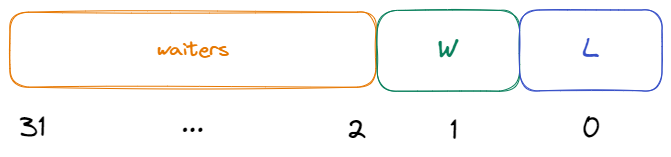

# Deep Understanding of Golang Mutex

# 深入理解 golang 的互斥锁

- 原文地址：<https://levelup.gitconnected.com/deep-understanding-of-golang-mutex-9964b02c56e9>
- 原文作者：Dwen
- 本文永久链接：https:/github.com/gocn/translator/blob/master/2022/w47_Deep_Understanding_of_Golang_Mutex.md
- 译者：[小超人](https://github.com/focozz)
- 校对：[]()

> How to implement Golang Mutex
> 如何实施 Golang Mutex


Photo by [Daniil Silantev](https://unsplash.com/@betagamma?utm_source=unsplash&utm_medium=referral&utm_content=creditCopyText) on [Unsplash](https://unsplash.com/s/photos/home?utm_source=unsplash&utm_medium=referral&utm_content=creditCopyText)

Before we start, we need to add several ways to implement locks.

在开始之前，我们需要知道锁实现的几种方式。

**\# Semaphore.**
**\# 信号量**

There are P and V operations in the OS. The P operation is to change the semaphore by -1, and the V operation is to increase the semaphore by 1, so the operation mode of the semaphore is:

操作系统中有 P 和 V 操作。P 操作是将信号量值减去 1，V 操作是将信号量值增加 1，因此信号量的操作模式为：

- Initialize, give it a non-negative integer value.
- 初始化，给它一个非负整数值。
- The process of the program attempting to enter the critical block needs to run P first. Then there will be 2 scenarios.
- 在程序试图进入临界区之前需要先运行 P 操作，然后会有两种情况。

1. When the semaphore S is reduced to a negative value, the process will be blocked and cannot continue. At this time, the process is blocked.
2. 当信号量 S 减少到负值时，该过程将被阻止并且无法继续。这个时候，进程会被阻塞。
3. When the semaphore S is not negative, the process can be admitted to the critical block.
4. 当信号量 S 不为负时，进程可以进入临界区。

- To end the process leaving the critical block, V will be run. When the semaphore S is not negative, other processes that were previously blocked will be allowed to enter the critical block.
- 在程序离开临界区时，需要执行 V 操作。当信号量 S 不是为负时，之前被阻止的其他进程将允许进临界区。

**\# Semaphores and locks.**
**\# 信号量和锁**

Although semaphores and locks look similar, for example, when the semaphore is 1, a mutual exclusion lock is implemented, but in fact, they have different meanings.

尽管信号量和锁看起来相似，例如，当信号量为 1 时，实现了互斥锁，但实际上，它们具有不同的含义。

Locks are used to protecting critical resources, such as reading and writing cannot be performed at the same time.

锁用于保护临界资源，例如读和写不能同时执行场景。

The semaphore is to ensure that the process (or thread or goroutine) is scheduled. For example, three processes jointly calculate c=a+b. First, the calculation of a+b and the assignment operation cannot be performed at the same time. Secondly, it is necessary to ensure that a+b is executed first. c is executed after the assignment, so this place needs to be done in the form of a semaphore.

信号量是用于确保进程 (线程或 goroutine) 被调度。比如，三个进程共同计算 `c = a+b`。首先，`a+b` 的计算和赋值操作不能同时执行。其次，必须确保首先执行 `a+b`。c 在赋值之后执行，因此这个位置需要以信号量的形式执行。

Further, the lock can be implemented by a semaphore, then the goroutine can be blocked and woken up according to the regulations, or it can be implemented by a spin lock, then the goroutine will occupy the CPU until it is unlocked.

此外，可以通过信号量实现锁，然后 goroutine 可以根据规则阻塞和唤醒锁；也可以通过自旋的方式实现锁，goroutine 将持有 CPU，直到解锁。

The difference between these two methods is whether goroutine scheduling is required, but in essence, the implementation of locks is to ensure that critical resources will not be accessed by mistake.

这两种方式之间的区别是是否需要调度 goroutine，但是从本质上讲，锁是为了确保不会错误地访问临界资源。

**\# Spin lock.**
**\# #自旋锁**

CAS theory is a kind of spinlock.

CAS 理论是一种自旋锁。

Only one thread can acquire the lock at the same time, and the thread that does not acquire the lock usually has two processing methods:

在同一时间只有一个线程获得锁，而没有获得锁的线程通常有两种处理方式:

- It has been waiting in a loop to determine whether the resource has released the lock. This kind of lock is called a spin lock, and it does not block the thread (NON-BLOCKING).
- 一直循环等待，以确定资源是否释放了锁。这种锁称为自旋锁，它不会阻塞线程(NON-BLOCKING)。
- Block yourself, waiting for rescheduling requests, this is a mutex.
- 一直阻塞，等待重新调度，这种是实现方式是一个互斥锁。

The principle of the spin lock is relatively simple. If the thread holding the lock can release the lock resource in a short time, then those threads waiting for the competing lock do not need to switch between the kernel mode and the user mode to enter the blocking state, they only need to Wait a minute (spin), wait until the thread holding the lock releases the lock and then acquire it, thus avoiding the consumption of user processes and kernel switching.

自旋锁的原理相对简单。如果持有锁的线程可以在短时间内释放锁定资源，那么等待锁的其他线程不需要在内核态和用户态之间切换来回切换阻止状态，他们只需要通过自旋的方式等一会，等待持有锁的线程释放锁，然后获取锁，这种方式避免用户进程在内核切换。

But if locked for a long time, the spinlock can be very expensive, it prevents other threads from running and scheduling.

但如果长时间未释放锁，那么自旋锁的开销会非常大，它会阻止其他线程的运行和调度。

The longer a thread holds a lock, the greater the risk that the thread holding that lock will be interrupted by the OS scheduler.

线程持有锁的时间越长，持有锁的线程被 OS 调度中断的风险就越大。

In the event of an interruption, other threads will remain spinning (repeatedly trying to acquire the lock) and the thread holding the lock does not intend to release the lock, which results in an indefinite delay until the thread holding the lock can complete and release it.

如果发生终端，其他线程将保持自旋状态(反复尝试获取锁)，而持有锁的线程不打算释放锁，这将导致无限延迟，直到持有锁的线程完成并释放锁。

A good way to solve the above situation is to set a spin time for the spin lock and release the spin lock as soon as the time expires.

解决上述情况的一个好方法是为自旋锁定设置一个自旋时间，并在时间一到就释放自旋锁。

The purpose of spin locks is to occupy CPU resources without releasing them and process them immediately when the locks are acquired.

自旋锁的目的是在不释放 CPU 资源的情况下占用 CPU 资源，并在获得锁时立即处理这些资源。

**\# Pessimistic locking and optimistic locking.**
**\# #悲观锁定和乐观锁定**

Pessimistic locking is a kind of pessimistic thinking. It always thinks that the worst situation may occur. It thinks that data is likely to be modified by others. Regardless of reading or writing, pessimistic locks are locked before performing operations.

悲观锁定是一种悲观思维。它总是认为最坏的情况可能会发生。它认为这些数据很可能被其他人修改过。无论是读还是写，悲观锁都是在执行操作之前锁定的。

Both read and write need to be locked, resulting in low performance, so there are not many opportunities for pessimistic locking. However, in the case of multiple writes, there is still a chance to use pessimistic locks, because optimistic locks will keep retrying in the case of inconsistent writes, which will waste more time.

读和写都需要锁定，因此性能较低，因此悲观锁定并不会有太多的机会。然而，在多次写入的情况下，仍然有机会使用悲观锁，因为乐观锁将在不一致的写入情况下不断重试，这将浪费更多的时间。

The idea of optimistic locking is contrary to the idea of pessimistic locking. It always believes that resources and data will not be modified by others, so reading will not be locked, but optimistic locking will determine whether the current data has been modified when writing operations.

乐观锁定的思想与悲观锁定的思想相反。它始终认为资源和数据不会被别人修改，所以读取不会被锁定，但是乐观锁定会在写操作时确定当前数据是否被修改过。

The implementation scheme of optimistic locking mainly includes CAS and version number mechanism. Optimistic locking is suitable for multi-read scenarios and can improve throughput.

乐观锁定的实现方案主要包括 CAS 和版本号机制。乐观锁定适用于多读场景这可以提高吞吐量。

CAS stands for Compare And Swap, which is a well-known lock-free algorithm.

CAS 是一个著名的基于比较和交换无锁算法。

That is, to achieve variable synchronization between multiple threads without using locks, that is, to achieve variable synchronization without threads being blocked, so it is also called non-blocking synchronization.

也就是在不使用锁的情况下实现多个线程之间的变量同步，(即在不阻塞线程的情况下实现变量同步)，所以又称非阻塞同步。

CAS involves three relationships: a pointer V to a region of memory, the old value A, and the new value B to be written.

CAS 涉及三种关系: 指向内存区域的指针 V、旧值 a 和要写入的新值 B。

The optimistic lock implemented by CAS will bring about the ABA problem. At the same time, the entire optimistic lock will trigger the waiting and retry mechanism in the case of data inconsistency, which has a great impact on performance.

由 CAS 实现的乐观锁将带来 ABA 问题。同时，整个乐观锁会在数据不一致的情况下触发等待和重试机制，这对性能有很大的影响。

The version number mechanism implements version control through a version number version.

版本号机制通过版本的值实现版本控制。

Well, with the above basic knowledge, we can start to analyze how Mutex is implemented in Golang.

有了以上的基础知识，我们就可以开始分析 golang 是如何实现互斥锁的了。

Golang’s implementation of Mutex has been improving, and as of now, it has mainly improved 4 versions:

Golang 的 Mutex 实现一直在改进，到目前为止，主要经历了 4 个版本:

- V1: Simple implementation.
- V1:实现简单
- V2: The new goroutine participates in the lock competition.
- V2:新的 goroutine 参加锁的竞争
- V3: Give new goroutines some more chances.
- V3：给新的 goroutines 更多参与竞争的机会
- V4: Solve the old goroutine starvation problem.
- V4：解决老 goroutine 饥饿的问题

Each improvement is to improve the overall performance of the system. This upgrade is gradual and continuous, so it is necessary to start slowly from the V1 version to see the evolution of Mutex.

每一次改进都是为了提高系统的整体性能。这个升级是渐进的、持续的，因此有必要从 V1 版本开始慢慢地看 Mutex 的演变过程。

**V1: Simple implementation.**
**V1: 实现简单**

In the V1 version, the entire source code of Mutex is as follows. [commit](https://github.com/golang/go/blob/d90e7cbac65c5792ce312ee82fbe03a5dfc98c6f/src/pkg/sync/mutex.go)

在 V1 版本中，互斥的完整源代码如下。[commit](https://github.com/golang/go/blob/d90e7cbac65c5792ce312ee82fbe03a5dfc98c6f/src/pkg/sync/mutex.go)

The main core code is as follows:

核心代码如下:

```golang

func cas(val *int32, old, new int32) bool
func semacquire(*int32)
func semrelease(*int32)
// The structure of the mutex, containing two fields
type Mutex struct {
  key int32 // Indication of whether the lock is held
  sema int32 // Semaphore dedicated to block/wake up goroutine
}
// Guaranteed to successfully increment the value of delta on val
func xadd(val *int32, delta int32) (new int32) {
    for {
        v := *val
        if cas(val, v, v+delta) {
            return v + delta
     }
    }
    panic("unreached")
}
// request lock
func (m *Mutex) Lock() {
    if xadd(&m.key, 1) == 1 { // Add 1 to the ID, if it is equal to 1, the lock is successfully acquired
    return
}
    semacquire(&m.sema) // Otherwise block waiting
}
func (m *Mutex) Unlock() {
    if xadd(&m.key, -1) == 0 { // Subtract 1 from the flag, if equal to 0, there are no other waiters
return
}
    semrelease(&m.sema) // Wake up other blocked goroutines
}
```

[code here](https://gist.github.com/tengergou/3851ef5ae21e4530272618ec096990ee#file-20220921-1-go)

First of all, the structure of `Mutex` is very simple, including two flags, `key` and `sema`.

首先，互斥锁的结构非常简单，包括两个字段，`key` 和 sema。

The `key` indicates that there are several goroutines currently using or preparing to use the lock. If `key==0`, it means that the current mutex is unlocked, otherwise, `key>0` means that the mutex is locked.

`key` 表示有几个 gorutines 正在使用或准备使用该锁。如果 `key==0`，表示当前互斥锁已解锁，否则，`key>0` 表示当前互斥锁已锁定。

The `sema` is the semaphore, which is what actually causes the `goroutine` to block and wake up.

`sema` 是实际导致 goroutine 阻塞和唤醒的信号量。

The `xadd` function is a CAS-based addition and subtraction function.

`xadd` 是一个基于 cas 的加减法函数。

The `Lock` and `Unlock` functions are the core of locking the current mutex, but the logic is very simple.

Lock 和 Unlock 是锁定当前互斥锁的核心函数，但逻辑非常简单。

The `Lock` function uses the `xadd` method to `key+1`. If the result is `1`, it means that the original lock is in an unlocked state, so you don’t need to pay attention to the semaphore to directly acquire the lock. If not, call the `semacquire` method to block the current goroutine.

`Lock` 使用 `xadd` 方法来给 `key` 进行 +1 操作。如果结果为 1，则表示原锁处于解锁状态，因此不需要关注信号量即可直接获取锁。如果不是，则调用 `semacquire` 方法来阻塞当前 goroutine。

The `Unlock` function uses the `xadd` method to pair `key-1`. If the result is not `0`, it means that a goroutine is currently waiting, and it is necessary to call `semrelease` to wake up a goroutine.

`Unlock` 使用 xadd 方法对 `key` 进行 -1 操作。如果结果不是 0，则意味着 goroutine 当前正在等待，需要调用 `semrelease` 来唤醒 goroutine。

In the current V1 version, the locking and unlocking are completely based on the FIFO method. Although this method is very fair, it is not optimal from the perspective of efficiency.

在目前的 V1 版本中，锁定和解锁完全基于 FIFO 方法。虽然这种方法是非常公平的，但从效率的角度来看，它不是最优的。

Imagine a scenario: the blocked goroutine (name the current goroutine as g1) must not occupy the CPU, so the context switch needs to be performed after g1 is woken up. If a new goroutine (g2) comes at this time, it has the CPU resource.

想象一下这样一个场景: 被阻塞的 goroutine(命名为 g1)不能占用 CPU，因此需要在 g1 被唤醒后执行上下文切换。如果此时出现一个新的 goroutine (g2)，它就拥有 CPU 资源。

If the lock is given to g2, then it can execute and return the result immediately (not waiting for the context switch of g1), so that the overall efficiency can be improved to a higher level.

如果把锁给 g2，那么它可以立即执行并返回结果(而不是等待 g1 的上下文切换)，这样整体效率就可以提高到更高的水平。

**V2: New Goroutine participates in lock competition.**

**V2:新 goroutine 参加锁竞赛.**

The full source code address is at:[https://github.com/golang/go/blob/weekly.2011-07-07/src/pkg/sync/mutex.go](https://github.com/golang/go/blob/weekly.2011-07-07/src/pkg/sync/mutex.go)

完整的源代码地址 [https://github.com/golang/go/blob/weekly.2011-07-07/src/pkg/sync/mutex.go](https://github.com/golang/go/blob/weekly.2011-07-07/src/pkg/sync/mutex.go)

In the V2 version, the core feature is that a goroutine does not execute tasks immediately after being woken up, but still repeats the process of preempting locks so that new goroutines have the opportunity to acquire locks, which is the so-called opportunity for newcomers.

在 V2 版本中，核心特性是 goroutine 在被唤醒后不会立即执行任务，而是重复抢占锁的过程，以便新的 goroutine 有机会获得锁，这就是给后来者机会。

Mutex structures and constants are defined as follows.

互斥锁结构和常量的定义如下:

```golang
// A Mutex is a mutual exclusion lock.
// Mutexes can be created as part of other structures;
// the zero value for a Mutex is an unlocked mutex.
type Mutex struct {
    state int32
    sema  uint32
}

const (
    mutexLocked = 1 << iota // mutex is locked
    mutexWoken
    mutexWaiterShift = iota
)
```

[code here](https://gist.github.com/tengergou/3a4613c2a729f06f331c1182ba250bb0#file-20220921-2-go)

Although the definition of the Mutex structure is basically unchanged, from the `key` of V1 to the `state` of V2, their internal structure is very different.

虽然互斥锁结构的定义基本不变，但从 V1 的 `key` 到 V2 的 `state`，它们的内部结构却有很大的不同。

The 0th bit represents the lock state (L), that is, `0` represents unlocking, `1` represents locking, the 1st bit represents the wake-up state (W), and the 2nd to 31st bits represent the number of blocking waits.

第 0 位表示锁定状态(L)，即 0 表示解锁，1 表示锁定; 第 1 位表示唤醒状态(W)，第 2 位到第 31 位表示阻塞等待的计数。



The value of `mutexLocked` is `0x1`, the value of `mutexWoken` is `0x2`, the value of `mutexWaiterShift` is `0x2`, and `mutexWaiterShift` indicates that any array representing the number of blocked waits needs to be shifted left by two bits.

`mutexLocked` 的值是 0x1, `mutexawake` 的值是 0x2, `mutexWaiterShift` 的值是 0x2, `mutexWaiterShift` 表示任何表示阻塞等待数量的数组都需要左移两位。

The main improvement of the V2 version exists in the Lock method, the code is as follows.

V2 版本的主要在于 `Lock` 方法的改进，代码如下:

```golang
// Lock locks m.
// If the lock is already in use, the calling goroutine
// blocks until the mutex is available.
func (m *Mutex) Lock() {
 // Fast path: grab unlocked mutex.
 if atomic.CompareAndSwapInt32(&m.state, 0, mutexLocked) {
  return
 }

 awoke := false
 for {
  old := m.state
  new := old | mutexLocked
  if old&mutexLocked != 0 {
   new = old + 1<<mutexWaiterShift
  }
  if awoke {
   // The goroutine has been woken from sleep,
   // so we need to reset the flag in either case.
   new &^= mutexWoken
  }
  if atomic.CompareAndSwapInt32(&m.state, old, new) {
   if old&mutexLocked == 0 {
    break
   }
   runtime.Semacquire(&m.sema)
   awoke = true
  }
 }
}
```

[code here](https://gist.github.com/tengergou/77d6f4ab3acf0a951114fe045e1429a2#file-20220921-3-go)

The code logic in lines 2–4 applies to the unlocked state, and the goroutine acquires the lock through CAS by setting the L bit from `0` to `1`.

第 2 行和第 4 行中的代码逻辑应用于解锁状态，goroutine 通过 CAS 将 L 位从 0 设置为 1 获得锁。

There is no contention at this point, so acquiring the lock costs almost nothing.

此时不存在任何争用，因此获取锁几乎不需要花费任何成本。

The following code is accessed to indicate that it is currently locked, that is, the L bit is `1`.

之后的代码表示当前的锁已经被锁定，即 L 位为 1。

The goroutine then enters a loop in which the CAS method ensures that the new state is properly superimposed.

然后，goroutine 进入一个循环，其中 CAS 方法可确保正确叠加新状态。

The main changes from the old state to the new state (new) include:

state 从旧到新的变更主要包含以下的逻辑:

- Attempt to acquire the lock.
- 尝试获得锁。
- Try increasing the number of waiters by 1.
- 尝试将等待锁的数量增加 1。

Since the change is not atomic, it may cause the old state to become stale.

由于更改不是原子的，它可能会导致旧 `state` 的值变得无效。

For example, it is currently in the unlocked state, and two goroutines acquire the old state at the same time, both of which are in the unlocked state, but there is always one that can get the lock and the other that cannot.

例如，它目前处于解锁状态，两个 goroutines 同时获得了旧状态，这两个状态都处于解锁状态，但是总有一个可以得到锁，而另一个不能。

Similarly, even if the current state is locked, the old state will be out of date due to the number of waiters.

同样，即使当前状态被锁定，由于等待者的数量，旧状态也将过时。

So you need to continue to get the new old state through the loop.

因此，您需要继续通过循环获得新的旧状态。

After the old state is not obsolete and overwrites the new state, the real locking step is entered.

在旧状态未过时并覆盖新状态后，进入真正的锁定步骤。

If the old state is unlocked, the lock is obtained directly, otherwise, the current goroutine is blocked through the semaphore mechanism.

如果旧状态未解锁，则直接获得锁，否则，通过信号量机制阻塞当前 goroutine。

After being awakened, unlike V1, the current process will still fall into the for loop to grab the lock again, which is the embodiment of giving newcomers a chance:

与 V1 不同的是，当前进程在被唤醒后，仍然会陷入 for 循环再次获取锁，这主要是给新的 goroutine 机会

- If the old goroutine has a new goroutine during the context switch, the lock will be given to the new goroutine.
- 如果旧的 goroutine 在上下文切换期间有一个新的 goroutine，锁将被赋予新的 goroutine。
- If the old goroutine still does not have a new goroutine after the context switch is completed, the lock will be given to the old goroutine.
- 如果在完成上下文切换后，旧的 goroutine 仍然没有新的 goroutine，那么锁将被交给旧的 goroutine。

The Unlock method is relatively simple. The code is as follows.

Unlock 方法相对简单。代码如下:

```golang
// Unlock unlocks m.
// It is a run-time error if m is not locked on entry to Unlock.
//
// A locked Mutex is not associated with a particular goroutine.
// It is allowed for one goroutine to lock a Mutex and then
// arrange for another goroutine to unlock it.
func (m *Mutex) Unlock() {
 // Fast path: drop lock bit.
 new := atomic.AddInt32(&m.state, -mutexLocked)
 if (new+mutexLocked)&mutexLocked == 0 {
  panic("sync: unlock of unlocked mutex")
 }

 old := new
 for {
  // If there are no waiters or a goroutine has already
  // been woken or grabbed the lock, no need to wake anyone.
  if old>>mutexWaiterShift == 0 || old&(mutexLocked|mutexWoken) != 0 {
   return
  }
  // Grab the right to wake someone.
  new = (old - 1<<mutexWaiterShift) | mutexWoken
  if atomic.CompareAndSwapInt32(&m.state, old, new) {
   runtime.Semrelease(&m.sema)
   return
  }
  old = m.state
  }
}
```

[code here](https://gist.github.com/tengergou/53d9b51646b23369ae9e030631aca9b5#file-20220921-4-go)

There are two main unlocking logics.

有两个主要的解锁逻辑。

- Returns directly if there is no waiter or the current system is unlocked and there is a wake-up goroutine.
- 如果没有等待锁的 goroutine，或者当前系统处于解锁状态，并且有唤醒程序，则直接返回。
- If the above requirements are not met, the number of waiting will be reduced by one and the Goroutine at the head of the queue will be woken up through the semaphore.
- 如果不满足上述要求，则等待的数量将减少 1，队列头部的 goroutine 将通过信号量被唤醒。

**V3: Give new goroutines some more chances.**
**V3：给新的 goroutines 更多机会**

The optimization of this version, the key commit is at

[https://github.com/golang/go/commit/edcad8639a902741dc49f77d000ed62b0cc6956f](https://github.com/golang/go/commit/edcad8639a902741dc49f77d000ed62b0cc6956f)

这个版本的优化，关键提交是[https://github.com/golang/go/commit/edcad8639a902741dc49f77d000ed62b0cc6956f](https://github.com/golang/go/commit/edcad8639a902741dc49f77d000ed62b0cc6956f)

On the basis of V2, how can the performance be further improved? Most of the time, the operation of the data during the exclusive lock period of the coroutine is actually very low, which may be lower than the time-consuming of waking up + switching the context.

在 V2 的基础上，如何进一步提高性能? 在大多数情况下，协程互斥锁定期间的数据操作的耗时是非常低的，这可能比唤醒+切换上下文的耗时更低。

Imagine a scenario: GoroutineA has CPU resources, and GoroutineB is at the head of the blocking queue. Then when GoroutineA tries to acquire the lock, it finds that the current lock is occupied. According to the V2 policy, GoroutineA is blocked immediately, assuming that the lock is at this moment. If it is released, then GoroutineB will be woken up as planned, that is, the entire running time includes GoroutineB’s wake-up + context switching time.

想象一个场景: GoroutineA 拥有 CPU 资源，GoroutineB 位于阻塞队列的头部。然后，当 GoroutineA 试图获取锁时，它发现当前锁已被占用。根据 V2 策略，GoroutineA 立即被阻塞，假设锁此时处于阻塞状态。如果释放，则 GoroutineB 将按计划被唤醒，即整个运行时间包括 GoroutineB 的唤醒+上下文切换时间。

In V3, the new Goroutine (GoroutineA) is allowed to wait for a certain period of time by spinning. If the lock is released during the waiting time, the new Goroutine immediately obtains the lock resource, avoiding the time-consuming of the old Goroutine’s wake-up + context switching, and improving the overall work efficiency.

在 V3 版本的实现中，新的 Goroutine (GoroutineA)被允许通过旋转等待一段时间。如果在等待时间内释放锁，新的 Goroutine 立即获取锁资源，避免了旧 Goroutine 唤醒+上下文切换的耗时，提高了整体工作效率。

Similarly, the improvement of V3 mainly focuses on the `Lock` method, and the code is as follows.

同样，V3 的改进主要集中在 `Lock` 方法上，代码如下。

```golang

// Lock locks m.
// If the lock is already in use, the calling goroutine
// blocks until the mutex is available.
func (m *Mutex) Lock() {
    // Fast path: grab unlocked mutex.
    if atomic.CompareAndSwapInt32(&m.state, 0, mutexLocked) {
        if raceenabled {
            raceAcquire(unsafe.Pointer(m))
        }
        return
    }

    awoke := false
    iter := 0
    for {
        old := m.state
        new := old | mutexLocked
        if old&mutexLocked != 0 {
            if runtime_canSpin(iter) {
                // Active spinning makes sense.
                // Try to set mutexWoken flag to inform Unlock
                // to not wake other blocked goroutines.
                if !awoke && old&mutexWoken == 0 && old>>mutexWaiterShift != 0 &&
                    atomic.CompareAndSwapInt32(&m.state, old, old|mutexWoken) {
                    awoke = true
                }
                runtime_doSpin()
                iter++
                continue
            }
            new = old + 1<<mutexWaiterShift
        }
        if awoke {
            // The goroutine has been woken from sleep,
            // so we need to reset the flag in either case.
            if new&mutexWoken == 0 {
                panic("sync: inconsistent mutex state")
            }
            new &^= mutexWoken
        }
        if atomic.CompareAndSwapInt32(&m.state, old, new) {
            if old&mutexLocked == 0 {
                break
            }
            runtime_Semacquire(&m.sema)
            awoke = true
            iter = 0
        }
    }

    if raceenabled {
        raceAcquire(unsafe.Pointer(m))
    }
}
```

[code here](https://gist.github.com/tengergou/13e1eff9a75821c5441cab49345e7c5d#file-20220921-5-go)

Compared with the implementation code of V2, it mainly focuses on lines 14–25, and there are two more functions `runtime_canSpin` and `runtime_doSpin`, which are the core of the spin lock.

与 V2 的实现代码相比，它主要集中在第 14-25 行，多了两个自旋锁的核心函数 `runtime_canSpin` 和 `runtime_doSpin`。

The first is the `runtime_canSpin` function. The incoming parameter is `iter` (representing the current number of spins). The implementation function of the runtime_canSpin function is to determine whether the current spin wait state can be entered.

第一个是 `runtime_canSpin` 函数。传入参数是迭代器（代表当前旋转的数量）。`runtime_canSpin` 函数的实现功能是确定是否可以输入当前的旋转等待状态。

As mentioned earlier, spin locks wait without releasing CPU resources, and there is no consumption of context switching, but if the spin time is too long, it will lead to meaningless CPU consumption, which will further affect performance.

如前所述，旋转锁在等待时不会释放 CPU 资源，也不会消耗上下文切换，但如果旋转时间过长，则会导致无意义的 CPU 消耗，这将进一步影响性能。

Therefore, when using the spinlock, the entry process of the spin lock must be strictly controlled.

因此，在使用自旋锁时，必须严格控制自旋锁的进入过程。

The last is the `runtime_doSpin` function, which can be simply understood as the CPU idle for a period of time, that is the spin process.

最后一个是 `runtime_doSpin` 函数，可以简单地理解为 CPU 空闲一段时间，这就是自旋过程。

The whole process is very clear. All Goroutines that hold the CPU perform spin operations after the runtime_canSpin function has passed the check. If they still do not hold the lock after the spin operation is completed, the Goroutine is blocked. Other logic remains the same as V2.

整个过程非常清晰。所有持有 CPU 的 goroutine 在 `runtime_canSpin` 函数通过检查后执行自旋操作。如果在旋转操作完成后，它们仍然没有持有锁，则 Goroutine 将被阻塞。其他逻辑与 V2 相同。

**V4: Solve the old goroutine starvation problem.**

**V4：解决老 Goroutine 的饥饿问题.**

The source address is at: [https://github.com/golang/go/blob/go1.15.5/src/sync/mutex.go](https://github.com/golang/go/blob/go1.15.5/src/sync/mutex.go)

源地址如下: [https://github.com/golang/go/blob/go1.15.5/src/sync/mutex.go](https://github.com/golang/go/blob/go1.15.5/src/sync/mutex.go)

The improvement from V2 to V3 is to give new goroutines more opportunities, which leads to the starvation problem that old goroutines may not be able to grab new goroutines, so this problem is focused on improving in V4.

从 V2 到 V3 的改进是为新的 goroutines 提供更多的机会，这导致了老的 goroutine 饥饿问题，即新的获取锁的机会不会让给老的 goroutines，因此这个问题主要集中在 V4 中改进。

The first is that the State field of the Mutex structure has a new change, adding a hunger indicator (S).

首先是互斥锁结构的 State 字段有了新的变化，增加了饥饿指示器(S)。

Where `0` means starvation did not occur and `1` means starvation occurred.

0 表示没有发生饥饿，1 表示发生了饥饿。(图片中的 S 标志位)


In the new definition, the definitions of constants have also changed a bit.

在新的定义中，常数的定义也发生了一些变化。

```go
const (
    mutexLocked = 1 << iota // mutex is locked
    mutexWoken
    mutexStarving // separate out a starvation token from the state field
    mutexWaiterShift = iota
    starvationThresholdNs = 1e6
)
```

The logic of the Lock method is as follows.

Lock 方法的逻辑如下所示。

```golang
// Lock locks m.
// If the lock is already in use, the calling goroutine
// blocks until the mutex is available.
func (m *Mutex) Lock() {
 // Fast path: grab unlocked mutex.
 if atomic.CompareAndSwapInt32(&m.state, 0, mutexLocked) {
  if race.Enabled {
   race.Acquire(unsafe.Pointer(m))
  }
  return
 }
 // Slow path (outlined so that the fast path can be inlined)
 m.lockSlow()
}

func (m *Mutex) lockSlow() {
 var waitStartTime int64
 starving := false
 awoke := false
 iter := 0
 old := m.state
 for {
  // Don't spin in starvation mode, ownership is handed off to waiters
  // so we won't be able to acquire the mutex anyway.
  if old&(mutexLocked|mutexStarving) == mutexLocked && runtime_canSpin(iter) {
   // Active spinning makes sense.
   // Try to set mutexWoken flag to inform Unlock
   // to not wake other blocked goroutines.
   if !awoke && old&mutexWoken == 0 && old>>mutexWaiterShift != 0 &&
    atomic.CompareAndSwapInt32(&m.state, old, old|mutexWoken) {
    awoke = true
   }
   runtime_doSpin()
   iter++
   old = m.state
   continue
  }
  new := old
  // Don't try to acquire starving mutex, new arriving goroutines must queue.
  if old&mutexStarving == 0 {
   new |= mutexLocked
  }
  if old&(mutexLocked|mutexStarving) != 0 {
   new += 1 << mutexWaiterShift
  }
  // The current goroutine switches mutex to starvation mode.
  // But if the mutex is currently unlocked, don't do the switch.
  // Unlock expects that starving mutex has waiters, which will not
  // be true in this case.
  if starving && old&mutexLocked != 0 {
   new |= mutexStarving
  }
  if awoke {
   // The goroutine has been woken from sleep,
   // so we need to reset the flag in either case.
   if new&mutexWoken == 0 {
    throw("sync: inconsistent mutex state")
   }
   new &^= mutexWoken
  }
  if atomic.CompareAndSwapInt32(&m.state, old, new) {
   if old&(mutexLocked|mutexStarving) == 0 {
    break // locked the mutex with CAS
   }
   // If we were already waiting before, queue at the front of the queue.
   queueLifo := waitStartTime != 0
   if waitStartTime == 0 {
    waitStartTime = runtime_nanotime()
   }
   runtime_SemacquireMutex(&m.sema, queueLifo, 1)
   starving = starving || runtime_nanotime()-waitStartTime > starvationThresholdNs
   old = m.state
   if old&mutexStarving != 0 {
    // If this goroutine was woken and mutex is in starvation mode,
    // ownership was handed off to us but mutex is in somewhat
    // inconsistent state: mutexLocked is not set and we are still
    // accounted as waiter. Fix that.
    if old&(mutexLocked|mutexWoken) != 0 || old>>mutexWaiterShift == 0 {
     throw("sync: inconsistent mutex state")
    }
    delta := int32(mutexLocked - 1<<mutexWaiterShift)
    if !starving || old>>mutexWaiterShift == 1 {
     // Exit starvation mode.
     // Critical to do it here and consider wait time.
     // Starvation mode is so inefficient, that two goroutines
     // can go lock-step infinitely once they switch mutex
     // to starvation mode.
     delta -= mutexStarving
    }
    atomic.AddInt32(&m.state, delta)
    break
   }
   awoke = true
   iter = 0
  } else {
   old = m.state
  }
 }

 if race.Enabled {
  race.Acquire(unsafe.Pointer(m))
 }
}
```

[code here](https://gist.github.com/tengergou/a10a675929d7ae203816c65cbf564672#file-20220921-6-go)

We focus on the lockSlow method. Before diving into the code, we first need to understand under what circumstances the current lock is considered to be starved:

我们主要关注 lockSlow 方法。在深入研究代码之前，我们首先需要理解在什么情况下当前锁被认为是饥饿的:

- (Scenario 1) The old Goroutine is woken up but the lock is taken by the new Goroutine, for the old Goroutine “I was woken up and did nothing and was immediately blocked again”.
- (场景 1)旧的 Goroutine 被唤醒，但锁被新的 Goroutine 占据，对于旧的 Goroutine，我被唤醒了，但什么也没做，并立即再次被阻塞。
- (Scenario 2) The total time a Goroutine is blocked exceeds the threshold (default is 1ms).
- (场景二)Goroutine 被阻塞的总时间超过阈值(默认为 1ms)。

So the core is to record the time when the current Goroutine starts to wait: for the Goroutine that first enters the lock, the start waiting time is 0. For scenario 1, the judgment criterion is whether the start waiting time is 0. If it is not 0, it means that it has been blocked before. passed (line 45).

所以核心是记录当前 Goroutine 开始等待的时间: 对于第一次进入锁的 Goroutine，开始等待时间为 0。对于场景 1，判断标准为开始等待时间是否为 0。如果它不是 0，就意味着它以前被阻塞过。通过(第 45 行)。

For scenario 2, the judgment criterion is whether the difference between the current time and the start waiting time exceeds the threshold. If so, it means that the Goroutine has been waiting for too long and should enter a starvation state (line 50).

对于场景 2，判断标准为当前时间与开始等待时间的差值是否超过阈值。如果是这样，这意味着 Goroutine 已经等待太久，应该进入饥饿状态(第 50 行)。

Further, when we know how the starvation state is judged, what is the difference between the starvation mode and the non-starvation mode?

进一步，当我们知道如何判断饥饿状态时，饥饿模式和非饥饿模式的区别是什么

First, if the current lock is starved, any new Goroutines will not spin (line 15).

首先，如果当前锁被耗尽，任何新的 goroutine 都不会旋转(第 15 行)。

Second, if the current Goroutine is in a starving state, it will be added to the head of the waiting queue when it is blocked (the next wakeup operation will definitely wake up the currently starved Goroutine, lines 45–49).

其次，如果当前 Goroutine 处于饥饿状态，那么当它被阻塞时，它将被添加到等待队列的头部(下一个唤醒操作肯定会唤醒当前处于饥饿状态的 Goroutine，第 45 行和第 49 行)。

Finally, the starved goroutine is allowed to hold the lock immediately after being woken up, without re-competing for the lock with other goroutines (compare V2, lines 52–62).

最后，允许饥饿的 goroutine 在被唤醒后立即持有锁，而不必与其他 goroutine 重新竞争锁(比较 V2，第 52 行和 62 行)。

The Unlock corresponding to V4 has also been adjusted according to the starvation state. The code is as follows:

V4 对应的 Unlock 也根据饥饿状态进行了调整。代码如下

```golang
func (m *Mutex) Unlock() {
 if race.Enabled {
  _ = m.state
  race.Release(unsafe.Pointer(m))
 }

 // Fast path: drop lock bit.
 new := atomic.AddInt32(&m.state, -mutexLocked)
 if new != 0 {
  // Outlined slow path to allow inlining the fast path.
  // To hide unlockSlow during tracing we skip one extra frame when tracing GoUnblock.
  m.unlockSlow(new)
 }
}

func (m *Mutex) unlockSlow(new int32) {
 if (new+mutexLocked)&mutexLocked == 0 {
  throw("sync: unlock of unlocked mutex")
 }
 if new&mutexStarving == 0 {
  old := new
  for {
   // If there are no waiters or a goroutine has already
   // been woken or grabbed the lock, no need to wake anyone.
   // In starvation mode ownership is directly handed off from unlocking
   // goroutine to the next waiter. We are not part of this chain,
   // since we did not observe mutexStarving when we unlocked the mutex above.
   // So get off the way.
   if old>>mutexWaiterShift == 0 || old&(mutexLocked|mutexWoken|mutexStarving) != 0 {
    return
   }
   // Grab the right to wake someone.
   new = (old - 1<<mutexWaiterShift) | mutexWoken
   if atomic.CompareAndSwapInt32(&m.state, old, new) {
    runtime_Semrelease(&m.sema, false, 1)
    return
   }
   old = m.state
  }
 } else {
  // Starving mode: handoff mutex ownership to the next waiter, and yield
  // our time slice so that the next waiter can start to run immediately.
  // Note: mutexLocked is not set, the waiter will set it after wakeup.
  // But mutex is still considered locked if mutexStarving is set,
  // so new coming goroutines won't acquire it.
  runtime_Semrelease(&m.sema, true, 1)
 }
}
```

[code here](https://gist.github.com/tengergou/0ff186760513855ace82c56a68c6bc58#file-20220921-7-go)

Compared with the locking operation, the unlocking operation is much easier to understand.

与上锁操作相比，解锁操作更容易理解。

In normal mode, the unlocking operation is the same as in previous versions. In starvation mode, the coroutine at the top of the blocking queue will be awakened directly.

普通模式下，解锁操作与以前版本相同。在饥饿模式下，阻塞队列顶部的协程将被直接唤醒。

Thanks for reading.

谢谢阅读

If you like such stories and want to support me, please give me a clap.

Your support is very important to me — thank you.
