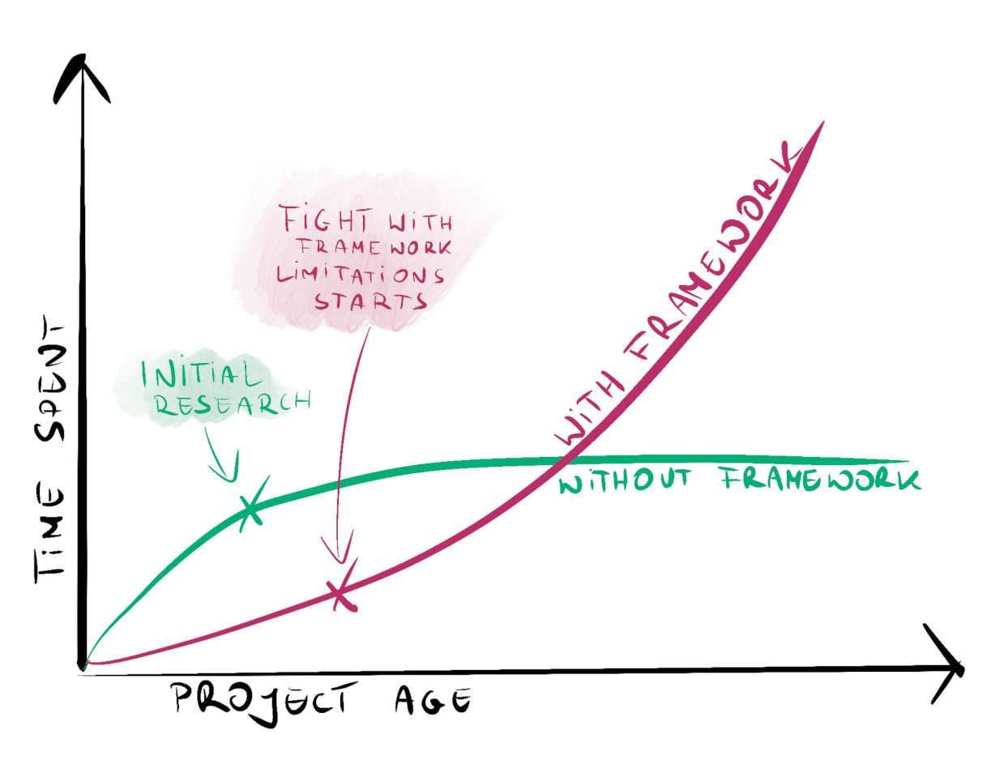

# 最好的 Go 框架：没有框架？

- 原文地址：https://threedots.tech/post/best-go-framework/
- 原文作者：Robert Laszczak
- 本文永久链接：https://github.com/gocn/translator/blob/master/2022/w49_Best_Go_Framework.md
- 译者：[鱼雷](https://github.com/b8kings0ga)
- 校对：

作为Go 语言的团队领导者这几年时间，我从初学者那里听到的最常见问题是“我应该使用什么框架？”。 我的想法是使用过去的语言经验去编写 Go 程序往往会让结果变得非常糟糕。

其他的编程语言已经建立了 “默认” 的框架。Java有Spring，Python有Django和Flask，Ruby有Rails，C#有ASP.NET，Node有Express，PHP有Symfony和Laravel。但 Go 没有默认框架，这一点跟其他编程语言完全不同。

并且，很多过来人建议你根本不应该使用框架。到底该怎么办？

从库构建 Go 服务可能会给人一种构建弗兰肯斯坦的怪物的感觉

## Go 语言哲学
Go 语言有很多框架，但没有一个提供像其他语言框架那样的功能集。**这种情况短时间内还会持续**。

你可能认为这是因为 Go 语言的生态更年轻。但更重要的是，Go 是围绕 Unix 哲学构建的，Unix 的哲学要求编写的程序需要具备以下三要素：

> * 只做一件事，并做好。
> * 程序间协同工作。
> * 处理文本流，因为这是一个通用接口。

这种哲学起源于 B 编程语言（C 语言的前身）的设计者 Ken Thompson， 并以同样的哲学思想在 2006 年创建了 Go 语言。

将 Unix 哲学运用实践中，你会编写出多个独立的软件来做好每一件事，而不是写出一个巨大的程序去做所有事情。 这些例子在 Linux 终端中就能经常看到。比如：cat example.txt | sort | uniq。 cat从文件中读取文本，sort对行进行排序，并uniq删除重复项。所有命令都是独立的，只做一件事。它源自 Unix 哲学。由于这样的设计，你可以独立开发更小的、自主的命令。

在 Go 中，Unix 哲学在标准库中随处可见。最常见的就是最广泛使用的接口：io.Reader和io.Writer。 最好的库也遵循这一理念。

框架的设计往往是 “反 Unix 哲学而行”。语言框架试图在一个框架内涵盖所有可能的用例。它们不是为与其他工具一起使用而设计的，而且通常不能重复使用。这意味着不可能将开发工作转移到其他不兼容的框架。**如果一个框架没有人用，那么针对该框架所有的所有努力都会白费。**

## 对你来说，什么才是真正重要的

每个技术决策都有代价。你需要选择项目可以承受的代价， 并从决策中获得尽量大的收益。

当你在做一个项目的简单技术验证 （Proof of Concept）时，最重要的是你可以多快的完成。但如果这是个持续时间长，涉及多人协作的大型项目时，这个技术验证带来的代价将会是巨大的。

对于大多数项目，最需要关注的是以下几点：

* 启动项目的速度
* 完成项目的速度
* 项目适应外来需求变化的能力， 这和上一点息息相关

让我们来逐条分析下影响我们决策的因素。 

## 节省时间

语言框架给出的最大承诺之一是节省时间。只需一个命令，就能启动一个可用的项目。语言框架通常提供项目的默认架构，这会对入门有点帮助。但与大多数其他技术决策一样，它也有一定的代价。

随着时间的推移，当项目增长时，你会很快碰到该语言框架的约定和限制。语言框架的需求大概率会跟你的项目有区别。语言框架提供的教学文档可能适用于简单的 CRUD 应用程序，但一般无法处理更复杂的场景。 **为了和语言框架的限制作斗争，很容易就会将启动项目所节省的时间全部浪费。**长期以往，这会给团队带来很多挫败感。

几年前，我在一家使用某个 Go 语言框架起家的公司工作。公司正在发展并且不断的创造新的服务。随着时间的推移，当我们想要支持更复杂的用例时，我们开始越发痛苦。不仅如此，长此以往，使用语言框架逐渐成为了产生严重 Bug 的主要原因。但摆脱语言框架远不如想象中容易。

有一次，一些框架组件变得无人维护并且与生态的其余部分不兼容。我们将不得不去掉它。但是， 该框架中的所有组件之间耦合非常高。从几十个服务中删除一个组件非常困难。这需要多团队协作，并大概率会带来一些事故。即使最后我们成功删除了这个组件，我也不会觉得这是件值得骄傲的事。 如果有人早点做出不同的决定，我们就可以更好的利用为了删除这个组件所花掉的时间。这也是为什么很多公司对开发团队不太信任的主要原因。

为几年前的小决定付出了高昂的代价， 这个故事是个很好的例子。

## 项目的可维护性

量化项目的可维护性一直以来都是个有争议的话题——很难比较两个项目哪个可维护性更高。一些人觉得使用语言框架很好， 使用很方便。但是对于一些复杂的项目，长期使用语言框架会使开发工作变得越来越困难。并且，还有很多人觉得跟语言框架作斗争是他们的正常工作。因此很难客观地衡量框架对项目可维护性的影响。

但是，我们可以通过一些手段真正理解它。基于《加速：精益软件科学和 DevOps》一书。这本书重点描述了如何找出表现最好和最差的团队的特点。书中提到，**想要让一个团队表现更好，最重要因素之一是让项目架构的耦合更加松散。**

我领导的团队成员经常问我如何知道我们的架构是否松散耦合。这里有一个好方法，如果你应用里的组件可以被轻松替换或删除， 说明这个应用是松散耦合的。但是， 如果大多数组件都很难被替换，改动一个组件会导致其他地方发生问题的情况，则说明你的应用耦合很高。

为什么松耦合架构如此重要？首先我们需要承认，我们是人， 即使做了最周密的准备，我们仍然可能犯错误。当你选择了错误的框架或库时，应该很容易替换它而不用重写整个项目。如果我们想节省时间，我们应该从长远来看某些决策是否有收益，而不仅仅是在项目开始时。

考虑一个场景，当你想要完全删除框架时。它需要重写大量代码么？它可以独立地在多个服务上完成吗？如果没有，你可以努力将框架与核心逻辑分开。但当你这样做时，使用框架被节省的时间就已经开始被浪费了。

## 替代方案？在没有框架的情况下构建服务

你可能觉得如果不用语言框架的话，构建服务会花费很长时间。特别是当你从其他语言转型到 Go 语言时。我懂你的痛。几年前，当我开始用 Go 语言编程时，我也有过同样的感觉。这是一种毫无理由的的恐惧。不使用语言框架不代表你需要自己编写所有代码。有许多经过验证的库可以提供你需要的功能。

你需要花更多时间做调研，寻找更好的答案。比如找到并阅读本文。在整个项目的生命周期中，几个小时的调研不算什么。足够的正确信息带来的灵活性将让你很快让项目回到正轨。

如果你决定不使用框架，你应该怎么做？开头最大的障碍可能是如何构建服务。 最简单的方法是开始时只用一个文件编写所有逻辑。一切从简，推迟一些决策，随着时间的推移改进你的项目。

拥有可用作参考的示例项目会很有帮助。你可以查看我在 GoRemoteFest 上使用 Watermill 演示在 15 分钟内构建事件驱动应用程序时使用的项目 – github.com/roblaszczak/goremotefest-livecoding。这个例子只需要两个外部库就可以正常运行。

随意克隆这个 Git 并测试。为了帮助你处理更具体的用例，下周我们将发布一篇文章，其中包含可用于构建你的 Go 服务的 Go 库列表。我们已经使用它们几年了。我们还将解释为什么我们使用这些库，以及如何知道一个外部库是否值得使用。

在不终止项目的前提下修改项目的某些部分是很实用的。

当你的项目变得更加复杂，并且你已经知道你的库如何协同工作时，你可以开始重构它。你可能不需要很多看起来很重要的框架功能。长此以往，你得到一个更简单的项目，并最终花了更少的时间去调研。

如果你正在寻找一些复杂项目的最佳实践，你应该查看 Wild Workouts - 我们们功能齐全的示例 Go 项目。我们发布了一本描述我们如何构建应用程序的书。

## 总结

当一个项目开始时，决定如何构建服务是最不应该走捷径的地方。从长远来看，错误的决定会对团队的效率产生负面影响，还会影响士气。

**在做出错误的决策后，你很快就会陷入沉没成本谬误陷阱。我们不应该成为解决他们制造的问题的英雄，而应避免制造他们。**

读完此文，你应该了解了使用语言框架的代价并了解如何做出权衡。你现在可以做出负责任的决定。我希望这篇文章至少能帮助一家公司避免需要经历跨团队经历几个月才能完成的的重构项目的痛苦。

你是否有任何关于使用语言框架的恐怖故事？评论里见！