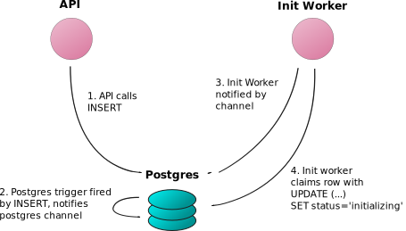

# 系统设计技巧：使用`Postgres`作为发布/订阅和作业服务器

- 原文地址：https://webapp.io/blog/postgres-is-the-answer/
- 原文作者：Colin Chartier
- 本文永久链接：https://github.com/gocn/translator/blob/master/2022/w51_System_design_hack_Postgres_is_a_great_pub_sub_&_job_server.md
- 译者：[Cluas](https://github.com/Cluas)
- 校对：[Jancd](https://github.com/Jancd)

**如果在项目中需要`发布/订阅和作业`服务器，可以尝试使用 `Postgres`。它将为您提供大量数据完整性和性能保证，并且不需要您或您的团队学习任何新技术。**

如果你正在做任何足够复杂的项目，你将需要一个[发布/订阅](https://en.wikipedia.org/wiki/Publish%E2%80%93subscribe_pattern)服务器来处理事件。本文将向你介绍 `Postgres`，解释替代方案，并引导你了解 `发布/订阅` 的一个用例及其解决方案。

**Postgres 是一个了不起的关系型数据库**

如果你对[Postgres](https://www.postgresql.org/)不太熟悉，它是一个功能丰富的关系型数据库，许多公司将其作为传统的中央数据存储。通过在 `Postgres` 中存储你的 `user` 表，你可以立即为每个活着的人扩展到 100 列每行。

这是有可能的将 `Postgres` 扩展到完全在内存中存储 10 亿条 `1KB` 的行 - 这意味着你可以在商用硬件上快速执行针对地球上所有人的全名的查询，而且几乎不需要微调。

我不打算赘述这个叫做 `PostgresSQL` 的东西是一个好的 `SQL`数据库。我将向你展示一个更有趣的使用案例，在这个案例中，我们结合一些功能，将`Postgres`变成一个强大的`发布/订阅和作业`服务器。

**`Postgres` 是一个强大的持久性`发布/订阅`服务器**

如果你做了足够多的系统设计，你将不可避免地需要解决一个关于[发布/订阅](https://en.wikipedia.org/wiki/Publish%E2%80%93subscribe_pattern)架构的问题。我们在[webapp.io](https://webapp.io/)很快就遇到了这个问题 - 我们需要让测试运行页面的浏览者和[github](https://github.com/) API 在执行任务的过程中得到通知。

对于你要使用哪种`发布/订阅`服务器，目前可以有有很多选择：

- [Kafka](https://kafka.apache.org/)
- [RabbitMQ](https://www.rabbitmq.com/)
- [Redis PUB/SUB](https://redis.io/topics/pubsub)
- 一个[供应商](https://aws.amazon.com/sqs/)[绑定的](https://cloud.google.com/pubsub/docs/overview)[云](https://docs.microsoft.com/en-us/azure/event-grid/)[供应商](https://docs.microsoft.com/en-us/azure/event-grid/)[解决方案](https://docs.microsoft.com/en-us/azure/service-bus-messaging/)
- Postgres?

很少有使用场景需要像 `Kafka` 那样的专业的`发布/订阅`服务器。`Postgres` 可以[很容易地处理每秒 10,000 次的插入](https://severalnines.com/blog/benchmarking-postgresql-performance)，而且它可以被调整到更高的数字。如果你从`Postgres`开始，然后在时机成熟时换掉系统中最关键的性能部分, 在这个过程中很少会出错。

### `发布/订阅` + 原子操作 ⇒ 不需要`工作`服务器

在上面的列表中，我跳过了与`发布/订阅`服务器类似的东西，称为 `工作队列` - 它们每次只让一个 `订阅者` 观察新的 `事件`，并保留一个未处理事件的队列：

- [Celery](http://www.celeryproject.org/)
- [Gearman](http://gearman.org/)
  事实证明，Postgres 通常也会取代`作业`服务器。你可以让你的工人`监听``新事件`通道，并在有新的工作被推送时尝试`申请`一个工作。好处是，`Postgres`让其他服务观察`事件`的状态，而不增加任何复杂性。

### 我们的用例：CI 运行着按照顺序处理的工作

在 webapp.io，当我们执行 `test runs`，首先是克隆一个资源库，然后运行一些用户指定的测试。有一些微服务开始为测试运行做各种初始化步骤，还有一些微服务（如 `websocket` 网关）需要监听任务运行的状态。


一个 API 服务器的实例通过向`Postgres`表的 `Runs` 行插入一行来创建一个运行任务：

```sql
CREATE TYPE ci_job_status AS ENUM ('new', 'initializing', 'initialized', 'running', 'success', 'error');

CREATE TABLE ci_jobs(
	id SERIAL,
	repository varchar(256),
	status ci_job_status,
	status_change_time timestamp
);

/*在 API 调用*/
INSERT INTO ci_job_status(repository, status, status_change_time) VALUES ('https://github.com/colinchartier/layerci-color-test', 'new', NOW());
```

工人如何 `申请` 一份工作？通过原子化地设置工作状态：

```sql
UPDATE ci_jobs SET status='initializing'
WHERE id = (
  SELECT id
  FROM ci_jobs
  WHERE status='new'
  ORDER BY id
  FOR UPDATE SKIP LOCKED
  LIMIT 1
)
RETURNING *;
```

最后，我们可以使用一个触发器和一个通道来通知工人可能有新的工作：

```sql
CREATE OR REPLACE FUNCTION ci_jobs_status_notify()
	RETURNS trigger AS
$$
BEGIN
	PERFORM pg_notify('ci_jobs_status_channel', NEW.id::text);
	RETURN NEW;
END;
$$ LANGUAGE plpgsql;


CREATE TRIGGER ci_jobs_status
	AFTER INSERT OR UPDATE OF status
	ON ci_jobs
	FOR EACH ROW
EXECUTE PROCEDURE ci_jobs_status_notify();
```

工人所要做的就是 `监听` 到这个频道的状态，并在工作任务的状态发生变化时尝试申请工作：

```go
tryPickupJob := make(chan interface{})
// 相当于 'LISTEN ci_jobs_status_channel;'
listener.Listen("ci_jobs_status_channel")
go func() {
  for event := range listener.Notify {
    select {
    case tryPickupJob <- true:
    }
  }
  close(tryPickupJob)
}

for job := range tryPickupJob {
  //try to "claim" a job
}
```

当我们把这些元素结合起来时，我们会得到类似以下的东西：


这种架构可以扩展到许多连续处理工作的工人，你所需要的只是为每个工作标记的 `处理中` 状态和 `已处理` 状态。对于 webapp.io 来说，这看起来像：新建、初始化、已初始化、运行、完成。
它还允许其他服务观察 `ci_jobs_status_channel` - 我们的 `/run` 页面的`websocket`网关和`github`通知服务只是监听该通道，并通知任何相关方发布的事件。

## 使用`Postgres`作为`发布/订阅`服务器的其他好处

使用`Postgres`而不是像 `Redis 发布/订阅`这样的东西，还有一堆其他的好处：

- 许多`SQL`用户已经安装了`Postgres`作为数据库使用，所以在`发布/订阅`中使用它不需要额外的设置
- 作为一个数据库，`Postgres` 有很好的持久性保证 - 很容易通过查询找出 `死掉` 的作业，例如，通过 `SELECT \* FROM ci_jobs WHERE status='initializing' AND NOW() - status_change_time > '1 hour'::interval` 来处理工人崩溃或挂起的情况
- 由于作业是用 `SQL` 定义的，所以很容易生成 `graphql` 和 `protobuf` 的表示（即提供检查运行状态的`API`）
- 很容易有多个状态变化的观察者，你可以让其他服务使用相同的 `LISTEN ci_jobs_status_channel` -`Postgres`有很好的编程语言支持，对大多数流行语言都有绑定。这与其他大多数`发布/订阅` 服务器有着明显的区别
- 你还可以对仍在你的 `工作队列` 中的事物运行复杂的 `SQL` 查询，以向你的用户提供高度定制的 `API` 端点

## 总结

如果你在项目的任何阶段需要一个`发布/订阅`或工作服务器，从使用`Postgres`开始也不失为一个好主意。它将为你提供大量的数据完整性和性能保证，而且它不需要你或你的团队学习任何新的技术。
