- 原文地址：https://teivah.medium.com/profiling-and-execution-tracing-in-go-a5e646970f5b
- 原文作者：Teiva Harsanyi
- 本文永久链接：https://github.com/gocn/translator/edit/master/2022/w53_Profiling_and_Execution_Tracing_in_Go.md
- 译者：[Fivezh](https://github.com/fivezh)
- 校对：[]()

# Go 中的性能分析和执行跟踪

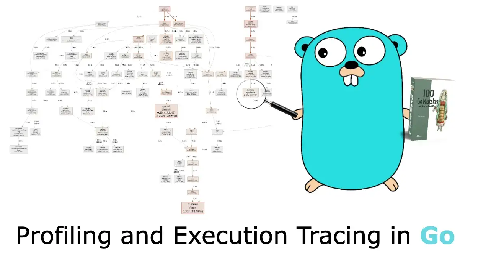

Go 提供了一些优秀的诊断工具来帮助我们深入分析应用程序的执行情况。 这篇文章核心关注点是：分析和执行跟踪器。 这两个工具都非常重要，它们应该成为任何对优化感兴趣的 Go 开发人员的核心工具集的一部分。 首先，我们来讨论下性能分析。

# 性能分析 Profiling

分析工具提供了对应用程序执行的洞察力。 它使我们能够解决性能问题、检测竞争、定位内存泄漏等。 这些信息可以通过几个分析工具来收集：

- `CPU`— 确定应用程序的时间花在了哪里
- `Goroutine`— 报告正在运行的 goroutines 堆栈跟踪
- `Heap`— 报告堆内存分配以监视当前内存使用情况并检查可能的内存泄漏
- `Mutex`— 报告锁争情况来分析代码中互斥锁使用行为以及应用程序是否在锁定调用上花费了太多时间
- `Block`— 显示 goroutines 阻塞等待同步原语的位置

性能分析是通过 `分析器(profiler)` 工具进行检测来实现的，在 Go 中使用称为 `pprof`。 首先，让我们了解如何和何时启用 `pprof`，然后再讨论最关键的配置分析类型。

## 开启 pprof

有几种方法可以启用 `pprof`。 例如，我们可以使用 `net/http/pprof` 包通过 HTTP 提供分析数据：

```
package main

import (
    "fmt"
    "log"
    "net/http"
    _ "net/http/pprof" // Blank import to pprof
)

func main() {
    // Exposes an HTTP endpoint
    http.HandleFunc("/", func(w http.ResponseWriter, r *http.Request) {
        fmt.Fprintf(w, "")
    })
    log.Fatal(http.ListenAndServe(":80", nil))
}
```

导入 `net/http/pprof` 的作用是，我们可以通过`http://host/debug/pprof` 来访问 pprof。 请注意，即使在生产环境中启用 `pprof` 也是安全的 (https://go.dev/doc/diagnostics#profiling)。 影响性能的分析，比如 CPU 分析，默认情况下是不启用的，也不会连续运行。它们仅在特定时间段内被激活。

现在我们已经了解了如何公开 `pprof` 访问路由，接下来讨论最常见的几种分析。

## CPU 分析

CPU 分析器依赖于操作系统和信号。 当它被激活时，应用程序默认通过 `SIGPROF` 信号要求操作系统每 10 毫秒中断一次。 当应用程序收到 `SIGPROF` 时，它会暂停当前活动并将执行转移到分析器。 分析器收集诸如当前 goroutine 活动之类的数据，并汇总可以检索的执行统计信息；然后停止分析并继续执行直到下一次的 `SIGPROF`。

我们可以访问 [/debug/pprof/profile](https://teivah.medium.com/debug/pprof/profile) 路由来激活 CPU 分析。 默认情况下，访问此路由会执行 30 秒的 CPU 分析。 在 30 秒内，我们的应用程序每 10 毫秒中断一次。 请注意，可以更改这两个默认值：使用 `seconds` 参数将分析应该持续多长时间传递给路由（例如 [/debug/pprof/profile?seconds=15](https://teivah.medium.com/debug/pprof/profile?seconds=15)），也可以更改中断率（甚至小于 10 毫秒）。 但多数情况下，10 毫秒应该足够了，在减小这个值（意味着增加频率）时，我们应该注意不要对性能产生影响。 30 秒后，就可以下载 CPU 分析器的结果。

**注意：** 也可以通过  `-cpuprofile` 标志来开启 CPU 分析器，比如在运行基准测试时就可以用这种方式。 例如，执行以下命令后可通过 `/debug/pprof/profile` 下载到相同的分析结果文件。

```
$ go test -bench=. -cpuprofile profile.out
```

从这个文件，我们可以使用 `go tool` 来查看结果分析：

```
$ go tool pprof -http=:8080 <file>
```

此命令会打开一个显示调用图的 Web UI。 图 1 显示了一个示例。 箭头越大，这条分支就越是热路径。 通过可以分析此图表就可以进一步分析程序的执行情况。

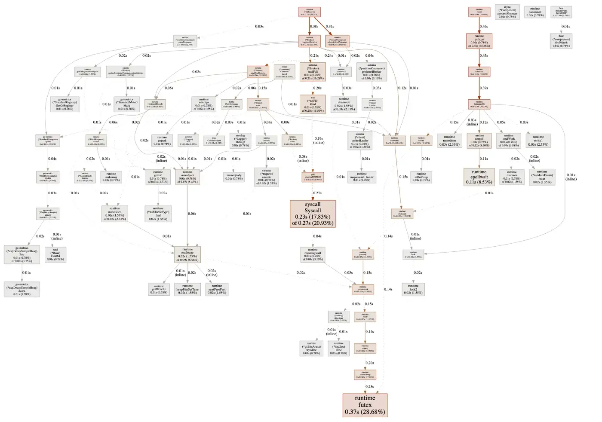

**图1:** 程序在30秒内的调用图

例如，图2 中的图表告诉我们，在 30 秒内，`*FetchResponse` 接收者的`decode`方法花费了 0.06 秒。 在这 0.06 秒中，0.02 秒用于`RecordBatch.decode`，0.01 秒用于`makemap`（创建一个map）。

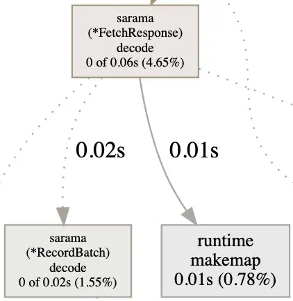

**图2:** 调用图示例

我们还可以从具有不同表示形式的 Web UI 访问此类信息。 例如，Top 视图按执行时间对函数进行排序，而 Flame Graph 可视化执行时间层次结构。 UI 甚至可以逐行显示源代码中执行最耗时的部分。

**注意:** *我们还可以通过命令行深入分析数据。 然而，这篇文章中专注于 Web UI。*

多亏了这些数据，我们可以大致了解应用程序的行为方式：

- 对 runtime.mallogc 的调用过多，意味着我们可以尝试减少过多的小堆分配。
- 在通道操作或互斥锁上花费太多时间，可能表明过度竞争正在损害应用程序的性能。
- 在 `syscall.Read` 或 `syscall.Write` 上花费太多时间，意味着应用程序在内核模式下花费了大量时间。 处理 I/O 缓冲可能是改进的途径。

这些是可以从 CPU 分析器中获得的信息。 了解最频繁的代码路径和识别程序瓶颈是很有价值，但它不会确定超过特定频率，因为 CPU 分析器是以固定速度执行分析的（默认情况下为 10 毫秒）。 为了获得更细粒度的分析数据，我们应该使用跟踪器(`tracing`)，将在本文后面讨论。

**注意:** *我们还可以为不同的功能附加标签。 例如，想象一个从不同客户端调用的通用函数，要跟踪两个客户端花费的时间，可以使用 pprof.Labels。*

## 堆分析

堆分析允许我们获得有关当前堆使用情况的统计信息。 与 CPU 分析一样，堆分析也是基于采样的。 可以改变采样频率，但不应该过于细化，因为采样频率提升越多，堆分析收集数据所需的额外工作就越多。 默认情况下，样本在每 512 KB 堆分配一次就执行一次。

访问 [/debug/pprof/heap/](https://teivah.medium.com/debug/pprof/heap/)，会得到难以阅读的原始数据。 但是，可以使用 [/debug/pprof/heap/?debug=0](https://teivah.medium.com/debug/pprof/heap/?debug=0) 下载堆分析文件，然后使用  `go tool`（与上一节中的命令相同）打开，就可以使用 Web UI 来分析数据。

图3 显示了堆图的示例。 调用`MetadataResponse.decode`方法会导致分配 1536 KB 的堆数据（占总堆的 6.32%）。 但是，这 1536 KB 中有 0 块是由该函数直接分配的，因此我们需要检查第二层的调用。 `TopicMetadata.decode` 方法分配了 1536 KB 中的 512 KB； 其余的——1024 KB——是用另一种方法分配的。

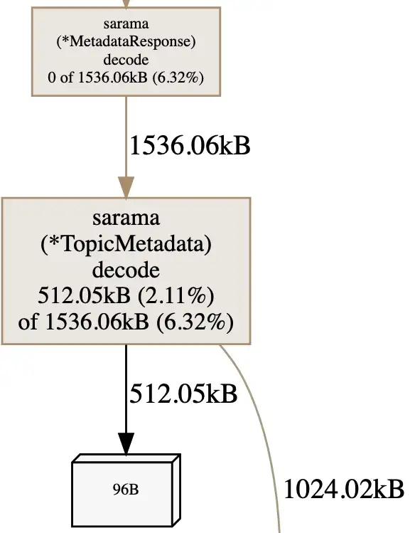

**图3:** 堆分配图示

这就是我们如何通过调用链分析应用程序哪个部分占用了大量堆分配。 还可以查看不同的采样类型：

- `alloc_objects`— 分配的对象总数
- `alloc_space`— 分配的内存总量
- `inuse_objects`— 已分配但尚未释放的对象数
- `inuse_space`— 已分配但尚未释放的内存量

堆分析的另一个非常有用的功能是跟踪内存泄漏。 基于 GC 类的语言，通常的过程如下：

1. 触发GC。
2. 下载堆数据。
3. 等待几秒/分钟。
4. 触发另一个GC。
5. 下载另一个堆数据。
6. 比较。

在下载数据之前强制执行 GC 是一种防止错误假设的方法。 如果在没有先运行 GC 的情况下看到保留对象的峰值，我们无法确定这是泄漏还是下一次 GC 将收集的对象。

使用 `pprof`，可以下载堆分析文件并同时强制执行 GC。 Go中的过程如下：

1. 访问 [/debug/pprof/heap?gc=1](https://teivah.medium.com/debug/pprof/heap?gc=1)（触发 GC 并下载堆分析文件）
2. 等待几秒/分钟
3. 再次访问 [/debug/pprof/heap?gc=1](https://teivah.medium.com/debug/pprof/heap?gc=1)
4. 使用 go tool 比较两个堆配置文件：

```
$ go tool pprof -http=:8080 -diff_base <file2> <file1>
```

图4 显示了可以访问的数据类型。 例如，`newTopicProducer`方法（左上角）占用的堆内存量减少了 (–513 KB)。 相比之下，`updateMetadata`（右下角）持有的数量增加了（+512 KB）。 缓慢增加是正常的。 例如，第二个堆分析文件可能是在服务调用过程中计算出来的。 可以重复此过程或等待更长时间； 重要的部分是跟踪特定对象分配的稳步增长。

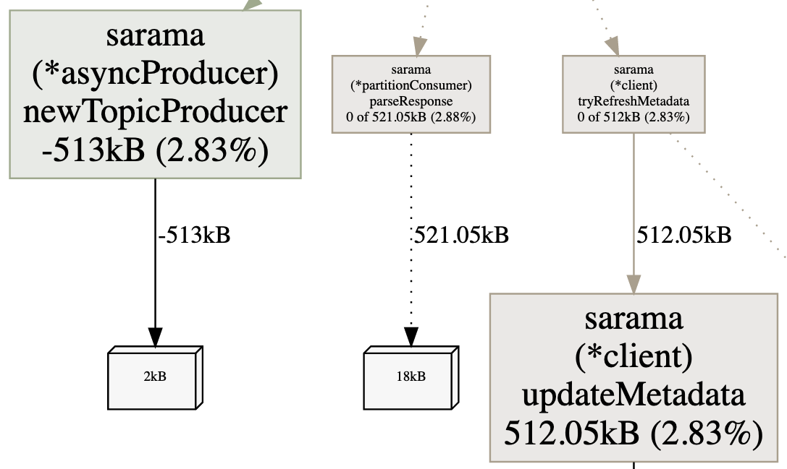


**图4:** 两份堆分析文件的差异

**注意:** *与堆相关的另一种分析类型是* `allocs`*，它报告分配。 堆分析显示堆内存的当前状态。 要了解自应用程序启动以来过去的内存分配情况，我们可以使用分配分析。 如前所述，由于堆栈分配的成本很低，因此它不是此分析的一部分，该分析仅关注堆。*

## Goroutine 分析

`goroutine` 分析可以反映出应用程序中所有当前 goroutine 的堆栈跟踪。 可以使用 [/debug/pprof/goroutine/?debug=0](https://teivah.medium.com/debug/pprof/goroutine/?debug=0) 下载文件并再次使用 go tool。 图5 显示了可以获得的信息类型。

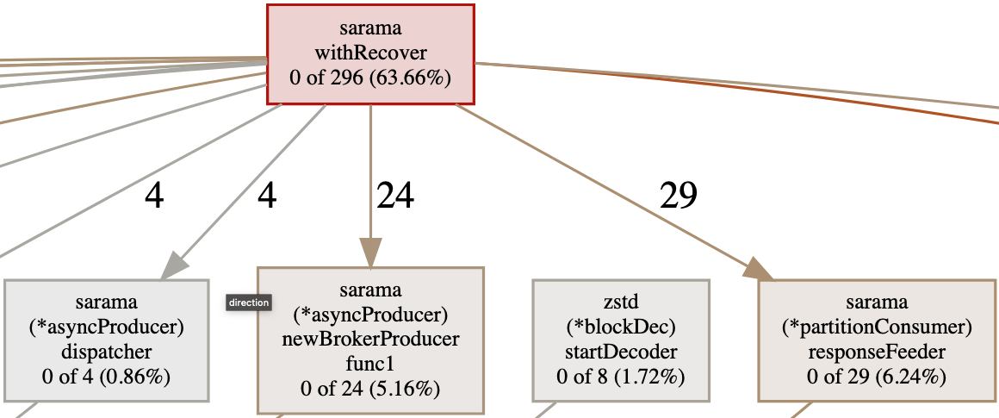

**图5:** Goroutine图示

我们可以看到应用程序的当前状态以及每个函数创建了多少 goroutine。 在这种情况下，`withRecover` 创建了 296 个正在进行的 goroutines (63%)，其中 29 个与调用 `responseFeeder` 有关。

如果怀疑 goroutine 泄漏，这种信息也很有用。 可以查看 goroutine 分析器数据以了解系统的哪一部分是可疑的。

## Block 阻塞分析

`block` 分析可以反映出正在进行的 goroutines 阻塞等待同步原语的位置。 可能性包括：

- 在无缓冲通道上发送或接收
- 向已满的通道发送数据
- 从空通道接收数据
- 互斥锁竞争
- 网络或文件系统等待

块分析还记录了 goroutine 等待的时间，可以通过 [/debug/pprof/block](https://teivah.medium.com/debug/pprof/block) 访问。 如果我们怀疑性能因阻塞调用而受到损害，此分析文件可能会非常有用。

默认情况下不启用 `block` 分析，必须显式调用 `runtime.SetBlockProfileRate` 来启用它。 此函数控制报告的 goroutine 阻塞事件的比例。 启用后，即使我们不调用 [/debug/pprof/block](https://teivah.medium.com/debug/pprof/block)，分析器也会继续在后台收集数据。 如果我们想设置高速率，请谨慎行事，以免对性能产生影响。

**注意:** *如果我们遇到死锁或怀疑 goroutines 处于阻塞状态，完整的 goroutine 堆栈转储 (*[*/debug/pprof/goroutine/?debug=2*](https://teivah.medium.com/debug/ pprof/goroutine/?debug=2)*) 创建所有当前 goroutine 堆栈跟踪的转储，作为分析的第一步，这将是很有帮助的。 例如，以下转储显示 Sarama goroutine 在通道接收操作中阻塞了 1,420 分钟：*

```
goroutine 2494290 [chan receive, 1420 minutes]:
github.com/Shopify/sarama.(*syncProducer).SendMessages(0xc00071a090,
[CA]{0xc0009bb800, 0xfb, 0xfb})
    /app/vendor/github.com/Shopify/sarama/sync_producer.go:117 +0x149
```

## Mutex 互斥锁分析

最后一个分析类型与阻塞有关，但仅与互斥锁有关。 当我们怀疑应用程序花费大量时间等待互斥锁而影响了正常执行时，可以使用互斥量分析。 它可以通过 [/debug/pprof/mutex](https://teivah.medium.com/debug/pprof/mutex) 访问。

此分析的工作方式类似于阻塞。 默认情况下它是禁用的：必须使用 `runtime.SetMutexProfileFraction` 来启用，并控制报告中互斥锁争用事件的比例。

以下是关于分析的一些附加说明：

- 这里没有提及 `threadcreate` 分析，因为它自 2013 年以来已经无法使用 (https://github.com/golang/go/issues/6104)。
- 确保一次只启用一个分析器：例如，不要同时启用 CPU 和堆分析器。 这样做会导致错误的观察。
- `pprof` 是可扩展的，我们可以使用 `pprof.Profile` 创建自定义分析。

至此，已经看到了可以启用的最重要的分析，它们可以帮助了解应用程序的执行方式和可能的优化途径。 通常，建议启用 `pprof`，即使在生产中也是如此，因为在大多数情况下，它在其足迹和可以从中获得的分析能力之间提供了极好的平衡。 某些分析（例如 CPU 分析）会导致性能下降，但仅在启用它们期间才会发生。

现在让我们看看执行跟踪器。

# 执行跟踪器（Execution Tracer）

执行跟踪器是一种工具，可以使用 `go tool` 捕获各种运行时事件，使它们可用于可视化。 它对以下方面有帮助：

- 了解运行时事件，例如 GC 如何执行
- 理解 goroutines 是如何执行的
- 识别不良的并行执行

让我们以 [Go 中的并发并不总是更快](https://medium.com/@teivah/concurrency-isnt-always-faster-in-go-de325168907c) 帖子为例来尝试一下。 这里讨论了归并排序算法的两个并行版本。 第一个版本的问题是并行化不佳，导致创建了太多的 goroutine。 让我们看看跟踪器如何帮助验证这一说法。

为第一个版本编写一个基准测试，并使用 `-trace` 标志执行以开启执行跟踪器：

```
$ go test -bench=. -v -trace=trace.out
```

**NOTE:** 还可以使用 [/debug/pprof/trace?debug=0](https://teivah.medium.com/debug/pprof/trace?debug=0) 路由下载远程跟踪文件。

这一命令创建了一个 trace.out 文件，我们可以通过 `go tool` 来打开它：

```
$ go tool trace trace.out
2021/11/26 21:36:03 Parsing trace...
2021/11/26 21:36:31 Splitting trace...
2021/11/26 21:37:00 Opening browser. Trace viewer is listening on
    http://127.0.0.1:54518
```

打开浏览器访问此地址，就可以单击 View Trace 查看特定时间范围内的所有轨迹，如图6 所示。该图表示了大约 150 毫秒。 我们可以看到多个有用的指标，例如 goroutine 数量和堆大小。 堆大小稳定增长，直到触发 GC。 还可以观察每个 CPU 内核的 Go 应用程序的活动。 时间范围从用户级代码开始； 然后执行STW，占用四个 CPU 内核大约 40 毫秒。

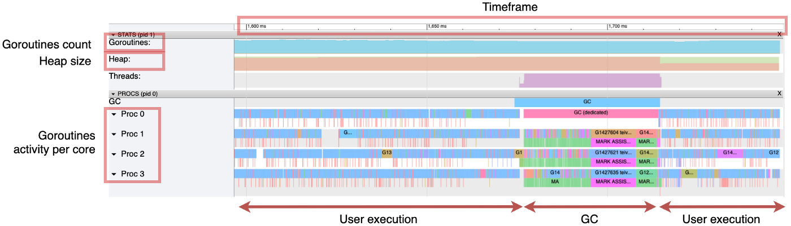


**图6:** 显示 goroutine 活动和运行时事件，例如 GC 阶段

关于并发性，我们可以看到这个版本使用了机器上所有可用的 CPU 内核。 然而，图7 放大了 1 毫秒的一部分。 每个条对应于一个 goroutine 执行。 有太多的小条看起来不对：这意味着执行的并行化很差。

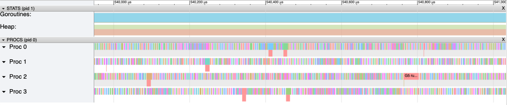

**图7:** 太多的小条意味着并行执行不佳

图8 进一步放大以查看这些 goroutine 是如何编排的。 大约 50% 的 CPU 时间没有花在执行应用程序代码上。 空白表示 Go 运行时启动和编排新 goroutine 所需的时间。

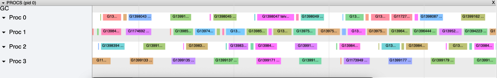

**图8:** 大约 50% 的 CPU 时间花在处理 goroutine 切换上

将其与第二个并行实现进行比较，后者快了大约一个数量级。 图9 再次放大到 1 毫秒的时间范围。

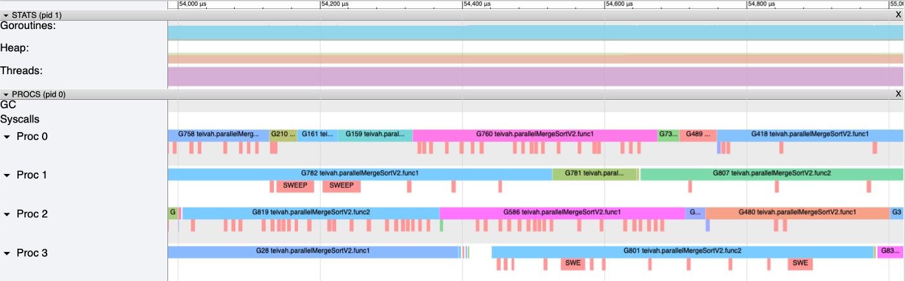

**图9:** 空白的数量已明显减少，证明 CPU 已被更充分地占用

每个 goroutine 需要更多的时间来执行，并且空白的数量已经显着减少。 因此，CPU 比第一个版本更忙于执行应用程序代码。 CPU 时间的每一毫秒都得到了更有效的利用，这解释了基准测试的差异。

请注意，跟踪的粒度是每个 goroutine，而不是像 CPU 分析那样的每个函数。 但是，可以使用 `runtime/trace` 包定义用户级任务以获取每个函数或函数组的分析能力。

例如，假设一个函数计算斐波那契数，然后使用原子操作将其写入全局变量。可以定义两个不同的任务：

```
var v int64
// Creates a fibonacci task
ctx, fibTask := trace.NewTask(context.Background(), "fibonacci")
trace.WithRegion(ctx, "main", func() {
    v = fibonacci(10)
})
fibTask.End()

// Creates a store task
ctx, fibStore := trace.NewTask(ctx, "store")
trace.WithRegion(ctx, "main", func() {
    atomic.StoreInt64(&result, v)
})
fibStore.End()
```

使用 `go tool` 可以获得关于这两个任务如何执行的更精确的信息。 在前面的跟踪 UI（图 12）中我们可以看到每个 goroutine 的每个任务的边界。 在用户定义的任务中，我们可以遵循持续时间分布（见图 10）。

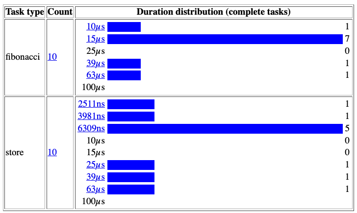

**图10:** 用户级别任务分布

我们看到，在大多数情况下，`fibonacci` 任务的执行时间不到 15 微秒，而 `store` 任务的执行时间不到 6309 纳秒。

在上一节中，我们讨论了可以从 CPU 分析中获得的不同分类信息。 与用户级跟踪中获得的数据相比，主要区别是什么？

- CPU 分析：
   – 基于采样
   – 每个函数
   – 不低于采样率（默认为 10 毫秒）
- 用户级跟踪：
   – 不是基于样本的
   – 每个 goroutine 执行（除非使用 `runtime/trace` 包）
   – 时间执行不受任何速率的约束

总之，执行跟踪器是了解应用程序如何执行的强大工具。 正如在归并排序示例中看到的那样，可以识别出并行执行不佳的情况。 然而，跟踪器的粒度仍然是每个 goroutine，除非手动使用 `runtime/trace` 与 CPU 分析进行比较，例如。 在优化应用程序时，可以同时使用分析和执行跟踪器来充分利用标准的 Go 诊断工具。

这篇文章摘自我的书，[*100 个 Go 错误以及如何避免它们*](https://www.manning.com/books/100-go-mistakes-and-how-to-avoid-them)， 于 2022 年 8 月发布（错误 *#98*）。

> 100 个 Go 错误以及如何避免它们。*展示如何用惯用的、富有表现力的代码替换 Go 中的常见编程问题。 在其中，将探索许多有趣的示例和案例研究，同时学习如何发现自己的应用程序中可能出现的错误。*
>

同时，这里是 GitHub 存库，总结了本书中的所有错误：https://github.com/teivah/100-go-mistakes