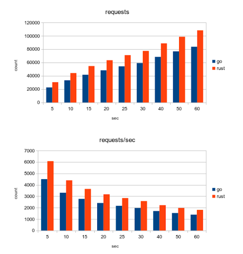

# Golang vs Rust —— 服务端编程应该选择哪种语言

- 原文地址：<https://medium.com/@golang_company/golang-vs-rust-which-language-to-be-choose-for-server-side-programming-628cd81c1184>
- 原文作者：Golang Company
- 本文永久链接：<https://github.com/gocn/translator/blob/master/2023/w01_golang_vs_rust.md>
- 译者：[pseudoyu](https://github.com/pseudoyu)
- 校对：[小超人](https://github.com/focozz)

为服务端编程选择一种语言应该基于你的长期目标和项目的要求，因此，盲目地问我应该雇用 Go 开发人员还是应该选择 Rust 进行开发并不能帮助你解决问题。然而，如果你发现自己陷入了困境，那么这篇博客将为你解惑。那么，让我们开始吧。

Go 是一种静态类型的、AOT 编译的语言，而 Rust 是一种静态、强类型与 AOT 编译的语言，也是一种多范式、高级和通用的语言。

让我们从多方位来评估这两种语言。

## 1. Go 与 Rust 的简单性比较

- 简单性是 Go 的主要卖点之一。开发者只需要几天甚至几个小时就能上手 golang，而 Rust 则可能需要数周，这会对团队合作产生很大的影响。
- Go 程序容易解读、编写，便于在大型团队中进行管理。而 Rust 是一门非常复杂的语言，需要学习成本，要想熟练运用，则需要花费更多的时间。
- 此外，各种有用的功能已被纳入 1.18 版本中，如 Golang 中一度缺失的泛型。

## 2. Go 与 Rust 的性能比较

- 说到性能，Golang 和 Rust 都是非常受欢迎的。它们有很好的内部高性能工具来管理依赖关系与编译。由于其对线程运行方式和线程间资源共享方式的完美控制，Rust 几乎总是能在运行时基准测试中击败 Go。
- 两种语言 -- Rust 和 Go -- 使用了类似的格式化工具。Rust 有 rustfmt，Go 有 gofmt，它们会自动按照规范的风格重新格式化你的代码。
- Go 对架构的细节进行了抽象，以帮助程序员集中精力解决手头的问题，这与我们在 Rust 中了解到的情况完全相反。
- 虽然 Go 与 Rust 相比运行速度较为逊色，但它的开发和编译速度更快。这是因为 Rust 编译器进行了大量的优化和检查，这也使得 Rust 不适合于大型项目。
- 然而，在部署时，它们都是一样的。它们产生静态的二进制文件作为输出。你并不需要一个解释器来运行它。

同时，如果你被微服务开发或用 Golang 构建服务端程序所困扰，你应该从 Golang.Company [雇佣 Go 开发者](https://golang.company/go-developers)，他们会协助你完成各个环节，并为你建立一个可扩展的、强大的应用程序。

下图描述了 Rust 和 Go 之间的基准测试状况。

## 3. Go 与 Rust 的并发比较

- Go 对并发性有很好的支持，大多数开发者认可 goroutines 和 channel 是 Golang 最好的功能。然而，这些特性在 Rust 中也有，可以通过标准库或第三方库（如 Tokio）使用。
- Rust 的并发模型被视为“正确的”，这意味着编译器在编译时，在程序执行之前，就能够捕捉到一类线程安全的错误。这使得开发者可以避免一些错误，比如在没有任何同步的情况下将其写入同一个共享变量中。
- Goroutines 可以理解为轻量级的线程，是运行时管理的 Go 对象，并在操作系统线程之间进行调度。goroutines 非常容易创建，而且消耗很低，堆栈的大小可以随时间调整。因为操作系统线程的成本远高于 goroutines，开发者可以建立成千上万的 goroutines 来代替。
- Go 的这种解决方案的缺点是增加了 CPU 和内存开销。然而，Rust 对这个问题有一个解决方案，它努力将即使是微小的开销也降到最低。

## 4. Go 与 Rust 的错误处理比较

- 这两种编程语言在处理错误方面使用类似的方式。在 Golang 中，除了错误之外，函数还将返回几个值。Rust 使用专用的枚举类型来处理错误, 它有两个子类型, Result 类型和 Err 类型。
- 错误处理可以通过用问号（?）来解开，使其不像 Golang 那样冗长。对于这两种语言来说，处理方式都很详细和清晰。
- 这些方法可以帮助开发者定位没有得到正确处理的方法，这也使得 Rust 和 Go 中的代码编写更容易、更安全。

如果你想知道语言流行度趋势，可以看如下图表。

## 5. 内存安全和安全性

- Rust 创新性地在编译时使用所有权机制来确保内存安全, 所以开发者必须做一些列措施以确保代码的安全。编译器是非常“严格”的，因为它不会让任何不安全的内存代码通过。Rust 还提出了多种并发模型，以确保在内存安全方面没有漏洞。
- 而 Go 并不是内存安全的，在 Go 中，非原子性的多字结构实现了接口和分片。此外，数据竞争会导致无效值，有时甚至会导致内存损坏。
- 然而，Go 和 Rust 都可以被认为在处理 use-after-free 和悬空指针方面是安全的。Go 使用自动垃圾收集器来限制与内存泄漏有关的问题。另一方面，所有权和借用功能是 Rust 的一大特色。根据这个原则，每个项目都有一个所有者，该所有者可以借出或将其转交给其他人。
- Rust 还允许我们建立许多不可变的引用或有且只有一个的可变引用。通过这种方法，Rust 无需垃圾收集器就能解决内存问题，在性能上优于 Golang。
- 然而，有一点是你必须记住的。即使 Rust 编译器在捕捉内存错误方面非常高效，并帮助你写出了性能非常好的代码，它也是有代价的。这就是彼得-帕克原则，这意味着你在使用 Rust 时必须非常小心。

下面是一张描述 Go 和 Rust（以及 Java）之间内存使用情况的图表。

## 6. 社区

- Golang 是在 2009 年出现的，而 Rust 是在 2013 年开始的，再加上 Golang 的简单性，它因此成为了最受开发者欢迎的语言之一。
- 此外，Go 中的库和框架比 Rust 更成熟，尤其是与网络开发有关的库和框架。
- 然而，Rust 的开发者非常善于沟通，而且作为一种像 Go 一样的开源语言，会有进一步的发展。

## 7. 职业前景

- 最后，职业前景是你必须考虑的一个方面。如果你的目标是被雇用，你应该看一下拥有最多工作机会的市场。你可以看到几乎没有 Rust 相关的工作，却有很多 Golang 的。
- 使用 Golang 的公司有谷歌、Uber、Twitch、Dailymotion、SendGrid、Dropbox、Soundcloud 等，而使用 Rust 的公司有则有 Brave（Github）、Atlassian、Amazon、Discord 等。
- Rust 开发者的平均年薪约为 12 万美金。然而，Golang 开发者的平均年薪约为 13.5 万美元。

如果你的项目涉及到 Web 开发及可分发的服务器，那么建议你选择 Go。编程部分非常简单，而且并发模型会对你有很大的帮助。但是如果你要开发一个 CLI 应用程序，那么你应该选择 Rust，因为它包含了字符串处理相关库。虽然如此，Rust 并不是一门那么容易掌握的语言。
