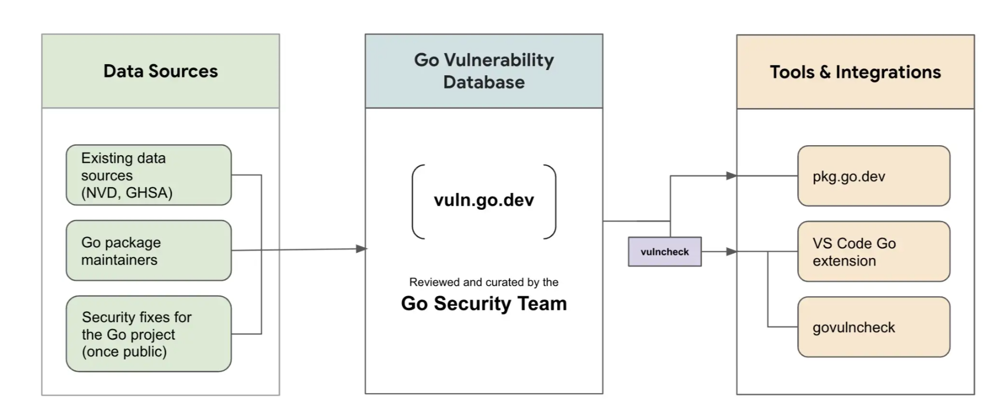
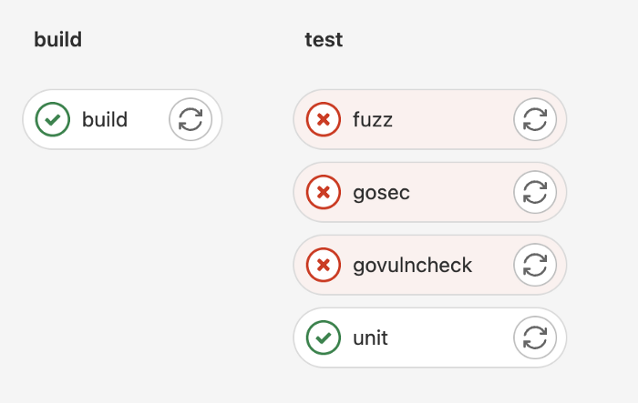
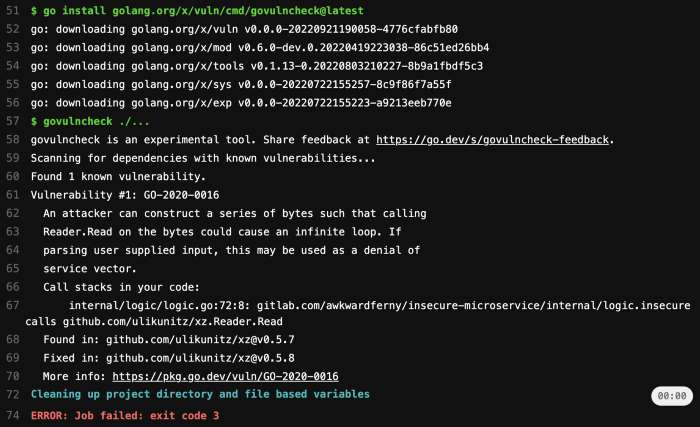

# Go 🐿 Application Security and AppSec Automation Made Easy

GoLang is one of the most popular languages for cloud applications, it even builds up most of [Kubernetes](https://kubernetes.io/) ⎈.

With that being said, according to the [Nautilus 2022 Cloud Native Threat report](https://info.aquasec.com/cloud-native-threat-report-2022?keyword=cloud attacks&campaignID=13175856474&matchtype=e&adgroupID=139880821361&device=c&utm_source=adwords&utm_campaign=Threats_US&utm_medium=cpc&utm_term=cloud attacks&utm_content=139880821361&utm_content=596105541264&hsa_acc=4069508776&hsa_src=g&hsa_ad=596105541264&hsa_kw=cloud attacks&hsa_ver=3&hsa_mt=e&hsa_grp=139880821361&hsa_net=adwords&hsa_cam=13175856474&hsa_tgt=kwd-320040970222), threat actors broadened their targets to include CI/CD environments and vulnerable Kubernetes deployments and applications.

Over time the amount and types of attacks targeting Kubernetes environments has continued to *increase*. Based on attacks that [AquaSec](https://www.aquasec.com/) observed, the number of malicious images with the potential to target Kubernetes environments increased by **10%** from 2020 (***9%\***) to 2021 (***19%\***). This is why it’s more important than ever to secure your GoLang application!


In this blog post, I will show different ways to scan your application source code for vulnerabilities, as well as how to integrate security scanners into a CI/CD platform like GitLab. I will provide real-world examples with an [**insecure microservice**](https://gitlab.com/awkwardferny/insecure-microservice) I have created.

## **Prerequisites**

- Basic understanding of the [Go programming language](https://go.dev/doc/tutorial/getting-started)
- Basic knowledge of [Git](https://www.atlassian.com/git/tutorials)
- Basic understanding of [application security](https://www.udemy.com/course/introduction-to-application-security-appsec/)
- [GitLab account (Free)](https://gitlab.com/)
- [Go version 1.19+](https://go.dev/dl/) (I used the below)

```
$ go versiongo version go1.19.1 darwin/amd64
```

# **Security Scanners**

By running security scanners before pushing code, we can detect and remediate vulnerabilities before we deploy our code to a production-level environment. I will go over how to use a variety of different security scanners for Go such as [***GoSec\***](https://github.com/securego/gosec), [***GoVulnCheck\***](https://go.dev/blog/vuln), and [***Fuzz\***](https://go.dev/security/fuzz/).

First we can start by setting up a proper `GOPATH`, adding `GOPATH/bin` to our `PATH`, and cloning the [**insecure microservice**](https://gitlab.com/awkwardferny/insecure-microservice). Additional information on paths can be found [here](https://go.dev/doc/tutorial/compile-install).

```
# Set the appropriate GOPATH
$ export GOPATH=/path/to/your/go/projects# Add your GOPATH bin directory to your PATH
$ export PATH=$PATH:$GOPATH/bin# Go into your GOPATH
$ cd $GOPATH# Create the proper directory structure
$ mkdir -p src/gitlab.com/awkwardferny# Clone application which we will be scanning
$ git clone git@gitlab.com:awkwardferny/insecure-microservice.git src/gitlab.com/awkwardferny/insecure-microservice# Go into the application root
$ cd src/gitlab.com/awkwardferny/insecure-microservice
```

Now that we have the paths correctly setup and the application has been cloned, we can start running our security scanners!

# **GoSec (Source Code Analysis)**

The first security scanner we will cover is [GoSec](https://github.com/securego/gosec). It is a popular Go security scanner which scans your application’s source code and dependencies for vulnerabilities. It works by pattern matching your source code against a set of rules.


GoSec mascot 🚓

GoSec will also automatically scan your application *dependencies* for vulnerabilities if the go module is turned on (e.g.`GO111MODULE=on`) or if you explicitly download the *dependencies* (`go get -d`). Now let’s run GoSec on our [**insecure microservice**](https://gitlab.com/awkwardferny/insecure-microservice):

```
# Install GoSec
$ go install github.com/securego/gosec/v2/cmd/gosec@latest# Run GoSec
$ gosec ./...
```

After the scanner has run we can take a look at the vulnerabilities we found:

```
G404 (CWE-338): Use of weak random number generator (math/rand instead of crypto/rand) (Confidence: MEDIUM, Severity: HIGH)G114 (CWE): Use of net/http serve function that has no support for setting timeouts (Confidence: HIGH, Severity: MEDIUM)G104 (CWE-703): Errors unhandled. (Confidence: HIGH, Severity: LOW)G104 (CWE-703): Errors unhandled. (Confidence: HIGH, Severity: LOW)G104 (CWE-703): Errors unhandled. (Confidence: HIGH, Severity: LOW)G104 (CWE-703): Errors unhandled. (Confidence: HIGH, Severity: LOW)
```

These vulnerabilities show that our application has many *uncaught exceptions*, is *not setting timeouts*, and *uses a weak random number generator*. The scan returns the [***Rule Triggered\***](https://github.com/securego/gosec#available-rules), [***Common Weakness Enumeration(CWE)\***](https://cwe.mitre.org/), ***Confidence\***, ***Severity,\*** and the ***Affected Line of Code\*** (Not Pictured).

In a typical developer workflow, after vulnerabilities are found, the developer can examine the *CWE* for tips on remediation, make code changes to the affected line(s) of code, and then re-run the scanner to check for resolution. Regression tests should be run to make sure our application logic is still sound.

# **Govulncheck** **(Source Code Analysis)**

Next up is [Govulncheck](https://go.dev/blog/vuln)! Govulncheck is a security scanner for source code and application dependencies. It is under active development by the Go security team and is different than GoSec in a few ways:

***First\*** it is backed by the [Go vulnerability database](https://vuln.go.dev/).

***Second\*** it only displays vulnerabilities which your code is actually calling. This reduces noise and lets you know what vulnerabilities actually affect your application.

Below is the architecture diagram for Govulncheck, showing its *datasources*, the *vulnerability database*, *tools*, and *integrations*.



Govulncheck architecture diagram

Now let’s give it a spin! ⚙️

```
# Install govulncheck
$ go install golang.org/x/vuln/cmd/govulncheck@latest# Run govulncheck
$ govulncheck ./...
```

After the scanner has run, let’s take a look at its findings:

```
Vulnerability #1: GO-2020-0016An attacker can construct a series of bytes such that calling Reader. Read on the bytes could cause an infinite loop. If
parsing user supplied input, this may be used as a denial of service vector.Call stacks in your code:internal/logic/logic.go:63:8: gitlab.com/awkwardferny/insecure-microservice/internal/logic.insecure calls github.com/ulikunitz/xz.Reader.ReadFound in: github.com/ulikunitz/xz@v0.5.7
Fixed in: github.com/ulikunitz/xz@v0.5.8
More info: https://pkg.go.dev/vuln/GO-2020-0016
```

You can see that the scanners presents us with a ***Vulnerability Rule Reference\***, ***Description\***, ***Affected Line of Code\***, ***Vulnerable Dependency\***, ***Resolution\***, and a ***Link to Additional Info\***.

Because I’m using ***github.com/ulikunitz/xz@v0.5.7\*** as a *dependency* in my application and calling ***xz.Reader.Read\***, my application is vulnerable to [DDoS](https://www.cloudflare.com/learning/ddos/what-is-a-ddos-attack/) attacks. This vulnerability was detected by the [GO-2020–016](https://github.com/golang/vulndb/blob/master/data/reports/GO-2020-0016.yaml) rule from the Go vulnerability database.

In a typical workflow, a developer would update the dependency version and then rerun the scanner as well as ***unit\*** and ***functional\*** tests in order to ensure the application does not break.

# **Fuzz (Fuzz-Testing)**

And last we are going to go over fuzz testing. Fuzz testing is the practice of inputing ***random/malformed\*** data into an application in an attempt to reveal security issues or bugs. Go has a native fuzzing library called [fuzz](https://go.dev/security/fuzz/).

[Fuzz](https://go.dev/security/fuzz/) performs ***coverage-based\*** fuzz tests which are written similar to *unit-tests* and are performed on application functions. They are good at finding edge-cases/bugs you may miss in your own *unit-tests*. Let’s look at this fuzz test example below:

```
func FuzzAdd(f *testing.F) {
  f.Add("1", "2")
  f.Fuzz(func(t *testing.T, a string, b string) {
    result, err := add(a, b)
    if err != nil {
      t.Errorf(fmt.Sprintf("error: %v", err))
    }    intA, _ := strconv.Atoi(a)
    intB, _ := strconv.Atoi(b)
    expected := intA + intB    if result != expected {
      t.Errorf(fmt.Sprintf("expected %v, got %v", expected, result))
    }
  })
}func add(a string, b string) (c int, e error) {
  intA, err := strconv.Atoi(a)
  if err != nil {
    return 0, nil
  }  intB, err := strconv.Atoi(b)
  if err != nil {
    return 0, nil
  }  return (intA + intB), nil
}
```

We can see that ***FuzzAdd()\*** is written similar to a unit test. We enable fuzz testing by adding **f.Fuzz(func(t \*testing.T, a string, b string)**, which calls the ***add(\*a string, b string\*)\*** function, supplying random data for variables ***a\*** and ***b\***. Then it compares the *result* against the *expected* value.

The ***add()\*** function, simply converts 2 strings into integers and then adds them up and returns the result.

The ***FuzzAdd()\*** test runs correctly with the [***seeded data\***](https://go.dev/security/fuzz/#glos-seed-corpus)`f.Add("1", “2”),`but what happens when there’s malformed or random data? Let’s run our fuzz test and find out:

```
# Run the fuzz tests
$ go test ./internal/logic -fuzz FuzzAdd
```

We can see that the scanner detected an error:

```
--- FAIL: FuzzAdd (0.10s)
    --- FAIL: FuzzAdd (0.00s)
        logic_test.go:44: expected 1, got 0
    
    Failing input written to testdata/fuzz/FuzzAdd/9f4dc959af0a73c061c4b4185e9fdb9e5dbfc854cccce7bf9199f0f5556c42a9
    To re-run:
    go test -run=FuzzAdd/9f4dc959af0a73c061c4b4185e9fdb9e5dbfc854cccce7bf9199f0f5556c42a9
FAIL
```

This error was caused because an ***actual letter (A)\*** was passed instead of a string that can be converted into an integer. Fuzz also generated a *seed corpus* under the ***testdata\*** directory, which can be used to test this particular failure again.

An idea to resolve this would be to simply return ***err\*** instead of ***nil\*** in the ***add()\*** function and expect the error for non-integer convertible strings in ***FuzzAdd().\***

We can also consider just making the integer value a 0 and logging the error as seen below. It Just depends on what we are trying to achieve.

```
func add(a string, b string) (c int, e error) {
  intA, err := strconv.Atoi(a)
  if err != nil {
    // change value to 0 if error is thrown
    intA = 0
    // TODO: Log the error (err)  
  }intB, err := strconv.Atoi(b)
  if err != nil {
    // change value to 0 if error is thrown
    intB = 0
    // TODO: Log the error (err)
  }  return (intA + intB), nil
}
```

For more advanced usage of fuzz, checkout the [Go fuzz-testing tutorial](https://go.dev/doc/tutorial/fuzz).

# Automation of Scanners with GitLab

Running the security scanners to search for vulnerabilities in your Go application can be automated so that we can run the scanners on a *feature branch* each time code is pushed.

This allows us to address security issues before we push code into production and saves us time by not having to run the scanners manually each time we make a code change.

These scanners can be automated by creating a CI/CD pipeline in GitLab 🦊. The pipeline can automatically run these scans on each code push to any branch. We will be looking at the [GitLab CI yaml](https://gitlab.com/awkwardferny/insecure-microservice/-/blob/master/.gitlab-ci.yml), which generates a CI/CD pipeline below.

First thing we see are the stages which will run within the pipeline in the order provided:

```
stages:
  - build
  - test
```

The **build** stage makes sure the application even builds before proceeding. If you’ve containerized your application, in this stage you would ideally also test if a container image can be built as well:

```
build:
  image: golang:alpine
  stage: build
  script:
    - go mod download
    - go build .
```

Then the **test** stage will run ***unit-tests\***, ***fuzz-tests\***, as well as the ***security scanners\*** described in this blog. The appropriate dependencies for running these jobs are also installed.

We can see under **fuzz**, that we have an ***artifact\*** directive with a ***path\*** that runs whenever the job fails. This is done so that we can [download](https://docs.gitlab.com/ee/ci/pipelines/job_artifacts.html#download-job-artifacts) the *seed corpus* to run locally:

```
unit:
  image: golang:alpine
  stage: test
  script:
    - apk update
    - apk add g++ git
    - go test -v ./...

gosec:
  image: golang:alpine
  stage: test
  script:
    - apk update
    - apk add g++ git
    - go install github.com/securego/gosec/v2/cmd/gosec@latest
    - gosec ./...

go-vuln-check:
  image: golang:alpine
  stage: test
  script:
    - apk update
    - apk add g++ git
    - go install golang.org/x/vuln/cmd/govulncheck@latest
    - govulncheck ./...

fuzz:
  image: golang:alpine
  stage: test
  script:
    - apk update
    - apk add g++ git
    - go test ./internal/logic -fuzz FuzzAdd -fuzztime 50s
  artifacts:
    paths:
      - internal/logic/testdata/*
    when: on_failure
```

All the above described in the [GitLab CI yaml](https://gitlab.com/awkwardferny/insecure-microservice/-/blob/master/.gitlab-ci.yml), generates the following pipeline where we can see ***fuzz\***, ***gosec\***, and ***govulncheck\*** all fail, showing there are vulnerabilities and bugs detected within our code:



Insecure microservice pipeline running in GitLab

If we click on a test we can see the output of our job. For example when clicking on the ***govulncheck\*** job, we see the following:



Govulncheck job ouput

And that is how you can integrate *unit-tests*, *fuzz-tests* and *security scanners* into your CI/CD pipeline. This makes life way easier and removes the need for running everything manually each time!

# Code Reviews and Secure Coding Practices

Last, but not least, in order to enhance application security, you should always perform *code reviews*. This is crucial because others can find issues that you may miss. Scanners may find vulnerabilities, but they cannot detect incorrect logic.

[Secure Coding Practices](https://github.com/OWASP/Go-SCP) are provided by the [Open Web Application Security Project (OWASP](https://owasp.org/)). These practices should be reviewed in order to provide great feedback on enhancing security within a code review.

Some examples of these Secure Coding Practices include [Database Security](https://github.com/OWASP/Go-SCP/tree/master/src/database-security), [Output Encoding](https://github.com/OWASP/Go-SCP/tree/master/src/output-encoding), [Error Handling and Logging](https://github.com/OWASP/Go-SCP/blob/master/src/error-handling-logging/logging.md), and much more.

# Other Considerations

# **Separation of duties**

Another way to reduce insecure code from making it to production is to enforce [s*eparation of duties*](https://www.totem.tech/cmmc-separation-of-duties/#:~:text=Continuing with NIST definitions, separation,privilege to perpetrate damaging fraud.). Separation of duties is the concept where developers should only have access to the functions which are necessary for their job. Some examples of this would be:

- Don’t allow developers to merge their own commits
- Require security team or team-lead ***approval\*** if a vulnerability is found
- Don’t allow security scans to be disabled by developers
- Implement [CODEOWNERS](https://docs.gitlab.com/ee/user/project/code_owners.html) functionality

# **Other attack vectors**

There are other aspects of an application which can be susceptible to attack which are not part of the application source code. Some examples of this include:

- Container images
- Application dependencies in other languages
- Restrictive licenses
- Configurations within the running application/server

These items can be remedied with *additional security scanners* as well as *implementing security policies* and *providing reviews around configurations*. I use GitLab Ultimate security [policies](https://docs.gitlab.com/ee/user/application_security/policies/) and [scanners](https://docs.gitlab.com/ee/user/application_security/configuration/#security-testing) for my day-to-day.

# **Visibility into security posture**

Another thing to consider is how great your visibility into your application’s [*security posture*](https://csrc.nist.gov/glossary/term/security_posture#:~:text=Definition(s)%3A,react as the situation changes.) is. You should have insight on which projects have the most concerning vulnerabilities and what is being done about them.


A dashboard type of view would be ideal, that way you can effectively triage and manage vulnerabilities, guiding you to what you should be address first.

And there you have it, Go 🐿 application security and AppSec automation made easy! Thanks for reading and I hope you enjoyed this article.

If you want to see similar articles like this, checkout [my other stories](https://awkwardferny.medium.com/) and do share this with others! Also feel free to find me on [twitter](https://twitter.com/awkwardferny) 🐦, my posts consist of travel, philosophy, tech, comedy, and some cool things I find.
