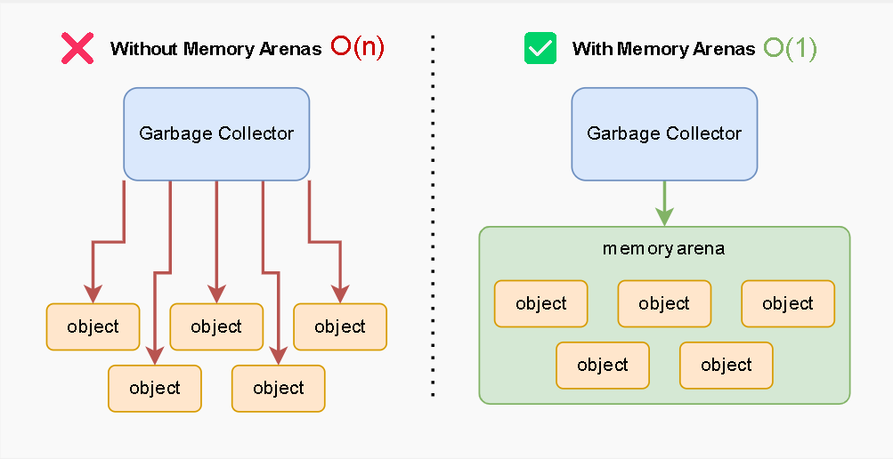
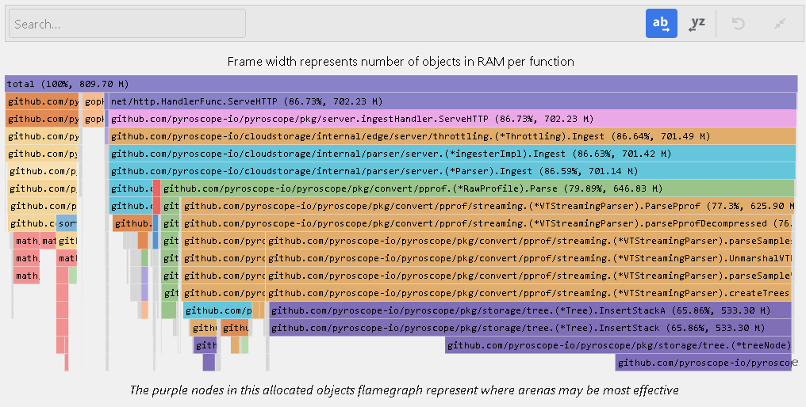
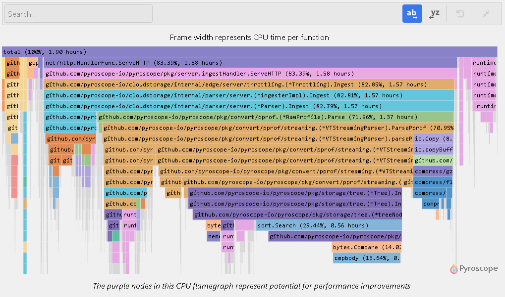
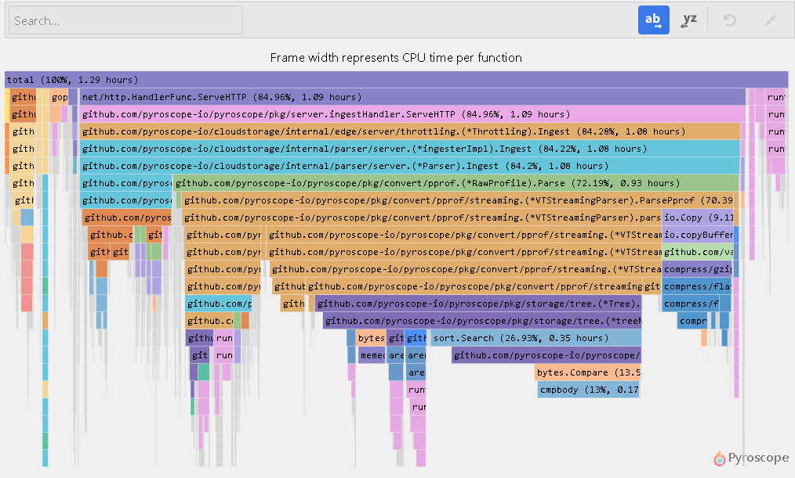
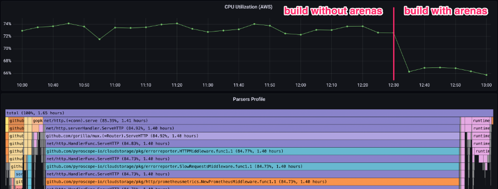

# Go 1.20 Experiment: Memory Arenas vs Traditional Memory Management

##### CAUTION

Go arenas are an experimental feature. The API and implementation is completely unsupported and go team makes no guarantees about compatibility or whether it will even continue to exist in any future release.

See [this Github discussion](https://github.com/golang/go/issues/51317#issuecomment-1385623024) for more details.

## Introduction

Go 1.20 introduces an experimental concept of "arenas" for memory management, which can be used to improve the performance of your Go programs. In this blog post, we'll take a look at:

- What are arenas
- How do they work
- How can you determine if your programs could benefit from using arenas
- How we used arenas to optimize one of our services

## What Are Memory Arenas?

Go is a programming language that utilizes garbage collection, meaning that the runtime automatically manages memory allocation and deallocation for the programmer. This eliminates the need for manual memory management, but it comes with a cost:

**The Go runtime must keep track of \*every\* object that is allocated, leading to increased performance overhead.**

In certain scenarios, such as when an HTTP server processes requests with large protobuf blobs (which contain many small objects), this can result in the Go runtime spending a significant amount of time tracking each of those individual allocations, and then deallocating them. As a result this also causes signicant performance overhead.

Arenas offer a solution to this problem, by reducing the overhead associated with many smaller allocations. In this protobuf blob example, a large chunk of memory (an arena) can be allocated before parsing enabling all parsed objects to then be placed within the arena and tracked as a collective unit.

Once parsing is completed, the entire arena can be freed at once, further reducing the overhead of freeing many small objects.

## Identifying Code That Could Benefit From Arenas

Any code that allocates a lot of small objects could potentially benefit from arenas. But how do you know if your code allocates too many? In our experience, the best way to do that is to profile your program.

Using Pyroscope we were able to get an allocations profile (`alloc_objects`) of one of our [cloud services](https://pyroscope.io/pricing/):

You can see that the majority of allocations (`533.30 M`) come from one area of code — it's the purple node at the bottom where it calls function `InsertStackA`. Given that it represents 65% of allocations this is a good candidate for using arenas. But is there enough of a performance benefit to be gained by cutting down these allocations? Let's take a look at the CPU profile (`cpu`) of the same service:

A few things stand out:

- The program spends a lot of CPU time in the same `InsertStackA` function, so there definitely is potential for meaningful performance gains
- If you search for `runtime.mallocgc` (multiple pink nodes at the bottom) you will see that that function is called frequently in various different places and it takes about 14% our total execution time
- About 5% of the CPU time is spent in `runtime.gcBgMarkWorker` (pink nodes located in the right section of the flamegraph)

So in theory, if we optimized all allocations in this program, we could cut about 14% + 5% = 19% of CPU time. This would translate in 19% cost savings and latency improvements for all of our customers. In practice, it's unlikely that we could truly get these numbers down to zero, but this is still a significant chunk of work that the application performs and it might be worth it to optimize it.

## Optimizations We've Made

If you're interested in following along, there's a [public pull request in the Pyroscope repository](https://github.com/pyroscope-io/pyroscope/pull/1804) that you can use as a reference.

- To begin, we created [a wrapper component](https://github.com/pyroscope-io/pyroscope/pull/1804/files#diff-70ab4bbe796a97ad1a47d7970504296eff36b5307527ae2806d2b50f94f83a45) that is responsible for dealing with allocations of slices or structs. If arenas are enabled, this component allocates the slices using an arena, otherwise it uses the standard `make` function. We do this by using build tags (`//go:build goexperiment.arenas`). This allows for easy switching between arena allocation and standard allocation at build time
- We then added [initialization](https://github.com/pyroscope-io/pyroscope/pull/1804/files#diff-32bf8c53a15c8a5f7eb424b21c8502dc4905ec3caa28fac50f64277361ae746fR417) and [cleanup](https://github.com/pyroscope-io/pyroscope/pull/1804/files#diff-34edf37e55842273380ee6cb31c9245f31ed25aa6d7898b0f2c25145f17d8ea0R170) calls for arenas around the parser code
- After that we [replaced regular `make` calls with make calls from our wrapper component](https://github.com/pyroscope-io/pyroscope/pull/1804/files#diff-abe15b6d3634170650f86bb7283aa15265de2197cffa969deda2dd5b26fcecd9R89-R92)
- Finally, we built pyroscope with arenas enabled and gradually deployed it to our production environment of [Pyroscope Cloud](https://pyroscope.io/pricing).

## Results of Our Arenas Experimentation

The flamegraph above represents a profile after we've implemented the changes. You can see that many of the `runtime.mallocgc` calls are now gone, but are replaced with arena-specific equivalent (`runtime.(*userArena).alloc`), you can also see that garbage collection overhead is cut in half. It is hard to see the exact amount of savings from solely looking at the flamegraphs, but when looking at our Grafana dashboard which combines our flamegraph with CPU utilization from AWS metrics we saw approximately a 8% reduction in CPU usage. This translates directly into 8% cost savings on cloud bills for that particular service, making it a worthwhile improvement.

This may not seem like a lot, but it's important to note that this is a service that has already been optimized quite a bit. For example, the protobuf parser that we use doesn't allocate any extra memory at all, garbage collection overhead (5%) is also on the lower end of the spectrum for our services. We think that there's a lot more room for improvement in other parts of the codebase and so we're excited to continue our experiments with arenas.

## Tradeoffs and Drawbacks

While arenas can provide performance benefits, it's important to consider the tradeoffs before using them. The main drawback of using arenas is that when you use arenas you now have to manage memory manually and if you're not careful that may lead to serious problems:

- Failing to properly free memory can lead to **memory leaks**
- Attempting to access objects from a previously freed arena may cause **program crashes**

Here's our recommendations:

- Only use arenas in critical code paths. Do not use them everywhere
- Profile your code before and after using arenas to make sure you're adding arenas in areas where they can provide the most benefit
- Pay close attention to the lifecycle of the objects created on the arena. Make sure you don't leak them to other components of your program where objects may outlive the arena
- Use `defer a.Free()` to make sure that you don't forget to free memory
- Use `arena.Clone()` to clone objects back to the heap if you want to use them after an arena was freed

The other major drawback at the moment is that Go arenas are an experimental feature. The API and implementation is completely unsupported and go team makes no guarantees about compatibility or whether it will even continue to exist in any future release. We recommend that you extract all arena-related code into a separate package and use build tags to make sure that it's easy to remove it from your codebase if you decide to stop using arenas. [Our code](https://github.com/pyroscope-io/pyroscope/pull/1804/files#diff-70ab4bbe796a97ad1a47d7970504296eff36b5307527ae2806d2b50f94f83a45) can serve as a demonstration of this approach.

## Addressing Community Concerns

The go team has received a lot of feedback about arenas and we'd like to address some of the concerns that we've seen in the community. The most frequently mentioned issue with arenas is that they make the language more complicated by adding an implicit and not immediately obvious way for programs to crash.

Most of the criticism is well-founded but misdirected. We do not anticipate arenas becoming widespread. We view arenas as a powerful tool, but one that is only suitable for specific situations. In our view, arenas should be included in the standard library, however, their usage should be discouraged, much like the use of `unsafe`, `reflect`, or `cgo`.

Our experience with arenas has been very positive and we were able to show that arenas can significantly reduce the amount of time spent in garbage collection and memory allocations. The experiment described in this article focused on a single, already highly optimized service, and we were still able to squeeze 8% of extra performance by using arenas. We think that many users could benefit a lot more from using arenas in their codebases.

In addition to that we also find that arenas are easier to implement compared to other optimizations that we've tried in the past, such as using buffer pools or writing custom allocation-free protobuf parsers. And compared to the other types of optimizations, they share the same drawbacks, but provide more benefits — so in our view arenas are a net win. We're hoping to see arenas become a part of the standard library (and part of commonly used packages like protobuf or JSON parsers) in the future.

## Conclusion

Arenas are a powerful tool for optimizing Go programs, particularly in scenarios where your programs spend significant amount of time parsing large protobuf or JSON blobs. They have the potential to provide significant performance improvements, but it is important to note that they are an experimental feature and there are no guarantees of compatibility or continued existence in future releases.

We recommend that you profile your applications and try using arenas on a limited portion of your codebase and [report your findings to the go team](https://github.com/golang/go/issues/51317).
