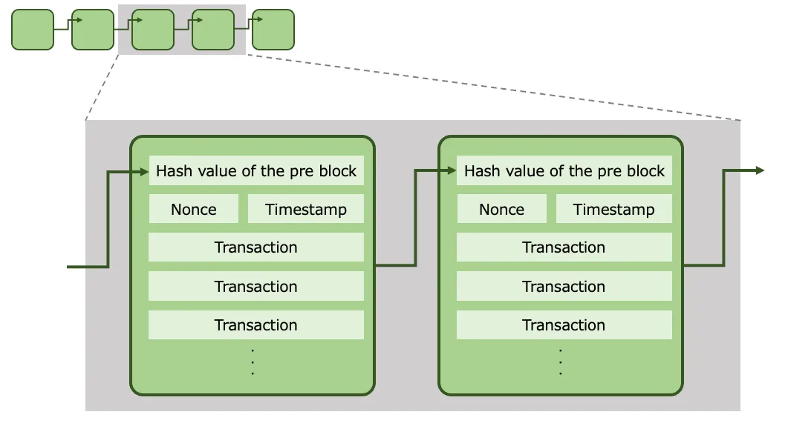

# Go 语言实现区块链工作量证明（PoW）中的哈希值计算

- 原文地址：https://medium.com/@shuntaro-okuma/understanding-the-calculation-of-hash-values-in-blockchains-pow-through-go-implementation-7c4b45ed654d
- 原文作者：Shuntaro
- 本文永久链接：https://github.com/gocn/translator/blob/master/2023/w16_Understanding_the_Calculation_of_Hash_Values_in_Blockchain’s_PoW_Through_Go_Implementation.md
- 译者：[haoheipi](https://github.com/haoheipi)
- 校对：[watermelo](https://github.com/watermelo)

在本文中，我将通过具体的例子解释区块链中工作量证明（PoW）算法的计算方法，并展示一个 Go 语言的实现示例。

什么是随机数（Nonce）？什么是难度（Difficulty）？哈希值是如何计算的？本文将帮助您理解这些概念。

## 区块链结构与工作量证明（PoW）的计算

区块链由多个相互连接的区块组成的列表结构构成。

在下面的示意图中，每个区块用一个绿色方框表示，它们通过哈希值相互连接，这就是为什么它被称为区块链。



每个区块包含前一个区块的哈希值、一个随机数（Nonce）值、一个时间戳和交易信息。

在工作量证明（PoW）算法中，哈希值和随机数（Nonce）值之间有密切关系。

- 哈希值：基于一个区块的数据（前一个区块的哈希值、随机数值、时间戳、交易）计算出的唯一值。通常使用诸如 SHA-256 之类的加密哈希函数进行计算。由于在计算过程中信息会被丢弃，所以哈希值无法恢复为原始数据。如果原始数据发生了哪怕是细微的变化，哈希值也会变成一个完全不同的值。由于这些特性，哈希值能被用于检测数据的篡改。

- 随机数（Nonce）值：随机数（Nonce）表示“一次性使用的数字”，是一种独特的数值，用于调整区块数据的哈希值以满足难度要求。随机数通常从 0 开始递增。难度值（Difficulty）要求意味着哈希值低于某个目标值。难度是为了维持恒定的区块生成速度而引入的阈值。

工作量证明（PoW）的计算过程如下：

1. 从 0 开始递增随机数（Nonce），计算区块的哈希值
2. 检查哈希值是否满足难度条件
3. 在找到满足条件的哈希值之前，不断改变随机数（Nonce）值
4. 当找到满足条件的哈希值时，将区块添加到区块链中


## 简单示例

让我们展示一个用 Go 语言实现的示例。

计算条件为：

- 区块的数据是字符串“Hello, world!”
- 难度值设置为 4（意味着计算出的哈希值必须以“0000”开头）

计算步骤如下：

1. 从随机数（Nonce）为 0 开始。
2. 将区块数据和随机数（Nonce）组合，即计算目标是字符串“Hello, world!0”。
3. 对“Hello, world!0”应用 SHA-256 哈希函数，计算哈希值。
4. 检查计算出的哈希值是否满足难度条件（以“0000”开头）。
5. 如果不满足条件，将随机数（Nonce）加 1，然后重复步骤 2-4。
6. 如果满足条件，计算完成。

Go 语言的具体实现如下：

```golang
package main

import (
 "crypto/sha256"
 "encoding/hex"
 "fmt"
 "strings"
)

func main() {
 data := "Hello, world!"
 difficulty := 4
 target := strings.Repeat("0", difficulty) // "0000"

 // 1. Start with nonce at 0
 nonce := 0

 for {
  // 2. Combine the block data and Nonce, i.e., the calculation target is the string "Hello, world!0."
  dataToHash := data + fmt.Sprint(nonce)

  // 3. Apply the SHA-256 hash function to "Hello, world!0" and calculate the hash value.
  hasher := sha256.New()
  hasher.Write([]byte(dataToHash))
  hash := hex.EncodeToString(hasher.Sum(nil))

  // 4. Check if the calculated hash value meets the Difficulty conditions (starting with "0000").
  if strings.HasPrefix(hash, target) {
   // 6. If true, the calculation is complete.
   fmt.Printf("Found a valid hash: %s (Nonce: %d)\n", hash, nonce)
   break
  } else {
   // 5. If not met, increase the Nonce by 1 and repeat steps 2–4.
   nonce++
  }
 }
}
```

当你运行它时，你会得到类似这样的结果：

```golang
Found a valid hash: 0000c3af42fc31103f1fdc0151fa747ff87349a4714df7cc52ea464e12dcd4e9 (Nonce: 4250)
```

在这个计算示例中，当随机数（Nonce）为 4250 时，找到了一个满足难度条件（哈希值以“0000”开头）的哈希值。


## 真实场景示例

在实际的区块链中，哈希值和随机数（Nonce）的计算是基于区块头，其中包括区块内的交易数据、前一个区块的哈希值以及时间戳等信息。

假设我们有如下区块数据：

- 前一个区块的哈希值：abcd1234
- 时间戳：1633022800
- 交易数据：{发件人：“Alice”，收件人：“Bob”，金额：10}
- 初始随机数（Nonce）值：0
- 难度值：3

实现如下：

```golang
package main

import (
 "crypto/sha256"
 "encoding/hex"
 "fmt"
 "strings"
)

type Block struct {
 Timestamp     int64
 Transactions  string
 PrevBlockHash string
 Nonce         int
}

func main() {
  block := &Block{
  Timestamp:     1633022800,
  Transactions:  `{Sender: "Alice", Recipient: "Bob", Amount: 10}`,
  PrevBlockHash: "abcd1234",
  Nonce:         0,
 }

  data := strconv.FormatInt(block.Timestamp, 10) + block.Transactions + block.PrevBlockHash + strconv.Itoa(block.Nonce)

 difficulty := 3
 target := strings.Repeat("0", difficulty) // "000"

 nonce := 0

 for {
  dataToHash := data + fmt.Sprint(nonce)

  hasher := sha256.New()
  hasher.Write([]byte(dataToHash))
  hash := hex.EncodeToString(hasher.Sum(nil))

  if strings.HasPrefix(hash, target) {
   fmt.Printf("Found a valid hash: %s (Nonce: %d)\n", hash, nonce)
   break
  } else {
   nonce++
  }
 }
}
```

当你运行它时，你会得到类似这样的结果：

```golang
Found a valid hash: 000d162f9ed911a43771dcc0159a92a8372bf4aa9f452f6cbc195e000192c8c4 (Nonce: 8098)
```

通过增加随机数（Nonce），我们能够生成不同的哈希值，并找到满足难度条件的哈希值。


## 结论

上述计算是在将一个区块添加到区块链之前进行的关键过程，其是工作量证明（PoW）的一部分。

实际上，难度值要大得多，而且找到有效的哈希值需要更长的时间。这就是使区块链难以篡改并保持数据不变性的原因。

例如，如果我们将难度值设置为 4 并运行它，我们会得到这样的结果：

```golang
Found a valid hash: 0000cd54202992361b10644a6596b12e9d19e89fb8a325062fb0499dbe1a3a23 (Nonce: 13655)
```

可以发现随机数（Nonce）值增加了，这意味着计算所需的时间更长了。

随着难度值的增加，计算所需的时间也会增加，也就需要更多的计算资源。因此，全球的矿工们投入大量计算资源，以在竞争对手之前找到满足难度条件的哈希值。

难度值（Difficulty）是在整个区块链网络中进行不断调整的，它被设置为使区块能在特定的时间间隔内生成（例如，比特币大约每 10 分钟生成一个区块）。这可以防止由于没有生成新区块而导致交易永远无法存储在区块链中。

## [译者补充](https://en.wikipedia.org/wiki/Bitcoin)
比特币每产生 2016 个区块后会进行难度值调整，根据最近的区块生成速率确定性地调整难度目标，目的为使新区块的平均生成时间保持在十分钟左右。

假设前 2015 个区块平均运行时间为 5 分钟，难度值为 4，那么为使得后面区块的时间保持在 10 分钟左右，难度值就需设置为 5。

虽然 10 分钟的区块时间是目标，但挖矿难度不能高于或低于当前难度水平的四倍。这条规则的制定是为了消除挖矿难度的突然变化。
