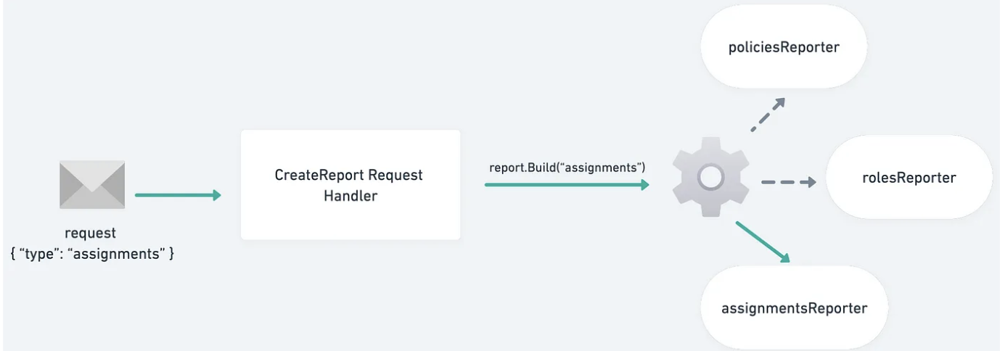
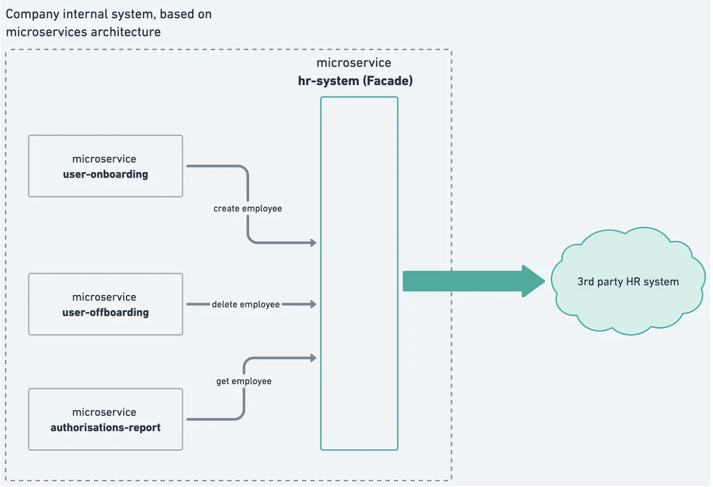
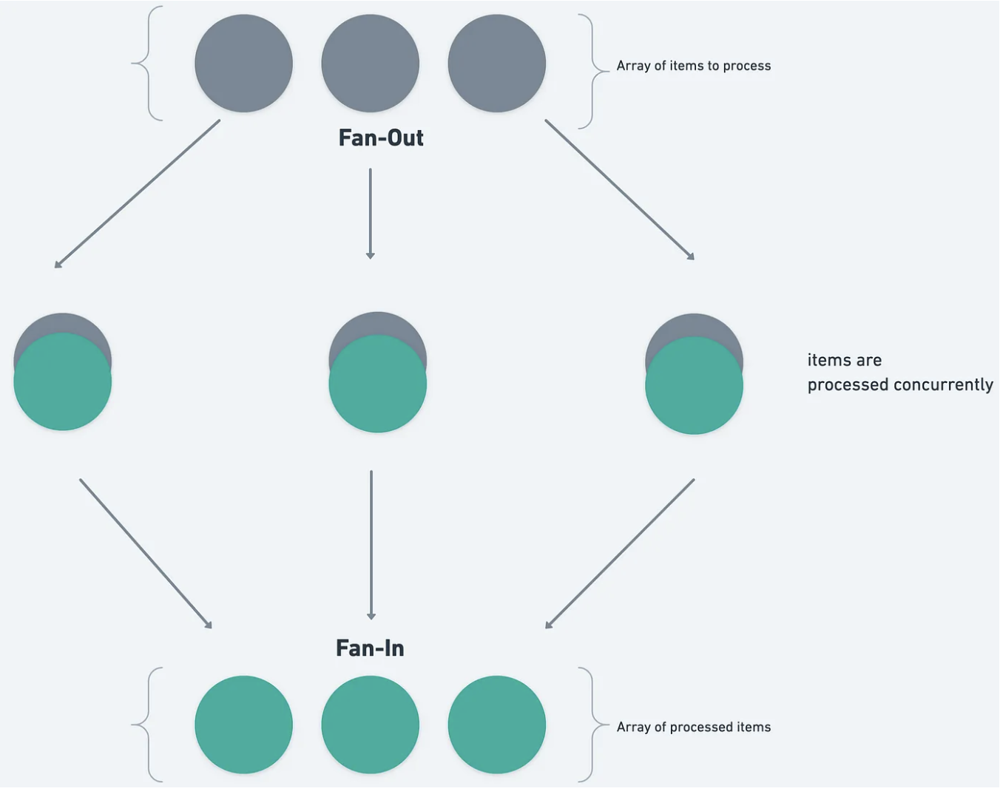

- 原文地址：https://medium.com/@opheliaandcat/top-3-design-patterns-for-a-large-go-codebase-79a324003b47
- 原文作者：**Lula Leus**
- 本文永久链接：
- 译者：[iddunk](https://github.com/iddunk)
- 校对：[pseudoyu](https://github.com/pseudoyu)

# 大型 Go 代码库的 3 种最佳设计模式	

# 有助于解决实际问题的设计模式

## 介绍

设计模式通常被认为是每个优秀软件工程师都应该具备的基础知识，这么说可能没问题。然而，并不是所有的理论知识都对日常工作有用。

我不确定设计模式是否适用于我在大型基于微服务的代码库中的日常工作，这些微服务为数百万用户提供服务，所以我决定调查一下。

我的目的并不是描述所有经典的软件设计模式。我专注于我经常注意到的前 3 种设计模式。我将解释每种模式解决的具体现实问题。

## 设计模式的简史

让我们回顾一下软件工程设计模式是如何产生的。 1994 年，四位作者——Erich Gamma、John Vlissides、Ralph Johnson 和 Richard Helm 出版了一本书“[设计模式：可复用面向对象软件的基础](https://www.oreilly.com/library/view/design-patterns-elements/0201633612/)”。 这本书赢得了“四人帮之书”的绰号，后来缩写为“GoF之书”。

GoF 书中包含 23 种设计模式，分为三种类型：创建型设计模式、结构型设计模式和行为型设计模式。 本书的示例是用 C++ 和 Smalltalk 编写的。 不出意外的，这本书所描述的模式受到这些特定语言和当时软件工程需求的影响。 然而，设计模式的概念被证明是持久的。

今天，我们仍然将这 23 种设计模式分为三类，称为经典软件设计模式。 所有这些模式的示例实现都是用现在所流行的语言编写的，包括[Go 的实现](https://golangbyexample.com/strategy-design-pattern-golang/)。 我对这些最新的内容特别感兴趣，因为我自己主要使用 Go。

## 为什么使用设计模式？

虽然有设计模式的存在，但是我们为什么要使用它们呢？ 它们帮助工程师在解决常见问题或重复出现的问题时避免重复造轮子。 此外，设计模式有助于软件工程师之间有效地交流想法。

设计模式的概念知识也可以帮助工程师适应不熟悉的代码库。 如果代码库中发生的事情可以用熟悉和普遍的东西进行思维导图，那么无论代码库有多大，它都会变得不那么令人难以承受。 设计模式为这种思维的映射提供了框架。

## 策略模式：清晰易读的计划

> “策略：旨在实现特定目的的计划”
> *剑桥词典*

在软件工程中，策略模式是一种行为设计模式，它允许对象具有一组可互换的行为，并能够在运行时根据当前的需求选择其中一种行为。

策略模式的典型用例是接口请求处理。 处理的行为必须根据请求参数而有所不同，但我们并不能保证复杂业务中每种情况都有单独的接口。

让我们以一个名为 **authorizations-report** 的微服务为例。 它有一个接口 */get-report*，可以很好地获取报告信息。 可以请求不同类型的报告，例如授权角色、授权策略或授权（用户及其授权之间的关联关系）。



​																		策略模式图例

此示例的代码分为两个包 — *handler* 和 *report*。 处理函数 *GetReport* 调用 report 包公开的 Build 方法，并将请求的报告类型传递给它。 报告类型可以是 “roles”、“policies” 或 “assignments”。

```go
package "handler"

func (h *Handler) GetReport(ctx context.Context, body *reportproto.GetReportRequest) (*reportproto.GetReportResponse, error) {
 // Generate report
 result, err := report.Build(ctx, body.ReportType)
 if err != nil {
  return nil, error
 }

 return &reportproto.ReportResponse{report: result}, nil
}
```

还有一个 *report* 包。 当调用 *Build* 函数时，它会根据提供的类型选择报告构建策略。

```go
package "report"

func Build(ctx context.Context, reportType string) (Report, error) {
 // We choose strategy to build report
 var reportBuilder reporter
 switch reportType {
 case constants.ReportTypeUsers:
  reportBuilder = allUsersReporter{}
 case constants.ReportTypeRoles:
  reportBuilder = roleReporter{}
 case constants.ReportTypePolicies:
  reportBuilder = policyReporter{}
 default:
  return nil, fmt.Errorf("invalid_report_type: Invalid report type provided")
 }

 report, err := reportBuilder.build(ctx, w)

 return report, err
}
```

策略模式使用简单而干净的方法去创建不同的行为，而无需使用大量 if/else 条件使代码堆积成山，从而保持代码的清晰度和可读性。

## 门面模式：与第三方服务沟通的一种方式

> “门面（虚假外观）：使某人或某物看起来比实际情况更令人愉快或更好的虚假外观”
>
> *剑桥词典*

在软件工程中，通过使用门面模式，我们可以将实际实现的内部复杂性隐藏在简化的外部接口后面，该接口仅公开外部系统所需的方法。 这提供了一个简单且用户友好的界面进行通信。

在基于微服务的架构中，我看到这种模式多次用于与第三方服务的通信。 例如，用于管理文档的 DocuSign 或用于协助招聘的 GreenHouse。 每个门面模式都是一个自治的微服务，连接内部公司服务和外部第三方 API。 这提供了构建通用集成的灵活性，可以按比例扩所容，像任何内部服务一样进行监控等。我将把微服务 **hr-system** 作为门面模式的示例。



​																					门面模式图例

该代码示例演示了一个处理函数 *ReadEmployee*，它负责使用 client.GetEmployee 从外部 HR 系统按 ID 获取员工信息。 然后，在返回给请求者之前，使用 *marshaling.EmployeeToProto* 将员工数据转换为 protobuf 对象类型。

```go
package handler

func (h *Handler) ReadEmployee(ctx context.Context, body *hrsystemproto.GETReadEmployeeRequest) (*hrsystemproto.GETReadEmployeeResponse, error) {
 if body.EmployeeId == "" {
  return nil, validation.ErrMissingParam("employee_id")
 }

 // client is based on Go net/http package and does request to 3rd party system
 employee, err := client.GetEmployee(ctx, body.EmployeeId)
 if err != nil {
  return nil, fmt.Errorf("failed to read employee")
 }

 marshalled, err := marshaling.EmployeeToProto(ctx, employee)
 if err != nil {
  return nil, fmt.Errorf("failed to marshal employee")
 }
 return &hrsystemproto.GETReadEmployeeResponse{
  Employee: marshalled,
 }, nil
}
```

使用门面模式有一些好处。 它为工程师提供了强类型接口的有限子集，其中与请求身份验证、可选参数或对象转换相关的复杂问题已经得到解决。

当需要进行新的第三方集成时，构建它就成为一项快速而简单的任务，因为我们已经有了全面的蓝图框架。

## 扇出/扇入模式：利用并发性更快地获得结果

> “扇出：散布到更广阔的区域”
>
> *剑桥词典*

该设计模式属于并发模式，不在 The GoF 书中。 然而，该模式在分布式系统中普遍存在。 因此我想讨论一下。

该模式的概念是将数据检索任务划分为多个块，并发执行它们，然后聚合结果。

对象数组是一个简单但现实的示例，其中每个对象都应以某种方式进行处理。 想象一下数组非常大或者对象的处理需要很长时间（例如，每个对象都会生成/需要一个 HTTP 调用）。



​																			扇入/扇出设计模式图

我将把微服务 **authorisations-report** 作为使用扇入/扇出模式的示例。 我们已经在策略模式部分讨论了这个服务。 注释可以防止服务同时实现多个设计模式。

假设该服务收到了生成 “assignments” 报告的请求。 在此服务域中，授权意味着公司员工和授予该员工的权限之间的联系。 assignments 报告预计将提供有关公司所有员工以及当前授予他们的所有授权的信息。

创建这样的报告需要大量网络请求，并且逐个员工地按顺序执行，大约需要 30 分钟才能完成。

扇出/扇入模式可以解决这个问题。 值得注意的是，在代码片段中，我们不会为每个员工生成一个 Goroutine，因为这会创建超过数千个 Goroutine，并且对所有下游服务的请求会出现不健康的峰值。 我们使用信号量将扇出宽度限制为 100 个 goroutine。

```go
func createReportRows(ctx context.Context, employeeProfiles []profile) (map[string]reportRow, error) {
 numOfEmployees := len(employeeProfiles)
 rowsChan := make(chan reportRow, numOfEmployees)
 concurrencyLimiter := semaphore.NewWeighted(100)

 // Fan-out stage, create rows of assignment report concurrenty
 for _, employee := range employeeProfiles {
  // Acquire a "token" from semaphore, block if none available.
  if err := concurrencyLimiter.Acquire(ctx, 1); err != nil {
   return nil, err
  }

  go func(curProfile profile, rowsChan chan<- reportRow, concurrencyLimiter <-chan struct{}) {
   // Release the "token" back to semaphore
   defer concurrencyLimiter.Release(1)

   rowsChan <- newRow(ctx, curProfile)
  }(employee, rowsChan, concurrencyLimiter)
 }

 // Fan-in stage, all created rows go into one data structure
 // As we know the exact number of rows, we can use a simple for loop
 // and wait for all of them to be created and sent to the channel.
 rows := make(map[string]reportRow, numOfEmployees)
 for i := 0; i < numOfEmployees; i++ {
  assignment := <-rowsChan
  rows[assignment.id] = assignment
 }

 return rows, nil
}
```

扇出/扇入模式是现代软件工程领域中最有用和最普遍的设计模式之一，因为逐一处理事情的效率是不够的。

## 所讨论的设计模式的回顾

设计模式的演示使用证明这些模式不仅仅是理论。 它们是生产代码不可或缺的一部分，通过重新建立有效的设计模式来解决重复出现的问题，以此来维持高编码标准。

除了经典的设计模式之外，并发模式已经成为当代软件开发的重要组成部分。 我快速查看了这组模式并广泛使用了扇出/扇入模式。

这是我对可应用于软件工程师日常工作的设计模式的看法。 根据我的经验，我已经探索了前 3 个，但探索还不止于此。 设计模式已经超越了 GoF 最初的 23 种模式，也超越了新增加的并发模式。 还有架构模式、消息传递模式以及更多值得探索的内容！
